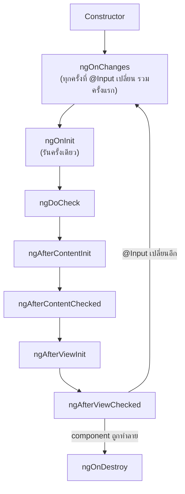

---
tags:
  - angular
  - typescript
  - lifecycle
type: reference
created: 2026-09-16
---

# ⏱️ Angular Lifecycle Hooks

> **Component มีช่วงชีวิตที่ตายตัว** ตั้งแต่ถูกสร้างจนถูกทำลาย — Angular เรียก method พิเศษให้อัตโนมัติตอนแต่ละช่วงเปลี่ยน เขียน logic ผิดจังหวะ (เช่นพึ่งพา `@Input` ใน constructor) คือสาเหตุของบั๊กแปลก ๆ ที่พบบ่อยที่สุดของคนใหม่

---

## 1. ลำดับการทำงาน



| hook | รันตอนไหน | ใช้ทำอะไร |
|---|---|---|
| **constructor** | สร้าง instance (DI resolve เสร็จ แต่ `@Input` **ยังไม่ถูกตั้งค่า**) | inject dependency เท่านั้น ห้ามพึ่งพา `@Input` |
| **ngOnChanges** | ก่อน `ngOnInit` และทุกครั้งที่ `@Input` เปลี่ยนหลังจากนั้น | ตอบสนองการเปลี่ยนของ input โดยเฉพาะ |
| **ngOnInit** | **ครั้งเดียว** หลัง `@Input` ตัวแรกพร้อมแล้ว | ที่ที่ถูกต้องสำหรับ init logic หนัก ๆ, เรียก API |
| **ngAfterViewInit** | หลัง template ของตัวเองถูก render เสร็จ | เข้าถึง `@ViewChild`/DOM ได้ปลอดภัยแล้ว |
| **ngOnDestroy** | ก่อนถูกทำลาย | cleanup: unsubscribe, clear timer, ปลด event listener |

---

## 2. ทำไม logic หนักต้องอยู่ `ngOnInit` ไม่ใช่ `constructor`

```typescript
export class ProductDetailComponent {
  id = input.required<string>();

  constructor() {
    console.log(this.id());   // ❌ error หรือได้ค่า default — @Input ยังไม่ถูกตั้งค่าจริง
  }

  ngOnInit() {
    console.log(this.id());   // ✅ ค่าจาก parent พร้อมแล้วแน่นอน
  }
}
```

**Angular สร้าง instance (เรียก constructor) ก่อน แล้วค่อยตั้งค่า `@Input` ทีหลัง** — ตอน constructor ทำงาน `@Input` ยังไม่มีค่าจริงจาก parent ใด ๆ เลย `ngOnInit` คือจุดแรกที่การันตีได้ว่า input พร้อมใช้งานแล้ว

---

## 3. ⚠️ ลืม `ngOnDestroy` = memory leak

```typescript
export class LiveClockComponent implements OnInit, OnDestroy {
  private sub?: Subscription;

  ngOnInit() {
    this.sub = interval(1000).subscribe(() => this.updateClock());
  }

  ngOnDestroy() {
    this.sub?.unsubscribe();   // ✅ ต้องทำเอง ไม่งั้น interval รันตลอดไปแม้ component หายไปแล้ว
  }
}
```

**ปัญหาเดียวกับที่เขียนไว้ใน [[Observable]] ข้อ 8** — stream ที่ไม่จบเอง (interval, event listener, WebSocket) ต้อง unsubscribe เองใน `ngOnDestroy` เสมอ

---

## 4. `ngOnChanges` — รู้ค่าเก่ากับค่าใหม่พร้อมกัน

```typescript
export class ProductCardComponent implements OnChanges {
  @Input() productId!: string;

  ngOnChanges(changes: SimpleChanges) {
    if (changes['productId'] && !changes['productId'].firstChange) {
      console.log('เปลี่ยนจาก', changes['productId'].previousValue, 'เป็น', changes['productId'].currentValue);
    }
  }
}
```

`changes['xxx'].firstChange` บอกว่าเป็นการเปลี่ยนครั้งแรก (ตอน component เพิ่งสร้าง) หรือเปลี่ยนทีหลังจริง ๆ — ใช้กันเวลาไม่อยากให้ logic รันซ้ำตอน initial set

---

## 5. กับดัก

- **อ่านค่า `@Input` ใน constructor** — ยังไม่พร้อม ได้ค่าผิดหรือ error (ข้อ 2)
- **ลืม `ngOnDestroy`** — subscription/timer ที่ไม่จบเองค้างอยู่ตลอดไปแม้ component ถูกทำลายแล้ว (ข้อ 3)
- **เข้าถึง `@ViewChild` ก่อน `ngAfterViewInit`** — ได้ `undefined` เพราะ DOM ยังไม่ถูก render
- **ทำงานหนักใน `ngDoCheck`** — hook นี้รันถี่มาก (ทุกรอบ change detection) ใส่ logic หนักตรงนี้ทำให้แอปช้าทั้งแอป
- **ลืมว่า `ngOnChanges` รันก่อน `ngOnInit`** — เขียน logic ที่ต้องพึ่งพาสิ่งที่ตั้งค่าใน `ngOnInit` ไว้ใน `ngOnChanges` แล้วพัง เพราะ `ngOnChanges` (ครั้งแรก) รันมาก่อน

---

## 6. Cheat sheet

```typescript
export class MyComponent implements OnInit, OnDestroy {
  private sub?: Subscription;

  constructor() { /* inject only, ห้ามพึ่ง @Input */ }
  ngOnInit() { /* init logic, เรียก API, subscribe */ }
  ngOnDestroy() { this.sub?.unsubscribe(); /* cleanup เสมอ */ }
}
```

| อาการ | สาเหตุ |
|---|---|
| `@Input` เป็น `undefined`/ค่า default ใน constructor | input ยังไม่ถูกตั้งค่า ต้องย้ายไป `ngOnInit` |
| memory ค่อย ๆ โตขึ้นเรื่อย ๆ เมื่อเปิด-ปิด component ซ้ำ ๆ | ไม่ได้ unsubscribe ใน `ngOnDestroy` |
| `@ViewChild` เป็น `undefined` | เข้าถึงก่อน `ngAfterViewInit` |
| แอปช้าลงเมื่อมีข้อมูลเยอะ | logic หนักอยู่ใน `ngDoCheck` |

## 🔗 เกี่ยวข้อง

- [[Observable]] — เหตุผลเต็ม ๆ ว่าทำไมต้อง unsubscribe
- [[Angular Component Communication]] — `@Input`/`@ViewChild` ที่ lifecycle hook พวกนี้ทำงานด้วย

## 📖 อ่านต่อ

- [Angular — Component lifecycle](https://angular.dev/guide/components/lifecycle)
