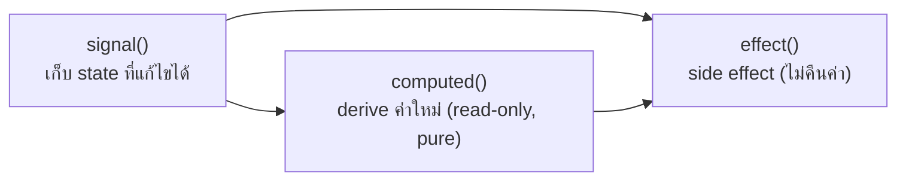

---
tags:
  - angular
  - typescript
  - signals
type: reference
created: 2026-09-16
---

# ⚡ Angular Signal Primitives — signal / computed / effect

> **ทั้งสามตัวนี้ไม่ใช่ "operator"** (ศัพท์ที่ยืมมาจาก RxJS ใช้ผิดที่บ่อย — ดู [[Angular Signals - Operators]]) แต่คือ **3 core reactive primitives** ที่ทำหน้าที่ต่างกันชัดเจน: `signal()` เก็บ state, `computed()` derive ค่าใหม่, `effect()` ทำ side effect — สับสนหน้าที่กันคือต้นตอของบั๊ก signal ส่วนใหญ่

---

## 1. ภาพรวม — ใครทำหน้าที่อะไร



| | `signal()` | `computed()` | `effect()` |
|---|---|---|---|
| เก็บอะไร | state จริง | ค่าที่ derive มา | ไม่เก็บ — แค่ทำงาน |
| แก้ไขได้ไหม | ✅ `.set()`/`.update()` | ❌ read-only | ไม่เกี่ยวกับการแก้ |
| คืนค่าไหม | ✅ อ่านได้เป็นค่า | ✅ อ่านได้เป็นค่า | ❌ ไม่คืนอะไร |
| ต้อง pure ไหม | — | ✅ ต้อง pure (ห้าม side effect) | ❌ มีไว้ทำ side effect โดยเฉพาะ |

---

## 2. `signal()` — เก็บ state ที่แก้ไขได้

```typescript
const count = signal(0);

count();              // อ่านค่า — เรียกเป็นฟังก์ชัน
count.set(5);          // ตั้งค่าใหม่ตรง ๆ
count.update(c => c + 1);   // ตั้งค่าใหม่จากค่าปัจจุบัน
```

### ⚠️ ไม่มี `.mutate()` แล้ว — ถูกถอดออกจาก API จริง

```typescript
// ❌ mutate() ถูกถอดออกจาก public API แล้ว ใช้ไม่ได้อีกต่อไป
user.mutate(u => { u.age = 31; });

// ✅ ใช้ update() แทนเสมอ — สร้างค่าใหม่ ไม่แก้ของเดิมตรง ๆ
user.update(u => ({ ...u, age: 31 }));
users.update(list => [...list, newUser]);   // array ก็ทำแบบเดียวกัน
```

**เหตุผลที่ถอด `.mutate()` ออก:** การแก้ object/array เดิมตรง ๆ (mutation) ตรวจจับการเปลี่ยนแปลงได้ยากกว่าสร้างของใหม่ โดยเฉพาะภายใต้ zoneless change detection — `update()` ที่คืนค่าใหม่เสมอทำให้ signal รู้แน่นอนว่าเปลี่ยนแล้วจริง

### Equality check — signal ฉลาดพอไม่แจ้งเตือนถ้าค่าเหมือนเดิม

```typescript
const count = signal(0);
count.set(0);   // ค่าเท่าเดิม (Object.is comparison) → ไม่มีใครถูกแจ้งว่าเปลี่ยน เลย ไม่ trigger effect/computed ใหม่
```

**default ใช้ `Object.is()` เทียบ (reference equality สำหรับ object/array)** — ถ้าอยากเทียบแบบ deep เอง ใส่ custom equality function ได้: `signal(value, { equal: (a, b) => ... })`

---

## 3. `computed()` — ค่าที่ derive มา (lazy + memoized)

```typescript
const price = signal(100);
const qty = signal(2);
const total = computed(() => price() * qty());

console.log(total());   // 200 — คำนวณตอนนี้แหละ ไม่ใช่ตอนประกาศ
```

**สองคุณสมบัติที่ทำให้ `computed()` มีประสิทธิภาพ:**

- **Lazy** — ไม่คำนวณจนกว่าจะถูกอ่านครั้งแรก แม้ `price`/`qty` จะเปลี่ยนไป 100 ครั้งก่อนหน้านั้น ถ้าไม่มีใครอ่าน `total()` เลย สูตรคำนวณไม่เคยรันสักครั้ง
- **Memoized** — คำนวณครั้งเดียวแล้ว cache ไว้ อ่านซ้ำโดยที่ dependency ไม่เปลี่ยนจะได้ค่าเดิมทันทีไม่คำนวณซ้ำ

```typescript
console.log(total());   // คำนวณจริง (cache miss)
console.log(total());   // ได้ค่า cache ทันที ไม่คำนวณซ้ำ (cache hit)
price.set(150);
console.log(total());   // dependency เปลี่ยน → คำนวณใหม่ (cache invalidated)
```

**mental model นี้เหมือนกับ [[Java Stream]]/[[Observable]] เป๊ะ** — lazy, ไม่ทำงานจนกว่าจะมีคน "เรียกใช้จริง" (อ่านค่า ≈ subscribe/terminal operation)

### ต้อง pure เสมอ — ห้ามมี side effect ข้างใน

```typescript
// ❌ ห้ามทำ — computed ไม่ควรมี side effect
const total = computed(() => {
  console.log('calculating...');   // side effect ที่ซ่อนอยู่
  saveToLocalStorage(price());     // side effect จริงจัง — ผิดหน้าที่
  return price() * qty();
});
```

ถ้าต้องการ side effect (log, บันทึกค่า, เรียก API) นั่นคือหน้าที่ของ `effect()` ไม่ใช่ `computed()` (ข้อ 4)

---

## 4. `effect()` — side effect เมื่อ signal เปลี่ยน

```typescript
export class LoggerComponent {
  count = signal(0);

  constructor() {
    effect(() => {
      console.log(`count เปลี่ยนเป็น: ${this.count()}`);
    });
  }
}
```

**รันทันที 1 ครั้งตอนสร้าง แล้วรันซ้ำทุกครั้งที่ signal ที่มันอ่านอยู่เปลี่ยนค่า** — dependency ไม่ได้ fix ไว้ตายตัว มัน track เฉพาะ signal ที่ถูกอ่านใน**รอบล่าสุด**เท่านั้น (เปลี่ยนได้ทุกรอบถ้าโค้ดข้างในมี condition)

### ⚠️ ต้องสร้างใน injection context เท่านั้น

```typescript
// ✅ สร้างใน constructor/field initializer ของ component/service
export class MyComponent {
  constructor() {
    effect(() => { ... });   // ✅ อยู่ใน injection context
  }
}

// ❌ สร้างนอก injection context — error ทันที
export function debounce<T>(source: Signal<T>, delay: number): Signal<T> {
  effect(() => { ... });   // ❌ NG0203: ไม่ได้อยู่ใน constructor/field initializer ของอะไรเลย
}
```

```
NG0203: effect() can only be used within an injection context
```

**แก้ได้สองทาง:** เรียก `debounce()` จากภายใน constructor/field initializer ของ component เอง (ให้ injection context ของ caller ครอบคลุมไปถึง) หรือส่ง `injector` เข้าไปเป็น option ตรง ๆ

```typescript
effect(() => { ... }, { injector: myInjector });
```

### Cleanup — `onCleanup` แทนการจัดการ timer/subscription เอง

```typescript
effect((onCleanup) => {
  const id = setTimeout(() => doSomething(), 1000);
  onCleanup(() => clearTimeout(id));   // รันก่อน effect รอบถัดไป และตอนถูก destroy
});
```

**`onCleanup` คือพารามิเตอร์แรกที่ effect callback รับได้** — ดีกว่าประกาศตัวแปร `timeoutId`/`subscription` ไว้นอก effect แล้วจัดการเอง (แบบที่มักเห็นในโค้ดเก่า) เพราะ Angular เรียก cleanup ให้ถูกจังหวะเสมอ ทั้งตอน effect รันใหม่และตอน component ถูกทำลาย

### ⚠️ ห้ามเขียนกลับเข้า signal ที่ตัวเองอ่านอยู่ — เสี่ยงวนลูปไม่จบ

```typescript
// ❌ อันตราย — a เปลี่ยน → effect แก้ b → ถ้ามี effect อื่นแก้ a กลับ วนไม่จบ
effect(() => {
  b.set(a() * 2);   // เขียนสัญญาณอื่นจาก signal ที่อ่านอยู่ ต้องระวังเสมอ
});
```

Angular ป้องกันกรณีเขียนกลับเข้า signal ตัวเองที่กำลังอ่านอยู่โดย default (ต้องเปิด `allowSignalWrites` ถ้ามั่นใจจริง ๆ ว่าไม่วนลูป)

---

## 5. ⚠️ `effect()` ไม่ใช่เครื่องมือสำหรับ "ส่งต่อ state ระหว่าง signal" — ใช้ `computed()` แทน

```typescript
// ❌ ผิดหน้าที่ — ใช้ effect() ทำสิ่งที่ computed() ทำได้ตรง ๆ และดีกว่า
const fullName = signal('');
effect(() => {
  fullName.set(`${firstName()} ${lastName()}`);
});

// ✅ ควรเป็นแบบนี้แทน
const fullName = computed(() => `${firstName()} ${lastName()}`);
```

**สัญญาณเตือนว่าใช้ผิด: ถ้า `effect()` ทำแค่ "ก๊อปค่าจาก signal หนึ่งไปอีกตัว"** แปลว่าควรเป็น `computed()` — `effect()` เหมาะกับการ sync ไปหาของที่**ไม่ใช่ signal** (`localStorage`, DOM API ตรง ๆ, analytics, log) ไม่ใช่ไว้ผูก signal สองตัวเข้าด้วยกัน

**นี่คือปัญหาจริงของตัวอย่าง `debounce`/`distinct` ใน [[Angular Signals - Operators]]** — ทั้งสองฟังก์ชันใช้ `effect()` เพื่อ "ก๊อปค่า" จาก signal ต้นทางไป signal ใหม่ ซึ่งเป็นรูปแบบที่ควรหลีกเลี่ยงตามแนวทางนี้ (ถึงจะยังทำงานได้ถ้าแก้ปัญหา injection context ในข้อ 4 แล้วก็ตาม)

---

## 6. เทียบกับ [[Observable]] — "reactive" เหมือนกัน แต่คนละ mental model

| | Signal | Observable |
|---|---|---|
| อ่านค่าปัจจุบัน | ได้ตรง ๆ (`count()`) | ไม่ได้ ต้อง subscribe รอค่าถัดไป |
| ต้อง subscribe ไหมถึงจะเริ่มทำงาน | ไม่ต้อง — `effect()`/`computed()` auto-track เอง | ต้อง (cold observable ไม่ทำงานจนกว่าจะ subscribe) |
| ค่าหลายค่าตามเวลา (stream) | ❌ เก็บแค่ "ค่าปัจจุบัน" ค่าเดียว | ✅ ออกแบบมาเพื่อสิ่งนี้โดยเฉพาะ |
| operator ต่อ pipeline | ไม่มีในตัว (ต้องพึ่ง `computed()`/`effect()` เขียนเอง) | มี operator กว่า 100 ตัว |

**ใช้ signal สำหรับ state ของ UI ที่อยากอ่านค่าปัจจุบันได้ตรง ๆ, ใช้ Observable สำหรับ stream ของเหตุการณ์ตามเวลา (HTTP, WebSocket, user event)** — `toSignal()`/`toObservable()` (ดู [[Angular Signals - Operators]]) มีไว้แปลงข้ามกันตอนต้องใช้ทั้งคู่ร่วมกัน

---

## 7. กับดัก

- **ใช้ `.mutate()`** — ถูกถอดออกจาก API แล้ว compile ไม่ผ่าน ใช้ `.update()` แทนเสมอ (ข้อ 2)
- **สร้าง `effect()` นอก injection context** — `NG0203` ทันที โดยเฉพาะเวลาเขียนเป็นฟังก์ชันช่วยแยกออกมา (ข้อ 4)
- **ใช้ `effect()` ทำสิ่งที่ `computed()` ทำได้** — ก๊อปค่าระหว่าง signal ด้วย effect แทนที่จะ derive ตรง ๆ (ข้อ 5)
- **ลืมว่า `computed()` ต้อง pure** — ใส่ side effect (log, เรียก API) เข้าไปข้างใน ทำงานผิดที่ผิดทาง
- **เข้าใจผิดว่า `computed()` คำนวณใหม่ทุกครั้งที่อ่าน** — จริง ๆ cache ไว้ คำนวณใหม่เฉพาะตอน dependency เปลี่ยนจริง (ข้อ 3)
- **ตั้ง timer/subscription ใน `effect()` แล้วไม่ cleanup** — memory leak เหมือนกับที่เขียนไว้ใน [[Observable]] เรื่อง unsubscribe — ควรใช้ `onCleanup` ที่ `effect()` มีให้ในตัว (ข้อ 4)
- **เรียกโค้ดที่มี side effect หนักในระหว่างที่ signal อ่านค่า** — `signal()`/`computed()` ควรอ่านได้เร็วและปลอดภัยเสมอ ไม่ควรมี logic หนักซ่อนอยู่ในการอ่านค่าเฉย ๆ

---

## 8. Cheat sheet

```typescript
// signal — เก็บ state
const s = signal(initial);
s(); s.set(x); s.update(fn);
signal(initial, { equal: (a, b) => ... });   // custom equality

// computed — derive (pure, lazy, memoized)
const c = computed(() => s() * 2);

// effect — side effect (ต้องอยู่ใน injection context)
constructor() {
  effect((onCleanup) => {
    doSomething(s());
    onCleanup(() => cleanup());
  });
}
effect(() => { ... }, { injector: myInjector });   // นอก injection context
```

| อาการ | สาเหตุ |
|---|---|
| `mutate is not a function` | API ถูกถอดออกแล้ว ใช้ `.update()` แทน |
| `NG0203: effect() can only be used within an injection context` | สร้าง `effect()` นอก constructor/field initializer โดยไม่ส่ง `injector` |
| แอปวนลูปไม่จบ/ค้าง | `effect()` เขียนกลับเข้า signal ที่ตัวเองอ่านอยู่ (วงจรปิด) |
| `computed()` มี side effect แต่ debug ยาก | ใส่ logic ที่ไม่ pure เข้าไปใน `computed()` แทนที่จะใช้ `effect()` |
| memory leak จาก timer/subscription ค้าง | ไม่ได้ใช้ `onCleanup` ใน `effect()` |

## 🔗 เกี่ยวข้อง

- [[Signals ใน Angular]] — พื้นฐานการใช้งานเบื้องต้น
- [[Angular Signals - Operators]] — ตัวอย่าง `toSignal`/`toObservable`/signal input ที่ใช้ primitive พวกนี้ (มี 2 จุดที่ผิดตามที่เขียนไว้ในโน้ตนี้ — `.mutate()` และ `effect()` นอก injection context)
- [[Observable]] — เทียบ mental model reactive อีกแบบ
- [[Java Stream]] — lazy evaluation แบบเดียวกับ `computed()`
- [[Angular Lifecycle Hooks]] — จังหวะที่ปลอดภัยจะสร้าง `effect()` (constructor/field initializer)

## 📖 อ่านต่อ

- [Angular — Signals overview](https://angular.dev/guide/signals)
- [Angular — Side effects for non-reactive APIs (effect)](https://angular.dev/guide/signals/effect)
- [Angular — effect() API reference](https://angular.dev/api/core/effect)
