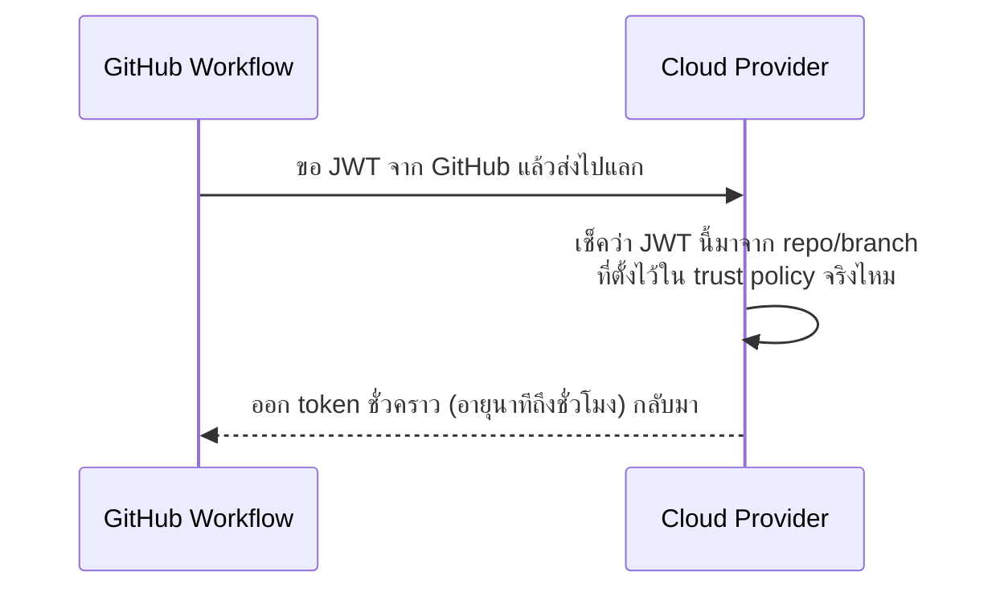

---
tags:
  - ci-cd
  - security
  - secrets
  - github-actions
  - jenkins
type: reference
created: 2026-08-18
---

# 🔑 การจัดการ Secret — GitHub Actions vs Jenkins

> **secret ที่ดีที่สุดคือ secret ที่ไม่ต้องเก็บเลย** — ทิศทางปี 2026 ของทั้งสองแพลตฟอร์มคือย้ายจาก "เก็บ key ถาวรอย่างดี" ไปเป็น "ขอ token ชั่วคราวตอนต้องใช้" (OIDC) เก็บ secret แบบเก่าไว้เฉพาะของที่ไม่มีทางเลือกอื่นจริง ๆ

---

## 1. ลำดับความสำคัญที่ควรใช้เสมอ

| ลำดับ | วิธี | เหตุผล |
|---|---|---|
| 1 | OIDC / workload identity | ไม่มี secret ถาวรให้ขโมยเลย (ดีที่สุด) |
| 2 | secret ที่หมุนเวียนอัตโนมัติ | ยังเป็น secret แต่มีอายุสั้น |
| 3 | secret แบบเดิม (long-lived) | ใช้เฉพาะที่ไม่มีทางเลือกอื่น (3rd-party API key) |

**เกณฑ์ตัดสิน:** ถ้าปลายทางรองรับ OIDC (cloud provider ใหญ่ ๆ รองรับหมดแล้ว) ใช้ OIDC เสมอ เก็บ secret ถาวรไว้เฉพาะของที่ไม่รองรับจริง ๆ เช่น API key ของบริการภายนอกเล็ก ๆ

---

## 2. ฝั่ง GitHub Actions

### Secret แบบพื้นฐาน

```
Settings → Secrets and variables → Actions → New repository secret
```

```yaml
steps:
  - run: deploy.sh
    env:
      API_KEY: ${{ secrets.API_KEY }}
```

**GitHub mask ค่า secret ในหน้า log ให้อัตโนมัติ** — แต่ **mask เฉพาะค่าที่ตรงเป๊ะกับที่ประกาศไว้เป็น secret** ถ้า secret ถูกแปลงรูปแบบก่อนพิมพ์ (เช่น base64, uppercase, หรือ token ที่สร้างขึ้นตอน runtime จาก OIDC) **GitHub จะไม่รู้จักและไม่ mask ให้**

```yaml
# ⚠️ ตัวอย่างที่ mask ไม่ทำงาน
- run: echo "${{ secrets.API_KEY }}" | base64
# ผลลัพธ์ base64 ไม่ถูก mask เพราะไม่ตรงกับค่า secret ดิบ
```

### `GITHUB_TOKEN` — token ที่มีให้ฟรีทุก workflow

```yaml
permissions:
  contents: read       # ← กำหนดสิทธิ์ให้แคบที่สุดเท่าที่จำเป็นเสมอ
  pull-requests: write

steps:
  - run: gh pr comment --body "deployed"
    env:
      GH_TOKEN: ${{ secrets.GITHUB_TOKEN }}
```

**`GITHUB_TOKEN` สร้างขึ้นใหม่อัตโนมัติทุกครั้งที่ workflow รัน แล้วหมดอายุเองหลัง job จบ** — ไม่ต้องสร้าง personal access token เองสำหรับงานที่แค่โต้ตอบกับ repo ตัวเอง (comment PR, สร้าง release, push tag)

**`permissions` ควรตั้งให้แคบเสมอ** ค่าเริ่มต้นของ org บางที่เปิดกว้างเกินจำเป็น — ประกาศชัดในไฟล์ workflow ว่าต้องการสิทธิ์อะไรบ้างเท่านั้น

### OIDC — ไม่มี secret ให้ขโมยเลย

```yaml
permissions:
  id-token: write        # ← ต้องมีบรรทัดนี้ถึงขอ OIDC token ได้
  contents: read

steps:
  - uses: aws-actions/configure-aws-credentials@v4
    with:
      role-to-assume: arn:aws:iam::123456789:role/deploy-role
      aws-region: ap-southeast-1
```



**ไม่มี AWS key ถาวรเก็บอยู่ใน GitHub Secrets เลย** — ต่อให้ secret ทั้ง repo หลุด ก็ไม่มี credential ถาวรให้เอาไปใช้ต่อ เพราะ token ที่ได้มาหมดอายุเร็วและผูกกับเงื่อนไขเฉพาะ (repo ไหน branch ไหน) เท่านั้น

---

## 3. ฝั่ง Jenkins

### Credentials Store

```
Manage Jenkins → Credentials → Add Credentials
เลือกประเภท: Secret text / Username-password / SSH key / Certificate
เลือก scope: Global / System / เฉพาะ folder
```

```groovy
pipeline {
    agent any
    environment {
        API_KEY = credentials('my-api-key')   // inject เป็น env var
    }
    stages {
        stage('Deploy') {
            steps { sh 'deploy.sh' }
        }
    }
}
```

**`environment { API_KEY = credentials(...) }` คือวิธีมาตรฐาน** — Jenkins Credentials Binding plugin ดึงค่ามาใส่ environment variable ให้อัตโนมัติ และ **mask ค่านั้นในหน้า log ทุกครั้งที่ค่าปรากฏ** (ไม่ใช่แค่ตรงเป๊ะเหมือน GitHub — ครอบคลุมกว่าในหลายกรณี)

### Scope — จำกัดว่าใครมองเห็น credential ไหนได้

```
Global        → ทุก job ใน Jenkins มองเห็นได้ (ใช้เท่าที่จำเป็นจริง ๆ)
System        → ใช้ได้เฉพาะ Jenkins เอง (เช่น mail server) job อื่นมองไม่เห็น
Folder-level  → เฉพาะ job ที่อยู่ใน folder นั้น
```

**scope แคบกว่า Global เสมอเมื่อทำได้** — ถ้า credential รั่วจาก job หนึ่ง scope ที่แคบจำกัดความเสียหายไม่ให้ลามไปทุก job ในระบบ

### Jenkins ไม่มี OIDC มาตรฐานในตัวเหมือน GitHub

Jenkins ไม่มีโมเดล workload identity กลางแบบ GitHub Actions OIDC — ถ้าต้องการของเทียบเท่า ต้องพึ่ง plugin เฉพาะของแต่ละ cloud provider (เช่น AWS มี plugin แลก IAM role) หรือดึง secret จาก vault ภายนอกแทน

### ดึง secret จาก Vault ภายนอก แทนเก็บใน Jenkins เอง

```groovy
withVault([vaultSecrets: [[path: 'secret/deploy', secretValues: [
    [envVar: 'API_KEY', vaultKey: 'api_key']
]]]]) {
    sh 'deploy.sh'
}
```

**ข้อดีของการแยก secret ออกจาก Jenkins เอง:** ถ้า Jenkins เองถูกเจาะ (ซึ่งเกิดขึ้นจริงบ่อยเพราะ Jenkins มักมี plugin เยอะและอัปเดตช้า) secret ไม่ได้อยู่ในเครื่องนั้นให้ขโมยไปด้วย

---

## 4. เทียบกันตรง ๆ

| | GitHub Actions | Jenkins |
|---|---|---|
| ที่เก็บ | GitHub Secrets (encrypted, ผูกกับ repo/org) | Credentials store ในตัว Jenkins |
| การ mask log | เฉพาะค่าที่ตรงเป๊ะกับ secret ดิบ | ครอบคลุมกว่า รวมบางกรณีที่ encode แล้ว |
| OIDC | มีในตัว รองรับ cloud provider หลัก | ไม่มีมาตรฐานกลาง ต้องพึ่ง plugin |
| scope การมองเห็น | ผูกกับ repo/environment | Global/System/Folder เลือกได้ละเอียดกว่า |
| token ที่ให้ฟรี | `GITHUB_TOKEN` หมดอายุอัตโนมัติทุกรัน | ไม่มีของลักษณะนี้ในตัว |
| แหล่งภายนอก | ผูกกับ cloud secret manager ได้ (เช่น AWS Secrets Manager) | plugin เชื่อม Vault/AWS/Azure ได้เช่นกัน |

---

## 5. กฎรวมที่ใช้ได้ทั้งสองแพลตฟอร์ม

- **หมุนเวียน (rotate) secret เป็นประจำ** ไม่ใช่สร้างครั้งเดียวแล้วใช้ตลอดไป
- **หนึ่ง credential ต่อหนึ่งงาน/หนึ่งบริการ** อย่าใช้ key เดียวกันทั่วทั้งระบบ — รั่วที่เดียวกระทบทุกที่
- **อย่า echo/print secret ออกมาดูเอง** แม้จะคิดว่า "แค่ debug" เพราะ log อาจถูกเก็บไว้นานกว่าที่คิด และคนอื่นในทีมอาจเห็นได้
- **ให้สิทธิ์แคบที่สุดเท่าที่จำเป็น (least privilege)** — credential ที่ deploy ได้แค่ระบบเดียว ดีกว่า credential ที่ทำได้ทุกอย่าง
- **secret ไม่ควรอยู่ในไฟล์ที่ commit เข้า repo เด็ดขาด** แม้จะเป็น private repo ก็ตาม — ประวัติ git เก็บไว้ถาวร ลบทีหลังไม่ช่วย

---

## 6. กับดัก

- **เข้าใจผิดว่า mask log ครอบคลุมทุกกรณี** — ทั้งสองแพลตฟอร์มพลาดได้ถ้า secret ถูกแปลงรูปแบบก่อน print (encode, ต่อ string, แสดงบางส่วน)
- **ใช้ credential scope Global ทั้งที่ job ต้องการแค่ scope แคบ** — เพิ่มพื้นที่เสียหายถ้ามีอะไรหลุด
- **เก็บ long-lived cloud key ทั้งที่ provider รองรับ OIDC อยู่แล้ว** — เสียโอกาสของวิธีที่ปลอดภัยกว่าโดยไม่มีเหตุผล
- **`permissions` ของ GitHub Actions ปล่อยเป็นค่า default กว้าง ๆ** — ไม่ได้ตั้งแคบทั้งที่ workflow ต้องการแค่ `contents: read`
- **Jenkins ที่ plugin ไม่อัปเดตนาน** — ตัว Jenkins เองกลายเป็นจุดอ่อนที่สุดของระบบทั้งชุด ต่อให้ credential store ตั้งถูกทุกอย่าง
- **ลืมว่า fork ของ public repo ไม่เห็น secret ของ repo ต้นทาง** (เป็นพฤติกรรมความปลอดภัยของ GitHub) แล้วสงสัยว่าทำไม workflow บน fork ทำงานไม่ครบ — ดูเพิ่มที่ [[Self-Hosted Runners]] เรื่องความเสี่ยงของ fork PR

---

## 7. Cheat sheet

```yaml
# GitHub Actions
permissions:
  contents: read
  id-token: write         # ต้องมีถ้าจะใช้ OIDC
steps:
  - env:
      API_KEY: ${{ secrets.API_KEY }}
    run: deploy.sh
```

```groovy
// Jenkins
environment {
    API_KEY = credentials('my-api-key')
}
```

| อาการ | สาเหตุ |
|---|---|
| secret โผล่ใน log ทั้งที่ตั้งไว้แล้ว | ค่าถูกแปลงรูปแบบก่อน print (encode/ต่อ string) ทำให้ mask จำไม่ได้ |
| OIDC ขอ token ไม่ได้ | ลืมใส่ `permissions: id-token: write` |
| credential รั่วแล้วกระทบทั้งระบบ | ใช้ key เดียวกันทุกที่แทนที่จะแยกต่อบริการ |
| fork PR เข้าไม่ถึง secret | พฤติกรรมตั้งใจของ GitHub ป้องกันขโมย secret ผ่าน fork |

---

## 🔗 เกี่ยวข้อง

- [[CI-CD]] — หน้ารวม
- [[Self-Hosted Runners]] — ความเสี่ยงเรื่อง secret รั่วผ่าน fork PR ที่รันบน self-hosted runner
- [[GitHub Actions Workflow Syntax]] — `permissions`, `env`, syntax การใช้ secret ใน step

## 📖 อ่านต่อ

- [GitHub Docs — Using secrets in GitHub Actions](https://docs.github.com/en/actions/security-guides/using-secrets-in-github-actions)
- [GitHub Docs — About security hardening with OpenID Connect](https://docs.github.com/en/actions/deployment/security-hardening-your-deployments/about-security-hardening-with-openid-connect)
- [Jenkins Docs — Credentials Binding plugin](https://plugins.jenkins.io/credentials-binding/)
