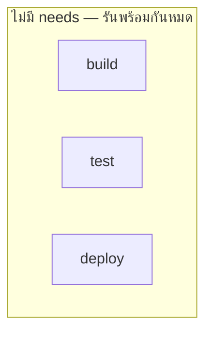
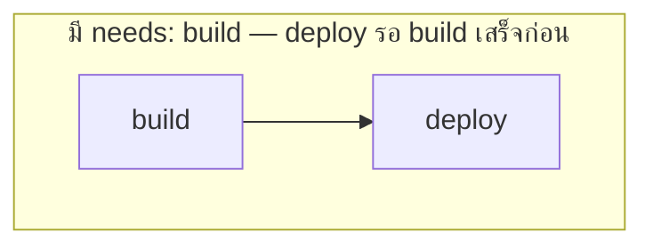

---
tags:
  - ci-cd
  - github-actions
  - yaml
type: reference
created: 2026-08-18
---

# ⚙️ GitHub Actions — Workflow Syntax

> โครงสร้างเดียว ใช้ได้ทุกงาน: **workflow → jobs → steps** — workflow คือไฟล์ทั้งไฟล์, job คือกลุ่มงานที่รันบนเครื่องเดียวกัน, step คือคำสั่งทีละบรรทัดใน job นั้น

---

## 1. โครงร่างพื้นฐาน

```yaml
# .github/workflows/ci.yml
name: CI

on:
  push:
    branches: [main]
  pull_request:

jobs:
  build:
    runs-on: ubuntu-latest
    steps:
      - uses: actions/checkout@v4
      - uses: actions/setup-node@v4
        with:
          node-version: 20
      - run: npm ci
      - run: npm test
```

```
name        ← ชื่อ workflow ที่โชว์ในแท็บ Actions
on          ← เหตุการณ์อะไรที่ทำให้ workflow นี้รัน
jobs        ← มีได้หลาย job รันขนานกันเป็นค่าเริ่มต้น (เว้นแต่สั่ง needs)
  <job-id>
    runs-on   ← runner ตัวไหน (ubuntu-latest, windows-latest, self-hosted, ...)
    steps     ← ลำดับคำสั่งภายใน job นี้ รันตามลำดับบนสุดลงล่างสุด
```

---

## 2. `on` — จะให้รันตอนไหน

```yaml
on:
  push:
    branches: [main, develop]
    paths: ["src/**"]              # รันเฉพาะตอนไฟล์ใน src/ เปลี่ยน
  pull_request:
    types: [opened, synchronize]
  schedule:
    - cron: "0 2 * * *"            # ทุกวัน 02:00 UTC
  workflow_dispatch:                # ปุ่มกดรันเองจากหน้า GitHub
```

**`workflow_dispatch` มีประโยชน์มากกว่าที่คิด** — เพิ่ม input parameter ให้กดรันแบบเลือกค่าได้

```yaml
on:
  workflow_dispatch:
    inputs:
      environment:
        type: choice
        options: [dev, staging, prod]
```

---

## 3. Step — สองแบบที่ใช้ผสมกันได้

```yaml
steps:
  - uses: actions/checkout@v4          # ← เรียก action สำเร็จรูปจาก marketplace
  - run: echo "hello"                   # ← รัน shell command ตรง ๆ
  - name: ตั้งชื่อ step ให้อ่านง่ายใน log
    run: |
      echo "หลายบรรทัด"
      echo "เขียนแบบนี้ได้"
```

### ส่งค่าระหว่าง step

```yaml
steps:
  - id: build
    run: echo "version=1.2.3" >> "$GITHUB_OUTPUT"
  - run: echo "ใช้ค่าจาก step ก่อน ${{ steps.build.outputs.version }}"
```

**`$GITHUB_OUTPUT` คือกลไกมาตรฐานปัจจุบัน** — วิธีเก่า (`::set-output`) ถูกเลิกใช้แล้ว เพราะมีช่องโหว่ด้าน security เจอในตัวอย่างเก่าบนเว็บให้รู้ว่าล้าสมัย

### เงื่อนไข

```yaml
steps:
  - run: echo "deploy"
    if: github.ref == 'refs/heads/main'
  - run: echo "รันแม้ step ก่อนพัง"
    if: always()
  - run: echo "รันเฉพาะตอน step ก่อนพัง"
    if: failure()
```

---

## 4. Job หลายตัว — ลำดับและการส่งค่าต่อกัน

```yaml
jobs:
  build:
    runs-on: ubuntu-latest
    outputs:
      version: ${{ steps.v.outputs.version }}
    steps:
      - id: v
        run: echo "version=1.2.3" >> "$GITHUB_OUTPUT"

  deploy:
    needs: build                        # ← รอ build เสร็จก่อน ไม่งั้นรันขนานกันหมด
    runs-on: ubuntu-latest
    steps:
      - run: echo "deploy ${{ needs.build.outputs.version }}"
```





**ค่าเริ่มต้นของ job คือรันขนานกันทั้งหมด** — ถ้าต้องมีลำดับก่อนหลัง ต้องใส่ `needs` เอง ไม่งั้น `deploy` อาจเริ่มก่อน `build` เสร็จ

---

## 5. Matrix — รันชุดเดียวกันหลายค่าพร้อมกัน

```yaml
jobs:
  test:
    strategy:
      matrix:
        node: [18, 20, 22]
        os: [ubuntu-latest, windows-latest]
    runs-on: ${{ matrix.os }}
    steps:
      - uses: actions/setup-node@v4
        with:
          node-version: ${{ matrix.node }}
      - run: npm test
```

`matrix.node × matrix.os = 3 × 2 = 6 jobs รันขนานกันทั้งหมด`

| | ubuntu-latest | windows-latest |
|---|:---:|:---:|
| node 18 | ✓ | ✓ |
| node 20 | ✓ | ✓ |
| node 22 | ✓ | ✓ |

**ใช้เมื่อต้องพิสูจน์ว่าโค้ดใช้ได้กับหลายสภาพแวดล้อมจริง** — ไม่ต้องเขียน job ซ้ำ 6 รอบเอง

### `fail-fast` และ `exclude`

```yaml
strategy:
  fail-fast: false           # ปกติพอ 1 ตัวพัง ตัวอื่นถูกยกเลิกหมด — ปิดถ้าอยากเห็นผลครบทุกตัว
  matrix:
    node: [18, 20, 22]
    os: [ubuntu-latest, windows-latest]
    exclude:
      - node: 18
        os: windows-latest    # ไม่ต้องเทสคู่นี้
```

---

## 6. Cache — ข้ามงานที่ทำซ้ำได้

**runner เป็นเครื่องใหม่ทุกครั้ง** ไม่มีอะไรเหลือจากรอบก่อนเลย — ถ้าไม่ cache `npm ci`/`mvn install` จะโหลด dependency ใหม่หมดทุกครั้ง ช้าและเปลือง

```yaml
steps:
  - uses: actions/cache@v4
    with:
      path: ~/.m2/repository
      key: maven-${{ hashFiles('**/pom.xml') }}
      restore-keys: maven-
  - run: mvn install
```

| เงื่อนไข | ผลลัพธ์ |
|---|---|
| key ตรงเป๊ะ | cache hit เต็ม ๆ ไม่ต้องโหลดอะไรใหม่เลย |
| key ไม่ตรง แต่ restore-keys ตรง | ได้ cache เก่ามาเป็นฐาน แล้วโหลดเฉพาะส่วนต่าง |
| ไม่มี key ไหนตรงเลย | cache miss โหลดใหม่หมด แล้วเก็บ cache ใหม่ไว้ให้รอบหน้า |

**`hashFiles('**/pom.xml')` คือกลไกสำคัญ** — key เปลี่ยนก็ต่อเมื่อ `pom.xml` เปลี่ยน (มี dependency ใหม่) ถ้าโค้ดเปลี่ยนแต่ dependency เดิม cache ยังใช้ได้อยู่

### หลาย build tool ก็มี `setup-*` action ที่ cache ให้อัตโนมัติอยู่แล้ว

```yaml
- uses: actions/setup-java@v4
  with:
    distribution: temurin
    java-version: 17
    cache: maven          # ← บรรทัดเดียว ไม่ต้องเขียน actions/cache เอง
```

**ใช้ตัวนี้ก่อนเสมอถ้ามี** ง่ายกว่าและ Google/GitHub ดูแล key ให้ถูกต้องอยู่แล้ว เขียน `actions/cache` เองเฉพาะตอนไม่มีตัวสำเร็จรูป (เช่น cache Docker layer — ดู [[Docker Layer Caching in CI]])

---

## 7. Reusable workflow — ตัดโค้ดซ้ำเมื่อมีหลาย repo/หลาย pipeline

```yaml
# .github/workflows/reusable-build.yml
on:
  workflow_call:
    inputs:
      node-version:
        type: string
        default: "20"
jobs:
  build:
    runs-on: ubuntu-latest
    steps:
      - uses: actions/setup-node@v4
        with: { node-version: "${{ inputs.node-version }}" }
      - run: npm ci && npm run build
```

```yaml
# .github/workflows/ci.yml
jobs:
  call-build:
    uses: ./.github/workflows/reusable-build.yml
    with:
      node-version: "22"
```

เหมือนฟังก์ชันในโปรแกรม — เขียนตรรกะครั้งเดียว เรียกใช้จากหลาย workflow

---

## 8. กับดัก

- **ลืมว่า job รันขนานกันเป็นค่าเริ่มต้น** — deploy รันก่อน build เสร็จ เพราะไม่ได้ใส่ `needs`
- **ใช้ `::set-output` แบบเก่า** — เลิกใช้แล้ว (security) ต้องเป็น `$GITHUB_OUTPUT`
- **cache key ไม่ผูกกับไฟล์ dependency** — ตั้ง key ตายตัว (`key: cache-v1`) แล้ว dependency เปลี่ยนไปแล้ว cache เก่ายังถูกใช้อยู่ ต้อง `hashFiles()` เสมอ
- **matrix ใหญ่เกินจำเป็น** — เทสทุกชุดที่เป็นไปได้ทั้งที่จริง ๆ ต้องการแค่ยืนยันว่าใช้ได้กับ 2-3 ชุดหลัก เสียเวลา runner โดยไม่จำเป็น
- **ใส่ secret ลง `run:` ตรง ๆ** — โผล่ใน log แม้ GitHub จะ mask ให้บางกรณี แต่ไม่ครอบคลุมทุกกรณี (ดู [[CI-CD Secrets]])
- **`if: always()` ทำให้ step อันตรายรันแม้ build พัง** — ถ้าใส่ `always()` กับ step ที่ deploy จริง อาจ deploy โค้ดที่ build ไม่ผ่านออกไปโดยไม่ตั้งใจ

---

## 9. Cheat sheet

```yaml
on: { push: { branches: [main] }, pull_request: {}, workflow_dispatch: {} }

jobs:
  <id>:
    runs-on: ubuntu-latest
    needs: [<job อื่นที่ต้องรอ>]
    if: <เงื่อนไข>
    strategy:
      matrix: { node: [18, 20] }
      fail-fast: false
    outputs:
      <name>: ${{ steps.<id>.outputs.<name> }}
    steps:
      - uses: actions/checkout@v4
      - uses: actions/cache@v4
        with: { path: <path>, key: <key>-${{ hashFiles('<lockfile>') }} }
      - run: <command>
        if: <เงื่อนไข>
```

| อาการ | สาเหตุ |
|---|---|
| job รันก่อนที่ควรจะรอ | ลืมใส่ `needs` |
| cache ไม่เคยอัปเดตทั้งที่ dependency เปลี่ยนแล้ว | `key` ไม่ได้ผูกกับ `hashFiles()` ของไฟล์ lock |
| output จาก step ก่อนไม่มีค่า | ใช้ `::set-output` แบบเก่าแทน `$GITHUB_OUTPUT` |
| matrix job เกินความจำเป็น กิน quota | ไม่ได้ `exclude` ชุดที่ไม่ต้องการ |

---

## 🔗 เกี่ยวข้อง

- [[CI-CD]] — หน้ารวม
- [[Docker Layer Caching in CI]] — cache สำหรับ Docker build โดยเฉพาะ
- [[Versioning and Tagging Strategy]] — ใช้ output จาก step มาตั้ง tag

## 📖 อ่านต่อ

- [GitHub Docs — Workflow syntax](https://docs.github.com/en/actions/writing-workflows/workflow-syntax-for-github-actions)
- [GitHub Actions — Matrix strategy](https://docs.github.com/en/actions/using-jobs/using-a-matrix-for-your-jobs)
