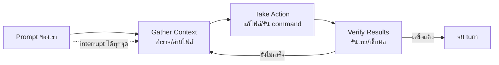

---
tags:
  - claude
  - claude-code
  - agent-engineering
type: reference
created: 2026-09-17
---

# 🔁 Agentic Loop — วงจรชีวิตของ Claude Code ตอนทำงาน

> สิ่งที่ทำให้ Claude Code ต่างจาก chatbot ทั่วไปคือ **มันไม่ได้แค่ตอบแล้วรอ** — มันอ่านไฟล์จริง รันคำสั่งจริง แก้โค้ดจริง แล้ววนทำแบบนี้เองจนกว่างานจะเสร็จ วงจรนี้เรียกว่า **agentic loop**

---

## 1. วงจร 3 phase ที่วนซ้ำ

**3 phase นี้ปนกันไปมา ไม่ได้เรียงเป๊ะทีละขั้น** — คำถามง่ายๆ เกี่ยวกับโค้ดอาจใช้แค่ "gather context" อย่างเดียว ส่วนการแก้บั๊กจะวนทั้ง 3 phase ซ้ำหลายรอบ **Claude เป็นคนตัดสินใจเองว่าขั้นต่อไปควรทำอะไร** โดยดูจากสิ่งที่เพิ่งเรียนรู้จากขั้นก่อนหน้า ต่อกันเป็นสิบๆ action พร้อมปรับทิศทางไปเรื่อยๆ

**เราเป็นส่วนหนึ่งของวงจรนี้ด้วย** — ขัดจังหวะได้ทุกจุดเพื่อเปลี่ยนทิศทาง เพิ่ม context หรือขอให้ลองวิธีอื่น

---

## 2. 2 องค์ประกอบที่ขับเคลื่อนวงจร

| องค์ประกอบ | หน้าที่ |
|---|---|
| **Model** (Claude) | คิดและตัดสินใจ — อ่านโค้ดภาษาไหนก็ได้ เข้าใจว่าส่วนไหนเชื่อมกับส่วนไหน แตกงานใหญ่เป็นขั้นย่อย |
| **Tools** | ลงมือทำจริง — อ่าน/แก้ไฟล์, รันคำสั่ง, ค้นเว็บ, ต่อ service ภายนอก |

**Claude Code คือ "agentic harness"** — ตัวห่อรอบโมเดลที่จัดหา tool, จัดการ context, และสภาพแวดล้อมให้รัน กลายเป็น agent เขียนโค้ดที่ใช้งานได้จริง ไม่ใช่แค่โมเดลเปล่าๆ (ดู [[Claude Agent Harness Design]] สำหรับแนวคิด harness แบบทั่วไปกว่านี้)

**ไม่มี tool = ตอบได้แค่ข้อความ** ทุกครั้งที่ใช้ tool ผลลัพธ์จะย้อนกลับเข้าวงจรเป็นข้อมูลใหม่ให้ตัดสินใจขั้นต่อไป

---

## 3. Tool 5 หมวดหลัก

| หมวด | ทำอะไรได้ |
|---|---|
| **File operations** | อ่าน/แก้/สร้างไฟล์ เปลี่ยนชื่อ จัดโครงสร้างใหม่ |
| **Search** | หาไฟล์ตาม pattern, ค้นเนื้อหาด้วย regex, สำรวจ codebase |
| **Execution** | รัน shell command, เปิด server, รันเทส, ใช้ git |
| **Web** | ค้นเว็บ, ดึงเอกสาร, เช็ก error message |
| **Code intelligence** | เห็น type error/warning หลังแก้โค้ด, jump to definition (ต้องมี plugin เพิ่ม) |

### ตัวอย่างจริง — "fix the failing tests"

1. รัน test suite ดูว่าอะไร fail
2. อ่าน error output
3. ค้นหาไฟล์ source ที่เกี่ยวข้อง
4. อ่านไฟล์นั้นเพื่อเข้าใจโค้ด
5. แก้ไฟล์
6. รันเทสอีกครั้งเพื่อยืนยัน

ทุกขั้นที่ใช้ tool คือข้อมูลใหม่ที่ป้อนกลับเข้าไปตัดสินใจขั้นถัดไป — นี่คือ agentic loop ในทางปฏิบัติ

**ต่อยอดจากฐานนี้ได้อีก:** [[Claude Agent Skills|Skills]] (ความรู้เฉพาะทาง), MCP (ต่อ service ภายนอก), Hooks (รันสคริปต์ deterministic), Subagents (แยกงานไปทำใน context อื่น)

---

## 4. สิ่งที่ Claude เข้าถึงได้ในแต่ละ session

โปรเจกต์ทั้งหมด, terminal (ทำอะไรได้ก็สั่งได้เหมือนคน), git state (branch/uncommitted changes/history), `CLAUDE.md`, **auto memory** (สิ่งที่ Claude จำได้เองระหว่างทำงาน โหลด 200 บรรทัด/25KB แรกของ `MEMORY.md` ทุก session), และ extension ที่ตั้งไว้ (MCP/skills/subagents)

**ต่างจาก inline code assistant ที่เห็นแค่ไฟล์ปัจจุบัน** — Claude Code เห็นทั้งโปรเจกต์ ทำงานข้ามหลายไฟล์พร้อมกันได้จริง

---

## 5. Session — วงจรชีวิตของการสนทนาแต่ละครั้ง

- **บันทึกลง local เป็นไฟล์ JSONL** ที่ `~/.claude/projects/` ทุกข้อความ/tool use/ผลลัพธ์ — ทำให้ rewind/resume/fork ได้
- **แต่ละ session เริ่มด้วย context window ใหม่เสมอ** ไม่มีประวัติจาก session ก่อนหน้าติดมาด้วย (สิ่งที่ข้ามได้จริงคือ auto memory + CLAUDE.md เท่านั้น)
- **`--continue`/`--resume`** ต่อ session เดิม (ID เดิม) — **`--fork-session`/`/branch`** copy ประวัติไปเป็น session ใหม่ (ID ใหม่) โดยของเดิมไม่เปลี่ยน
- Session ผูกกับ directory — สลับ branch แล้ว Claude เห็นไฟล์ของ branch ใหม่ แต่ยังจำบทสนทนาเดิมได้ ถ้าอยากรันหลาย session พร้อมกันจริงๆ ใช้ git worktrees แยก directory

---

## 6. Context window เต็มแล้วเกิดอะไรขึ้น

Context เก็บทุกอย่าง: บทสนทนา, เนื้อไฟล์, ผล command, `CLAUDE.md`, auto memory, skill ที่โหลดมา, system instruction — **เต็มเร็วกว่าที่คิด**

**เมื่อใกล้เต็ม Claude Code จัดการอัตโนมัติ:** ล้าง tool output เก่าก่อน แล้วค่อยสรุปบทสนทนาถ้ายังไม่พอ — **request ปัจจุบันกับโค้ดสำคัญยังอยู่ แต่คำสั่งละเอียดจากตอนต้นบทสนทนาอาจหายไป** (นี่คือเหตุผลที่กฎถาวรควรอยู่ใน `CLAUDE.md` ไม่ใช่พึ่งว่า "เคยบอกไปแล้วตอนต้น") — ดูรายละเอียดเพิ่มที่ [[Claude Code Best Practices]]

**ตัวช่วยลด context นอกจาก compaction:**
- **Skills** โหลดแค่ชื่อ+description ตอนแรก เนื้อหาเต็มโหลดเฉพาะตอนถูกเรียกใช้จริง
- **Subagent** รันแยก context ตัวเอง งานสำรวจที่ต้องอ่านไฟล์เยอะๆ ไม่มากินพื้นที่ session หลัก ได้แค่สรุปกลับมา
- **MCP tool definition** ถูก defer ไว้ โหลดตามจริงเฉพาะตอนถูกเรียกใช้ ไม่ใช่โหลดทั้งหมดตั้งแต่ต้น (ดู [[Claude MCP Code Execution]])

---

## 7. ความปลอดภัย — Checkpoint กับ Permission คนละกลไก

| กลไก | ป้องกันอะไร |
|---|---|
| **Checkpoint** | การแก้ไฟล์ผิดพลาด — snapshot ไฟล์ไว้ก่อนแก้ทุกครั้ง กด `Esc` สองทีย้อนกลับได้ (แยกจาก git, ไม่ครอบคลุม action ที่กระทบระบบภายนอกเช่น database/deploy) |
| **Permission mode** | สิ่งที่ Claude ทำได้โดยไม่ต้องถามก่อน — สลับด้วย `Shift+Tab` |

**4 permission mode:** Auto (classifier คอยเช็กเบื้องหลังแทนคน — ดู [[Claude Code Auto Mode]] สำหรับรายละเอียดเต็ม), Manual (ถามก่อนแก้ไฟล์/รัน command ทุกครั้ง), Accept edits (แก้ไฟล์/รันคำสั่งพื้นฐาน เช่น `mkdir` ได้เลย แต่คำสั่งอื่นยังถาม), Plan (สำรวจ+เสนอแผนอย่างเดียว ไม่แตะไฟล์จริง)

---

## 🔗 เกี่ยวข้อง

- [[Claude Code Best Practices]] — วิธีใช้วงจรนี้ให้ได้ผลดีที่สุด (plan mode, verification, session management)
- [[Claude Code Auto Mode]] — รายละเอียดเต็มของ permission mode "Auto" ที่กล่าวถึงในข้อ 7
- [[Claude Agent Skills]] — กลไก progressive disclosure ที่ทำให้ skill ไม่กิน context ตามข้อ 6
- [[Claude Agent Harness Design]] — แนวคิด harness ที่กว้างกว่าแค่ Claude Code (ใช้ทำ agent ของตัวเองได้)

## 📖 อ่านต่อ

- [How Claude Code works](https://code.claude.com/docs/en/how-claude-code-works)
