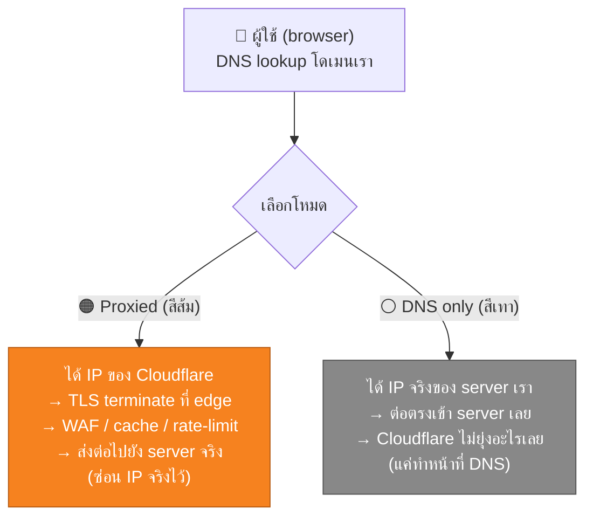

---
tags:
  - cloudflare
  - infra
  - network
  - security
type: reference
created: 2026-09-15
---

# 🟧 Cloudflare

> **พูดสั้นที่สุด: Cloudflare คือตัวที่ "แทรกตัวเอง" ไว้ระหว่างผู้ใช้กับ server ของเรา**
> เดิมเริ่มจาก CDN + DNS แต่ตอนนี้ขยายเป็น "connectivity cloud" — มีทั้ง security, edge compute, storage, database ในตัวเดียว

---

## 1. Cloudflare คืออะไร

Cloudflare เป็นเครือข่าย edge server กระจายอยู่ทั่วโลก (300+ เมือง) ที่ทำงานแบบ **reverse proxy**: แทนที่ผู้ใช้จะต่อเข้า server ของเราโดยตรง เขาจะต่อเข้า Cloudflare ก่อน แล้ว Cloudflare ค่อยส่งต่อ (proxy) ไปยัง server จริงของเราอีกที

วิธีเริ่มใช้งานพื้นฐานที่สุด:
1. เอาโดเมนไปเปลี่ยน nameserver ให้ชี้มาที่ Cloudflare (หรือใช้ partial setup แค่บาง record)
2. ตั้งค่า DNS record ใน Cloudflare ให้ชี้ไปที่ IP จริงของ server เรา
3. เปิด "proxy" (ดูข้อ 2) — จากนั้น traffic ทั้งหมดจะวิ่งผ่าน Cloudflare ก่อนถึง server จริง

จุดที่ทำให้คนใช้เยอะคือ **free tier ใจกว้าง** — DNS, CDN, SSL, DDoS protection พื้นฐาน ใช้ฟรีได้โดยไม่ต้องผูกบัตรเครดิต

---

## 2. วิธีทำงานคร่าว ๆ — Proxied vs DNS only (จุดที่งงที่สุดตอนเริ่มใช้)

ใน DNS record ของ Cloudflare แต่ละอันจะมีไอคอนก้อนเมฆ กดสลับได้สองแบบ:



| | 🟠 Proxied | ⚪ DNS only |
|---|---|---|
| ผู้ใช้เห็น IP อะไร | IP ของ Cloudflare (anycast) | IP จริงของ server เรา |
| ได้ WAF / DDoS protection / cache | ✅ | ❌ |
| ได้ SSL ฟรีจาก Cloudflare | ✅ | ต้องหาของตัวเอง |
| ใช้ได้กับ record ประเภทไหน | เฉพาะ `A` / `AAAA` / `CNAME` | ทุกประเภท (`MX`, `TXT`, `NS` บังคับเทาเสมอ) |
| ใช้ได้กับ port ไหน | จำกัด (80, 443, 8443 ฯลฯ) | ทุก port |
| เหมาะกับ | เว็บ, API ที่คุยผ่าน HTTP/HTTPS | mail server, SSH, database, VPN endpoint |

**กฎจำง่าย ๆ**: traffic ที่เป็นเว็บ (HTTP/HTTPS) → เปิดสีส้ม, อะไรที่ไม่ใช่เว็บ (mail, SSH, DB) → ปล่อยสีเทา เพราะ Cloudflare proxy ผ่านได้แค่บาง port/protocol เท่านั้น ถ้าเปิดสีส้มกับ service ที่ไม่รองรับ service นั้นจะต่อไม่ได้ทันที

---

## 3. บริการหลักที่มีให้ใช้

### 3.1 DNS & Network

| บริการ                 | ทำอะไร                                                                                                  |
| ---------------------- | ------------------------------------------------------------------------------------------------------- |
| **DNS**                | โฮสต์ DNS record ของโดเมน (เร็ว เพราะ anycast network เดียวกับที่ใช้ proxy)                             |
| **Load Balancing**     | กระจาย traffic ไปหลาย origin server, health check, failover อัตโนมัติ                                   |
| **Argo Smart Routing** | เลือกเส้นทางเน็ตที่เร็วที่สุดไปยัง origin แบบ real-time (แทนเส้นทางมาตรฐานของอินเทอร์เน็ต)              |
| **Spectrum**           | proxy ให้ protocol ที่ไม่ใช่ HTTP (TCP/UDP ทั่วไป เช่น game server, custom protocol) ผ่าน edge เดียวกัน |

### 3.2 Performance / CDN

| บริการ            | ทำอะไร                                                                     |
| ----------------- | -------------------------------------------------------------------------- |
| **CDN (caching)** | เก็บ static asset (รูป, JS, CSS) ไว้ที่ edge ใกล้ผู้ใช้ ลด load ที่ origin |
| **Cache Rules**   | กำหนดเองว่า path/pattern ไหน cache ยังไง นานแค่ไหน                         |
| **Polish**        | บีบอัด/แปลงรูปภาพอัตโนมัติ (เช่นแปลงเป็น WebP) ตอนส่งผ่าน edge             |
| **Auto Minify**   | ตัด whitespace/comment ออกจาก HTML/CSS/JS อัตโนมัติ                        |

### 3.3 Security

| บริการ                              | ทำอะไร                                                                                                    |
| ----------------------------------- | --------------------------------------------------------------------------------------------------------- |
| **WAF (Web Application Firewall)**  | กรอง request อันตราย (SQLi, XSS, ...) ก่อนถึง server จริง                                                 |
| **DDoS Protection**                 | ป้องกันการถล่ม traffic ทั้งระดับ L3/L4 (network) และ L7 (application) — เปิดใช้อัตโนมัติทุก plan รวม free |
| **Bot Management / Bot Fight Mode** | แยกแยะ bot จากคนจริง บล็อกหรือ challenge bot ที่ไม่ต้องการ                                                |
| **Rate Limiting**                   | จำกัดจำนวน request ต่อ IP/ต่อช่วงเวลา กัน API โดนยิงถล่มหรือ scrape                                       |
| **Turnstile**                       | ทางเลือกแทน CAPTCHA แบบเดิม ผู้ใช้ไม่ต้องกดรูป ส่วนใหญ่ผ่านแบบไม่รู้ตัว                                   |
| **Universal SSL**                   | ออก SSL certificate ให้ฟรีอัตโนมัติ (ทำให้เว็บมี HTTPS ได้โดยไม่ต้องซื้อ cert เอง)                        |

### 3.4 Zero Trust (ทดแทน VPN แบบเดิม)

| บริการ | ทำอะไร |
|---|---|
| **Access** | ทำ identity-aware proxy — ผู้ใช้ต้อง login (SSO) ก่อนเข้าถึง internal app ได้ ไม่ต้องเปิด VPN |
| **Tunnel** (`cloudflared`) | เปิดทางจาก edge ของ Cloudflare เข้าไปหา service ที่รันอยู่หลัง NAT/firewall โดยไม่ต้องเปิด port ที่ router เลย |
| **Gateway** | กรอง DNS/web request ขาออกของ user/organization (บล็อกเว็บอันตราย, บังคับ policy) |
| **WARP** | client ฝั่งผู้ใช้ (คล้าย VPN) ที่ต่อเข้า Zero Trust network ของ Cloudflare |

### 3.5 Developer Platform (edge compute)

| บริการ              | ทำอะไร                                                                                                        |
| ------------------- | ------------------------------------------------------------------------------------------------------------- |
| **Workers**         | รันโค้ด (JS/TS/Python/Wasm) ที่ edge ทุกจุดทั่วโลก บน V8 isolate (ไม่ใช่ container) — cold start เกือบ 0ms    |
| **Pages**           | โฮสต์ static site / frontend build (เช่นผลลัพธ์จาก `ng build`) พร้อม CI จาก git push ฟรี                      |
| **Durable Objects** | edge compute ที่มี state ติดตัว (ปกติ Workers ไม่เก็บ state) ใช้ทำ WebSocket room, counter ที่ต้อง consistent |
| **Queues**          | message queue แบบ managed ผูกกับ Workers                                                                      |

### 3.6 Storage & Data ที่ edge

| บริการ | ทำอะไร                                                                                                                      |
| ------ | --------------------------------------------------------------------------------------------------------------------------- |
| **R2** | object storage แบบเดียวกับ S3 (API เข้ากันได้) **จุดขายหลักคือไม่มีค่า egress** (ปกติ S3 คิดเงินตอนดึงข้อมูลออก)            |
| **KV** | key-value store กระจายทั่ว edge, consistency แบบ eventual — เหมาะกับ config/feature flag/session token ที่อ่านบ่อยเขียนน้อย |
| **D1** | database แบบ SQLite รันที่ edge, consistency แน่นกว่า KV, อ่านเร็วระดับ sub-10ms                                            |

---

## 4. เอาไปทำอะไรได้บ้าง

- **DNS + CDN + SSL ฟรี** สำหรับโปรเจกต์ส่วนตัว/side project — ไม่ต้องซื้อ SSL cert เอง
- **ซ่อน IP จริงของ origin server** — เปิด proxy (สีส้ม) แล้ว attacker เห็นแค่ IP ของ Cloudflare ลด attack surface ที่ยิงตรงเข้า server
- **เปิด local dev server ให้คนอื่นเข้าถึงได้ชั่วคราว** ผ่าน Cloudflare Tunnel โดยไม่ต้อง port forward ที่ router — ใช้แทน ngrok ได้ (ดูตัวอย่างข้อ 5)
- **โฮสต์ frontend แบบ static ฟรี** ผ่าน Pages — เหมาะกับ SPA ที่ build เป็น static file (Angular/React/Vue build output)
- **เขียน edge function เล็ก ๆ** ผ่าน Workers — redirect, A/B testing, inject header, lightweight API — โดยไม่ต้องมี server ของตัวเองเลย
- **ป้องกัน API ที่เปิด public** ด้วย Rate Limiting + WAF ก่อนที่ traffic แปลก ๆ จะไปถึง service จริง
- **แทนที่ CAPTCHA เดิมด้วย Turnstile** ลดความรำคาญผู้ใช้แต่ยังกัน bot ได้
- **เก็บไฟล์/รูปจำนวนมากโดยไม่ต้องกังวลค่า egress** ผ่าน R2 (ต่างจาก S3 ที่ยิ่งดึงข้อมูลออกเยอะยิ่งจ่ายแพง)

---

## 5. ตัวอย่างจริง: Cloudflare Tunnel — เปิด local server ให้เข้าถึงจากเน็ต

วิธีเร็วที่สุด ไม่ต้องมี account ก็ทดสอบได้ (Quick Tunnel):

```bash
# server ของเรารันอยู่ที่ localhost:8080
cloudflared tunnel --url http://localhost:8080
```

Output จะได้ URL แบบสุ่มที่เข้าถึงจากที่ไหนก็ได้:

```
+--------------------------------------------------------------------------------------------+
|  Your quick Tunnel has been created! Visit it:                                             |
|  https://seasonal-deck-organisms-sf.trycloudflare.com                                      |
+--------------------------------------------------------------------------------------------+
```

ใช้ทดสอบ webhook จาก third-party (เช่น payment callback), demo งานให้คนอื่นดูแบบเรียลไทม์, หรือทดสอบจากมือถือจริงโดยไม่ต้องอยู่ network เดียวกัน

ถ้าอยากได้ URL คงที่ (ไม่สุ่มใหม่ทุกครั้ง) ต้องทำ **named tunnel** แทน — ผูกกับโดเมนที่เรามีใน Cloudflare:

```bash
cloudflared tunnel login
cloudflared tunnel create my-app
# แมป hostname เข้ากับ local service ใน config.yml แล้วรัน
cloudflared tunnel run my-app
```

---

## 6. ตัวอย่างจริง: Workers — edge function ตัวอย่าง

```js
export default {
  async fetch(request, env, ctx) {
    const url = new URL(request.url);

    if (url.pathname === "/api/hello") {
      return new Response(JSON.stringify({ message: "Hello from the edge" }), {
        headers: { "content-type": "application/json" },
      });
    }

    return new Response("Not found", { status: 404 });
  },
};
```

deploy ด้วย CLI ชื่อ `wrangler`:

```bash
wrangler deploy
```

โค้ดนี้จะถูกส่งไปรันที่ทุก edge location ทั่วโลกพร้อมกัน — ผู้ใช้แต่ละคนจะชนโค้ดชุดเดียวกันที่จุดใกล้ตัวเองที่สุด ไม่ใช่วิ่งไปหา server กลางที่จุดเดียว

---

## 7. Free plan ให้อะไรบ้างคร่าว ๆ

| Plan | เหมาะกับ |
|---|---|
| **Free** | DNS, CDN, Universal SSL, DDoS protection พื้นฐาน, WAF managed rules จำกัดจำนวน, Workers/Pages มี free quota ใช้งานจริงได้ |
| **Pro / Business** | WAF custom rule เพิ่มขึ้น, image optimization เต็มรูปแบบ, analytics ละเอียดขึ้น, SLA |
| **Enterprise** | custom contract, dedicated support, feature ระดับองค์กร |

ราคาที่แน่นอนเปลี่ยนบ่อย ควรเช็คหน้าราคาจริงของ Cloudflare ก่อนตัดสินใจเสมอ — free tier เพียงพอสำหรับโปรเจกต์เล็กถึงกลางส่วนใหญ่แล้ว

---

## 🎯 แนวทางการเริ่มศึกษา

1. **เริ่มต้น** — เข้าใจ concept "reverse proxy" ให้ขึ้นใจก่อน (ข้อ 1) แล้วแยก 🟠 Proxied vs ⚪ DNS-only ให้ออก (ข้อ 2) — สองอย่างนี้คือรากของทุกฟีเจอร์ที่เหลือทั้งหมด เข้าใจผิดตรงนี้แล้วงงไปตลอด
2. **ลงมือทำจริง** — เอาโดเมนจริง (หรือโดเมนทดลองฟรี) มาเปลี่ยน nameserver ชี้เข้า Cloudflare แล้วลอง **Quick Tunnel** (ข้อ 5) เปิด local server ให้เข้าถึงจากเน็ตได้ภายในไม่กี่นาที — เห็นผลจริงเร็วที่สุดโดยไม่ต้องมี server จริงเลยด้วยซ้ำ
3. **ใช้งานได้คล่อง** — ตั้ง SSL mode ให้สอดคล้องกับพฤติกรรม origin จริง (กัน redirect loop), ตั้ง Cache Rules ให้เหมาะกับ asset ที่เปลี่ยนบ่อย, รู้ขีดจำกัดของ Workers (CPU time ต่อ request), และรู้ว่าต้องจำกัด `CF-Connecting-IP` ให้เชื่อเฉพาะ IP range ของ Cloudflare ก่อนเอาไปใช้ตัดสินใจอะไรสำคัญ

---

## 8. กับดัก / ข้อควรระวัง

- **ลืมว่า record ไหนเป็นสีอะไร** — เปิดสีส้มกับ record ที่ไม่ใช่เว็บ (เช่น service ที่คุยกันเอง port แปลก ๆ) แล้วงงว่าทำไมต่อไม่ติด ทั้งที่ DNS ถูกอยู่แล้ว
- **cache ค้างหลัง deploy ใหม่** — ผู้ใช้บางคนยังเห็นเวอร์ชันเก่าเพราะ edge cache ไม่รู้ว่าของเปลี่ยน ต้องกด purge cache (หรือตั้ง Cache Rules ให้เหมาะกับ asset ที่เปลี่ยนบ่อย)
- **เชื่อ header `CF-Connecting-IP` ตรง ๆ โดยไม่ตรวจที่มา = เปิดช่องปลอม IP** — header นี้บอก IP จริงของผู้ใช้ (เพราะ Cloudflare proxy ซ่อน IP จริงไว้) แต่ใครก็ส่ง header นี้ปลอมมาที่ server ได้โดยตรงถ้า server รับ connection จาก IP ไหนก็ได้ ต้อง configure server/firewall ให้เชื่อ header นี้เฉพาะตอน connection มาจาก IP range ของ Cloudflare เท่านั้น (เช็ค list ได้จาก `cloudflare.com/ips`)
- **SSL mode ตั้งผิด = redirect loop** — ถ้า origin server บังคับ redirect http → https เองอยู่แล้ว แต่ตั้ง Cloudflare SSL mode เป็น **Flexible** (edge-to-origin ใช้ http) จะวนลูป redirect ไม่จบ (`ERR_TOO_MANY_REDIRECTS`) ต้องเปลี่ยนเป็น **Full** หรือ **Full (strict)** แทน
- **Workers มี CPU time limit ต่อ request** — ไม่เหมาะกับงานหนัก/รันนาน (batch job ใหญ่ ๆ, heavy computation) ควรใช้ทำ edge logic เบา ๆ เท่านั้น
- **Bot Fight Mode / WAF เข้มเกินไปอาจบล็อก client ที่ถูกต้อง** — เช่น mobile app, server-to-server webhook caller ที่ pattern การยิง request ดูเหมือน bot ต้องตั้ง allow rule เฉพาะให้ดีก่อนเปิดโหมดเข้มบน production

---

## 9. เทียบกับทางเลือกอื่น

| | Cloudflare | Nginx reverse proxy (self-host) | AWS (CloudFront + Route53 + Shield + WAF) |
|---|---|---|---|
| ตั้งค่าเริ่มต้น | ง่าย เร็ว ผ่าน dashboard | ต้องเขียน config เอง ดูแลเซิร์ฟเวอร์เอง | หลาย service ต้องต่อกันเอง |
| edge network ทั่วโลก | ✅ มีในตัว | ❌ ต้องทำเอง (หรือไม่มี) | ✅ มีในตัว |
| ค่าใช้จ่ายเริ่มต้น | free tier ใจกว้าง | ค่า server เอง | จ่ายตามการใช้งาน มักแพงกว่าตอนเริ่ม |
| เหมาะกับ | ส่วนใหญ่ไม่ต้องคุม infra เองระดับต่ำ | ต้องคุม config ละเอียดสุด ๆ, มี infra อยู่แล้ว | อยู่ใน AWS ecosystem อยู่แล้ว |

---

## Cheat sheet

- Cloudflare = reverse proxy ทั่วโลก แทรกอยู่ระหว่างผู้ใช้กับ server จริง
- 🟠 proxied = traffic วิ่งผ่าน Cloudflare (WAF/cache/ซ่อน IP) / ⚪ DNS only = แค่ resolve DNS ตรงเข้า origin
- Workers = รันโค้ดที่ edge (V8 isolate, เบา เร็ว, ไม่เหมาะงานหนัก)
- Pages = โฮสต์ static frontend ฟรี
- R2 = S3-compatible แต่ไม่มีค่า egress
- Tunnel = เปิด local server ให้เข้าถึงจากเน็ตโดยไม่ต้อง port forward
- ก่อนเชื่อ `CF-Connecting-IP` ต้องจำกัดว่า connection มาจาก IP range ของ Cloudflare จริงเท่านั้น
- SSL mode ต้องสอดคล้องกับพฤติกรรม origin (ไม่งั้น redirect loop)

---

## 🔗 ที่อื่นใน vault

- [[CI-CD]] — pipeline ที่ build เสร็จแล้ว deploy ขึ้น Cloudflare Pages/Workers ก็เป็นอีกรูปแบบของ CD
- [[Docker]] — ถ้า self-host origin server เอง มักเอา Cloudflare มาวางไว้ข้างหน้าเป็น reverse proxy ชั้นแรก
- [[Quarkus REST Client]] — ถ้าเรียก API ภายนอกที่อยู่หลัง Cloudflare ต้องเผื่อ retry/backoff ไว้เวลาโดน rate limit (429)

## 📖 อ้างอิงหลัก

- [Cloudflare Developer Docs](https://developers.cloudflare.com/)
- [Cloudflare Workers — Get Started](https://developers.cloudflare.com/workers/get-started/guide/)
- [Cloudflare Proxy modes (orange vs grey cloud)](https://developers.cloudflare.com/load-balancing/understand-basics/proxy-modes/)
- [Cloudflare SSL/TLS encryption modes](https://developers.cloudflare.com/ssl/origin-configuration/ssl-modes/full/)
- [Cloudflare IP ranges](https://www.cloudflare.com/ips/)
