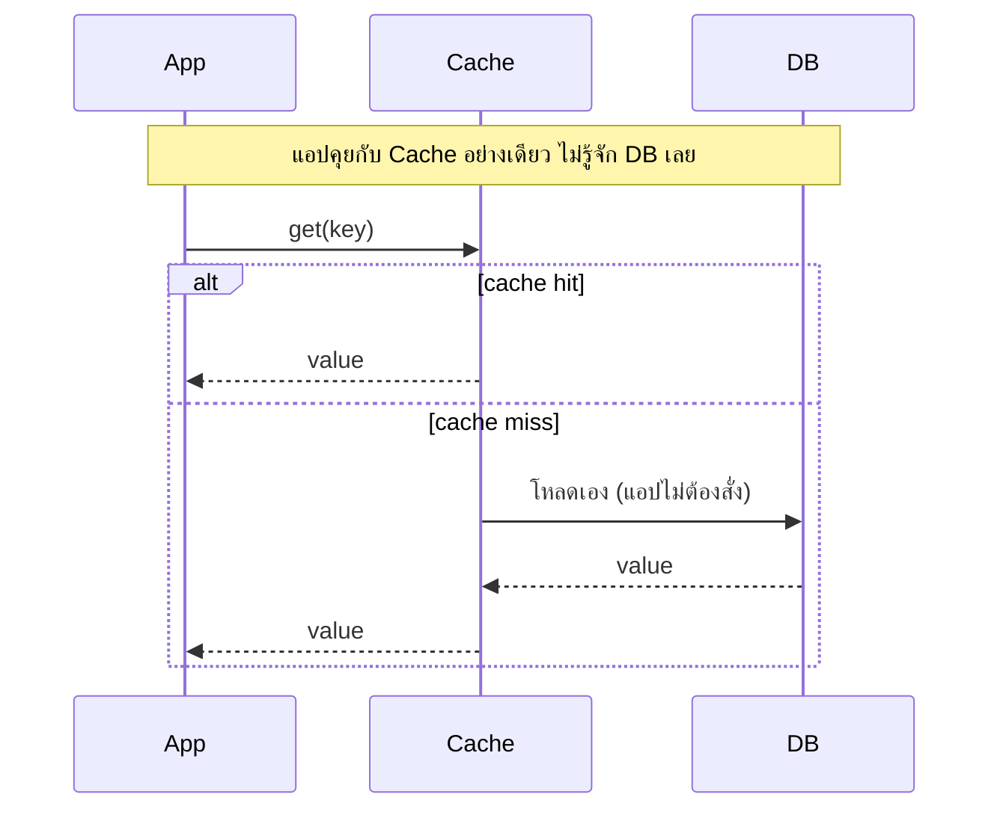
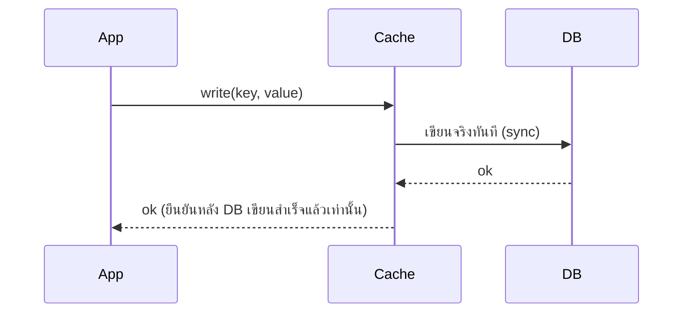
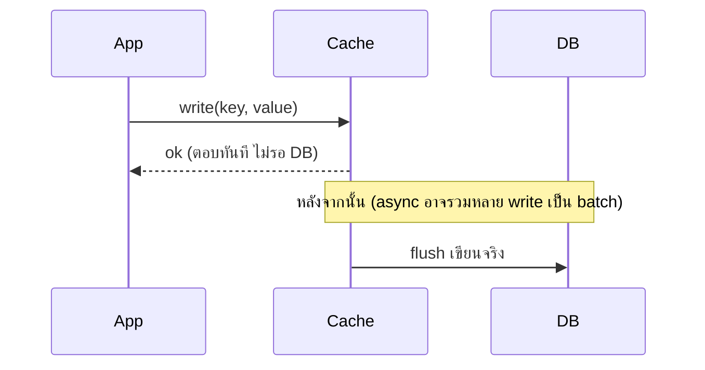
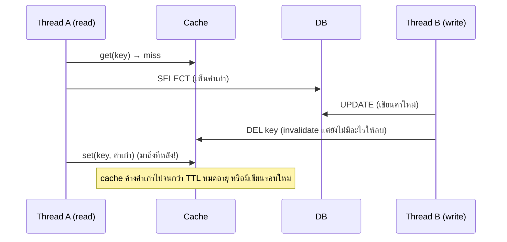

---
tags:
  - design-patterns
  - caching
  - distributed-systems
  - performance
type: reference
created: 2026-09-29
---

# 🗄️ Cache

> **ไม่ใช่ GoF design pattern** แต่เป็นชุด pattern ระดับ system design ที่ถูกถามคู่กับ design pattern บ่อยมาก — เก็บไว้ในหมวดนี้เพราะเป็นหลักการทั่วไป **ไม่ผูกกับภาษา/framework/cache store ตัวไหน** (ตัวอย่างเป็น pseudocode ทั่วไป ถ้าอยากดู implementation จริงด้วย Redis/Quarkus ไปที่ [[Redis]] และ [[Quarkus Redis]])
>
> **Cache = เก็บสำเนาข้อมูลที่เข้าถึงช้า/แพง ไว้ในที่ที่เข้าถึงเร็วกว่า** แลกมาด้วยความเสี่ยงที่สำเนานั้นจะไม่ตรงกับต้นฉบับ (staleness) — โน้ตนี้ตอบ 2 คำถามหลักที่ cache ทุกระบบต้องตัดสินใจ: **"อ่าน/เขียนผ่าน cache ยังไง"** (ข้อ 2) และ **"เอาของเก่าออกเมื่อไหร่"** (ข้อ 3-6)

---

## 1. ทำไมต้อง cache — และเมื่อไหร่ไม่ควร

**ประโยชน์หลัก 3 อย่าง:**
- **Latency** — อ่านจาก RAM/in-process เร็วกว่าอ่าน DB หรือยิง network call หลายเท่าตัว
- **Cost** — ลดการคำนวณซ้ำที่หนัก หรือลดการยิง external API ที่คิดเงินต่อ call
- **Load reduction** — กัน DB พังตอน traffic พุ่ง เพราะ request ส่วนใหญ่ไม่ไปถึง DB เลย

**ไม่ควร cache เมื่อ:**
- ข้อมูลเปลี่ยนเร็วกว่าที่ TTL ไหนจะตามทัน (เช่น ราคาหุ้นระดับ real-time)
- อ่านครั้งเดียวแล้วไม่อ่านซ้ำ — cache ไม่มีประโยชน์ มีแต่ overhead เปล่าๆ
- ความถูกต้อง 100% สำคัญกว่าความเร็ว (เช่น ยอดเงินคงเหลือ**ก่อน**ตัดเงินจริง ต้องอ่านจาก DB ตรงเสมอ ห้ามผ่าน cache)

---

## 2. Cache strategy — แยก "อ่านผ่าน cache ยังไง" กับ "เขียนผ่าน cache ยังไง"

คนมักคิดว่าต้องเลือก pattern เดียวให้ทั้งระบบ แต่จริงๆ **read-strategy กับ write-strategy เลือกแยกกันได้** ผสมกันได้ตามหน้างาน

### 2.1 Cache-aside (Lazy loading) — ใช้บ่อยที่สุด

แอปเช็ค cache ก่อนเสมอ พลาด (miss) ค่อยไปอ่านจากแหล่งข้อมูลจริงแล้ว**เติมกลับเข้า cache เอง** — **แอปเป็นคนคุมทั้ง cache และ DB ตรงๆ** cache กับ DB ไม่รู้จักกันเลย (diagram + โค้ด Redis จริงดูที่ [[Redis]] ข้อ 4.1)

### 2.2 Read-through — คล้าย cache-aside แต่ cache layer จัดการ miss เอง



ต่างจาก cache-aside ตรงที่**แอปไม่ต้องเขียน if-miss-then-load เอง** — ตัวอย่างจริงที่ใช้กันทุกวันแต่ไม่มีใครเรียกชื่อ pattern คือ **`@CacheResult` ของ `quarkus-cache`** (หรือ `@Cacheable` ของ Spring): annotation ครอบ method ไว้ ผ่าน proxy ทำ check-miss-load-populate ให้หมด แอปแค่เรียก method เฉยๆ (รายละเอียด/กับดักจริงดู [[Quarkus Redis]] ข้อ 2)

### 2.3 Write-through



ทุกครั้งที่เขียนต้องรอ DB เขียนเสร็จก่อนตอบกลับ — **cache กับ DB sync กันเสมอ ไม่มีช่วง stale** แลกมาด้วย write latency ที่สูงขึ้น

### 2.4 Write-behind (Write-back)



ตอบกลับ**ก่อนที่ DB จะเขียนจริงด้วยซ้ำ** — เร็วที่สุดในกลุ่ม แต่ถ้า cache process ตายก่อน flush **ข้อมูลที่ยังไม่ทันเขียนลง DB หายจริง** เหมาะกับงานที่ทนข้อมูลหายเล็กน้อยได้เพื่อแลกความเร็ว เช่น view counter, metrics

### 2.5 Write-around

เขียนตรงไป DB เท่านั้น **ไม่แตะ cache เลย** — cache จะมีข้อมูลนี้ก็ต่อเมื่อมีคนมาอ่านทีหลัง (ผ่าน cache-aside/read-through) เหมาะกับข้อมูลที่เขียนครั้งเดียวแล้วไม่ค่อยอ่านซ้ำ (log, ประวัติแชท) — ถ้าใช้กับข้อมูลที่อ่านซ้ำถี่ทันทีหลังเขียน จะเจอ miss รัวๆ ไม่คุ้ม

### เปรียบเทียบทั้งหมด

| Strategy | Read miss ทำยังไง | Write ทำยังไง | Consistency | ใช้เมื่อ |
|---|---|---|---|---|
| Cache-aside | แอป miss→อ่าน DB→เติม cache เอง | แอปเขียน DB แล้ว invalidate cache เอง | Eventual | ทั่วไปที่สุด อ่านมากกว่าเขียน |
| Read-through | Cache layer โหลดจาก DB ให้เอง | (มักคู่กับ write-around/write-through) | Eventual | ลดโค้ด boilerplate, library รองรับ (`@CacheResult`) |
| Write-through | (มักคู่กับ read-through) | เขียน cache+DB sync พร้อมกัน รอ DB เสร็จก่อน ack | Strong | อ่านซ้ำถี่หลังเขียน ต้องชัวร์ว่าไม่เจอของเก่า |
| Write-behind | (มักคู่กับ read-through) | เขียน cache ตอบทันที flush DB ทีหลัง (async/batch) | Weak | เขียนถี่มาก ทนข้อมูลหายได้บ้าง (counter, metrics) |
| Write-around | อ่านผ่าน cache-aside/read-through ตามปกติ | เขียนตรง DB เท่านั้น ไม่แตะ cache | Eventual | เขียนทีเดียว อ่านน้อย/ไม่อ่านอีก (log, history) |

---

## 3. Eviction policy — cache เต็มแล้วไล่ตัวไหนออก

| Policy | ไล่ตัวไหนออก | ข้อดี | ข้อเสีย |
|---|---|---|---|
| **LRU** (Least Recently Used) | ตัวที่ไม่ถูกใช้นานที่สุด | ตรงกับ pattern การใช้งานจริงส่วนใหญ่ | key ที่ถูกอ่านรัวๆช่วงสั้นแล้วเงียบยาวๆ ได้เปรียบเกินจริง |
| **LFU** (Least Frequently Used) | ตัวที่ถูกใช้น้อยที่สุด (นับความถี่สะสม) | ทนต่อ "burst แล้วเงียบ" ได้ดีกว่า LRU | ของใหม่ที่กำลังจะฮอตแต่ความถี่ยังน้อย ถูกไล่ออกเร็วเกินไป |
| **FIFO** | ตัวที่เข้ามาก่อนสุด | ง่ายสุด คำนวณน้อย | ไม่สนความถี่การใช้ อาจไล่ของฮอตที่ยังใช้อยู่ออก |
| **Random** | สุ่มไล่ | เร็ว ไม่ต้อง track อะไร | ไม่ optimize อะไรเลย |
| **TTL-only** (ไม่ evict แค่หมดอายุ) | ตัวที่ครบเวลา | คุมความสดตรงๆ ไม่พึ่ง memory pressure | ถ้า TTL ยาวเกินและ memory เต็มก่อน ยังต้องมี eviction policy สำรอง |

Redis ใช้ config `maxmemory-policy` เลือก policy พวกนี้ตรงๆ (`allkeys-lru`, `allkeys-lfu`, `volatile-ttl`, `noeviction` ฯลฯ — [ตัวเลือกทั้งหมด](https://redis.io/docs/latest/develop/reference/eviction/)) **`allkeys-lru` เป็น default ที่เหมาะกับงาน cache ทั่วไปที่สุด**

---

## 4. Invalidation — เอาของเก่าออกเมื่อไหร่

### 4.1 Passive — TTL หมดอายุเอง

ง่ายสุด ยอมรับ stale window สั้นๆ — ปลอดภัยสุดเมื่อไม่แน่ใจว่า invalidate ครบทุก code path ที่แก้ข้อมูลจริงหรือไม่

### 4.2 Active — Delete ตอนเขียน (ไม่ใช่ Update)

เขียน DB เสร็จ → **ลบ** key ใน cache ทิ้ง (ไม่ใช่เขียนค่าใหม่ทับตรงนั้น) แล้วให้ read ครั้งถัดไปโหลดใหม่เอง (cache-aside/read-through ตามปกติ)

**ทำไม "ลบ" ดีกว่า "update ทับ"** — บทเรียนจาก Facebook's Memcache ([*Scaling Memcache at Facebook*, NSDI 2013](https://www.usenix.org/conference/nsdi13/technical-sessions/presentation/nishtala)): delete เป็น **idempotent** — เรียกซ้ำกี่ครั้งผลลัพธ์เหมือนกัน (key หายไปแล้วก็หายไปแล้ว) แต่ "update" ไม่ใช่ ถ้าสอง write แข่งกันเขียนทับ cache ไม่ตามลำดับเดียวกับที่เขียน DB จริง cache อาจจบด้วยค่าที่ผิดโดยไม่มีใครรู้ (property นี้คือเรื่องเดียวกับที่ [[Idempotency]] อธิบายไว้)

### 4.3 กับดักคลาสสิก — Race ระหว่าง read-miss กับ write-invalidate



Thread A อ่านค่าเก่าจาก DB ไปก่อน Thread B เขียนเสร็จ แต่ A เขียนกลับเข้า cache **หลัง** B สั่ง invalidate — cache เลยจบลงด้วยค่าเก่าที่ไม่มีใครมาลบอีก

**ไม่มีทางกันได้ 100% ด้วย cache-aside เพียวๆ** ลดความเสียหายได้ด้วย: ตั้ง TTL สั้นเป็นตาข่ายกันตกเสมอ (ต่อให้ race เกิด ค่าเก่าก็หายไปเองไม่นาน), ทำ **delayed double-delete** (ลบ cache อีกทีหลัง write เสร็จไปสักพัก เผื่อจับ race ที่มาช้า), หรือย้ายไป read-through ที่ทำ per-key locking ตอน refetch

---

## 5. Cache stampede (Thundering herd)

**ปัญหา:** key ที่คนเข้าถึงบ่อยมากหมดอายุพร้อมกัน → request จำนวนมากเจอ miss พร้อมกันหมด แล้วยิง DB/recompute ซ้ำกันทั้งหมดในจังหวะเดียว

**วิธีแก้ที่ใช้จริง:**

1. **TTL jitter** — สุ่ม TTL ± เล็กน้อย (เช่น 300s ± 30s) ไม่ให้ key จำนวนมากหมดอายุพร้อมกันเป๊ะ
2. **Lock ตอน refetch** — คนแรกที่เจอ miss ถือ lock (`SET NX EX` แบบเดียวกับ [[Redis]] ข้อ 4.2) แล้วไปโหลดจริง คนอื่นที่มาเจอ miss พร้อมกันรอหรือได้ค่าเก่าไปก่อน ไม่ใช่ทุกคนวิ่งไป DB พร้อมกัน
3. **Probabilistic early expiration (XFetch)** — แทนที่จะรอ TTL หมดเป๊ะ แต่ละ request สุ่มคำนวณว่า "ควร refresh ล่วงหน้าหรือยัง" โดยความน่าจะเป็นเพิ่มขึ้นเรื่อยๆเมื่อใกล้หมดอายุ (exponential distribution) — ผลคือมีแค่ request เดียว(หรือน้อยมาก)ที่ไป refresh ล่วงหน้าแบบสุ่ม ที่เหลือยังได้ค่าเดิมไปใช้ตามปกติ ไม่มีจังหวะที่ cache "ว่างเปล่า" พร้อมกันเลย (ที่มา: [Vattani, Chierichetti, Lowenstein — *Optimal Probabilistic Cache Stampede Prevention*, VLDB 2015](http://www.vldb.org/pvldb/vol8/p886-vattani.pdf))
4. **Stale-while-revalidate** — ตอบค่าเก่าที่หมดอายุแล้วไปก่อนทันที พร้อมยิง refresh เบื้องหลังแบบเงียบๆ (เป็น HTTP `Cache-Control` extension จริงตาม [RFC 5861](https://datatracker.ietf.org/doc/html/rfc5861) ที่ CDN/browser cache รองรับ) เหมาะกับข้อมูลที่ "เก่านิดหน่อยไม่เป็นไร" ดีกว่าให้ผู้ใช้รอ

---

## 6. Negative caching — cache "ไม่เจอ" ด้วย

ถ้า miss แล้วไม่เจอใน DB จริงๆ (เช่น id ที่ไม่มีอยู่) แล้วไม่ cache ผลลัพธ์นั้นไว้เลย ทุก request ที่ถาม id เดิมจะยิง DB ซ้ำตลอดไป โดยเฉพาะถ้ามีคนจงใจยิง id สุ่มๆ ถามรัว (**cache penetration**) — **cache "not found" ไว้ด้วย** ด้วย TTL สั้นกว่าเคสปกติ (เผื่อ id นี้ถูกสร้างขึ้นจริงทีหลัง อยากให้เห็นเร็วกว่าข้อมูลที่ cache แบบยาวตามปกติ)

---

## 7. Multi-level cache — L1 (in-process) + L2 (distributed)

ต่อ cache in-process (เร็วระดับ nanosecond แต่แต่ละ instance แยกกัน เช่น Caffeine) ไว้หน้า cache กลาง (เร็วระดับ sub-millisecond ทุก instance เห็นชุดเดียวกัน เช่น Redis) — อ่านเช็ค L1 ก่อน miss ค่อยไป L2 miss อีกค่อยไป DB (`quarkus-cache` ทำแบบนี้ให้อัตโนมัติ default เป็น Caffeine แล้วค่อยสลับไป Redis ทีหลังได้โดยไม่แก้โค้ด — ดู [[Quarkus Redis]] ข้อ 2)

**ข้อแลก:** L1 เร็วกว่ามากแต่**ไม่ sync ข้าม instance อัตโนมัติ** — instance A invalidate แล้ว instance B's L1 ยังมีของเก่าค้างจนกว่า TTL ของ L1 จะหมด ถ้าต้อง sync ทันทีต้อง broadcast invalidate ข้าม instance เอง (เช่นใช้ Redis Pub/Sub ประกาศ "ล้าง L1 กันด้วย" — ตรงกับที่ [[Redis]] ข้อ 4.6 บอกว่า Pub/Sub เหมาะกับงานที่ข้อความหายได้บ้าง เคสนี้เข้าเกณฑ์เพราะ TTL เป็นตาข่ายสำรองอยู่แล้ว)

---

## 8. ออกแบบ cache key ให้ดี

- **ใส่ namespace/prefix เสมอ** (`product:123` ไม่ใช่ `123`) กัน key ชนกันข้ามโดเมนข้อมูล
- **ใส่ version ไว้ใน key** (`product:v2:123`) ตอนเปลี่ยนโครงสร้างข้อมูล — ของเก่าที่ deserialize ไม่ได้แล้วกลายเป็น "ไม่มีใครแตะ" แล้วหมดอายุไปเอง ไม่ต้อง migrate/ไล่ลบเอง (ตัวอย่างจริงที่ [[Quarkus Redis]] กับดัก)
- **ระวัง cardinality ระเบิด** — key ที่ผูกกับ combination พารามิเตอร์หลายตัว (เช่น `search:{query}:{filter}:{page}:{sort}`) จำนวน key ที่เป็นไปได้อาจมากกว่าจำนวนครั้งที่แต่ละ combination ถูกถามจริง ทำให้ hit rate ต่ำจนไม่คุ้ม cache
- **อย่า cache reference ของ mutable object ตรงๆ** (เจอบ่อยใน in-process cache ของภาษาที่ mutable by default) — ถ้า caller แก้ object ที่ได้จาก cache ต่อ ของที่อยู่ใน cache จะถูกแก้ไปด้วยโดยไม่ตั้งใจ ต้อง copy/immutable ก่อนคืนออกจาก cache

---

## กับดัก (รวบรวม)

- Race ระหว่าง read-miss กับ write-invalidate ทำให้ cache ค้างค่าเก่าไม่มีกำหนด (ข้อ 4.3) — TTL สั้นเป็นตาข่ายกันตกเสมอ
- Cache stampede บน hot key (ข้อ 5) — อย่าตั้ง TTL เท่ากันเป๊ะทุก key
- ไม่ cache negative result → โดน cache penetration ยิง DB ซ้ำด้วย id ปลอม (ข้อ 6)
- Update cache ทับตรงๆ ตอน invalidate แทนการ delete → concurrent write ชนกันแล้วได้ค่าผิดค้างอยู่ (ข้อ 4.2)
- Multi-level cache ไม่ broadcast invalidate ข้าม instance → บาง instance เห็นข้อมูลเก่านานกว่าที่ควร (ข้อ 7)
- คิดว่า cache เป็น source of truth — ต้องเป็น optional layer ที่ตายแล้ว fallback ไป DB ได้เสมอ ไม่ใช่ที่เดียวที่มีข้อมูลจริง
- ผสม read strategy กับ write strategy โดยไม่ตั้งใจ (เช่น ตั้งใจทำ write-around แต่ TTL ฝั่ง cache-aside read ยาวเกินไป ทำให้อ่านได้ของเก่านานผิดคาด)

---

## Cheat sheet

| ต้องการ | ใช้ |
|---|---|
| อ่านบ่อย เขียนน้อย ทั่วไปที่สุด | Cache-aside (2.1) |
| ไม่อยากเขียน if-miss เอง | Read-through / `@CacheResult` (2.2) |
| ต้อง consistent เป๊ะทุกครั้งที่เขียน | Write-through (2.3) |
| เขียนถี่มาก ทนข้อมูลหายได้นิดหน่อย | Write-behind (2.4) |
| เขียนทีเดียว อ่านไม่ซ้ำ | Write-around (2.5) |
| cache เต็ม ต้องไล่ | `allkeys-lru` เป็น default ที่ปลอดภัยสุด (3) |
| กัน hot key ทำ DB ล้ม | TTL jitter + lock, หรือ stale-while-revalidate (5) |
| กัน DB โดนยิงด้วย id ปลอม | Negative caching (6) |

```
Cache-aside read : miss → load DB → set(key, value, ttl)
Cache-aside write: write DB → del(key)              # ลบ ไม่ update
Stampede guard   : ttl = base ± jitter, หรือ lock ตอน refetch คนแรก
```

---

## 🔗 เกี่ยวข้อง

- [[Redis]] — implementation จริงของ cache-aside/distributed lock (ข้อ 4.1-4.2), ตัวเลือก eviction policy จริงบน Redis (ข้อ 6)
- [[Quarkus Redis]] — `@CacheResult` = read-through จริงในโค้ด, Caffeine (L1) → Redis (L2) จริง (ข้อ 2), กับดักเรื่อง cache key version (ข้อ 7)
- [[Idempotency]] — หลักการใกล้เคียงกัน (delete idempotent แต่ update ไม่, ข้อ 4.2)
- [[Design Patterns]] — หน้ารวม

## 📖 อ่านต่อ

- [AWS — Database Caching Strategies Using Redis](https://docs.aws.amazon.com/whitepapers/latest/database-caching-strategies-using-redis/evictions.html)
- [Nishtala et al. — Scaling Memcache at Facebook (NSDI 2013)](https://www.usenix.org/conference/nsdi13/technical-sessions/presentation/nishtala)
- [Vattani, Chierichetti, Lowenstein — Optimal Probabilistic Cache Stampede Prevention (VLDB 2015)](http://www.vldb.org/pvldb/vol8/p886-vattani.pdf)
- [RFC 5861 — HTTP Cache-Control Extensions for Stale Content](https://datatracker.ietf.org/doc/html/rfc5861)
- [Redis — Key eviction](https://redis.io/docs/latest/develop/reference/eviction/)
