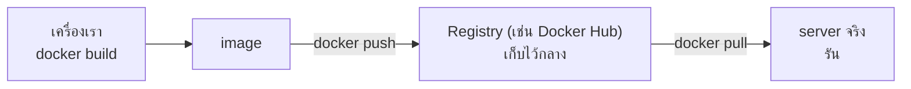

---
tags:
  - docker
  - devops
  - docker-compose
  - deploy
  - beginner
type: tutorial
created: 2026-08-18
---

# 🐳 Docker ภาค 3 — Compose และ Deploy จริง

> ก่อนอ่านภาคนี้ควรผ่าน [[Docker Basics]] และ [[Docker Dockerfile]] มาแล้ว
> เป้าหมายของภาคนี้: **รันหลาย container พร้อมกันเป็นระบบเดียว** แล้ว **เอา image ที่ทำเองไปรันบน server จริง**

---

## 1. ปัญหาที่ Docker Compose แก้

แอปจริงแทบไม่มีทางมีแค่ container เดียว — ปกติต้องมี backend + database + cache อย่างน้อย

```powershell
# ทำแบบนี้ทุกครั้งที่จะรันระบบ? ลำบากและลืมง่าย
docker run -d --name db -e POSTGRES_PASSWORD=pass -v pgdata:/var/lib/postgresql/data postgres:16
docker run -d --name redis redis:7
docker run -d --name api -p 8080:8080 --link db --link redis my-api-image
```

**Docker Compose ให้เขียนทั้งหมดนี้ไว้ในไฟล์เดียว แล้วสั่งขึ้นพร้อมกันทีเดียว**

```powershell
docker compose up -d
```

> หมายเหตุ: คำสั่งปัจจุบันคือ `docker compose` (มีช่องว่าง ไม่มีขีด) ติดมากับ Docker Desktop อยู่แล้ว ไม่ต้องติดตั้งแยก — `docker-compose` (มีขีด) เป็นเครื่องมือรุ่นเก่าที่เลิกพัฒนาแล้ว

---

## 2. ตัวอย่างแรก — backend + database

```
docker-lab-compose/
├── compose.yaml
├── Dockerfile
├── package.json
└── server.js
```

ใช้ `server.js`/`package.json`/`Dockerfile` ตัวเดียวกับภาค 2 ได้เลย เพิ่มไฟล์ `compose.yaml`:

```yaml
# compose.yaml
services:
  api:
    build: .                        # build จาก Dockerfile ในโฟลเดอร์นี้
    ports:
      - "3000:3000"
    environment:
      - DATABASE_URL=postgres://postgres:pass@db:5432/mydb
    depends_on:
      - db

  db:
    image: postgres:16
    environment:
      - POSTGRES_PASSWORD=pass
      - POSTGRES_DB=mydb
    volumes:
      - pgdata:/var/lib/postgresql/data

volumes:
  pgdata:
```

```powershell
docker compose up -d
docker compose ps
```

```
NAME                    IMAGE          STATUS
docker-lab-compose-api-1   docker-lab-compose-api   Up
docker-lab-compose-db-1    postgres:16              Up
```

**สิ่งที่เพิ่งเกิดขึ้น:** Compose สร้าง network ให้อัตโนมัติที่ทั้งสอง service คุยกันได้ — สังเกตว่า `DATABASE_URL` เขียนว่า `db:5432` ไม่ใช่ `localhost:5432` **`db` คือชื่อ service ที่ตั้งไว้ในไฟล์ Compose มันกลายเป็นชื่อโฮสต์ที่ container อื่นเรียกหากันได้เอง** — นี่คือประโยชน์ใหญ่ที่สุดของ Compose เหนือกว่าการ `docker run` แยกทีละตัว

```powershell
docker compose logs -f api      # ดู log เฉพาะ service api
docker compose down             # หยุดและลบทุก container (volume ยังอยู่)
docker compose down -v          # หยุดและลบทั้ง container และ volume (ข้อมูลหายด้วย!)
```

---

## 3. อ่านโครงสร้างไฟล์ทีละส่วน

```yaml
services:              # ← รายชื่อ container ทั้งหมดในระบบ
  <ชื่อ service>:
    build: .            # หรือ image: <ชื่อ image> ถ้าใช้ของสำเร็จรูป
    ports:
      - "host:container"
    environment:
      - KEY=value
    volumes:
      - <volume-name>:/path/ข้างใน
    depends_on:
      - <service อื่นที่ต้องขึ้นก่อน>

volumes:                # ← ประกาศ volume ที่ใช้ (ให้ Compose จัดการที่เก็บให้)
  <volume-name>:

networks:                # ← ปกติไม่ต้องเขียนเอง Compose สร้าง default ให้แล้ว
```

**ไม่ต้องมีบรรทัด `version:` แล้ว** — เคยเป็นข้อบังคับในไฟล์ยุคเก่า (`version: "3.8"`) แต่ Docker Compose รุ่นปัจจุบันเลิกใช้แล้ว ใส่ไปก็แค่เตือนเฉย ๆ ไม่มีผลอะไร ตัวอย่างเก่าบนเว็บจำนวนมากยังมีบรรทัดนี้ค้างอยู่ ไม่ต้องเลียนแบบ

---

## 4. `depends_on` ไม่ได้แปลว่า "รอจนพร้อม" — ต้องรู้ก่อนจะงง

```yaml
depends_on:
  - db
```

**แบบสั้นแบบนี้แปลว่า "รอให้ container `db` แค่เริ่ม (start) เท่านั้น"** ไม่ได้รอจนกว่า postgres ข้างในจะพร้อมรับ connection จริง ๆ ผลคือบางครั้ง `api` เริ่มก่อน `db` พร้อม แล้ว connect ไม่ติดตอน startup

### แก้ด้วย healthcheck + condition

```yaml
services:
  api:
    build: .
    depends_on:
      db:
        condition: service_healthy    # รอจน db "พร้อมจริง" ไม่ใช่แค่ "เริ่มแล้ว"

  db:
    image: postgres:16
    environment:
      - POSTGRES_PASSWORD=pass
    healthcheck:
      test: ["CMD-SHELL", "pg_isready -U postgres"]
      interval: 5s
      timeout: 5s
      retries: 5
```


`api` รอสถานะ `healthy` จาก `db` ก่อนถึงจะเริ่ม

---

## 5. `.env` — แยกค่าที่เปลี่ยนตามสภาพแวดล้อมออกจากไฟล์ Compose

```
docker-lab-compose/
├── compose.yaml
└── .env
```

```bash
# .env
DB_PASSWORD=pass
API_PORT=3000
```

```yaml
services:
  api:
    build: .
    ports:
      - "${API_PORT}:3000"
    environment:
      - DATABASE_URL=postgres://postgres:${DB_PASSWORD}@db:5432/mydb
  db:
    image: postgres:16
    environment:
      - POSTGRES_PASSWORD=${DB_PASSWORD}
```

Compose อ่านไฟล์ `.env` ในโฟลเดอร์เดียวกันให้อัตโนมัติ ไม่ต้องสั่งอะไรเพิ่ม

**⚠️ ต้องใส่ `.env` ใน `.gitignore` เสมอ** ถ้ามีรหัสผ่านหรือ secret อยู่ในนั้น — commit เข้า git แล้วรหัสหลุดไปกับ history ตลอดกาล ลบทีหลังก็ไม่ช่วยเพราะยังอยู่ใน commit เก่า

---

## 6. เตรียม image เพื่อ deploy — Registry คืออะไร



**Registry คือที่เก็บ image กลาง** (แบบเดียวกับที่ git repository เป็นที่เก็บโค้ดกลาง) — build image บนเครื่องเราแล้ว push ขึ้นไปเก็บ จากนั้น server ปลายทางค่อย pull ลงมารัน ไม่ต้องส่งไฟล์กันเองผ่านช่องทางอื่น

### ตัวอย่างด้วย Docker Hub (ฟรี สำหรับ image สาธารณะ)

```powershell
docker login
docker tag my-first-image myusername/my-first-image:1.0
docker push myusername/my-first-image:1.0
```

**`docker tag` ทำไมต้องมี:** ชื่อ image ที่จะ push ต้องขึ้นต้นด้วยชื่อบัญชี/องค์กรบน registry นั้น (`myusername/...`) ต้อง tag ชื่อให้ตรงรูปแบบก่อนถึงจะ push ได้

```powershell
# ที่เครื่องอื่น หรือ server ปลายทาง
docker pull myusername/my-first-image:1.0
docker run -d -p 8080:80 myusername/my-first-image:1.0
```

> ในงานบริษัท มักมี **private registry** ของตัวเอง (เช่น Harbor, GitLab Container Registry, AWS ECR) แทน Docker Hub สาธารณะ — วิธีใช้เหมือนกันทุกอย่าง ต่างแค่ `docker login <registry-url>` ก่อน แล้ว tag ชื่อ image ให้มี hostname ของ registry นำหน้า

---

## 7. Deploy ขึ้น server จริง — ภาพรวม

```
① เตรียม server (ลง Docker ให้เรียบร้อยเหมือนเครื่องเรา)
② push image ขึ้น registry (ข้อ 6)
③ เชื่อมต่อไปที่ server (ผ่าน SSH)
④ pull image ลงมาที่ server
⑤ รัน container ที่ server ด้วย docker run หรือ docker compose up
```

### วิธีที่ง่ายที่สุดสำหรับมือใหม่ — SSH เข้าไปรันเอง

```bash
# SSH เข้า server
ssh user@my-server.com

# ที่ server (ต้องลง Docker ไว้แล้ว)
docker login
docker pull myusername/my-first-image:1.0
docker run -d -p 80:80 --restart unless-stopped --name prod-app myusername/my-first-image:1.0
```

**`--restart unless-stopped` สำคัญมากสำหรับ production** — ถ้า server รีสตาร์ต (ไฟดับ, patch OS) container จะเริ่มขึ้นมาเองอัตโนมัติ ไม่ต้อง SSH เข้าไปสั่งรันมือทุกครั้ง

| ค่า `--restart` | พฤติกรรม |
|---|---|
| `no` (default) | ไม่ restart อัตโนมัติเลย |
| `on-failure` | restart เฉพาะตอนพัง (exit code ไม่ใช่ 0) |
| `unless-stopped` | restart เสมอ เว้นแต่ตั้งใจ `docker stop` เอง — **แนะนำสำหรับ production** |
| `always` | restart เสมอไม่มีข้อยกเว้น แม้แต่ตอนตั้งใจ stop |

### วิธีที่สะดวกกว่า — Docker Context (ไม่ต้อง SSH เข้าไปพิมพ์เอง)

```powershell
# สร้าง context ชี้ไปที่ server ผ่าน SSH
docker context create prod --docker "host=ssh://user@my-server.com"

# สลับไปใช้ context นั้น
docker context use prod

# จากนี้ทุกคำสั่ง docker ที่พิมพ์บนเครื่องเรา ไปรันที่ server จริงแทน!
docker compose up -d

# สลับกลับมาที่เครื่องตัวเอง
docker context use default
```

**นี่คือของที่ทำให้ deploy สะดวกขึ้นมาก** — พิมพ์คำสั่งจากเครื่องตัวเอง แต่ผลไปเกิดที่ server ปลายทาง ไม่ต้อง SSH เข้าไปพิมพ์คำสั่งยาว ๆ ทุกครั้งที่จะ deploy

---

## 8. Deploy ระบบทั้งชุด (compose) ขึ้น server

```powershell
docker context use prod
docker compose pull            # ดึง image เวอร์ชันล่าสุดจาก registry
docker compose up -d           # รันใหม่ ตัวที่เปลี่ยนจะถูกสร้างใหม่ ตัวที่เหมือนเดิมไม่แตะ
docker context use default
```

**`docker compose up -d` รันซ้ำได้อย่างปลอดภัย** — ถ้า service ไหนไม่มีอะไรเปลี่ยน มันจะข้ามไปเฉย ๆ ไม่ต้องกลัวรันซ้ำแล้วพัง

---

## 9. เก็บ config ให้เหมาะกับแต่ละสภาพแวดล้อม

```yaml
# compose.yaml — ค่าพื้นฐานที่ใช้ร่วมกันทุกที่
services:
  api:
    build: .
    environment:
      - NODE_ENV=production
```

```yaml
# compose.override.yaml — ใช้เฉพาะตอน dev, Compose รวมให้อัตโนมัติ
services:
  api:
    build: .
    volumes:
      - .:/app             # mount โค้ดสด ๆ เพื่อแก้แล้วเห็นผลทันทีตอน dev
    environment:
      - NODE_ENV=development
```

```powershell
docker compose up -d                                    # dev — รวม override อัตโนมัติ
docker compose -f compose.yaml up -d                     # prod — ใช้เฉพาะไฟล์หลัก ไม่เอา override
```

`compose.override.yaml` ถูกอ่านรวมกับ `compose.yaml` โดยอัตโนมัติถ้าอยู่โฟลเดอร์เดียวกัน — เหมาะกับของที่อยากได้ตอน dev แต่ไม่อยากให้หลุดไป prod เช่น mount โค้ดสด

---

## 10. กับดัก

- **`.env` หลุดเข้า git** — รหัสผ่านรั่วถาวรในประวัติ commit ต้อง `.gitignore` ไว้ตั้งแต่แรก
- **ลืมว่า `depends_on` แบบสั้นไม่รอความพร้อมจริง** — แอปพยายาม connect DB ก่อน DB พร้อม ทำให้ error ตอน startup แบบสุ่ม ๆ (ข้อ 4)
- **ไม่ตั้ง `--restart`** — server รีสตาร์ตแล้ว container ไม่ขึ้นเอง ต้องมานั่ง SSH เข้าไปสั่งรันมือ
- **`docker compose down -v` บน production โดยไม่ตั้งใจ** — `-v` ลบ volume ด้วย ข้อมูลจริงหายทั้งฐาน ต้องแน่ใจก่อนใส่ flag นี้เสมอ
- **ใช้ tag `latest` ตอน deploy งานจริง** — ไม่รู้ว่า pull มาได้เวอร์ชันไหนกันแน่ ย้อนดูไม่ได้ว่า deploy ตัวไหนไปเมื่อไหร่ ควร tag ด้วยเลขเวอร์ชันหรือ commit hash เสมอ
- **เปิดพอร์ต database ออกสู่อินเทอร์เน็ตตรง ๆ** เช่น `-p 5432:5432` บน server ที่ไม่มี firewall กัน — ฐานข้อมูลควรเข้าถึงได้แค่จาก container อื่นในเครือข่ายเดียวกัน ไม่ต้อง publish port ออกไปข้างนอกเลยถ้าไม่จำเป็น
- **ไม่มี healthcheck เลยทั้งระบบ** — ไม่รู้ว่า service ไหน "ดูเหมือนรันอยู่" แต่จริง ๆ พังข้างในแล้ว

---

## 11. Cheat sheet

```yaml
services:
  <name>:
    build: .
    image: registry/name:tag
    ports: ["host:container"]
    environment: ["KEY=value"]
    volumes: ["vol:/path"]
    depends_on:
      other:
        condition: service_healthy
    restart: unless-stopped
    healthcheck:
      test: ["CMD-SHELL", "..."]
      interval: 5s
volumes:
  vol:
```

```powershell
# Compose
docker compose up -d           # ขึ้นทั้งระบบ
docker compose down            # หยุด+ลบทั้งระบบ (volume ไม่หาย)
docker compose down -v         # หยุด+ลบทั้งระบบ+volume (ข้อมูลหาย!)
docker compose logs -f <name>  # ดู log
docker compose ps              # สถานะทุก service

# Registry / Deploy
docker login
docker tag <local> <user>/<name>:<tag>
docker push <user>/<name>:<tag>
docker pull <user>/<name>:<tag>
docker context create prod --docker "host=ssh://user@host"
docker context use prod
```

| อาการ | สาเหตุ |
|---|---|
| `api` connect DB ไม่ติดตอน startup แบบสุ่ม ๆ | `depends_on` แบบสั้นไม่รอ DB พร้อมจริง — ใส่ healthcheck |
| container ไม่ขึ้นเองหลัง server รีสตาร์ต | ไม่ได้ตั้ง `restart: unless-stopped` |
| ข้อมูลหายหลัง deploy รอบใหม่ | `down -v` ไปลบ volume โดยไม่ตั้งใจ |
| deploy แล้วไม่รู้ว่าได้โค้ดเวอร์ชันไหน | ใช้ tag `latest` แทนเลขเวอร์ชันจริง |
| รหัสผ่านหลุดใน git history | ไม่ได้ `.gitignore` ไฟล์ `.env` |
| `docker push` ไม่ผ่าน บอก denied | ยังไม่ `docker tag` ให้ชื่อขึ้นต้นด้วยชื่อบัญชีบน registry |

---

## 🔗 เกี่ยวข้อง

- [[Docker Basics]] — ภาค 1: พื้นฐาน
- [[Docker Dockerfile]] — ภาค 2: เขียน image เอง
- [[Quarkus Build]] — native/JVM build ของ Quarkus ที่จะเอาไป containerize ด้วยความรู้ชุดนี้
- [[CI-CD — Jenkins vs GitHub Actions]] — ขั้นตอนถัดไปหลังทำ deploy มือเป็นแล้ว คือทำให้มันอัตโนมัติ

## 📖 อ่านต่อ

- [Docker Docs — Compose file reference](https://docs.docker.com/reference/compose-file/)
- [Docker Docs — Docker contexts](https://docs.docker.com/engine/manage-resources/contexts/)
