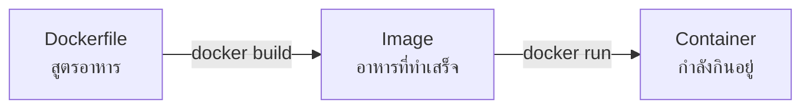
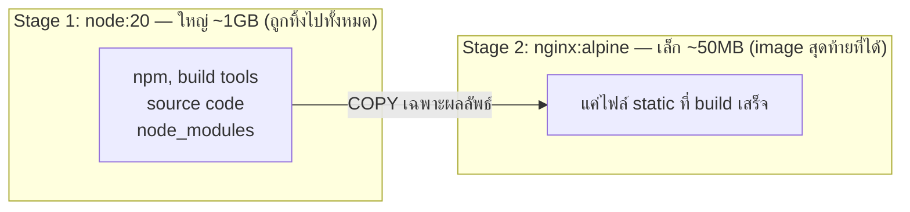

---
tags:
  - docker
  - devops
  - dockerfile
  - beginner
type: tutorial
created: 2026-08-18
---

# 🐳 Docker ภาค 2 — เขียน Dockerfile เอง

> ก่อนอ่านภาคนี้ควรผ่าน [[Docker Basics]] มาแล้ว — เข้าใจ image/container, รัน/หยุด/ลบ container เป็น
> เป้าหมายของภาคนี้: **เขียน image ของตัวเองได้ ไม่ใช่แค่ดึงของคนอื่นมาใช้**

---

## 1. Dockerfile คืออะไร



**Dockerfile คือไฟล์ข้อความธรรมดา** (ไม่มีนามสกุล ชื่อไฟล์ตรง ๆ คือ `Dockerfile`) เขียนเป็นขั้นตอนทีละบรรทัดว่า "เอา base อะไร → ติดตั้งอะไร → copy ไฟล์อะไรเข้าไป → รันคำสั่งอะไรตอนเริ่ม"

รันคำสั่งเดียวก็ได้ image ออกมา:

```powershell
docker build -t my-app .
```

---

## 2. ตัวอย่างที่เล็กที่สุดที่เขียนได้ — เว็บ static

สร้างโฟลเดอร์ทดลอง:

```powershell
mkdir docker-lab
cd docker-lab
```

สร้างไฟล์ `index.html`:

```html
<!DOCTYPE html>
<html>
<body><h1>สวัสดี จาก Docker image ของฉันเอง</h1></body>
</html>
```

สร้างไฟล์ชื่อ `Dockerfile` (ไม่มีนามสกุล):

```dockerfile
FROM nginx:1.27-alpine
COPY index.html /usr/share/nginx/html/index.html
```

### Build และรัน

```powershell
docker build -t my-first-image .
docker run -d -p 8080:80 --name my-first-container my-first-image
```

เปิด `http://localhost:8080` — ควรเห็นข้อความที่เขียนเอง

**แค่นี้คือ Docker image ตัวแรกที่เขียนเองแล้ว** ทุกอย่างต่อจากนี้คือการขยายจากรูปแบบนี้

---

## 3. อ่าน instruction ทีละตัว

### `FROM` — เลือก base image

```dockerfile
FROM nginx:1.27-alpine
```

ทุก Dockerfile ต้องเริ่มด้วย `FROM` เสมอ — คือการบอกว่า "เริ่มจากพื้นฐานอะไร" แทนที่จะสร้าง Linux เปล่า ๆ จากศูนย์เอง

**`alpine` คืออะไร:** เป็น Linux distro ที่เล็กมาก (ไม่กี่ MB) เทียบกับ Debian/Ubuntu เต็ม ๆ (หลายร้อย MB) นิยมใช้เป็น base เพราะ image ที่ได้เล็กและปลอดภัยกว่า (มีของน้อย = ช่องโหว่น้อย) แต่บางทีขาด tool บางตัวที่ image เต็มมีให้

### `COPY` — เอาไฟล์จากเครื่องเราเข้าไปใน image

```dockerfile
COPY index.html /usr/share/nginx/html/index.html
COPY ./src /app/src              # copy ทั้งโฟลเดอร์
COPY . .                          # copy ทุกอย่างในโฟลเดอร์ปัจจุบัน
```

```
COPY <ที่มา (บนเครื่องเรา)>  <ปลายทาง (ข้างใน image)>
```

### `RUN` — สั่งคำสั่งตอน build

```dockerfile
RUN apt-get update && apt-get install -y curl
```

รันครั้งเดียวตอน `docker build` ผลลัพธ์ถูก "อบ" ติดไปกับ image เลย ไม่ใช่รันทุกครั้งที่ container เริ่ม (นั่นคือหน้าที่ของ `CMD`)

### `CMD` — คำสั่งที่รันตอน container เริ่มทำงาน

```dockerfile
CMD ["node", "server.js"]
```

รันแค่ตอน `docker run` เท่านั้น — เขียนแบบ array (เรียกว่า **exec form**) จะดีกว่าเขียนเป็น string ธรรมดา เพราะจัดการ signal (เช่นตอน `docker stop`) ได้ถูกต้องกว่า

### `WORKDIR` — ตั้ง "โฟลเดอร์ปัจจุบัน" ข้างใน image

```dockerfile
WORKDIR /app
COPY . .              # ตอนนี้ copy เข้า /app โดยอัตโนมัติ
```

เหมือนสั่ง `cd /app` แล้วทุกคำสั่งหลังจากนั้นอ้างอิงจากตรงนั้น — ดีกว่าเขียน path เต็มซ้ำ ๆ ทุกบรรทัด

### `EXPOSE` — บอก (เอกสาร) ว่า container ฟังพอร์ตไหน

```dockerfile
EXPOSE 3000
```

**⚠️ กับดักที่มือใหม่เข้าใจผิดบ่อยที่สุด: `EXPOSE` ไม่ได้เปิดพอร์ตให้จริง** มันเป็นแค่เอกสารบอกคนอ่านว่า "แอปนี้ฟังที่พอร์ตนี้นะ" **การเปิดพอร์ตจริงต้องใช้ `-p` ตอน `docker run` เท่านั้น** (ตามที่เรียนไปใน [[Docker Basics]])

### `ENV` — ตั้งค่า environment variable ให้ image

```dockerfile
ENV NODE_ENV=production
```

---

## 4. ตัวอย่างที่ใหญ่ขึ้น — แอป Node.js

```
docker-lab-node/
├── Dockerfile
├── package.json
└── server.js
```

```json
// package.json
{
  "name": "hello-docker",
  "version": "1.0.0",
  "dependencies": { "express": "^4.19.0" }
}
```

```js
// server.js
const express = require("express");
const app = express();
app.get("/", (req, res) => res.send("สวัสดีจาก Node.js ใน Docker"));
app.listen(3000, () => console.log("running on port 3000"));
```

```dockerfile
FROM node:20-alpine
WORKDIR /app
COPY package.json .
RUN npm install
COPY . .
EXPOSE 3000
CMD ["node", "server.js"]
```

```powershell
docker build -t hello-node .
docker run -d -p 3000:3000 --name hello-node-c hello-node
```

เปิด `http://localhost:3000`

---

## 5. ⭐ Layer และ Cache — เรื่องที่ทำให้ build เร็วขึ้นสิบเท่า

**ทุกบรรทัดใน Dockerfile กลายเป็น "layer" หนึ่งชั้น** เหมือนแผ่นใสซ้อนกัน — Docker จำ layer แต่ละชั้นไว้ ถ้า build ใหม่แล้ว layer ไหนไม่เปลี่ยน **มันข้ามการรันซ้ำแล้วใช้ของเก่าเลย (cache hit)**

```
FROM node:20-alpine          ─┐
WORKDIR /app                  ├─ layer เหล่านี้แทบไม่เปลี่ยนเลย → cache ตลอด
COPY package.json .           │
RUN npm install               ─┘  ← ใช้เวลานาน แต่ cache ได้ถ้า package.json ไม่เปลี่ยน
COPY . .                      ─┐  ← โค้ดเปลี่ยนบ่อยที่สุด
EXPOSE 3000                    ├─ ทุกครั้งที่แก้โค้ด layer พวกนี้ต้องรันใหม่
CMD ["node", "server.js"]     ─┘
```

**กฎทอง: เรียงจากของที่เปลี่ยนน้อยไปของที่เปลี่ยนบ่อย** — วางบนสุด (rebuild น้อย) ไปล่างสุด (rebuild บ่อย)

### ทำไม `COPY package.json .` แยกจาก `COPY . .`

```dockerfile
# ❌ ผิด — copy ทุกอย่างมาทีเดียว แล้วค่อย install
COPY . .
RUN npm install
```

```dockerfile
# ✅ ถูก — copy แค่ package.json ก่อน install แยกจาก code
COPY package.json .
RUN npm install
COPY . .
```

**เหตุผล:** ถ้าเขียนแบบผิด ทุกครั้งที่แก้โค้ดแม้แค่บรรทัดเดียว Docker เห็นว่า `COPY . .` เปลี่ยน → รัน `npm install` ใหม่ทั้งหมดทุกครั้ง (ช้ามาก อาจนาทีนึง) แต่ถ้าเขียนแบบถูก ตราบใดที่ `package.json` ไม่เปลี่ยน `RUN npm install` **จะใช้ cache เดิม ข้ามไปเลย** แก้แค่โค้ดแล้ว build ใหม่จะเสร็จในไม่กี่วินาที

**นี่คือหลักการเดียวกับที่ใช้ตอนเขียน Dockerfile สำหรับ Quarkus** — แยก `COPY pom.xml` ออกจาก `COPY src/` เพื่อ cache ขั้นตอนดาวน์โหลด dependency ไว้ (ดู [[Quarkus Build]])

---

## 6. `.dockerignore` — บอกว่าอะไรไม่ต้อง copy เข้าไป

```
# .dockerignore
node_modules
.git
*.log
.env
```

ทำงานเหมือน `.gitignore` — ป้องกันไม่ให้ `COPY . .` ลากไฟล์ที่ไม่จำเป็น (หรืออันตราย เช่น `.env` ที่มีรหัสลับ) เข้าไปใน image **ควรมีทุกโปรเจกต์** ไม่มีข้อยกเว้น

**ทำไมสำคัญกว่าที่คิด:** `node_modules` บนเครื่องเราอาจ build มาสำหรับ Windows แต่ container ข้างในเป็น Linux — ถ้า copy `node_modules` เก่าเข้าไปแทนที่จะให้ `npm install` สร้างใหม่ข้างใน container จะพังเพราะ native module ไม่ตรง OS

---

## 7. Multi-stage build — image เล็กลงและปลอดภัยขึ้น

**ปัญหา:** เครื่องมือ build (compiler, npm, build tools) ไม่จำเป็นต้องอยู่ใน image ตอนรันจริง มีแต่ทำให้ image ใหญ่และเสี่ยงด้านความปลอดภัยโดยไม่มีประโยชน์

```dockerfile
# ---------- Stage 1: build ----------
FROM node:20 AS build
WORKDIR /app
COPY package.json .
RUN npm install
COPY . .
RUN npm run build          # สมมติสร้างไฟล์ static ออกมาที่ /app/dist

# ---------- Stage 2: run จริง ----------
FROM nginx:1.27-alpine
COPY --from=build /app/dist /usr/share/nginx/html
```



**`AS build`** ตั้งชื่อ stage แรกว่า `build` แล้ว **`COPY --from=build`** ใน stage ที่สองดึงเฉพาะไฟล์ผลลัพธ์ที่ต้องการมา — เครื่องมือ build ทั้งหมดใน stage แรกถูกทิ้งไปเลย ไม่ติดไปกับ image สุดท้าย

**ผลลัพธ์จริง:** image ที่ได้อาจเล็กลงจาก ~1GB เหลือ ~50MB และไม่มี compiler/build tool ติดไปให้แฮกเกอร์ใช้ประโยชน์ได้เลยแม้จะเจาะเข้ามาได้

---

## 8. รันด้วยสิทธิ์ต่ำ — อย่าใช้ root

```dockerfile
FROM node:20-alpine
WORKDIR /app
COPY package.json .
RUN npm install
COPY . .
RUN addgroup -S appgroup && adduser -S appuser -G appgroup
USER appuser                  # ← เปลี่ยนจาก root มาเป็น user นี้
CMD ["node", "server.js"]
```

**ค่าเริ่มต้นถ้าไม่ระบุ `USER` container จะรันเป็น `root`** — ถ้ามีช่องโหว่ในแอปแล้วมีคนเจาะเข้ามาได้ จะได้สิทธิ์ root เต็ม ๆ ข้างใน container ทันที การตั้ง `USER` ธรรมดาจำกัดความเสียหายได้มาก

> image ทางการหลายตัว (เช่น `node`) มี user สำเร็จรูปให้ใช้เลยโดยไม่ต้องสร้างเอง เช่น `USER node`

---

## 9. Debug ตอน build ไม่ผ่าน

```powershell
docker build -t my-app .
```

ถ้า error ระหว่าง build อ่าน log ที่ terminal พ่นออกมา — Docker บอกตรง ๆ ว่า **step ไหนของ Dockerfile ที่พัง**

```
=> ERROR [3/5] RUN npm install
------
> [3/5] RUN npm install:
0.234 npm ERR! code ENOENT
```

**เทคนิคดีบั๊กที่มีประโยชน์มาก:** build จนถึง stage ที่พังแล้วเปิด shell เข้าไปดูสภาพจริง ๆ ข้างในตอนนั้น

```powershell
docker build --target build -t debug-image .
docker run -it debug-image sh
```

---

## 10. Cheat sheet

```dockerfile
FROM <image>:<tag>          # เริ่มจาก base image (ต้องมีเสมอ บรรทัดแรก)
WORKDIR /app                 # ตั้งโฟลเดอร์ทำงาน
COPY <src> <dest>            # copy ไฟล์เข้า image
RUN <command>                # รันคำสั่งตอน build (ติดตั้งของ)
ENV KEY=value                 # ตั้งตัวแปรสภาพแวดล้อม
EXPOSE <port>                 # เอกสารบอกพอร์ต (ไม่ได้เปิดจริง)
USER <username>               # เปลี่ยนจาก root
CMD ["cmd", "arg"]            # คำสั่งที่รันตอน container เริ่ม (มีได้บรรทัดเดียว)
```

```powershell
docker build -t <name> .              # build image จาก Dockerfile ในโฟลเดอร์ปัจจุบัน
docker build -t <name> -f <path> .    # ระบุ path ของ Dockerfile เอง
docker build --no-cache -t <name> .   # build ใหม่หมด ไม่ใช้ cache เลย
```

| อาการ | สาเหตุ |
|---|---|
| build ผ่าน แต่เข้าเว็บไม่ได้ | ลืม `-p` ตอน `docker run` — `EXPOSE` ไม่ได้เปิดพอร์ตจริง |
| แก้โค้ดนิดเดียว แต่ build ใหม่ช้าเหมือนเดิม | `COPY . .` มาก่อน `RUN npm install` — cache ใช้ไม่ได้ |
| image ใหญ่เกินคาด | ไม่ได้ทำ multi-stage หรือไม่มี `.dockerignore` |
| `npm install` ข้างใน container พังเรื่อง native module | copy `node_modules` จากเครื่องเข้าไปแทนที่จะให้ install ใหม่ข้างใน — ใส่ `.dockerignore` |
| container รันเป็น root โดยไม่ตั้งใจ | ลืมใส่ `USER` |
| `CMD` ไม่ตอบสนอง `docker stop` เร็ว | เขียน `CMD` เป็น string ธรรมดาแทน exec form (array) |

---

## 🔗 เกี่ยวข้อง

- [[Docker Basics]] — ภาค 1: พื้นฐานที่ต้องรู้ก่อน
- [[Docker Compose and Deploy]] — ภาค 3: รันหลาย container พร้อมกัน และ deploy จริง
- [[Quarkus Build]] — ตัวอย่าง Dockerfile จริงสำหรับแอป Quarkus (JVM/native), multi-stage แบบที่ใช้จริงในงาน

## 📖 อ่านต่อ

- [Docker Docs — Dockerfile reference](https://docs.docker.com/reference/dockerfile/)
- [Docker Docs — Multi-stage builds](https://docs.docker.com/build/building/multi-stage/)
