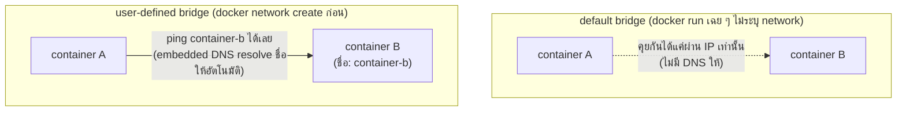

---
tags:
  - docker
  - devops
  - networking
  - storage
type: reference
created: 2026-09-19
---

# 🔌 Docker Network และ Volume — เจาะลึกกว่าคำสั่ง

> โน้ตนี้อธิบาย **แนวคิดเบื้องหลัง** network กับ volume ของ Docker — ถ้าแค่หาคำสั่งเปิดใช้เร็ว ๆ ไปที่ [[Docker Command]] ข้อ 4-5 แทน โน้ตนี้ตอบคำถาม **"ทำไมต้องมีหลายแบบ เลือกยังไงให้ถูก"**

---

# ส่วนที่ 1 — Network

## 1. Network driver มี 5 แบบ — ไม่ต้องรู้ลึกทุกตัว

| driver | ทำอะไร | ใช้เมื่อ |
|---|---|---|
| **bridge** (default) | สร้าง private network ภายในเครื่อง container คุยกันผ่าน network นี้ | ค่า default งานส่วนใหญ่บนเครื่องเดียว |
| **host** | ไม่มี isolation เลย — container ใช้ network stack ของ host ตรง ๆ | ต้องการ performance สูงสุด ไม่สนใจ isolation |
| **none** | ปิด network ทั้งหมด | งานที่ไม่ต้องต่อเน็ตเลย (ปลอดภัยสุด) |
| **overlay** | เชื่อม Docker daemon หลายเครื่องเข้าด้วยกัน | multi-host, Swarm |
| **macvlan** | ให้ container มี MAC address ของตัวเอง เห็นเป็น physical device จริงบน network | legacy app ที่ต้องเห็นเป็นเครื่องจริงในองค์กร |

**งานทั่วไปเกือบทั้งหมดใช้แค่ bridge** — driver ที่เหลือมีไว้แก้ปัญหาเฉพาะทาง ไม่ต้องเรียนรู้ลึกจนกว่าจะเจอ use case นั้นจริง ๆ

---

## 2. Default bridge vs User-defined bridge — จุดที่งงที่สุด



**Docker รัน embedded DNS server ให้อัตโนมัติเฉพาะบน user-defined network เท่านั้น** — นี่คือเหตุผลเดียวที่ทำให้ `docker compose` (ซึ่งสร้าง user-defined network ให้เองเสมอ) ทำให้ service คุยกันด้วยชื่อได้ทันทีโดยไม่ต้องตั้งอะไร แต่ `docker run` ธรรมดาที่ไม่ระบุ `--network` จะตกไปอยู่ default bridge ซึ่งไม่มี DNS ให้เลย

---

## 3. Port publishing (`-p`) — traffic ไหลยังไงจริง ๆ


`-p 8080:80` ไม่ได้ "เปิดพอร์ต 80 ให้เห็นจากข้างนอกตรง ๆ" แต่ Docker ตั้งกฎ NAT ผ่าน `iptables` ให้แปล traffic ที่มาที่ host port 8080 ส่งต่อเข้า container port 80 — container ข้างในไม่รู้ตัวเลยว่าโลกภายนอกเรียกผ่านพอร์ตอื่น (ดู breakdown แบบ command เต็ม ๆ ที่ [[Docker Basics]] ข้อ 4)

---

## 4. กับดัก (Network)

- **คาดหวังว่า container คุยกันด้วยชื่อได้ทั้งที่ยังอยู่ default bridge** — ต้อง `docker network create` ก่อนเสมอ (ข้อ 2)
- **สับสนว่า `-p` เปิด port ให้เห็นจากอินเทอร์เน็ตทั้งหมด** — `-p` แค่ผูกกับ host เท่านั้น ยังต้องผ่าน firewall/security group ของเครื่อง/cloud อีกชั้นถ้าต้องการให้คนนอกเข้าถึงได้จริง
- **ใช้ `host` network mode ตอน dev เพราะคิดว่าง่ายกว่า** — เสียประโยชน์เรื่อง isolation ไปทั้งหมด พอร์ตชนกับ process อื่นบนเครื่องได้ง่ายกว่าที่คิด
- **ลืมว่า macvlan ทำให้ container คุยกับ host ตรง ๆ ไม่ได้** — เป็นข้อจำกัดของ Linux kernel ไม่ใช่บั๊ก ถ้าต้องการให้ host คุยกับ container ที่ใช้ macvlan ต้องสร้าง macvlan interface เพิ่มบน host เอง

---

# ส่วนที่ 2 — Volume

## 5. 3 วิธีเก็บข้อมูล — ต้องแยกให้ออกจากกันให้ได้

| | **Volume** | **Bind Mount** | **tmpfs** |
|---|---|---|---|
| ใครจัดการที่เก็บ | Docker จัดการให้เต็มที่ | เราเลือก path บนเครื่องเอง | ไม่มี — อยู่ใน RAM เท่านั้น |
| อยู่ที่ไหนจริง | ในพื้นที่ของ Docker (ข้อ 6) | path ไหนก็ได้ที่เรากำหนด | RAM ของเครื่อง |
| ข้อมูลอยู่รอด container ลบไหม | ✅ อยู่รอด | ✅ อยู่รอด (เป็นไฟล์บนเครื่องเราอยู่แล้ว) | ❌ หายทันทีที่ container หยุด |
| แก้ไฟล์บน host เห็นผลในนั้นทันทีไหม | ไม่จำเป็น | ✅ real-time สองทาง | - |
| เหมาะกับ | **production** — database, ข้อมูลที่ห้ามหาย | **dev** — mount source code เข้าไปให้ hot-reload | ข้อมูล sensitive/ชั่วคราวที่ไม่ควรแตะ disk เลย |

**กฎจำง่าย: ใช้ volume เป็น default เสมอ, bind mount ตอน dev, tmpfs ตอนอยากการันตีว่าข้อมูลไม่ลง disk**

```bash
docker run -v pgdata:/var/lib/postgresql/data postgres      # volume — Docker จัดการ path ให้
docker run -v $(pwd)/src:/app/src node                      # bind mount — เรากำหนด path เอง
docker run --tmpfs /app/cache node                          # tmpfs — อยู่ใน RAM เท่านั้น
```

---

## 6. Named Volume อยู่ที่ไหนจริง ๆ บนเครื่อง

```bash
docker volume inspect pgdata
```

จะเห็น field `Mountpoint` ชี้ไปที่ path จริงบนเครื่อง (เช่น `/var/lib/docker/volumes/pgdata/_data` บน Linux) — **ไม่ควรเข้าไปแก้ไฟล์ตรงนั้นเองมือ ๆ** ให้เข้าถึงผ่าน container หรือคำสั่ง `docker volume`/`docker cp` เท่านั้น เพราะ Docker ถือว่า path นี้เป็นพื้นที่ภายในที่ตัวเองบริหารจัดการ

**บน Windows/Mac ที่รัน Docker ผ่าน VM (Docker Desktop)** — `Mountpoint` ที่เห็นเป็น path ข้างใน VM ลินุกซ์เสมือน ไม่ใช่ path จริงบน Windows/Mac ที่เรานั่งอยู่ เข้าถึงตรง ๆ จาก Windows Explorer ไม่ได้

---

## 7. กับดัก (Volume)

- **ใช้ bind mount ใน production เพราะเคยชินจาก dev** — ต้องพึ่ง path ที่แน่นอนบนเครื่อง ย้ายไป server อื่นแล้ว path ไม่ตรงกัน deploy พัง ควรใช้ named volume แทนเสมอในงานจริง
- **คิดว่า `docker volume rm` ลบได้เสมอ** — ลบไม่ได้ถ้ายังมี container (แม้จะหยุดอยู่) ใช้ volume นั้นค้างอยู่ ต้อง `docker rm` container ก่อน
- **`docker volume prune` ไม่ลบ volume ที่ compose ยังอ้างถึง** — แต่ถ้า container ที่ใช้มันถูกลบไปแล้ว (เช่น `docker compose down` โดยไม่ใส่ `-v`) volume จะกลายเป็น "ไม่มีใครใช้" ทันที และเสี่ยงโดน prune ทิ้งถ้าไม่ระวัง
- **นึกว่า tmpfs เหมาะกับ cache ที่อยากให้เร็ว** — จริงอยู่ว่าเร็วเพราะเป็น RAM แต่กิน memory ของเครื่องโดยตรง ถ้าข้อมูลใหญ่เกินคาดจะกระทบ memory ของ process อื่นบนเครื่องเดียวกันด้วย
- **bind mount แล้วสับสนสิทธิ์ไฟล์ (permission) ระหว่าง host กับ container** — user id ข้างใน container กับ host อาจไม่ตรงกัน ทำให้ไฟล์ที่ container เขียนออกมาแก้จาก host ไม่ได้ (หรือกลับกัน) โดยเฉพาะบน Linux host

---

## 8. Cheat sheet

```bash
# Network
docker network create <name>              # user-defined bridge — ได้ DNS ให้ฟรี
docker run --network <name> ...
docker network inspect <name>             # ดูว่าใครต่ออยู่บ้าง

# Volume
docker volume create <name>
docker run -v <name>:/path ...            # named volume
docker run -v $(pwd)/src:/path ...        # bind mount
docker run --tmpfs /path ...              # tmpfs (RAM เท่านั้น)
docker volume inspect <name>              # ดู path จริงบนเครื่อง (Mountpoint)
```

| ต้องการ | ใช้ |
|---|---|
| container คุยกันด้วยชื่อได้ | user-defined bridge network |
| performance network สูงสุด ไม่สนใจ isolation | host network |
| เก็บข้อมูล database ให้ปลอดภัยข้าม deploy | named volume |
| mount source code ให้ hot-reload ตอน dev | bind mount |
| ข้อมูล sensitive ที่ห้ามแตะ disk เลย | tmpfs |

## 🔗 เกี่ยวข้อง

- [[Docker Command]] — คำสั่ง `network`/`volume` แบบสั้นๆ ครบทุกคำสั่ง
- [[Docker Basics]] — พื้นฐาน image/container และ breakdown คำสั่ง `-p`/`-v` แบบเต็ม
- [[Docker Compose and Deploy]] — network/volume ที่ compose สร้างให้อัตโนมัติ

## 📖 อ่านต่อ

- [Docker — Network drivers](https://docs.docker.com/engine/network/drivers/)
- [Docker — Volumes](https://docs.docker.com/engine/storage/volumes/)
- [Docker — tmpfs mounts](https://docs.docker.com/engine/storage/tmpfs/)
