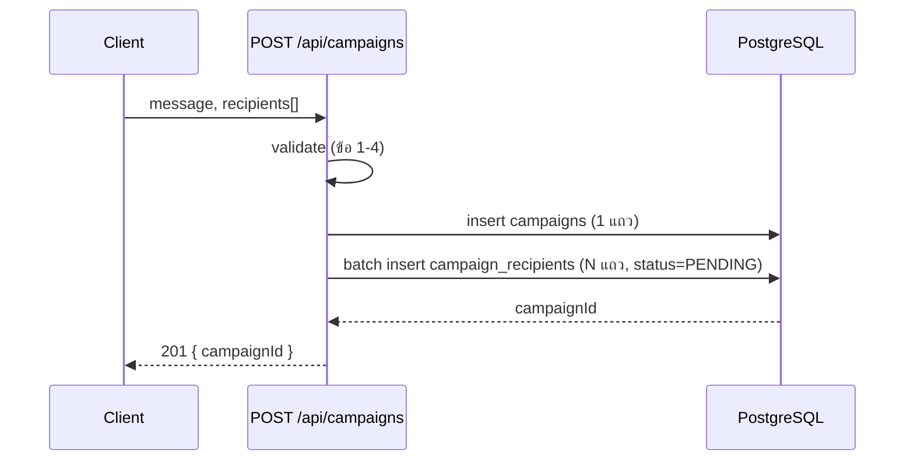

---
tags:
  - spec
  - java
  - quarkus
type: spec
status: ready
parent: "[[Background Job Processor (Quarkus)]]"
created: 2026-09-28
updated: 2026-09-28
---

# 🛠️ API Flow Spec — Notification Fan-out

ต่อยอดจาก decision ใน [[Background Job Processor (Quarkus)]]: use case = **Notification fan-out** (ยืนยันแล้ว 2026-09-28) · DB แนะนำ **PostgreSQL** (ยังไม่ยืนยันร่วมกัน) · trigger เฟส 1 = `@Scheduled` polling · rate limit เฟส 1 = จำกัดด้วยขนาด batch ต่อ tick (ยังไม่ใช้ Redis) · retry เฟส 1 = ไม่มี backoff

## 📋 Data Model

### ตาราง `campaigns`

| column | type | null ได้ไหม | หมายเหตุ |
|---|---|---|---|
| `id` | `BIGSERIAL` (PK) | ❌ | |
| `message` | `VARCHAR(500)` | ❌ | เนื้อหาที่จะ "ส่ง" (mock) |
| `total_recipients` | `INT` | ❌ | เก็บตอนสร้าง กัน `COUNT(*)` ทุกครั้งที่เช็คสถานะ |
| `created_at` | `TIMESTAMP` | ❌ | ตั้งจาก server ตอน insert |

**ไม่มี column `status` แยกในตัวมันเอง** — สถานะของ campaign คำนวณจาก `campaign_recipients` ตอน read (ดูเหตุผลใน `GET` endpoint) ไม่ใช่ค่าที่ worker ต้อง sync กลับมาที่นี่ทุกครั้ง (ลดจุดที่ต้องทำให้ตรงกันสองที่)

### ตาราง `campaign_recipients`

| column | type | null ได้ไหม | หมายเหตุ |
|---|---|---|---|
| `id` | `BIGSERIAL` (PK) | ❌ | |
| `campaign_id` | `BIGINT` (FK → campaigns.id) | ❌ | |
| `recipient` | `VARCHAR(255)` | ❌ | mock — string อิสระ (เช่น `"user1@example.com"`) ไม่ validate format จริงจัง |
| `status` | `VARCHAR(20)` | ❌ | `PENDING` → `SENDING` → `SENT` / `FAILED` |
| `attempts` | `INT DEFAULT 0` | ❌ | เพิ่มทุกครั้งที่ mock ส่งไม่สำเร็จ |
| `last_error` | `VARCHAR(500)` | ✅ | เก็บไว้ debug เฉยๆ ไม่ใช้ตัดสินใจ |
| `updated_at` | `TIMESTAMP` | ❌ | เช็คว่าค้างสถานะ `SENDING` มานานแค่ไหน (reclaim-stuck) |

```sql
CREATE INDEX idx_recipients_claim ON campaign_recipients (id) WHERE status = 'PENDING';
```

**partial index เฉพาะแถว `PENDING`** — claim query (ข้อล่าง) กรองด้วย `status = 'PENDING'` ทุกครั้ง index แบบนี้เล็กกว่า index เต็มตารางมาก เพราะในระยะยาวแถวส่วนใหญ่จะเป็น `SENT`/`FAILED` ไปแล้ว

---

## `POST /api/campaigns` — สร้าง campaign + insert ผู้รับจำนวนมาก

**Request**
```json
{
  "message": "โปรโมชั่นวันเกิดลด 20%",
  "recipients": ["user1@example.com", "user2@example.com", "user3@example.com"]
}
```

**ขั้นตอน validate (ก่อนแตะ DB)**
1. `message` ไม่ว่าง และยาว ≤ 500 ตัวอักษร
2. `recipients` ไม่ว่าง มีอย่างน้อย 1 รายชื่อ
3. จำนวน `recipients` ≤ **10,000** ต่อ request (เลขเดียวกับที่ใช้ในโน้ตหลัก หัวข้อ "✅ รู้ได้ยังไงว่าสำเร็จ") — เกินนี้ให้แยกเป็นหลาย request แทน กันไม่ให้ request เดียวโตจนกินหน่วยความจำ/เวลานานเกิน timeout
4. แต่ละ `recipient` ไม่ว่าง ยาว ≤ 255 ตัวอักษร

**business logic**
1. insert 1 แถวลง `campaigns` (`total_recipients = recipients.size()`)
2. **batch insert** ลง `campaign_recipients` ทุกแถวสถานะ `PENDING` — ใช้ JDBC/Hibernate batch insert (`hibernate.jdbc.batch_size`) **ห้าม insert ทีละแถวใน loop ธรรมดา** เพราะ 10,000 round-trip เดี่ยว ๆ ไป DB ช้ากว่าส่งเป็น batch มาก (นี่คือจุดที่ endpoint นี้ "insert ข้อมูลจำนวนมาก" ต้องทำให้ถูกจริง ๆ ไม่ใช่แค่ทำงานได้)
3. ทั้งสอง insert อยู่ใน `@Transactional` เดียวกัน — campaign กับผู้รับต้องถูกสร้างพร้อมกันทั้งคู่หรือไม่สร้างเลย

**Response**

| status | เมื่อไหร่ |
|---|---|
| `201` | สำเร็จ → `{ "campaignId": 1 }` |
| `400` | `message` ว่าง/ยาวเกิน, `recipients` ว่าง/เกิน 10,000, มี recipient ที่ไม่ผ่าน validate |



**🧪 ตัวอย่างจริง** — ส่ง:
```json
POST /api/campaigns
{
  "message": "ทดสอบระบบ",
  "recipients": ["a@x.com", "b@x.com", "c@x.com"]
}
```

Insert ลง `campaigns`:

| id | message | total_recipients | created_at |
|---|---|---|---|
| 1 | ทดสอบระบบ | 3 | 2026-09-28T10:00:00Z |

Insert ลง `campaign_recipients`:

| id | campaign_id | recipient | status | attempts |
|---|---|---|---|---|
| 1 | 1 | a@x.com | PENDING | 0 |
| 2 | 1 | b@x.com | PENDING | 0 |
| 3 | 1 | c@x.com | PENDING | 0 |

ตอบกลับ (`201`): `{ "campaignId": 1 }`

**🧪 เดินเทรซต่อ — worker ประมวลผลจนจบ** (สมมติ `b@x.com` mock ส่งไม่สำเร็จซ้ำ 3 ครั้งจนถึง `MAX_ATTEMPTS`):

| tick | เหตุการณ์ | สถานะหลัง tick (id 1 / 2 / 3) |
|---|---|---|
| 1 | claim ทั้ง 3 (BATCH_SIZE=20 > 3) → a, c สำเร็จ / b ล้ม (attempts=1) | SENT / PENDING / SENT |
| 2 | claim เฉพาะ id 2 (ตัวเดียวที่ยัง PENDING) → ล้มอีก (attempts=2) | SENT / PENDING / SENT |
| 3 | claim id 2 อีกครั้ง → ล้มครั้งที่ 3 = ถึง `MAX_ATTEMPTS` → FAILED ตลอดกาล | SENT / **FAILED** / SENT |

`GET /api/campaigns/1` หลัง tick 3 → `{ "status": "DONE", "total": 3, "sent": 2, "failed": 1, "pending": 0 }`

---

## `GET /api/campaigns/{id}` — เช็คสถานะ

**business logic**

```sql
SELECT status, COUNT(*) FROM campaign_recipients WHERE campaign_id = :id GROUP BY status;
```

รวมกับ `total_recipients` จาก `campaigns` แล้วคำนวณสถานะของ campaign เอง:
- `pending + sending > 0` → `PROCESSING` (หรือ `PENDING` ถ้ายังไม่มีอะไรถูก claim เลย)
- `pending = 0 AND sending = 0` → `DONE` — **`DONE` แปลว่า "ไม่มีอะไรต้องทำต่อแล้ว" ไม่ใช่ "สำเร็จหมดทุกคน"** (อาจมี `failed` ปนอยู่ก็ยัง `DONE` ได้ ดูตัวอย่างเทรซด้านบน)

**Response**
```json
{
  "campaignId": 1,
  "status": "DONE",
  "total": 3,
  "sent": 2,
  "failed": 1,
  "pending": 0
}
```

**`GET /api/campaigns/{id}/recipients?status=FAILED`** (optional — ไม่ใช่ "การทดลองที่เล็กที่สุด" ทำท้ายสุดถ้ามีเวลา) ดูรายชื่อที่ fail จริง ๆ เพื่อ debug

---

## Worker — claim, ประมวลผล, reclaim-stuck

### 1. Claim batch — หัวใจของ concurrency safety

```java
@ApplicationScoped
public class CampaignWorker {

    private static final int BATCH_SIZE = 20;
    private static final int MAX_ATTEMPTS = 3;

    @Inject EntityManager em;
    @Inject MockNotificationClient notificationClient;

    @Scheduled(every = "2s")
    void processBatch() {
        for (Long id : claim(BATCH_SIZE)) {
            sendOne(id);
        }
    }

    @Transactional
    List<Long> claim(int limit) {
        return em.createNativeQuery("""
                UPDATE campaign_recipients
                SET status = 'SENDING', updated_at = now()
                WHERE id IN (
                    SELECT id FROM campaign_recipients
                    WHERE status = 'PENDING'
                    ORDER BY id
                    LIMIT :limit
                    FOR UPDATE SKIP LOCKED
                )
                RETURNING id
                """, Long.class)
            .setParameter("limit", limit)
            .getResultList();          // ⚠️ ต้อง getResultList() ไม่ใช่ executeUpdate() — ดูกับดักข้อ 1
    }
}
```

**`FOR UPDATE SKIP LOCKED` ทำอะไรให้:** ถ้ามี worker/thread สองตัวรัน query นี้พร้อมกัน ตัวที่มาถึงก่อนจะ lock แถวที่กำลังจะ claim ไว้ ตัวที่สองพอเจอแถวที่ถูก lock แล้ว **ข้ามไปเลย (skip) ไม่ใช่รอ (block)** — ทั้งสอง query ทำงานพร้อมกันได้จริง ได้ผู้รับคนละกลุ่มไม่ทับกัน โดยไม่ต้องมี application-level lock (`synchronized`, distributed lock) เพิ่มเลย รายละเอียด API ของ `RedisDataSource`/native query ดู [[Quarkus EntityManager]]

### 2. ประมวลผลทีละคน + retry

```java
@Transactional
void sendOne(Long recipientId) {
    CampaignRecipient r = em.find(CampaignRecipient.class, recipientId);
    try {
        notificationClient.send(r.recipient, r.campaign.message);
        r.status = "SENT";
    } catch (Exception e) {
        r.attempts++;
        r.lastError = e.getMessage();
        r.status = r.attempts >= MAX_ATTEMPTS ? "FAILED" : "PENDING";   // < MAX → กลับไป PENDING ให้ claim ใหม่รอบหน้า
    } finally {
        r.updatedAt = Instant.now();
    }
    // ไม่ต้องเรียก em.merge()/persist() — dirty checking จัดการตอน commit (ดู [[Quarkus EntityManager]] ข้อ 3)
}
```

```java
@ApplicationScoped
public class MockNotificationClient {
    private final Random random = new Random();

    void send(String recipient, String message) throws Exception {
        Thread.sleep(200);                          // จำลอง network latency ของ provider จริง
        if (random.nextInt(10) == 0) {               // ~10% fail แบบสุ่ม จำลอง provider ล้มเป็นระยะ
            throw new RuntimeException("mock provider timeout for " + recipient);
        }
    }
}
```

**เรื่อง retry ที่ตั้งใจทำแบบง่ายสุดก่อน (เฟส 1):** พอ fail แล้วกลับไป `PENDING` ทันที ไม่มี backoff/delay — รอบ `@Scheduled` ถัดไปหยิบไปทำใหม่ได้เลย ถ้าอยากได้ backoff จริง (เฟส 2) ต้องเพิ่ม column `next_attempt_at` แล้วแก้ query ใน `claim()` ให้กรอง `AND (next_attempt_at IS NULL OR next_attempt_at <= now())` เพิ่ม

### 3. Reclaim-stuck — safety net เมื่อ worker ตายกลางคัน

```java
@Scheduled(every = "10s")
@Transactional
void reclaimStuck() {
    em.createNativeQuery("""
            UPDATE campaign_recipients
            SET status = 'PENDING'
            WHERE status = 'SENDING'
              AND updated_at < now() - interval '30 seconds'
            """).executeUpdate();     // ← ไม่มี RETURNING ครั้งนี้ใช้ executeUpdate() ได้ตรงๆ
}
```

**ทำไมต้องมีตัวนี้:** ถ้า worker claim แถวหนึ่งไปแล้ว (สถานะกลายเป็น `SENDING`) แต่ crash/ถูก kill ก่อนจะ commit ผลลัพธ์สุดท้าย (`SENT`/`FAILED`) แถวนั้นจะค้างที่ `SENDING` ตลอดไปโดยไม่มีใครหยิบอีก — `reclaimStuck()` รันเป็นระยะ ดึงแถวที่ค้าง `SENDING` นานเกิน 30 วินาที (ค่าที่ควรนานกว่าเวลาประมวลผลปกติมาก ๆ) กลับไปเป็น `PENDING` ให้ claim ใหม่ได้อีก — นี่คือกลไกที่ตอบ "✅ รู้ได้ยังไงว่าสำเร็จ" ข้อ 2 ในโน้ตหลัก (ปิด worker กลางคันแล้วงานไม่หาย)

### 💡 insight: ไม่ต้องรันหลาย instance ก็ทดสอบ concurrency ได้จริง

`@Scheduled` ของ Quarkus **default อนุญาตให้ tick ซ้อนกันได้** (ไม่รอตัวก่อนหน้าจบก่อน) — ถ้า `processBatch()` ใช้เวลานานกว่า 2 วินาทีต่อรอบ (เช่น `BATCH_SIZE=20 × sleep 200ms ≈ 4 วินาที`) tick ที่สองจะเริ่มขึ้นมา**ทับซ้อน**กับ tick แรกที่ยังไม่จบ กลายเป็นสอง execution วิ่งพร้อมกันจริง ๆ บน instance เดียว — เอา `FOR UPDATE SKIP LOCKED` ไปทดสอบกับสถานการณ์นี้ได้เลย โดยไม่ต้องรัน 2 instance จริง ถ้าอยากปิดพฤติกรรมนี้ (เพื่อความสะอาดตอน production) ใส่ `@Scheduled(every = "2s", concurrentExecution = Scheduled.ConcurrentExecution.SKIP)`

---

## กับดัก

- **`.executeUpdate()` กับ query ที่มี `RETURNING`** — ได้ int (จำนวนแถว) กลับมา ไม่ได้ id ที่ต้องการเลย ต้องใช้ `.getResultList()` เท่านั้นถึงจะได้ค่าจาก `RETURNING` จริง (ข้อ 1)
- **insert ผู้รับทีละแถวใน loop ธรรมดา** — 10,000 round-trip แยกกันช้ากว่า batch insert มาก ต้องตั้ง `hibernate.jdbc.batch_size` และเรียก `flush()`/`clear()` เป็นช่วง ๆ (ดู [[Quarkus EntityManager]] ข้อ 13)
- **ลืมว่า `campaigns.status` ไม่มีจริง คำนวณจาก recipient ทุกครั้ง** — ถ้าไปเขียน column `status` แยกใน `campaigns` แล้วลืม sync จะเจอบั๊กสถานะไม่ตรงกัน
- **`SKIP LOCKED` แต่ query ไม่มี `ORDER BY`** — Postgres ไม่การันตีลำดับ ถ้าอยากให้ผู้รับที่เข้ามาก่อนถูกส่งก่อน ต้องมี `ORDER BY id` แนบไว้เสมอ (มีอยู่แล้วในตัวอย่างข้างบน)
- **ตั้ง `STUCK_SECONDS` ใน `reclaimStuck()` สั้นเกินไป** — ถ้าสั้นกว่าเวลาที่ `sendOne()` ใช้จริงตามปกติ จะไป reclaim แถวที่ยังประมวลผลอยู่จริง (ไม่ได้ค้าง) กลายเป็นส่งซ้ำโดยไม่ตั้งใจ
- **เข้าใจว่า `concurrentExecution` default คือ `SKIP`** — ค่า default จริงคือปล่อยให้ซ้อนทับกันได้ (ข้อ 💡) ไม่อ่านสเปกอาจเข้าใจผิดว่า Quarkus กันซ้อนให้อัตโนมัติ

---

## ✅ Phase 1 พร้อม implement (2026-09-28)

Schema + endpoint 2 ตัว + worker (claim/process/reclaim-stuck) ปิด spec ครบสำหรับเฟส 1 แล้ว — **DB = PostgreSQL ยังเป็นข้อเสนอ ไม่ใช่มติปิด** ยืนยันก่อนเริ่มเขียนโค้ดจริง เฟส 2 (message queue, rate limit ผ่าน Redis, backoff) ยังไม่ต้อง spec ตอนนี้ รอเฟส 1 ใช้งานได้จริงก่อน

## 🔗 เกี่ยวข้องกับ

- [[Background Job Processor (Quarkus)]] — โน้ตหลัก (ปัญหา, design ภาพรวม, risk)
- [[Quarkus EntityManager]] — native query, batch insert, dirty checking
- [[Quarkus Thread Pool]] — `@Scheduled` และ `concurrentExecution`
- [[Idempotency]] — หลักการเบื้องหลัง claim pattern ในโน้ตนี้
