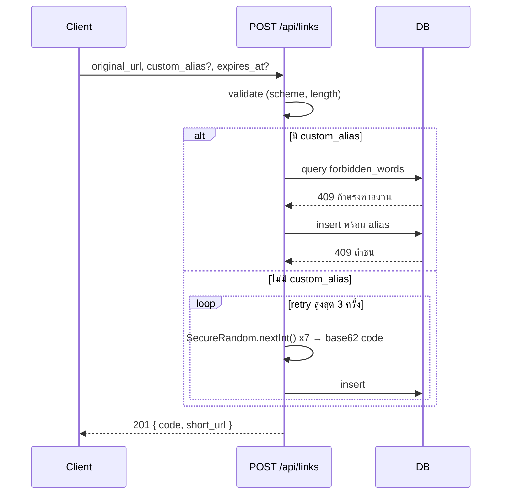
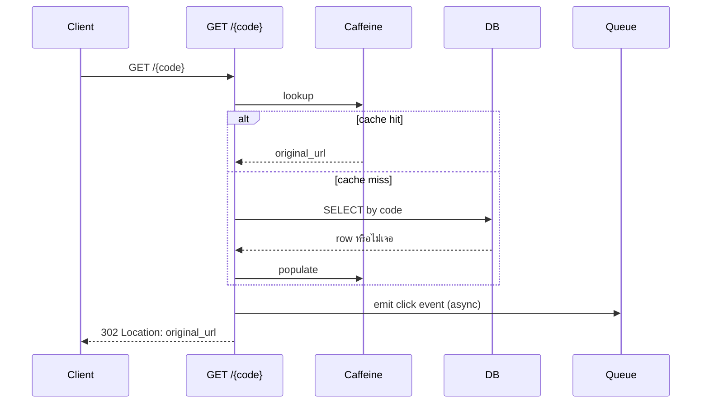

---
tags:
  - spec
  - java
  - quarkus
type: spec
status: ready
parent: "[[URL Shortener (Quarkus)]]"
created: 2026-09-11
updated: 2026-09-13
---

# 🛠️ API Flow Spec — URL Shortener

ต่อยอดจาก decision ใน [[URL Shortener (Quarkus)]]: **random base62 + unique constraint** (ยืนยันแล้ว 2026-09-12, ไม่ใช้ Redis counter), **302 ไม่ใช่ 301**, ไม่ dedupe, **ไม่มี auth** (ทำเล่น ไม่เปิด public), **DB = SQLite**

## 📋 Data Model

### ตาราง `short_urls`

| column         | type            | null ได้ไหม | หมายเหตุ                                                                                                 |
| -------------- | --------------- | ----------- | -------------------------------------------------------------------------------------------------------- |
| `code`         | `VARCHAR(7)`    | ❌ (PK)      | short code — random base62 หรือ `custom_alias` ที่ผู้ใช้ตั้งเอง เป็น **primary key** โดยตรง ไม่มี id แยก |
| `original_url` | `VARCHAR(2048)` | ❌           | ปลายทางที่จะ redirect ไป ผ่าน validate scheme (`http`/`https`) มาแล้ว                                    |
| `created_date` | `TIMESTAMP`     | ❌           | เวลาที่สร้าง, ตั้งจาก server ตอน insert                                                                  |
| `expires_at`   | `TIMESTAMP`     | ✅           | ไม่ใส่ = ไม่หมดอายุ ถ้าใส่ต้องเป็นเวลาอนาคต ณ ตอนสร้าง                                                   |
| `deleted_at`   | `TIMESTAMP`     | ✅           | null = ยังใช้งานอยู่, ไม่ null = ถูกลบแล้ว (soft delete)                                                 |

ไม่มี `created_by` (ไม่มี auth เลยไม่มี identity ให้ผูก) ไม่มี `id` แยกจาก `code`

### ตาราง `forbidden_words`

| column | type | null ได้ไหม | หมายเหตุ |
|---|---|---|---|
| `word` | `VARCHAR` | ❌ (PK) | คำที่ห้ามใช้เป็น `custom_alias` เช่น `api`, `admin`, `health`, `q` — seed ไว้ตอน migration แรก เพิ่ม/ลบทีหลังได้โดยไม่ redeploy |

---

### `POST /api/links` — สร้าง short link (ไม่มี auth)

**Request**
```json
{
  "original_url": "https://example.com/very/long/path",
  "custom_alias": "my-link",      // optional
  "expires_at": "2026-12-31T00:00:00Z"  // optional
}
```

**ขั้นตอน validate (ก่อนแตะ DB)**
1. `original_url` ไม่ว่าง และยาว ≤ 2048 ตัวอักษร
2. scheme ต้องเป็น `http`/`https` เท่านั้น — ปฏิเสธ `javascript:` `data:` `file:` (ป้องกัน open redirect)
3. ถ้ามี `custom_alias`: เช็ค charset ให้ตรงชุดที่เลือก (base62), query ตาราง `forbidden_words` ว่าไม่ตรงกับคำสงวน
4. ถ้ามี `expires_at`: ต้องเป็นเวลาที่ยังไม่ผ่านไป

**คำสงวน — เก็บใน DB** (ตัดสินใจ 2026-09-12) ตาราง `forbidden_words(word VARCHAR PRIMARY KEY)` seed ค่าเริ่มต้นไว้ (`api`, `admin`, `health`, `q`, …) เพิ่ม/ลบได้โดยไม่ต้อง redeploy
เช็คเฉพาะตอน validate `custom_alias` เท่านั้น (ไม่ใช่ hot path ไม่ต้อง cache) — โค้ดสุ่มไม่ต้องเช็คตารางนี้ เพราะความยาว fix ไว้ที่ 7 ตัวอักษรอยู่แล้ว ยาวกว่าคำสงวนทุกคำ ชนกันไม่ได้อยู่แล้วโดยโครงสร้าง

**🎲 random base62 code — gen จากอะไร**

alphabet คือ 62 ตัวอักษร `0-9` + `a-z` + `A-Z` (`"0123456789abcdefghijklmnopqrstuvwxyzABCDEFGHIJKLMNOPQRSTUVWXYZ"`) แล้วสุ่มหยิบทีละตัวจนครบ 7 ตัว

ใช้ **`java.security.SecureRandom`** เป็นแหล่งสุ่ม (ไม่ใช่ `Random`/`ThreadLocalRandom` ธรรมดา) เพราะข้อดีของวิธีนี้ที่เขียนไว้ใน prior art คือ "เดาไม่ได้" — ถ้าใช้ PRNG ธรรมดาที่ seed คาดเดาได้ ก็เสียคุณสมบัตินี้ไปเปล่า ๆ

```java
private static final String ALPHABET =
    "0123456789abcdefghijklmnopqrstuvwxyzABCDEFGHIJKLMNOPQRSTUVWXYZ";
private static final SecureRandom RANDOM = new SecureRandom(); // instance เดียว ใช้ซ้ำ ห้าม new ทุกครั้งที่เรียก

public static String generateCode(int length) {
    StringBuilder sb = new StringBuilder(length);
    for (int i = 0; i < length; i++) {
        sb.append(ALPHABET.charAt(RANDOM.nextInt(ALPHABET.length())));
    }
    return sb.toString();
}
```

**⚠️ จุดที่ต้องระวัง:** `new SecureRandom()` **ห้ามสร้างใหม่ทุกครั้งที่ generate code** — ต้องมี instance เดียว (static field) ใช้ร่วมกันทั้งแอป ไม่งั้นแต่ละครั้งจะไป seed ใหม่จาก entropy pool ของ OS ซ้ำ ๆ ซึ่งช้าและกิน entropy โดยไม่จำเป็น
เชื่อมกับความเสี่ยงที่บันทึกไว้แล้วในโน้ตหลัก (⚠️ ความเสี่ยง): `SecureRandom` บน GraalVM native image เคยมีปัญหาเรื่อง entropy source มาก่อน — **ต้องทดสอบให้แน่ใจตั้งแต่การทดลองเล็กที่สุด** ว่า generate code ได้เร็วและไม่ hang ตอนรันเป็น native binary

**business logic**
1. มี `custom_alias` → insert ตรง ๆ, ให้ unique constraint ของ DB เป็นตัวกันชนซ้ำ
2. ไม่มี `custom_alias` → เรียก `generateCode(7)` ด้านบน แล้ว insert, ถ้าชน unique constraint หรือ SQLite `SQLITE_BUSY` ให้ retry (generate code ใหม่ทุกครั้งที่ retry) **สูงสุด 3 ครั้ง** (ตัดสินใจ 2026-09-12) เกินนั้นถือว่า fail
3. บันทึก `created_date = now`, `deleted_at = null` (ไม่มี `created_by` เพราะไม่มี auth ไม่มี identity ให้ผูก)
4. ไม่ query หา `original_url` เดิมเพื่อ dedupe (ตามที่สรุปไว้แล้วในโน้ตหลัก)
5. บน SQLite: insert แต่ละครั้งแย่งไฟล์ lock กับ writer อื่น (single-writer) — ไม่กระทบตอนใช้งานคนเดียว แต่ถ้าทดสอบสร้าง link รัว ๆ พร้อมกันหลาย thread จะเห็นการ serialize/`SQLITE_BUSY` ได้ (นับรวมอยู่ใน retry 3 ครั้งด้านบน)

**Response**
| status | เมื่อไหร่ 
|--------|---------------------------------------------------------------------------------------  |
| `201` | สำเร็จ → `{ "code", "short_url", "expires_at" }`                                             |
| `400` | url ไม่ผ่าน validate / scheme ไม่ผ่าน / alias ผิด format                                              |
| `409` | `custom_alias` ชนของเดิม หรือชนคำสงวน                                                                 |
| `500` | retry ครบ 3 ครั้งแล้วยังไม่สำเร็จ (ชน unique constraint ต่อเนื่อง หรือ SQLite ยัง busy)  |

**🧪 ตัวอย่างจริง**

_กรณีไม่ใส่ `custom_alias`_ — ส่ง:
```json
POST /api/links
{
  "original_url": "https://www.amazon.com/gp/product/B08N5WRWNW/ref=ppx_yo_dt_b_search_asin_title?ie=UTF8&psc=1"
}
```
Server สุ่มได้ `aB3xK9z` → insert ลง `short_urls`:

| code      | original_url                                           | created_date           | expires_at | deleted_at |
| --------- | ------------------------------------------------------ | ---------------------- | ---------- | ---------- |
| `aB3xK9z` | `https://www.amazon.com/gp/product/B08N5WRWNW/ref=...` | `2026-09-12T10:30:00Z` | `null`     | `null`     |

ตอบกลับ (`201`):
```json
{
  "code": "aB3xK9z",
  "short_url": "http://localhost:8080/aB3xK9z",
  "expires_at": null
}
```

_กรณีใส่ `custom_alias` + `expires_at`_ — ส่ง:
```json
POST /api/links
{
  "original_url": "https://example.com/blog/my-long-article-title",
  "custom_alias": "myblog",
  "expires_at": "2026-12-31T00:00:00Z"
}
```
Insert ลง `short_urls`:

| code | original_url | created_date | expires_at | deleted_at |
|---|---|---|---|---|
| `myblog` | `https://example.com/blog/my-long-article-title` | `2026-09-12T10:31:00Z` | `2026-12-31T00:00:00Z` | `null` |

ตอบกลับ (`201`):
```json
{
  "code": "myblog",
  "short_url": "http://localhost:8080/myblog",
  "expires_at": "2026-12-31T00:00:00Z"
}
```

**`short_url` คำนวณจาก `{base_url}/{code}` เสมอ ไม่ได้เก็บลง DB** — สิ่งที่ persist จริง ๆ ในตารางมีแค่ `code` เท่านั้น

**`base_url` ห้าม hardcode — ใช้ Quarkus config property แทน** (ตัดสินใจ 2026-09-13) เพราะค่านี้ต้องเปลี่ยนตาม environment (dev ใช้ `localhost`, prod ใช้โดเมนจริง) โดยเฉพาะกับ **native image ที่ build ครั้งเดียวแล้วรันหลายที่** — ถ้า hardcode ไว้ในโค้ดต้อง rebuild native binary ใหม่ทุกครั้งที่ deploy คนละ environment ซึ่งเสียเวลามาก (native build ช้ากว่า JVM build เยอะ)

```properties
# application.properties
app.base-url=http://localhost:8080

# ทับอัตโนมัติเฉพาะตอน build/run profile "prod" โดยไม่ต้องแก้โค้ดเลย
%prod.app.base-url=https://your-real-domain.com
```

```java
@ApplicationScoped
public class LinkService {

    @ConfigProperty(name = "app.base-url")
    String baseUrl;

    String buildShortUrl(String code) {
        return baseUrl + "/" + code;
    }
}
```

ข้อดีอีกอย่างของทางนี้: ยังทับค่าได้ตอน runtime ผ่าน environment variable (`APP_BASE_URL=https://...`) โดยไม่ต้อง rebuild เลยด้วยซ้ำ — สำคัญมากสำหรับ native binary ที่ compile ค่าคงที่ในโค้ดตายตัวเข้าไปในไฟล์ binary ไม่ได้ถ้าอยากเปลี่ยนทีหลัง

หลังจากนี้ถ้าใครเปิด `http://localhost:8080/aB3xK9z` ก็จะเข้า flow `GET /{code}` ด้านล่าง → lookup แถวนี้ → ตอบ `302` ไป `original_url` ทันที



### `GET /{code}` — redirect (hot path, ไม่ auth)

1. route คำสงวน (`/api/*`, `/health`, …) ต้องกันไว้ก่อนตกมาถึง handler นี้ ไม่ใช่เช็คทีหลัง
2. lookup cache (Caffeine) → hit ข้ามไปข้อ 4
3. cache miss → query DB ด้วย `code`
   - ไม่เจอแถวเลย → `404`
   - เจอแต่ `deleted_at` ไม่ null → `410 Gone` body `{ "reason": "deleted" }`
   - เจอแต่ `expires_at` ผ่านไปแล้ว → `410 Gone` body `{ "reason": "expired", "expired_at": ... }`
   - เจอและยังใช้ได้ → populate cache แล้วไปข้อ 4
4. ยิง click event เข้าคิว **แบบ async / fire-and-forget** (ห้าม synchronous UPDATE บน hot path) ดู [[Quarkus Redis]]
5. ตอบ `302` พร้อม header `Location: original_url`

**เรื่อง deleted vs expired (ตัดสินใจ 2026-09-12):** แยกกันแน่นอน แต่ทั้งคู่ยังใช้ HTTP status `410` เหมือนเดิม เพราะทั้งสองเคสเข้าเงื่อนไข RFC 7231 ของ 410 พอดี (เคยมี, ไม่กลับมาแล้วแน่นอน) — สิ่งที่แยกจริง ๆ คือ **response body** (`reason` field) ให้ client เอาไปโชว์ข้อความที่ต่างกันได้ ("ลิงก์นี้ถูกลบไปแล้ว" vs "ลิงก์นี้หมดอายุแล้ว") โดยไม่ต้องเสีย semantic ของ HTTP status ไป



### `GET /{code}+` — preview page (ไม่ auth)

flow เหมือน redirect ทุกขั้น (reserved word → cache → DB → 404/410 พร้อมแยก `reason: deleted/expired`) แต่ต่างตรงที่:
- ตอบ `200` + HTML page แสดง `original_url` ให้ผู้ใช้เห็นก่อนกด แทนการ redirect ทันที
- ไม่นับเป็น click จริง (หรือถ้าจะนับ ให้แยก event type เป็น `preview` ไม่ปนกับ `click`)

### `DELETE /api/links/{code}` — ลบ (ไม่มี auth — ใครรู้ code ลบได้)

1. หาแถวด้วย `code` → ไม่เจอ → `404`
2. เจอแต่ `deleted_at` ไม่ null อยู่แล้ว → `410` body `{ "reason": "deleted" }` (idempotent)
3. soft delete: `UPDATE ... SET deleted_at = now` (ไม่ hard delete เพื่อให้ preview/redirect ตอบ `410` แทน `404` ได้)
4. invalidate cache entry ทันที (local cache ก่อน, ต้องคิดเรื่อง multi-instance ตอนย้ายไป Redis)

**Response:** `204` สำเร็จ, `404` ไม่เจอ, `410` ถูกลบไปแล้ว (ถึงแม้ link จะหมดอายุด้วยก็ตาม ยัง soft-delete สำเร็จได้ปกติ — DELETE เช็คแค่ `deleted_at` ไม่สนใจ `expires_at`)

**⚠️ trade-off ที่รับรู้แล้ว:** ไม่มี auth แปลว่าไม่มีการเช็คความเป็นเจ้าของ ใครก็ตามที่รู้ `code` เรียก `DELETE` ได้เลย รับได้เพราะเป็นโปรเจกต์ทดลองส่วนตัวไม่เปิด public — **ถ้าจะเปิดให้คนอื่นใช้เมื่อไหร่ ต้องกลับมาเพิ่ม auth + ownership check ก่อน**

### ✅ ปิดครบแล้ว (2026-09-12)

ทุกจุดที่เคยค้างใน spec นี้ตัดสินใจครบแล้ว: คำสงวนเก็บใน DB (`forbidden_words`), retry สูงสุด 3 ครั้ง, แยก deleted/expired ผ่าน `reason` field — พร้อมเริ่ม implement ได้

## 🔗 เกี่ยวข้องกับ

- [[URL Shortener (Quarkus)]] — โน้ตหลัก (prior art, design, risk)
- [[Quarkus Redis]]
