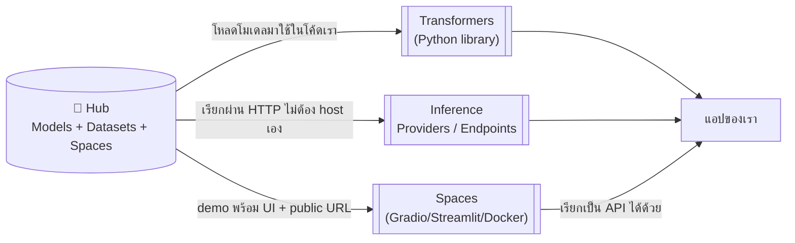

---
tags:
  - ai
  - machine-learning
  - hugging-face
type: reference
created: 2026-09-16
---

# 🤗 Hugging Face คืออะไร

> เข้าใจง่ายสุด: **"GitHub ของวงการ AI/ML"** — แทนที่จะ commit โค้ด คนอัปโหลด **โมเดล AI ที่ train ไว้แล้ว** และ **dataset** ขึ้นไปแชร์กัน มี versioning เหมือน git repo จริง ๆ เปิดให้ทุกคนโหลดไปใช้ต่อได้ฟรี (โมเดล/dataset ส่วนใหญ่)

---

## 1. องค์ประกอบหลัก



| ส่วน | คืออะไร |
|---|---|
| **Hub** | ที่เก็บกลาง — Models (2.4M+), Datasets (730K+), Spaces (~1M) ทุกอันมี versioning แบบ git |
| **Transformers** | Python library โหลด/รันโมเดลจาก Hub ได้ด้วยโค้ดไม่กี่บรรทัด |
| **Datasets** | library โหลด dataset สาธารณะมาใช้ ไม่ต้องเขียน parser เอง |
| **PEFT** | library fine-tune โมเดลใหญ่แบบประหยัด (LoRA) ไม่ต้อง train ใหม่ทั้งก้อน |
| **Spaces** | host demo/tool เป็นเว็บแอปจริง (Gradio/Streamlit/static/Docker) ได้ URL สาธารณะทันที |
| **Inference Providers/Endpoints** | เรียกใช้โมเดลผ่าน API โดยไม่ต้อง run เองเลย |

---

## 2. วิธีเอาโมเดลมาใช้งาน — เลือกตามความจริงจัง

| วิธี | เหมาะกับ | ข้อจำกัด |
|---|---|---|
| **`transformers` local** | ทดสอบ/รัน offline/ข้อมูล sensitive ห้ามออกนอกเครื่อง | ต้องมี RAM/VRAM พอ โมเดลขนาดหลาย GB |
| **Serverless Inference Providers** | prototype เร็ว ๆ ไม่อยากตั้ง infra | free tier มี rate limit ไม่ประกาศตัวเลขชัด, โมเดล "cold" ต้องรอ warm |
| **Dedicated Inference Endpoints** | production จริงจัง ต้องการ SLA/autoscale | เสียเงินตามชั่วโมงที่ใช้ hardware |
| **Spaces (เรียกเป็น API)** | มี demo อยู่แล้ว อยากเรียกใช้ต่อจากแอปอื่น | hardware ฟรีจำกัด ต้องจ่ายเพิ่มถ้าอยากได้ GPU/เสถียรกว่านี้ |

---

## 3. ตัวอย่างโค้ด

### รันโมเดล local — บรรทัดเดียวจบ

```python
from transformers import pipeline

classifier = pipeline("sentiment-analysis")
classifier("This vault is getting way too organized.")
# [{'label': 'POSITIVE', 'score': 0.999...}]
```

`pipeline()` มี task สำเร็จรูปให้เลือกเยอะ: `text-generation`, `summarization`, `translation`, `question-answering`, `image-classification`, `automatic-speech-recognition` (Whisper), `text-to-image` ฯลฯ — โหลดโมเดล default ของ task นั้นให้อัตโนมัติ

### เรียกผ่าน HTTP — ไม่ต้องมี Python เลย เรียกจาก backend ภาษาไหนก็ได้

```bash
curl https://router.huggingface.co/hf-inference/models/<model-id> \
  -H "Authorization: Bearer $HF_TOKEN" \
  -H "Content-Type: application/json" \
  -d '{"inputs": "ข้อความที่จะส่งไปประมวลผล"}'
```

จุดนี้สำคัญ: **Inference Providers/Endpoints คือ REST API ธรรมดา** — service ฝั่ง backend ที่มีอยู่แล้ว (ไม่ว่าเขียนด้วยภาษาอะไร) เรียกได้เหมือนเรียก API ภายนอกทั่วไป ไม่ต้องรู้ ML เชิงลึกก็เพิ่มฟีเจอร์ AI เข้าไปได้

---

## 4. เอามาทำอะไรได้บ้าง

- **เพิ่มฟีเจอร์ AI เข้า service ที่มีอยู่แล้ว** ผ่าน REST call ธรรมดา — auto-summarize เนื้อหายาว, จัดหมวดหมู่/ติด tag อัตโนมัติ, ตรวจ sentiment, ตรวจข้อความไม่เหมาะสม (content moderation), แปลภาษา, สรุปแชท
- **Semantic search / RAG** — ใช้ embedding model แปลงข้อความเป็นเวกเตอร์ เก็บลง vector DB แล้วค้นด้วยความหมายแทน keyword ตรง ๆ ต่อยอดเป็นระบบถาม-ตอบจากเอกสารของตัวเอง
- **Speech-to-text / text-to-speech** — ใส่ฟีเจอร์ถอดเสียงประชุมหรืออ่านออกเสียงข้อความ (Whisper และรุ่นอื่น ๆ บน Hub)
- **สร้างรูปจาก prompt** — โมเดลกลุ่ม text-to-image (Stable Diffusion และรุ่นอื่น ๆ) เรียกผ่าน `diffusers` library หรือ Inference API เดียวกัน
- **ทำ internal tool แบบมี UI ใน 10 นาที** — เขียน Gradio app ไม่กี่บรรทัด deploy เป็น Space ได้ URL แชร์ให้ทีมลองกดเล่นทันที ไม่ต้องตั้ง server/hosting เอง
- **Fine-tune โมเดลให้เข้ากับข้อมูลของตัวเอง** — ใช้ PEFT/LoRA ปรับโมเดลใหญ่ด้วย data เฉพาะทางโดยไม่ต้อง train ใหม่ทั้งก้อน ถูกกว่า full fine-tune มาก
- **รัน local เพื่อความเป็นส่วนตัว** — ข้อมูล sensitive ที่ห้ามส่งออกนอกองค์กร รันโมเดล open-weight บนเครื่อง/เซิร์ฟเวอร์ตัวเองแทนการเรียก API ภายนอก

---

## 🎯 แนวทางการเริ่มศึกษา

1. **เริ่มต้น** — เข้าใจความสัมพันธ์ Hub–Transformers–Inference ให้ออกก่อน (ข้อ 1) และรู้ว่ามีทางเลือกใช้งานต่างระดับความจริงจังกัน 4 แบบ (ข้อ 2) — เลือกทางที่เหมาะกับสิ่งที่กำลังทำ ไม่ใช่เลือกทางที่ซับซ้อนสุดตั้งแต่แรก
2. **ลงมือทำจริง** — ลอง `pipeline("sentiment-analysis")` บรรทัดเดียวในเครื่องตัวเองก่อน (ข้อ 3) แล้วค่อยลองยิงโมเดลเดียวกันผ่าน Inference API ด้วย `curl` เทียบดูว่าต่างกันตรงไหน
3. **ใช้งานได้คล่อง** — เช็ก license ของโมเดลก่อนใช้ production เสมอ (ไม่ใช่ทุกตัวใช้ commercial ได้ฟรี), pin revision กันโมเดลเปลี่ยนกลางทาง, และแยกให้ออกว่าเมื่อไหร่ควร fine-tune ด้วย PEFT/LoRA แทนที่จะหาโมเดลสำเร็จรูปมาใช้ตรง ๆ

---

## 5. กับดัก

- **free tier ของ Serverless Inference มี rate limit ไม่บอกตัวเลขชัดเจน** — ขึ้นกับโมเดล/โหลดตอนนั้น เจอ 429 ได้ง่ายกว่าที่คิด อย่าพึ่งพาเป็น production path
- **โมเดลที่ไม่ได้ถูกเรียกบ่อย ๆ อาจ "cold"** — request แรกได้ 503 ระหว่างระบบกำลัง warm up โมเดลขึ้นมา ต้อง retry ไม่ใช่ error ถาวร
- **Inference Providers คือการ route ไปที่ partner (Together AI, Groq, Cerebras ฯลฯ) ไม่ใช่ HF รันเองเสมอไป** — ราคา/ความเร็ว/behavior ขึ้นกับ partner ที่ถูกเลือกใช้ ไม่ใช่ HF ควบคุมตรง ๆ ทั้งหมด
- **license ของแต่ละโมเดลไม่เหมือนกัน** — Apache 2.0/MIT ใช้ commercial ได้สบาย แต่บางตัว research-only หรือมีเงื่อนไขพิเศษ (เช่น Llama license มีเงื่อนไขผู้ใช้รายใหญ่) ต้องเช็ค license ของโมเดลนั้น ๆ ก่อนใช้จริงเสมอ ไม่ใช่ทุกอย่างบน Hub จะฟรีใช้ได้ไม่มีเงื่อนไข
- **รัน local ไม่ใช่แค่ `pip install` แล้วจบ** — โมเดลขนาดจริงเป็น GB ต้องมี RAM/VRAM พอ ไม่งั้น OOM หรือช้ามากจนใช้งานจริงไม่ได้
- **ส่งข้อมูลผ่าน Serverless/Providers = ข้อมูลออกไปนอกเครื่องเสมอ** — ถ้าข้อมูล sensitive ต้องรัน local หรือใช้ Dedicated Endpoint ที่คุม infra เองได้ ไม่ใช่ serverless แชร์กับคนอื่น
- **model repo บน Hub แก้ "main" ได้ตลอดเวลาโดยเจ้าของ** — โหลดแบบไม่ pin revision ไว้ วันหนึ่งโค้ดเดิมอาจได้ผลลัพธ์ต่างไปเพราะโมเดลถูกอัปเดต ควร pin commit hash/revision เฉพาะตอนใช้ production

---

## 6. Cheat sheet

```bash
pip install transformers
```

```python
from transformers import pipeline

pipeline("sentiment-analysis")("ข้อความ")
pipeline("summarization")(long_text)
pipeline("translation_en_to_th")("Hello")
pipeline("image-classification")(image)
pipeline("automatic-speech-recognition")(audio_file)
```

```bash
curl https://router.huggingface.co/hf-inference/models/<model-id> \
  -H "Authorization: Bearer $HF_TOKEN" \
  -d '{"inputs": "..."}'
```

| ต้องการอะไร | ใช้อะไร |
|---|---|
| ทดสอบไอเดียเร็ว ๆ ไม่อยากตั้ง infra | Serverless Inference Providers |
| Production จริงจัง ต้องการ SLA/autoscale | Dedicated Inference Endpoints |
| Demo มี UI ให้คนอื่นลองกดเล่น | Spaces |
| ข้อมูล sensitive ห้ามออกนอกเครื่อง | รัน local ด้วย `transformers` |
| ปรับโมเดลให้เข้ากับข้อมูลตัวเองแบบประหยัด | PEFT/LoRA fine-tune |

## 🔗 เกี่ยวข้อง

- [[Docker Basics]] — Spaces บาง SDK deploy ได้ตรงจาก Dockerfile เหมือนกัน

## 📖 อ่านต่อ

- [Hugging Face](https://huggingface.co/)
- [Hugging Face Hub documentation](https://huggingface.co/docs/hub/en/index)
- [Inference Providers · Hugging Face](https://huggingface.co/docs/inference-providers/index)
- [Inference Endpoints · Hugging Face](https://huggingface.co/docs/inference-endpoints/index)
- [PEFT · Hugging Face](https://huggingface.co/docs/peft/en/index)
