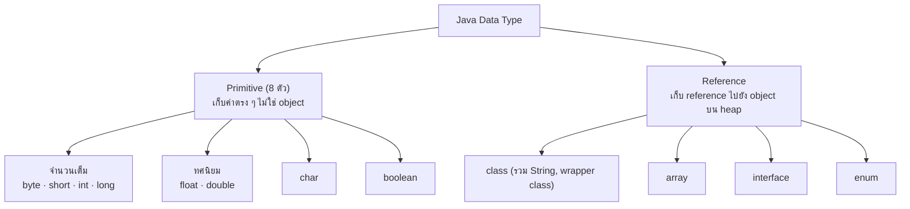

---
tags:
  - java
  - data-types
  - primitives
type: reference
created: 2026-09-15
---

# 🔢 Java Data Type — มีกี่แบบ

> **กฎเดียวที่ต้องจำก่อนอย่างอื่น:** Java แบ่ง type เป็นสองพวกที่ทำงานต่างกันโดยสิ้นเชิง — **primitive** (เก็บค่าตรง ๆ) กับ **reference** (เก็บที่อยู่ไปหา object) การเข้าใจสองอย่างนี้ต่างกันยังไงคือกุญแจของบั๊กแปลก ๆ หลายอย่างในภาษานี้ (`==` ให้ผลไม่ตรงใจ, default value ไม่เหมือนกัน, ฯลฯ)

---

## 1. ภาพรวม



**Primitive มีแค่ 8 ตัวตายตัว เพิ่มเองไม่ได้** — ทุกอย่างนอกเหนือจากนี้ (`String`, array, class ที่เขียนเอง, `List`, ...) เป็น **reference type** ทั้งหมด

---

## 2. Primitive — 8 ตัว

### จำนวนเต็ม

| type | ขนาด | ช่วงค่า | default | ตัวอย่าง literal |
|---|---|---|---|---|
| `byte` | 8 bit | -128 ถึง 127 | `0` | `byte b = 100;` |
| `short` | 16 bit | -32,768 ถึง 32,767 | `0` | `short s = 1000;` |
| `int` | 32 bit | -2³¹ ถึง 2³¹-1 (~±2.1 พันล้าน) | `0` | `int i = 100_000;` |
| `long` | 64 bit | -2⁶³ ถึง 2⁶³-1 | `0L` | `long l = 100_000_000_000L;` |

### ทศนิยม

| type | ขนาด | ความแม่นยำ | default | ตัวอย่าง literal |
|---|---|---|---|---|
| `float` | 32 bit | ~6-7 หลัก | `0.0f` | `float f = 3.14f;` |
| `double` | 64 bit | ~15-16 หลัก | `0.0` | `double d = 3.14;` |

### อื่น ๆ

| type | ขนาด | ช่วงค่า | default | หมายเหตุ |
|---|---|---|---|---|
| `char` | 16 bit | `\u0000` ถึง `￿` (0-65,535) | `'\u0000'` | เก็บตัวอักษรเดียวแบบ Unicode, **unsigned** (ไม่มีค่าติดลบ) |
| `boolean` | (ไม่กำหนดแน่ชัด, ขึ้นกับ JVM) | `true`/`false` เท่านั้น | `false` | ไม่ใช่ `0`/`1` แบบ C — แปลงไปมากับ int ไม่ได้เลย |

**ตัวเลข literal เขียนให้อ่านง่ายได้หลายแบบ**

```java
int million = 1_000_000;           // underscore คั่นหลักให้อ่านง่าย (Java 7+)
int hex     = 0x1F;                // เลขฐาน 16
int octal   = 017;                 // เลขฐาน 8 (ขึ้นต้นด้วย 0 เฉย ๆ — ระวังสับสนกับเลขปกติ)
int binary  = 0b1010;              // เลขฐาน 2 (Java 7+)
long big    = 100_000_000_000L;    // ต้องมี L ต่อท้าย ไม่งั้น compile error (เกินขอบเขต int)
float pi    = 3.14f;               // ต้องมี f ต่อท้าย ไม่งั้นถือเป็น double
```

---

## 3. Reference type — ที่เหลือทั้งหมด

**`class`, `interface`, `array`, `enum`** — ตัวแปร reference type ไม่ได้เก็บค่าตรง ๆ แต่เก็บ **ที่อยู่ (reference)** ชี้ไปยัง object จริงที่อยู่บน heap

```java
int x = 5;                    // x เก็บค่า 5 ตรง ๆ
int[] arr = new int[]{5};     // arr เก็บ "ที่อยู่" ของ array บน heap ไม่ใช่ตัวเลข
```

**`String` เป็น reference type** (เป็น class) แต่ Java ให้ syntax พิเศษเหมือน primitive (`String s = "hi";` ไม่ต้อง `new`, ใช้ `+` ต่อ string ได้) เพื่อความสะดวก — ข้างใต้ยังเป็น object เหมือนเดิม

---

## 4. Primitive vs Reference — ตารางเทียบ

| | Primitive | Reference |
|---|---|---|
| เก็บอะไร | ค่าจริงตรง ๆ | ที่อยู่ (reference) ไปยัง object |
| default value | `0` / `0.0` / `false` / `'\u0000'` | **`null`** เสมอ |
| เป็น `null` ได้ไหม | ❌ ไม่ได้ | ✅ ได้ |
| `==` เทียบอะไร | เทียบค่าโดยตรง | เทียบว่า **object เดียวกัน** ไหม (ไม่ใช่ค่าเท่ากันไหม) |
| ใช้กับ Generics ได้ไหม | ❌ (`List<int>` ผิด) | ✅ ต้องใช้ wrapper class แทน (ข้อ 5) |
| อยู่ที่ไหน (แนวคิด) | ติดไปกับตัวแปรโดยตรง | ตัวแปรเก็บแค่ reference, object จริงอยู่บน heap |

**ความต่างนี้ส่งผลตอนใช้จริงหลายเรื่อง** — pass-by-value (ทำไม `swap()` เขียนไม่ได้), `==` กับ String pool, unboxing `null` แล้ว NPE, และ "primitive อยู่บน stack" ที่ไม่จริงเสมอไป (primitive field อยู่บน heap ในตัว object) ดู [[Java Value vs Reference]]

---

## 5. Wrapper class — ตอนที่ primitive ต้องกลายเป็น object

`List<Integer>` ใช้ได้ แต่ `List<int>` compile ไม่ผ่าน — Generics ใน Java ต้องการ reference type เสมอ **wrapper class** จึงมีไว้ห่อ primitive ให้กลายเป็น object

| primitive | wrapper class |
|---|---|
| `byte` | `Byte` |
| `short` | `Short` |
| `int` | `Integer` |
| `long` | `Long` |
| `float` | `Float` |
| `double` | `Double` |
| `char` | `Character` |
| `boolean` | `Boolean` |

### Autoboxing / Unboxing — แปลงให้อัตโนมัติ

```java
Integer boxed = 5;          // autoboxing: int → Integer อัตโนมัติ
int unboxed = boxed;        // unboxing: Integer → int อัตโนมัติ

List<Integer> nums = new ArrayList<>();
nums.add(1);                 // 1 (int) ถูก autobox เป็น Integer ให้เอง
```

### ⚠️ Integer cache — กับดักคลาสสิกของ `==`

```java
Integer a = 127, b = 127;
System.out.println(a == b);          // true

Integer c = 128, d = 128;
System.out.println(c == d);          // false !!
System.out.println(c.equals(d));     // true  ← ถูกต้อง
```

**เหตุผล:** `Integer.valueOf(int)` (ที่ autoboxing เรียกให้อัตโนมัติ) **cache object ไว้ล่วงหน้าสำหรับค่า -128 ถึง 127** เท่านั้น — ค่าที่อยู่ในช่วงนี้จึงได้ object ตัวเดียวกันกลับมาเสมอ (`==` เลยเป็น true) แต่นอกช่วงนี้ทุกครั้งจะสร้าง object ใหม่ (`==` จึงเป็น false)

**กฎที่ต้องจำ: เทียบ wrapper class ด้วย `.equals()` เสมอ ไม่ใช่ `==`** — `==` บน reference type เทียบว่าเป็น object เดียวกันไหม ไม่ใช่ค่าเท่ากันไหม (ตรงกันข้ามกับ primitive ที่ `==` เทียบค่าตรง ๆ ได้เลย)

---

## 6. Widening vs Narrowing — แปลง type ไปมา

### Widening (แปลงขึ้น) — อัตโนมัติ ไม่มีข้อมูลหาย

```
byte → short → int → long → float → double
                char ┘
```

```java
int i = 100;
double d = i;      // ✅ widening อัตโนมัติ ไม่ต้อง cast
```

> **`char` ไม่อยู่ในสายเดียวกับ `byte`/`short`** — แปลงตรงไปมาระหว่าง `char` กับ `byte`/`short` ไม่ได้อัตโนมัติ เพราะ `char` เป็น **unsigned** (0-65,535) แต่ `byte`/`short` เป็น signed (มีค่าติดลบได้) ค่าติดลบใส่ใน `char` ไม่ได้พอดี

### Narrowing (แปลงลง) — ต้อง cast เอง และ**ข้อมูลหายได้แบบเงียบ ๆ**

```java
double d = 3.99;
int i = (int) d;              // 3 (ตัดทศนิยมทิ้ง ไม่ปัดเศษ)

int big = 300;
byte b = (byte) big;
System.out.println(b);        // 44   ⚠️ ไม่ error ไม่เตือน แค่ผิด
```

**ทำไมได้ 44:** `byte` มี 8 bit เก็บได้แค่ -128 ถึง 127 การ cast แค่ **ตัดเอาบิตล่างสุด 8 บิต** ของ 300 มาใช้ (300 = `1 0010 1100` ในไบนารี ตัดเหลือ `0010 1100` = 44) — **ไม่มี exception ไม่มี warning ตอนรัน** โปรแกรมรันต่อไปเงียบ ๆ ด้วยค่าที่ผิด

---

## 7. กับดักที่เจอบ่อยที่สุด

### 7.1 Integer overflow — เงียบกริบ ไม่ throw

```java
int max = Integer.MAX_VALUE;      // 2147483647
System.out.println(max + 1);      // -2147483648  ⚠️ วนกลับไปค่าติดลบสุด
```

Java **ไม่ throw exception ตอน int overflow** (ต่างจากบางภาษา) — ค่าแค่ "วนกลับ" (wrap around) เงียบ ๆ ถ้าต้องการให้ throw จริงตอน overflow ใช้ `Math.addExact()`/`Math.multiplyExact()` แทนตัวดำเนินการปกติ

### 7.2 ทศนิยมไม่แม่นยำ 100%

```java
System.out.println(0.1 + 0.2);    // 0.30000000000000004  ⚠️ ไม่ใช่ 0.3
```

`float`/`double` เก็บเลขฐาน 2 ซึ่งแทนเศษส่วนทศนิยมฐาน 10 บางค่าไม่ได้พอดี (เหมือน 1/3 ในฐาน 10 ที่เขียนไม่จบ) — **ห้ามใช้ `float`/`double` กับเงิน** ให้ใช้ `BigDecimal` แทนเสมอ

### 7.3 หารด้วยศูนย์ — int กับ double ให้ผลต่างกัน

```java
System.out.println(5 / 0);        // ❌ throw ArithmeticException: / by zero
System.out.println(5.0 / 0);      // Infinity   (ไม่ throw!)
System.out.println(0.0 / 0);      // NaN        (ไม่ throw!)
```

`int` หารด้วยศูนย์ **throw exception เสมอ** แต่ `float`/`double` หารด้วยศูนย์ **ไม่ throw** — ได้ `Infinity`/`-Infinity`/`NaN` แทน (ตามมาตรฐาน IEEE 754) ต้องเช็คเองถ้าไม่ต้องการค่าพวกนี้หลุดเข้าไปในการคำนวณต่อ

### 7.4 `char` บวกเลขได้ แต่ผลลัพธ์กลายเป็น `int`

```java
char c = 'A';
System.out.println(c + 1);          // 66        ← int ไม่ใช่ char!
System.out.println((char) (c + 1)); // B          ← ต้อง cast กลับเอง
```

---

## 8. Cheat sheet

```java
// primitive ทั้ง 8 ตัว
byte b; short s; int i; long l;     // จำนวนเต็ม
float f; double d;                  // ทศนิยม
char c; boolean bool;               // อื่น ๆ

// default value
int → 0, double → 0.0, boolean → false, char → '\u0000', reference → null

// wrapper class — เทียบด้วย equals() เสมอ ไม่ใช่ ==
Integer.valueOf(x).equals(Integer.valueOf(y))

// narrowing ต้อง cast เอง เสี่ยงข้อมูลหาย
byte b2 = (byte) someInt;

// overflow ที่ throw จริงถ้าไม่อยากให้เงียบ
Math.addExact(a, b);
```

| อาการ | สาเหตุ |
|---|---|
| `==` บน `Integer` ให้ผลไม่ตรงใจ | นอกช่วง cache (-128 ถึง 127) — ต้องใช้ `.equals()` |
| ตัวเลขวนไปติดลบทันทีโดยไม่มี error | int overflow เงียบ ๆ ไม่ throw |
| `0.1 + 0.2 != 0.3` | ความจำกัดของ floating point — ใช้ `BigDecimal` กับเงิน |
| หารด้วยศูนย์บางที่ throw บางที่ไม่ | `int` throw, `float`/`double` ได้ `Infinity`/`NaN` แทน |
| แปลง `byte`↔`char` ตรง ๆ compile ไม่ผ่าน | `char` เป็น unsigned ไม่อยู่ใน widening chain เดียวกับ `byte`/`short` |
| `char + int` ได้ผลเป็นตัวเลขแทนตัวอักษร | ผลลัพธ์ของ `char + int` เป็น `int` เสมอ ต้อง cast กลับเอง |
| `List<int>` compile ไม่ผ่าน | Generics ต้องการ reference type — ใช้ `List<Integer>` แทน |

---

## 🔗 เกี่ยวข้อง

- [[Java]] — หน้ารวม
- [[Java Value vs Reference]] — primitive vs reference ตอนใช้จริง: pass-by-value, String pool, unboxing NPE, memory, Valhalla (ต่อจากโน้ตนี้)
- [[Java Record]] — field ของ record ก็เป็น type พวกนี้ทั้งนั้น (primitive หรือ reference)
- [[Java Date Time]] — ตัวอย่างของ reference type ที่ออกแบบมาให้ immutable

## 📖 อ่านต่อ

- [Oracle — Primitive Data Types](https://docs.oracle.com/javase/tutorial/java/nutsandbolts/datatypes.html)
- [Java Language Specification — §4.2 Primitive Types and Values](https://docs.oracle.com/javase/specs/jls/se17/html/jls-4.html)
