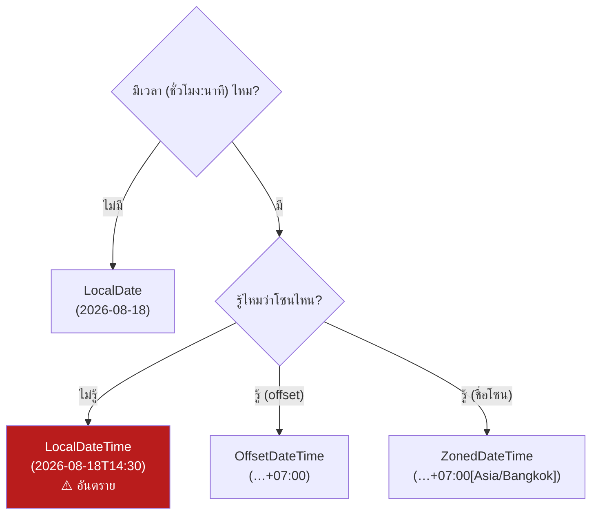

---
tags:
  - java
  - datetime
  - timezone
type: reference
created: 2026-08-18
---

# 🕐 Java Date & Time — เลือกตัวไหน และตัวไหนทำวันเพี้ยน

> **กฎเดียวที่ต้องจำ:** ชื่อขึ้นต้นด้วย **`Local`** = **ไม่มีโซนเวลาอยู่ข้างใน**
> มันไม่ใช่ "จุดเวลาจริง" บนโลก — มันคือตัวเลขบนหน้าปัดนาฬิกาที่ยังไม่ได้บอกว่านาฬิกาเรือนไหน

---

## 1. วิธีจำ — ถามตัวเอง 2 คำถาม



ไม่สนหน้าปัด สนแค่ "จุดไหนบนแกนเวลา" → ใช้ `Instant` (UTC เสมอ) แทนทั้งแผนภาพนี้

| คลาส             | เก็บอะไร             | ตัวอย่างค่า                            | เป็นจุดเวลาจริงไหม |
| ---------------- | -------------------- | -------------------------------------- | ------------------ |
| `LocalDate`      | วันที่               | `2026-08-18`                           | ❌                  |
| `LocalTime`      | เวลา                 | `14:30:00`                             | ❌                  |
| `LocalDateTime`  | วันที่+เวลา          | `2026-08-18T14:30`                     | ❌ **← กับดัก**     |
| `OffsetDateTime` | วันที่+เวลา+offset   | `2026-08-18T14:30+07:00`               | ✅                  |
| `ZonedDateTime`  | วันที่+เวลา+ชื่อโซน  | `2026-08-18T14:30+07:00[Asia/Bangkok]` | ✅                  |
| `Instant`        | จำนวนวินาทีจาก epoch | `2026-08-18T07:30:00Z`                 | ✅                  |

**`LocalDateTime` คือตัวที่หลอกที่สุด** เพราะดูเหมือนมีข้อมูลครบ — มีทั้งวันและเวลา — แต่ไม่มีใครรู้ว่าเป็นเวลาของโซนไหน `2026-08-18T14:30` ที่กรุงเทพกับที่ลอนดอน **ห่างกัน 7 ชั่วโมงจริง ๆ แต่หน้าตาเหมือนกันเป๊ะ**

---

## 2. `java.util.Date` — ทำไมถึงควรเลิกใช้

```java
Date d = new Date(0);          // epoch = 1970-01-01T00:00:00 UTC
System.out.println(d);
// → Thu Jan 01 07:00:00 ICT 1970          ⚠️ ไม่ใช่ 00:00
```

**`Date` ไม่ใช่ "วันที่"** แม้ชื่อจะบอกอย่างนั้น — ข้างในมันเก็บแค่ `long` จำนวนมิลลิวินาทีจาก epoch คือเป็น **จุดเวลา (instant)** ล้วน ๆ ไม่มีโซนอยู่ข้างใน

แต่ `toString()` **เอาโซนของเครื่องมาแปะให้** ทำให้ค่าเดียวกันพิมพ์ออกมาไม่เหมือนกันบนคนละเครื่อง — นี่คือต้นตอของ "บนเครื่อง dev ถูก บน server ผิด"

```java
Date d = new Date(0);

TimeZone.setDefault(TimeZone.getTimeZone("Asia/Bangkok"));
System.out.println(d);   // → Thu Jan 01 07:00:00 ICT 1970

TimeZone.setDefault(TimeZone.getTimeZone("UTC"));
System.out.println(d);   // → Thu Jan 01 00:00:00 UTC 1970
//                              ↑ object ตัวเดียวกัน ค่าเดียวกัน แต่พิมพ์คนละอย่าง
```

### และ `Calendar` ก็มีกับดักของตัวเอง

```java
Calendar c = Calendar.getInstance();
c.set(2026, 8, 18);                       // ตั้งใจ 18 สิงหา
System.out.println(c.getTime());
// → Fri Sep 18 ...                        ⚠️ ได้กันยายน! เดือนนับจาก 0
```

```java
Date old = new Date(126, 7, 18);          // ปีนับจาก 1900
System.out.println(old.getYear());        // → 126 ไม่ใช่ 2026
```

**สรุป:** ถ้าเจอ `java.util.Date` หรือ `Calendar` ในโค้ดใหม่ ให้เปลี่ยน ถ้าเป็นโค้ดเก่าที่แก้ไม่ได้ ให้แปลงเป็น `java.time` ทันทีที่รับเข้ามา แล้วทำงานต่อด้วย type ใหม่

---

## 3. ⚠️ ตัวไหนทำ "วันเพี้ยน" — และเพี้ยนยังไง

### 3.1 กรณีคลาสสิก — วันเลื่อนไป 1 วัน

ประเทศไทยคือ **UTC+7** เที่ยงคืนที่กรุงเทพ = ห้าโมงเย็นของ**วันก่อนหน้า**ที่ UTC

```java
LocalDate birthday = LocalDate.of(1990, 5, 15);
System.out.println(birthday);
// → 1990-05-15                                  ✅ ถูก

// เผลอแปลงเป็นจุดเวลาเพื่อเก็บลง DB
Instant stored = birthday.atStartOfDay(ZoneId.of("Asia/Bangkok")).toInstant();
System.out.println(stored);
// → 1990-05-14T17:00:00Z                        ⚠️ กลายเป็นวันที่ 14 แล้ว

// server อ่านกลับ แต่เครื่องตั้งเป็น UTC
LocalDate readBack = stored.atZone(ZoneOffset.UTC).toLocalDate();
System.out.println(readBack);
// → 1990-05-14                                  ❌ เพี้ยนไป 1 วัน
```

**สาเหตุ:** เอา "วันที่" (ไม่มีโซน) ไปแปลงเป็น "จุดเวลา" (มีโซน) แล้วแปลงกลับด้วยโซนคนละตัว
ทุกครั้งที่ข้ามระหว่างสองโลกนี้ **ต้องระบุโซนให้ตรงกันทั้งไปและกลับ**

> **วันเกิด วันครบกำหนด วันที่เอกสาร ไม่ควรมีเวลาและโซนติดมาตั้งแต่แรก** — เก็บเป็น `LocalDate` และคอลัมน์ `DATE` เท่านั้น ปัญหานี้จะไม่มีวันเกิด

### 3.2 กรณีที่เจ็บกว่า — `LocalDate.now()` บน server ที่ตั้ง UTC

```java
// เวลาจริง: 18 ส.ค. 2026 เวลา 06:00 น. ที่กรุงเทพ
// server ตั้ง timezone เป็น UTC → ตอนนั้น UTC คือ 17 ส.ค. 23:00

System.out.println(LocalDate.now());
// → 2026-08-17                                  ❌ ได้เมื่อวาน

System.out.println(LocalDate.now(ZoneId.of("Asia/Bangkok")));
// → 2026-08-18                                  ✅ ถูก
```

**`now()` แบบไม่ใส่โซน ใช้โซนของเครื่องเสมอ** — ซึ่งบนเครื่อง dev คือ ICT แต่บน container มักเป็น UTC
ผลคือรายงาน "ยอดขายวันนี้" ตอนเช้าจะดึงข้อมูลของเมื่อวาน และจะเพี้ยนเฉพาะช่วง **00:00–07:00 น.** เท่านั้น — ซึ่งเป็นช่วงที่คนทดสอบไม่ค่อยอยู่

```java
// ✅ ตั้งค่าคงที่ไว้ที่เดียว แล้วใช้ตลอด
public static final ZoneId TH = ZoneId.of("Asia/Bangkok");

LocalDate today = LocalDate.now(TH);
```

### 3.3 `LocalDateTime` ↔ `Instant` — แปลงมั่วเมื่อไหร่ เพี้ยนเมื่อนั้น

```java
LocalDateTime meeting = LocalDateTime.of(2026, 8, 18, 14, 30);
System.out.println(meeting);
// → 2026-08-18T14:30                            ← บ่ายสองครึ่ง "ของที่ไหน?"

System.out.println(meeting.toInstant(ZoneOffset.UTC));
// → 2026-08-18T14:30:00Z                        ← ตีความว่าเป็น UTC

System.out.println(meeting.atZone(ZoneId.of("Asia/Bangkok")).toInstant());
// → 2026-08-18T07:30:00Z                        ← ตีความว่าเป็นเวลาไทย
//                                                  ต่างกัน 7 ชั่วโมง!
```

**ค่า `LocalDateTime` ตัวเดียวกัน แปลงได้หลายคำตอบ** ขึ้นกับว่าเราบอกว่ามันเป็นเวลาของโซนไหน — ถ้าโค้ดคนละที่ตีความคนละแบบ ข้อมูลจะเพี้ยนแบบหาสาเหตุยากมาก

### 3.4 ตารางสรุปความเสี่ยง

| ใช้อะไร | โอกาสวันเพี้ยน | เพราะ |
|---|---|---|
| `LocalDate` เพียว ๆ | 🟢 **ไม่มี** | ไม่มีโซนให้แปลง |
| `LocalTime` | 🟢 ไม่มี | — |
| `Instant` / `OffsetDateTime` | 🟢 ต่ำ | มีโซนติดมาชัดเจน แปลงกลับได้ตรง |
| `ZonedDateTime` | 🟡 กลาง | ถูกต้อง แต่ต้องระวังเรื่อง DST ของโซนต่างประเทศ |
| **`LocalDateTime`** | 🔴 **สูงสุด** | ดูเหมือนครบแต่ไม่มีโซน ทุกการแปลงคือการเดา |
| **`java.util.Date`** | 🔴 สูง | `toString()` เปลี่ยนตามเครื่อง สับสนง่าย |
| `LocalDate.now()` ไม่ใส่โซน | 🔴 สูง | ผูกกับโซนของเครื่อง |

---

## 4. เลือกใช้ยังไง — ตัดสินจากความหมายของข้อมูล

| ข้อมูลคืออะไร | ใช้ | คอลัมน์ DB |
|---|---|---|
| วันเกิด, วันครบกำหนด, วันที่เอกสาร, วันหยุด | **`LocalDate`** | `DATE` |
| เวลาเปิด–ปิดร้าน (ไม่ผูกกับวัน) | `LocalTime` | `TIME` |
| เวลาที่เหตุการณ์เกิดขึ้นจริง (created_at, log, audit) | **`Instant`** หรือ `OffsetDateTime` | `TIMESTAMP WITH TIME ZONE` |
| นัดหมายในอนาคตตามเวลาท้องถิ่น ("ประชุม 9 โมงที่โตเกียว") | `LocalDateTime` + เก็บ `ZoneId` **แยกอีกคอลัมน์** | `TIMESTAMP` + `VARCHAR` |
| ช่วงเวลาแบบวัน/เดือน/ปี | `Period` | — |
| ช่วงเวลาแบบชั่วโมง/นาที/วินาที | `Duration` | — |

**เหตุผลที่นัดหมายอนาคตต้องเก็บเป็น `LocalDateTime` + โซนแยก:** ถ้าเก็บเป็น `Instant` แล้วประเทศนั้นเปลี่ยนกฎเวลา (เลื่อน DST, เปลี่ยน offset) นัดหมายที่ควรเป็น 9 โมงเช้าจะกลายเป็น 8 โมงหรือ 10 โมง — **เพราะเราบันทึก "จุดเวลา" ไว้ แต่สิ่งที่คนตกลงกันจริงคือ "ตัวเลขบนหน้าปัด"**

---

## 5. แปลงไปมาให้ถูก

```java
static final ZoneId TH = ZoneId.of("Asia/Bangkok");

// ---------- LocalDate ↔ อย่างอื่น ----------
LocalDate d = LocalDate.of(2026, 8, 18);

d.atStartOfDay()                    // → 2026-08-18T00:00        (LocalDateTime)
d.atTime(14, 30)                    // → 2026-08-18T14:30        (LocalDateTime)
d.atStartOfDay(TH)                  // → 2026-08-18T00:00+07:00[Asia/Bangkok]
d.atStartOfDay(TH).toInstant()      // → 2026-08-17T17:00:00Z    ⚠️ ข้ามวัน

// ---------- Instant ↔ อย่างอื่น ----------
Instant now = Instant.parse("2026-08-18T07:30:00Z");

now.atZone(TH)                      // → 2026-08-18T14:30+07:00[Asia/Bangkok]
now.atZone(TH).toLocalDate()        // → 2026-08-18
now.atZone(TH).toLocalDateTime()    // → 2026-08-18T14:30
now.atZone(ZoneOffset.UTC).toLocalDate()   // → 2026-08-18

// ---------- ของเก่า → ของใหม่ ----------
Date legacy = new Date();
legacy.toInstant()                          // → Instant
legacy.toInstant().atZone(TH).toLocalDate() // → LocalDate

java.sql.Date sqlDate = ...;
sqlDate.toLocalDate();                      // ✅ ตรงไปตรงมา ไม่ผ่านโซน
```

> **`java.sql.Date.toLocalDate()` ปลอดภัยกว่า** `new java.util.Date(...).toInstant()...` เพราะมันไม่แวะผ่านโซนเลย

---

## 6. Format และ Parse — สามตัวอักษรที่ทำพัง

### 6.1 `YYYY` กับ `yyyy` — บั๊กที่โผล่ปีละครั้ง

```java
LocalDate d = LocalDate.of(2024, 12, 31);

d.format(DateTimeFormatter.ofPattern("yyyy-MM-dd"));   // → 2024-12-31   ✅
d.format(DateTimeFormatter.ofPattern("YYYY-MM-dd"));   // → 2025-12-31   ❌ ปีผิด!
```

`YYYY` คือ **week-based year** (ปีตามสัปดาห์ ISO) ไม่ใช่ปีปฏิทิน วันที่ 31 ธ.ค. 2024 ตกอยู่ในสัปดาห์แรกของปี 2025 ตามมาตรฐาน ISO มันเลยรายงานว่าเป็นปี 2025

**บั๊กนี้ซ่อนตัวได้ทั้งปี แล้วโผล่มาช่วงสิ้นปี** — เลขที่เอกสาร ชื่อไฟล์รายงาน ชื่อ index จะกลายเป็นปีหน้าหมด

### 6.2 `mm` กับ `MM`

```java
LocalDateTime t = LocalDateTime.of(2026, 8, 18, 14, 30);

t.format(DateTimeFormatter.ofPattern("yyyy-MM-dd"));   // → 2026-08-18   ✅ เดือน
t.format(DateTimeFormatter.ofPattern("yyyy-mm-dd"));   // → 2026-30-18   ❌ นาที
```

### 6.3 `hh` กับ `HH`

```java
t.format(DateTimeFormatter.ofPattern("HH:mm"));        // → 14:30        ✅ 24 ชม.
t.format(DateTimeFormatter.ofPattern("hh:mm"));        // → 02:30        ❌ 12 ชม. ไม่มี AM/PM
t.format(DateTimeFormatter.ofPattern("hh:mm a"));      // → 02:30 PM     ✅ ถ้าตั้งใจ
```

### 6.4 ตัวอักษรที่ใช้บ่อย

| ตัว | ความหมาย | ตัวอย่าง |
|---|---|---|
| `yyyy` | ปีปฏิทิน | 2026 |
| `YYYY` | ⚠️ ปีตามสัปดาห์ ISO | 2025 (บางวัน) |
| `MM` | เดือน | 08 |
| `mm` | นาที | 30 |
| `dd` | วันที่ | 18 |
| `DD` | ⚠️ วันที่เท่าไรของปี | 230 |
| `HH` | ชั่วโมง 0–23 | 14 |
| `hh` | ชั่วโมง 1–12 | 02 |
| `ss` | วินาที | 00 |
| `SSS` | มิลลิวินาที | 123 |
| `a` | AM/PM | PM |

### 6.5 ใช้ค่าคงที่ที่มีอยู่แล้วถ้าทำได้

```java
d.format(DateTimeFormatter.ISO_DATE);              // → 2026-08-18
LocalDate.parse("2026-08-18");                     // ✅ ไม่ต้องใส่ formatter
LocalDateTime.parse("2026-08-18T14:30:00");        // ✅ ISO เป็น default อยู่แล้ว
```

**`DateTimeFormatter` เป็น immutable และ thread-safe** ประกาศเป็น `static final` ได้เลย ต่างจาก `SimpleDateFormat` ตัวเก่าที่ **ไม่ thread-safe** และเป็นต้นเหตุของบั๊กแปลกที่โผล่เฉพาะตอนคนใช้พร้อมกันเยอะ ๆ

---

## 7. บวกลบเวลา — `Period` กับ `Duration` ไม่เหมือนกัน

```java
LocalDate d = LocalDate.of(2026, 1, 31);
System.out.println(d.plusMonths(1));
// → 2026-02-28        ← ไม่มี 31 ก.พ. มันเลื่อนมาวันสุดท้ายให้

System.out.println(d.plusMonths(1).plusMonths(1));   // → 2026-03-28
System.out.println(d.plusMonths(2));                 // → 2026-03-31
//                                                       ↑ ผลไม่เท่ากัน!
```

**การบวกเดือนไม่ commutative** — บวกทีละเดือนสองครั้ง ไม่เท่ากับบวกสองเดือนรวดเดียว เพราะข้อมูลถูก "ตัด" ทิ้งไปในขั้นตอนแรก **ถ้าคำนวณงวดผ่อนหรือรอบบิล ให้บวกจากวันตั้งต้นเสมอ อย่าบวกสะสมทีละงวด**

```java
// ❌ สะสม error
LocalDate due = start;
for (int i = 0; i < 12; i++) { due = due.plusMonths(1); ... }

// ✅ คำนวณจากวันตั้งต้นทุกครั้ง
for (int i = 1; i <= 12; i++) { LocalDate due = start.plusMonths(i); ... }
```

| | `Period` | `Duration` |
|---|---|---|
| หน่วย | ปี / เดือน / วัน | ชั่วโมง / นาที / วินาที |
| ใช้กับ | `LocalDate` | `Instant`, `LocalTime` |
| ข้าม DST | นับเป็น "1 วัน" ตามปฏิทิน | นับเป็น 24 ชั่วโมงเป๊ะ |

```java
Period p = Period.between(LocalDate.of(1990,5,15), LocalDate.of(2026,8,18));
System.out.println(p.getYears() + " ปี " + p.getMonths() + " เดือน " + p.getDays() + " วัน");
// → 36 ปี 3 เดือน 3 วัน

long days = ChronoUnit.DAYS.between(LocalDate.of(2026,8,1), LocalDate.of(2026,8,18));
// → 17
```

---

## 8. เปรียบเทียบ

```java
LocalDate a = LocalDate.of(2026, 8, 18);
LocalDate b = LocalDate.of(2026, 8, 20);

a.isBefore(b);      // → true
a.isAfter(b);       // → false
a.isEqual(b);       // → false
```

**ระวังกับ `ZonedDateTime`** — `equals()` เทียบโซนด้วย ไม่ใช่แค่จุดเวลา

```java
ZonedDateTime bkk = ZonedDateTime.parse("2026-08-18T14:30+07:00[Asia/Bangkok]");
ZonedDateTime utc = bkk.withZoneSameInstant(ZoneOffset.UTC);

System.out.println(utc);            // → 2026-08-18T07:30Z
System.out.println(bkk.equals(utc));   // → false   ⚠️ คนละโซน
System.out.println(bkk.isEqual(utc));  // → true    ✅ จุดเวลาเดียวกัน
System.out.println(bkk.toInstant().equals(utc.toInstant()));   // → true
```

**อยากเทียบว่า "เวลาเดียวกันไหม" ให้แปลงเป็น `Instant` ก่อน หรือใช้ `isEqual`**

---

## 9. กับดักที่เหลือ

| อาการ | สาเหตุ |
|---|---|
| วันเลื่อน 1 วัน | เอา `LocalDate` แปลงผ่านโซนแล้วแปลงกลับด้วยคนละโซน |
| `LocalDate.now()` ได้เมื่อวาน ช่วงเช้า | server ตั้ง UTC — ใส่ `ZoneId` ให้ชัด |
| ปีในชื่อไฟล์ผิดช่วงสิ้นปี | ใช้ `YYYY` แทน `yyyy` |
| เดือนกลายเป็นเลขแปลก ๆ | ใช้ `mm` แทน `MM` |
| เวลาผิด 12 ชั่วโมง | ใช้ `hh` แทน `HH` |
| ค่าเวลาเพี้ยนแบบสุ่มตอนคนใช้เยอะ | ใช้ `SimpleDateFormat` เป็น static — ไม่ thread-safe |
| เดือนคลาดไป 1 | `Calendar` นับเดือนจาก 0 |
| งวดผ่อนคลาดไปเรื่อย ๆ | บวกเดือนสะสมทีละงวด |
| `equals()` ของเวลาบอก false ทั้งที่ควร true | `ZonedDateTime` เทียบโซนด้วย |
| ค่าใน DB ไม่ตรงกับที่แสดง | คอลัมน์เป็น `TIMESTAMP` (ไม่มีโซน) แต่โค้ดตีความคนละโซนกับตอนเขียน |

---

## 10. กฎที่ใช้ได้ตลอด

1. **เลือก type จากความหมายของข้อมูล ไม่ใช่จากความสะดวก** — "วันที่" ใช้ `LocalDate` อย่าเผลอใส่เวลาเข้าไปเพราะ "เผื่อไว้"
2. **ประกาศ `ZoneId` ไว้ที่เดียวในโปรเจกต์** แล้ว `now()` ทุกที่ต้องใส่โซนนั้นเสมอ ห้ามเรียก `now()` เปล่า ๆ
3. **ตั้ง server เป็น UTC ให้หมด** แล้วแปลงเป็นเวลาท้องถิ่นเฉพาะตอนแสดงผล — ไม่ใช่ตอนเก็บ
4. **แปลงของเก่าเป็น `java.time` ทันทีที่รับเข้ามา** อย่าปล่อย `Date` เดินทางลึกเข้าไปในระบบ
5. **`yyyy` เสมอ ไม่ใช่ `YYYY`** — ถ้าเจอ `YYYY` ในโค้ดคนอื่น ถือว่าเป็นบั๊กจนกว่าจะพิสูจน์ว่าตั้งใจ
6. **ส่ง JSON เป็น ISO-8601 ที่มีโซน** (`2026-08-18T14:30:00+07:00`) ไม่ใช่ epoch millis หรือ string ที่ไม่มีโซน

---

## 🔗 เกี่ยวข้อง

- [[Java]] — หน้ารวม
- [[Quarkus Hibernate]] — Hibernate 6 เปลี่ยนวิธี map `Instant` / `ZonedDateTime` เป็น UTC และเลิกใช้ `@Temporal`

## 📖 อ่านต่อ

- [Java 17 — java.time package](https://docs.oracle.com/en/java/javase/17/docs/api/java.base/java/time/package-summary.html)
- [DateTimeFormatter — pattern letters](https://docs.oracle.com/en/java/javase/17/docs/api/java.base/java/time/format/DateTimeFormatter.html)
