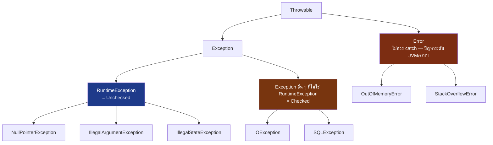

---
tags:
  - java
  - exception
  - error-handling
type: reference
created: 2026-09-16
---

# 🚨 Java Exception — Checked vs Unchecked และการออกแบบเอง

> **คำถามเดียวที่ตัดสินใจทุกอย่างในเรื่องนี้: "ถ้าเกิดเหตุการณ์นี้ คนเรียกฟังก์ชันมีทางแก้ไขจริง ๆ ไหม"**
> ถ้าแก้ได้จริง (เช่น ลองใหม่, ถามผู้ใช้ใหม่) → checked exception บังคับให้คิดเรื่องนี้ตั้งแต่ compile time
> ถ้าเป็นบั๊กของโปรแกรมเมอร์ (ส่ง `null` มาผิด, index เกิน) → unchecked exception เพราะไม่มีอะไรให้ "แก้ไข" ตอนนั้น มีแต่ต้องไปแก้โค้ด

---

## 1. ภาพรวม — ลำดับชั้นของ `Throwable`



| ระดับ | ตัวอย่าง | ใครควรจัดการ |
|---|---|---|
| **Error** | `OutOfMemoryError`, `StackOverflowError` | ไม่มีใคร — โปรแกรมพังระดับที่ recover ไม่ได้จริง ๆ |
| **Checked Exception** | `IOException`, `SQLException` | โค้ดแอปพลิเคชัน — คอมไพเลอร์บังคับให้จัดการ |
| **Unchecked (`RuntimeException`)** | `NullPointerException`, `IllegalArgumentException` | มักเป็นบั๊ก — ไม่บังคับจัดการ แต่ควรป้องกันไม่ให้เกิดตั้งแต่แรก |

---

## 2. Checked vs Unchecked — ต่างกันตรงไหนจริง ๆ

**กฎแบ่งง่ายที่สุด: เป็น subclass ของ `RuntimeException` หรือเปล่า**
- **ใช่** → unchecked — ไม่ต้องประกาศ `throws`, ไม่ต้อง catch ก็ compile ผ่าน
- **ไม่ใช่** (แต่ยังเป็น subclass ของ `Exception`) → checked — **คอมไพเลอร์บังคับ** ให้ `catch` หรือประกาศ `throws` ต่อ ไม่งั้น compile error ทันที

```java
// checked — ต้อง catch หรือประกาศ throws ไม่งั้น compile ไม่ผ่าน
void readFile() throws IOException {
    Files.readString(Path.of("data.txt"));
}

// unchecked — จะ catch หรือไม่ก็ compile ผ่านปกติ
void divide(int a, int b) {
    System.out.println(a / b);   // ArithmeticException ถ้า b == 0 แต่ไม่ต้องประกาศอะไร
}
```

---

## 3. try-catch-finally — `finally` ทำงานเสมอ

```java
static int normal() {
    try {
        System.out.println("try");
        return 1;
    } finally {
        System.out.println("finally");
    }
}
```
```
try
finally
```
(คืนค่า `1` — `finally` รันก่อนค่าจะถูกส่งออกไปจริง ๆ เสมอ ไม่ว่า `try` จะจบด้วย `return`, exception, หรือปกติ)

### ⚠️ `finally` ที่มี `return`/`throw` กลืน exception เงียบ ๆ

```java
static int trap() {
    try {
        throw new RuntimeException("boom");
    } finally {
        return 99;      // ⚠️ อันตรายมาก
    }
}

System.out.println(trap());
```
```
99
```

**exception ที่ throw ใน `try` หายไปทั้งดุ้น ไม่มีใครเห็นมันเลย** เพราะ `finally` ที่จบด้วย `return`/`throw` เอง จะ**แทนที่**ทุกอย่างที่มาจาก `try`/`catch` — ทั้ง return value และ exception ที่กำลังจะ propagate ออกไป **ห้ามเขียน `return`/`throw` ใน `finally` เด็ดขาด** ไม่ว่าจะตั้งใจหรือไม่

---

## 4. try-with-resources — ปิด resource ให้อัตโนมัติ

```java
class Resource implements AutoCloseable {
    private final String name;
    Resource(String name) { this.name = name; System.out.println("open " + name); }
    public void close() { System.out.println("close " + name); }
}

try (Resource a = new Resource("A"); Resource b = new Resource("B")) {
    System.out.println("ใช้งาน");
}
```
```
open A
open B
ใช้งาน
close B
close A
```

**ปิดเรียงย้อนกลับจากลำดับที่เปิด** (เปิด A→B, ปิด B→A) — เหมือน stack **ปิดให้อัตโนมัติแม้เกิด exception ระหว่างทาง** ไม่ต้องเขียน `finally { a.close(); b.close(); }` เองอีกต่อไป (แบบที่ทำกันก่อน Java 7)

**ใช้ได้กับทุกอย่างที่ implement `AutoCloseable`** — `Connection`, `Statement`, `InputStream`, `Scanner` ของมาตรฐานทำ interface นี้ไว้แล้ว หรือ class ที่เขียนเองก็ implement เพิ่มได้ตามตัวอย่างข้างบน

---

## 5. Multi-catch — จับหลาย exception พร้อมกัน

```java
try {
    riskyMethod();
} catch (IOException | SQLException e) {
    log.error("operation failed", e);
}
```

ใช้เมื่อหลาย exception ต้องจัดการ**เหมือนกันเป๊ะ** — ประหยัดกว่าเขียน `catch` แยกที่ทำเรื่องเดียวกันซ้ำ ๆ (`e` ในนี้มี type เป็น union ของทั้งสองคลาส เรียก method ร่วมกันได้เฉพาะที่ทั้งคู่มี)

---

## 6. ออกแบบ exception เอง

### 6.1 เลือก extend อะไร — ใช้คำถามเดียวกับหัวโน้ต

```java
// Unchecked — เป็นบั๊ก ไม่มีอะไรให้ caller "แก้" ตอนนั้น
public class OrderNotFoundException extends RuntimeException {
    public OrderNotFoundException(String orderId) {
        super("order not found: " + orderId);
    }
}

// Checked — caller ควรมีทางรับมือจริง ๆ เช่น retry ด้วย gateway อื่น
public class PaymentGatewayException extends Exception {
    public PaymentGatewayException(String message, Throwable cause) {
        super(message, cause);
    }
}
```

### 6.2 ⚠️ ต้องมี constructor ที่รับ `cause` เสมอ — ไม่งั้น stack trace เดิมหาย

```java
// ❌ เก็บแค่ข้อความ stack trace ของต้นตอหายไปเลย
catch (SQLException e) {
    throw new RuntimeException(e.getMessage());
}

// ✅ ส่ง e เข้าไปเป็น cause — stack trace เดิมยังอยู่ครบ ดูย้อนได้ว่าพังจากอะไรจริง ๆ
catch (SQLException e) {
    throw new RuntimeException("failed to save order", e);
}
```

**นี่คือเหตุผลที่ custom exception ทุกตัวควรมี constructor สองแบบ**

```java
public class ServiceException extends RuntimeException {
    public ServiceException(String message) { super(message); }
    public ServiceException(String message, Throwable cause) { super(message, cause); }
}
```

`getCause()` จะคืน exception ต้นตอกลับมาได้เสมอ ถ้า chain ไว้ถูกต้อง — log/monitoring tool อ่าน stack trace ทั้งสายได้ครบ ไม่ใช่แค่ชั้นบนสุด

---

## 7. Checked vs Unchecked — debate ที่ยังไม่จบ (แต่แนวทางปัจจุบันชัดแล้ว)

Java ตอนออกแบบ checked exception ตั้งใจให้คอมไพเลอร์บังคับดูแล error ที่ recover ได้ แต่ในทางปฏิบัติเจอปัญหา:

- **คนส่วนใหญ่ catch `Exception` แบบกว้าง ๆ เพื่อให้ compile ผ่านเร็ว ๆ** แทนที่จะจัดการแต่ละตัวอย่างตั้งใจ — เสียจุดประสงค์เดิมของ checked exception ไปเกือบหมด
- **checked exception กับ lambda/Stream ไปด้วยกันไม่ได้** — `Function<T,R>`, `Predicate<T>` ที่ใช้ใน `map()`/`filter()` ไม่ได้ประกาศ `throws` ไว้ ทำให้เขียน lambda ที่ throw checked exception ตรง ๆ ไม่ได้เลย (รายละเอียดเต็ม ๆ ดูที่ [[Java Lambda]] ข้อ 7 และ [[Java Stream]] ข้อ 9)

**แนวทางที่ยอมรับกันกว้างขึ้นเรื่อย ๆ ในปัจจุบัน: ใช้ unchecked เป็นค่าเริ่มต้น เก็บ checked ไว้เฉพาะกรณีที่อยากบังคับให้ caller คิดจริง ๆ** (เช่น library ที่คาดหวังให้ caller ตัดสินใจ retry/fallback อย่างชัดเจน) — ไม่ใช่กฎตายตัว แต่เป็นทิศทางที่ framework สมัยใหม่จำนวนมากเลือกใช้

---

## 8. กับดัก

- **`finally` มี `return`/`throw`** — กลืน exception จาก `try`/`catch` เงียบ ๆ ทั้งดุ้น (ข้อ 3)
- **catch block ว่างเปล่า** — `catch (Exception e) {}` ทำให้ error หายไปเงียบ ๆ ไม่มีทางรู้เลยว่าเคยพัง ควรอย่างน้อย log ไว้เสมอ
- **catch `Exception`/`Throwable` กว้างเกินไป** — ดักรวม `RuntimeException` ที่ไม่ตั้งใจดัก (เช่น `NullPointerException` จากบั๊กจริง) ทำให้บั๊กถูกกลืนหายแทนที่จะโผล่ให้เห็นตอน dev
- **สร้าง exception ใหม่จากแค่ message ไม่ส่ง `cause`** — สูญเสีย stack trace เดิม debug ยากขึ้นมาก (ข้อ 6.2)
- **ใช้ exception เป็นกลไกควบคุม flow ปกติ** — เช่นใช้ exception แทน `if` ใน loop ที่ทำงานถี่ ๆ การสร้าง exception (โดยเฉพาะ stack trace) มี cost จริง ไม่ควรใช้กับ path ที่เป็น "ปกติ" ของโปรแกรม
- **ลืมปิด resource เพราะไม่ได้ใช้ try-with-resources** — เขียน `close()` เองใน `finally` แล้วลืมเผื่อกรณี exception ระหว่างเปิด resource ตัวที่สอง
- **checked exception ใน lambda แล้วงงว่าทำไม compile ไม่ผ่าน** — ดู [[Java Lambda]] ข้อ 7 สำหรับวิธีแก้เต็ม ๆ

---

## 9. Cheat sheet

```java
// ลำดับชั้น
Throwable → Error (อย่า catch) / Exception
Exception → RuntimeException (unchecked) / อื่น ๆ (checked)

// custom exception ที่ควรมีเสมอ
public class ServiceException extends RuntimeException {
    public ServiceException(String msg) { super(msg); }
    public ServiceException(String msg, Throwable cause) { super(msg, cause); }
}

// try-with-resources
try (var res = openResource()) { ... }   // ปิดให้อัตโนมัติ เรียงย้อนกลับ

// multi-catch
catch (IOException | SQLException e) { ... }

// ห้ามทำ
finally { return x; }              // ❌ กลืน exception
catch (Exception e) {}             // ❌ กลืนเงียบ ไม่ log
throw new X(e.getMessage());       // ❌ เสีย stack trace เดิม
```

| อาการ                                                              | สาเหตุ                                                              |
| ------------------------------------------------------------------ | ------------------------------------------------------------------- |
| exception หายไปไม่รู้ทำไม                                          | `finally` มี `return`/`throw` (ข้อ 3)                               |
| stack trace ชี้ไปผิดจุด ไม่เห็นต้นตอจริง                           | สร้าง exception ใหม่โดยไม่ส่ง `cause` เดิมเข้าไป                    |
| compile error `unreported exception`                               | checked exception ไม่ได้ `catch`/`throws`                           |
| lambda/Stream compile ไม่ผ่านตอนใส่โค้ดที่ throw checked exception | functional interface มาตรฐานไม่ประกาศ `throws` — ดู [[Java Lambda]] |
| resource ไม่ถูกปิดตอนเกิด exception กลางทาง                        | ไม่ได้ใช้ try-with-resources                                        |
| error เกิดจริงแต่ไม่มี log เลย                                     | catch block ว่างเปล่า                                               |

---

## 🔗 เกี่ยวข้อง

- [[Java]] — หน้ารวม
- [[Java Lambda]] — ทำไม checked exception ใช้ใน lambda ตรง ๆ ไม่ได้ และวิธีแก้
- [[Java Stream]] — ปัญหาเดียวกันเกิดกับ `map()`/`filter()` ใน stream pipeline

## 📖 อ่านต่อ

- [Oracle — The Catch or Specify Requirement](https://docs.oracle.com/javase/tutorial/essential/exceptions/catchOrDeclare.html)
- [Oracle — The try-with-resources Statement](https://docs.oracle.com/javase/tutorial/essential/exceptions/tryResourceClose.html)
- [Oracle — Chained Exceptions](https://docs.oracle.com/javase/tutorial/essential/exceptions/chained.html)
