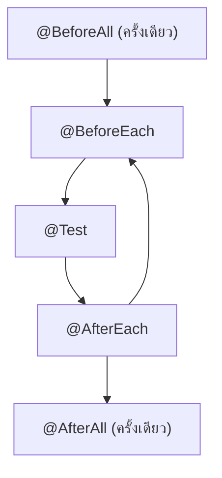

---
tags:
  - java
  - junit
  - testing
type: reference
created: 2026-09-20
---

# 🧪 JUnit 5 — พื้นฐานการเขียนเทสที่ framework อื่นต่อยอดจากตัวนี้

> **JUnit 5 แบ่งเป็น 3 ส่วน:** **Platform** (โครงพื้นฐานที่ให้ IDE/build tool เรียกใช้ได้, launcher), **Jupiter** (โมเดลเขียนเทสใหม่ — `@Test`, assertion, extension ที่โน้ตนี้พูดถึงเกือบทั้งหมด), **Vintage** (รันเทส JUnit 3/4 เก่าบน platform เดียวกัน ไม่ต้อง migrate รวดเดียวทั้งโปรเจกต์)
>
> โน้ตนี้ครอบเฉพาะ **JUnit 5 ล้วน ๆ แบบไม่ผูก framework** — ถ้าใช้ Quarkus ดู [[Quarkus Testing]] สำหรับ `@QuarkusTest`/REST Assured/`@InjectMock` ที่สร้างต่อยอดจากพื้นฐานในโน้ตนี้อีกที

---

## 1. Dependency

```xml
<dependency>
    <groupId>org.junit.jupiter</groupId>
    <artifactId>junit-jupiter</artifactId>
    <scope>test</scope>
</dependency>
```

`junit-jupiter` เป็น aggregator รวม `junit-jupiter-api` + `junit-jupiter-params` (parameterized test) + `junit-jupiter-engine` ไว้ในตัวเดียว — โปรเจกต์ Quarkus ได้ตัวนี้มาอัตโนมัติอยู่แล้วผ่าน `quarkus-junit5` (ดู [[Quarkus Testing]] ข้อ 2)

---

## 2. `@Test` และ lifecycle

```java
class OrderServiceTest {

    @BeforeAll
    static void setupAll() { }        // ← รันครั้งเดียวก่อนเทสทั้งคลาส ต้อง static

    @BeforeEach
    void setup() { }                  // ← รันก่อนทุกเทส

    @Test
    void createOrder_returnsPendingStatus() { }

    @AfterEach
    void tearDown() { }                // ← รันหลังทุกเทส

    @AfterAll
    static void tearDownAll() { }      // ← รันครั้งเดียวหลังเทสทั้งคลาส ต้อง static
}
```



**`@BeforeAll`/`@AfterAll` ต้องเป็น `static`** เพราะรันก่อน/หลัง instance ของคลาสเทสถูกสร้างเลย (ดูเหตุผลเต็มที่ข้อ 6 — เกี่ยวกับ instance lifecycle)

---

## 3. Assertion ที่ใช้บ่อย

```java
assertEquals(expected, actual);              // ⚠️ ลำดับ: ค่าที่ "ควรจะเป็น" มาก่อนเสมอ
assertTrue(condition);
assertNotNull(result);

assertThrows(
	IllegalArgumentException.class, () -> service.create(invalidRequest)
);

assertAll(                                    // รันทุกอันแม้บางอันจะ fail แล้วรายงานพร้อมกันทั้งหมด
    () -> assertEquals("P001", product.getCode()),
    () -> assertEquals(99.9, product.getPrice()),
    () -> assertNotNull(product.getId())
);

assertTimeout(Duration.ofMillis(100), () -> service.quickOperation());
```

**`assertAll`ต่างจากเขียน `assertEquals` แยกกันหลายบรรทัดตรงไหน:** ถ้าเขียนแยกบรรทัดแล้วบรรทัดแรก fail เทสจะหยุดทันที ไม่รู้เลยว่าบรรทัดที่ 2/3 ผ่านหรือไม่ — `assertAll` รวบรวม fail ทุกอันในกลุ่มมารายงานพร้อมกันทีเดียว เห็นภาพรวมว่า object ผิดกี่ field ในเทสเดียว

---

## 4. `@DisplayName` และ `@Nested` — จัดกลุ่มเทสแบบอ่านง่าย

```java
@DisplayName("ตะกร้าสินค้า")
class ShoppingCartTest {

    ShoppingCart cart = new ShoppingCart();

    @Nested
    @DisplayName("เมื่อตะกร้ายังว่าง")
    class WhenEmpty {

        @Test
        @DisplayName("ยอดรวมต้องเป็นศูนย์")
        void total_isZero() {
            assertEquals(0, cart.getTotal());
        }
    }

    @Nested
    @DisplayName("เมื่อมีสินค้าในตะกร้า")
    class WhenHasItems {

        @BeforeEach
        void addItem() {
            cart.add(new Item("P001", 100));
        }

        @Test
        @DisplayName("ยอดรวมต้องตรงกับราคาสินค้า")
        void total_matchesItemPrice() {
            assertEquals(100, cart.getTotal());
        }
    }
}
```

**`@Nested` จัดกลุ่มเทสตามบริบท/เงื่อนไข (สไตล์ given-when-then)** — แต่ละกลุ่มมี `@BeforeEach` ของตัวเองแยกจากกัน แต่ `@BeforeEach` ของคลาสแม่ยังรันก่อนเสมอ ผลลัพธ์ใน test report อ่านเป็นประโยคเดียวกันได้เลย ("ตะกร้าสินค้า > เมื่อมีสินค้าในตะกร้า > ยอดรวมต้องตรงกับราคาสินค้า")

**คลาส `@Nested` ต้องไม่ใส่ `static`** — ต้องเป็น non-static inner class เท่านั้น (ถึงจะเข้าถึง field ของคลาสแม่ได้และ JUnit จะรู้จักว่าเป็นกลุ่มเทสย่อย)

---

## 5. `@ParameterizedTest` — เทสเดียว หลาย input ไม่ต้อง copy-paste

```java
@ParameterizedTest
@ValueSource(strings = {"", " ", "   "})
void blank_isInvalid(String input) {
    assertFalse(validator.isValid(input));
}

@ParameterizedTest
@CsvSource({
    "1, 1, 2",
    "2, 3, 5",
    "10, -5, 5"
})
void add_returnsSum(int a, int b, int expected) {
    assertEquals(expected, calculator.add(a, b));
}

@ParameterizedTest
@MethodSource("provideUsers")
void validate_realCases(String email, boolean expected) {
    assertEquals(expected, validator.isValid(email));
}

static Stream<Arguments> provideUsers() {
    return Stream.of(
        Arguments.of("user@example.com", true),
        Arguments.of("invalid-email", false),
        Arguments.of("", false)
    );
}

@ParameterizedTest
@EnumSource(DayOfWeek.class)
void everyDay_hasNonNullName(DayOfWeek day) {
    assertNotNull(day.name());
}
```

| source | เหมาะกับ |
|---|---|
| `@ValueSource` | ค่าเดี่ยว ๆ (string/int/... อย่างเดียว) เช่นเทส input ว่าง/blank หลายแบบ |
| `@CsvSource` | หลาย argument ต่อเคส เขียน input+expected ในบรรทัดเดียวแบบ CSV |
| `@MethodSource` | เคสซับซ้อนกว่า string/number ธรรมดา (สร้าง object จริง, มาจาก logic) |
| `@EnumSource` | รันเทสเดียวกันกับทุกค่าใน enum |

**คุ้มที่สุดตอนเทส boundary value** (ค่าว่าง, ค่าติดลบ, ค่าขอบเขต) ที่ปกติต้อง copy `@Test` เดิมสิบรอบแล้วเปลี่ยนแค่ตัวเลข — เหลือเทสเดียวกับ dataset

---

## 6. Test instance lifecycle — `PER_METHOD` (default) vs `PER_CLASS`

```java
@TestInstance(TestInstance.Lifecycle.PER_CLASS)
class CounterTest {

    int counter = 0;      // ← แชร์ข้าม @Test ได้ในโหมดนี้ (ปกติทำไม่ได้)

    @BeforeAll             // ← ไม่ต้อง static แล้วในโหมด PER_CLASS
    void setup() { }
}
```

**ค่า default คือ `PER_METHOD`: JUnit สร้าง instance ใหม่ของคลาสเทสทุกครั้งก่อนรันแต่ละ `@Test`** — field ของคลาสเทสจึงไม่มีทางรั่วข้ามเทสได้เอง (นี่คือเหตุผลที่ `@BeforeAll`/`@AfterAll` ต้อง `static`: มันรันก่อน instance แรกจะถูกสร้างด้วยซ้ำ) การสลับเป็น `PER_CLASS` ใช้ instance เดียวรันทุกเทสในคลาส ทำให้ไม่ต้อง `static` แล้ว แต่ต้องระวังเรื่อง state รั่วข้ามเทสเอง

---

## 7. `@Disabled`

```java
@Disabled("รอ fix JIRA-1234 ก่อน — endpoint เปลี่ยน response format")
@Test
void flakyTest() { }
```

เทียบเท่า `@Ignore` ของ JUnit 4 — **ควรใส่เหตุผล/อ้างอิง ticket เสมอ** ไม่ใช่ปิดเงียบ ๆ แล้วลืมว่าทำไมปิดไว้ (กับดักเดียวกับเทสที่ถูก comment ทิ้งไว้ใน [[Quarkus Testing]] ข้อ 8)

---

## 8. ใช้กับ Mockito — `@ExtendWith(MockitoExtension.class)`

```java
@ExtendWith(MockitoExtension.class)
class OrderServiceTest {

    @Mock
    PaymentGateway paymentGateway;

    @InjectMocks
    OrderService orderService;

    @Test
    void checkout_callsPaymentGateway() {
        when(paymentGateway.charge(any())).thenReturn(true);

        orderService.checkout(new Order("O1", 100));

        verify(paymentGateway).charge(any());
    }
}
```

`@ExtendWith` คือ extension model ของ JUnit 5 (แทนที่ `@RunWith` ของ JUnit 4 ที่ **ใช้กับ JUnit 5 ไม่ได้เลย**) — `MockitoExtension` ทำให้ `@Mock`/`@Captor` ทำงานอัตโนมัติโดยไม่ต้องเรียก `MockitoAnnotations.openMocks(this)` เอง และเช็ค unnecessary stubbing ให้ด้วย

> **อย่าสับสนกับ `@InjectMock` (ตัว M ใหญ่ ไม่มี s) ของ Quarkus** — `@Mock`/`@InjectMocks` ในข้อนี้คือ Mockito ล้วน ๆ ไม่รู้จัก CDI เลย ต้องประกอบ object เองผ่าน constructor/`@InjectMocks` ส่วน `@InjectMock` ของ Quarkus แทนที่ CDI bean จริงในแอปที่กำลังรันอยู่ทั้งตัว ใช้ได้เฉพาะในบริบท `@QuarkusTest` เท่านั้น (ดู [[Quarkus Testing]] ข้อ 6)

---

## 9. เทียบกับ JUnit 4 แบบเร็ว ๆ

| JUnit 4 | JUnit 5 |
|---|---|
| `@Before` | `@BeforeEach` |
| `@After` | `@AfterEach` |
| `@BeforeClass` | `@BeforeAll` |
| `@AfterClass` | `@AfterAll` |
| `@Ignore` | `@Disabled` |
| `@RunWith(...)` | `@ExtendWith(...)` (ใช้พร้อมกันได้หลายตัว) |
| `@Test(expected = X.class)` | `assertThrows(X.class, () -> ...)` |
| `@Test(timeout = 100)` | `assertTimeout(Duration.ofMillis(100), () -> ...)` |
| ต้องเป็น `public` method/class | `private`/package-private ก็ได้ |
| jar เดียวรวมทุกอย่าง | แยก Platform/Jupiter/Vintage |

**Vintage module รันเทส JUnit 3/4 เก่าบน JUnit 5 platform เดียวกันได้** — โปรเจกต์ใหญ่ที่มีเทสเก่าเยอะไม่ต้อง migrate รวดเดียวทั้งหมด ค่อย ๆ ทยอยแปลงทีละไฟล์ได้

---

## กับดัก

- **`assertEquals(expected, actual)` สลับลำดับกัน** — error message ที่ได้ตอน fail จะอ่านตรงข้าม (`expected: <3> but was: <5>` ทั้งที่จริงค่าคาดหวังคือ 5) เสียเวลา debug ผิดทางเพราะเข้าใจผิดว่าโค้ดพัง ทั้งที่ตัวเลขคาดหวังในเทสเขียนผิดเอง
- **ลืมใส่ `static` ที่ `@BeforeAll`/`@AfterAll`** — compile error ทันที (ไม่ใช่ runtime) ยกเว้นเปิด `@TestInstance(PER_CLASS)` ไว้ (ข้อ 6)
- **ใส่ `static` ให้คลาส `@Nested`** — กลายเป็นแค่ inner class ธรรมดา JUnit ไม่รู้จักว่าเป็นกลุ่มเทสย่อยอีกต่อไป
- **ผสม `@RunWith(MockitoJUnitRunner.class)` (JUnit 4) เข้ากับเทส JUnit 5** — ใช้ด้วยกันไม่ได้ ต้องเปลี่ยนเป็น `@ExtendWith(MockitoExtension.class)` (ข้อ 8)
- **`@Disabled` ไม่ใส่เหตุผล/ไม่ผูก ticket** — เทสค้างปิดเงียบ ๆ ยาวจนลืมว่าทำไมปิดไว้ (ข้อ 7)
- **เปิด `PER_CLASS` แล้วมี mutable field ที่เทสหนึ่งแก้ค่าทิ้งไว้** — กระทบเทสถัดไปในคลาสเดียวกันเพราะใช้ instance เดียวกันจริง ๆ (ข้อ 6) ผลเทสเลยขึ้นกับลำดับรัน
- **`@ParameterizedTest` แล้วหา annotation ไม่เจอ** — ถ้า dependency ไม่ได้ใช้ aggregator `junit-jupiter` ต้องเพิ่ม `junit-jupiter-params` แยกเอง

---

## Cheat sheet

```java
@BeforeAll static void setupAll() { }
@BeforeEach void setup() { }
@Test void methodName_condition_expectedResult() { }
@AfterEach void tearDown() { }
@AfterAll static void tearDownAll() { }

assertEquals(expected, actual);
assertThrows(MyException.class, () -> service.doThing());
assertAll(() -> assertA(), () -> assertB());
assertTimeout(Duration.ofMillis(100), () -> fast());

@ParameterizedTest @ValueSource(strings = {"a", "b"})
@ParameterizedTest @CsvSource({"1,2,3"})
@ParameterizedTest @MethodSource("factoryMethodName")
@ParameterizedTest @EnumSource(MyEnum.class)

@Nested @DisplayName("...") class WhenX { }
@Disabled("เหตุผล + ticket")

@ExtendWith(MockitoExtension.class)
@Mock Dep dependency;
@InjectMocks Target target;
```

---

## 🔗 เกี่ยวข้อง

- [[Quarkus Testing]] — `@QuarkusTest`/REST Assured/`@InjectMock`/`@TestTransaction` ต่อยอดจากพื้นฐานในโน้ตนี้
- [[Java Exception]] — exception hierarchy ที่ `assertThrows` ใช้เช็ค type
- [[Java]] — หน้ารวม

## 📖 อ่านต่อ

- [JUnit 5 User Guide](https://docs.junit.org/current/user-guide/)
- [JUnit 5 — Assertions Javadoc](https://junit.org/junit5/docs/current/api/org.junit.jupiter.api/org/junit/jupiter/api/Assertions.html)
- [Baeldung — Migrating from JUnit 4 to JUnit 5](https://www.baeldung.com/junit-5-migration)
