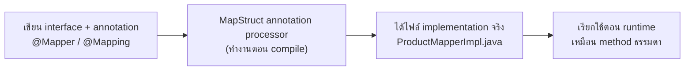

---
tags:
  - java
  - mapstruct
  - mapping
type: reference
created: 2026-09-17
---

# 🔄 MapStruct — map ระหว่าง DTO/Entity โดยไม่ต้องเขียน `set` เองทีละ field

> **ปัญหาที่มันแก้:** ทุกโปรเจกต์ที่แยกชั้น entity/DTO (ดู [[Java Record]] เรื่องแยกชั้นข้อมูล) ต้องมีโค้ดแปลงไปมา — `new ProductDto(entity.getId(), entity.getName(), ...)` ยาว ๆ ซ้ำ ๆ ทุกคลาส MapStruct generate โค้ดแปลงพวกนี้ให้อัตโนมัติตอน compile

---

## 1. ทำงานยังไง — ต่างจาก ModelMapper/Dozer ตรงไหน



**MapStruct generate โค้ด Java จริง ๆ ตอน compile** — ต่างจาก ModelMapper/Dozer ที่ใช้ reflection สแกน field ตอน **runtime**: เร็วกว่า (ไม่มี reflection overhead), **type-safe** (field ไม่ตรงกัน compile error ทันที ไม่ใช่พังตอนรันจริง), และ debug ง่าย (set breakpoint ในโค้ดที่ generate ได้ปกติ เพราะเป็น Java ธรรมดา อ่านได้)

---

## 2. ตัวอย่างพื้นฐาน

```java
public interface ProductMapper {
    ProductMapper INSTANCE = Mappers.getMapper(ProductMapper.class);

    ProductDto toDto(Product entity);
    Product toEntity(ProductDto dto);
}
```

field ชื่อ/ชนิดตรงกัน MapStruct จับคู่ให้อัตโนมัติทั้งหมด ไม่ต้องเขียนอะไรเพิ่ม — เรียกใช้:

```java
ProductDto dto = ProductMapper.INSTANCE.toDto(product);
```

---

## 3. field ชื่อไม่ตรงกัน / nested object

```java
public interface ProductMapper {
    @Mapping(source = "productName", target = "name")
    @Mapping(source = "category.name", target = "categoryName")   // ลงไปอ่าน nested object ได้เลย
    @Mapping(target = "internalNote", ignore = true)               // ไม่ map field นี้ ปล่อยเป็นค่า default
    ProductDto toDto(Product entity);
}
```

List/Collection ของ type เดียวกันก็ map ให้อัตโนมัติ — `List<Product>` → `List<ProductDto>` ไม่ต้องวนลูปเอง ถ้ามี `toDto(Product)` ประกาศไว้แล้ว MapStruct รู้เองว่าต้องใช้ตัวไหนแปลงแต่ละตัวในลิสต์

---

## 4. อัปเดต object เดิมแทนที่จะสร้างใหม่ — `@MappingTarget`

```java
public interface ProductMapper {
    void updateEntityFromDto(ProductDto dto, @MappingTarget Product entity);
}
```

ใช้ตอน pattern "PATCH" — โหลด entity เดิมจาก DB มาก่อน แล้วอัปเดตเฉพาะ field ที่ dto ส่งมา แทนที่จะสร้าง entity ใหม่ทั้งก้อน (เสี่ยงเขียนทับ field ที่ dto ไม่ได้ส่งมาด้วยค่า default)

---

## 5. ผูกกับ dependency injection — `componentModel`

```java
@Mapper(componentModel = "cdi")      // Quarkus/Jakarta EE — inject ผ่าน @Inject ได้เลย (ดู [[Angular Services and DI]] แนวคิดเดียวกันฝั่ง backend)
@Mapper(componentModel = "spring")   // Spring — inject ผ่าน @Autowired
@Mapper                               // default — ไม่ผูก DI framework ไหนเลย ต้องเรียก Mappers.getMapper() เอง
public interface ProductMapper { ... }
```

**ลืมตั้ง `componentModel` ให้ตรงกับ framework ที่ใช้ = inject ไม่ได้** (`NoSuchBeanDefinitionException`/`UnsatisfiedResolutionException`) เพราะ default ไม่ได้สร้างเป็น bean ให้ ต้องเรียก `Mappers.getMapper(...)` เอาเองแบบ static

---

## 6. ใช้คู่กับ Lombok — ต้องตั้ง annotation processor ให้ครบ

**MapStruct ต้อง "เห็น" getter/setter ของคลาสตอน compile ถึงจะ generate mapper ได้ถูก** — ถ้าคลาสนั้นใช้ [[Java Lombok]] สร้าง getter/setter (ซึ่งก็เพิ่งถูก generate ตอน compile เหมือนกัน) MapStruct กับ Lombok ต้องทำงานประสานกันถูกจังหวะ ไม่งั้น **compile error ทันที** (หา getter ไม่เจอ/`unmapped target property`) — ไม่ใช่บั๊กที่ซ่อนจนหลุดไป production

**ต้องเพิ่ม `lombok-mapstruct-binding` ให้ครบ 3 ตัวใน `annotationProcessorPaths`:**

```xml
<plugin>
  <groupId>org.apache.maven.plugins</groupId>
  <artifactId>maven-compiler-plugin</artifactId>
  <configuration>
    <annotationProcessorPaths>
      <path>
        <groupId>org.mapstruct</groupId>
        <artifactId>mapstruct-processor</artifactId>
        <version>${mapstruct.version}</version>
      </path>
      <path>
        <groupId>org.projectlombok</groupId>
        <artifactId>lombok</artifactId>
        <version>${lombok.version}</version>
      </path>
      <path>
        <groupId>org.projectlombok</groupId>
        <artifactId>lombok-mapstruct-binding</artifactId>
        <version>0.2.0</version>
      </path>
    </annotationProcessorPaths>
  </configuration>
</plugin>
```

**ขาด `lombok-mapstruct-binding` ไปตัวเดียว (โดยเฉพาะ Lombok 1.18.16 ขึ้นไป) = compile พังทันที** ไม่ใช่แค่ "ควรมี" แต่เป็นของบังคับสำหรับ Lombok เวอร์ชันปัจจุบันแทบทั้งหมด

---

## 7. กับดัก

- **ลืม `lombok-mapstruct-binding`** — compile error ทันทีเวลาใช้ Lombok + MapStruct คู่กัน (ข้อ 6)
- **field ชื่อไม่ตรงแล้วลืม `@Mapping`** — ได้แค่ warning ตอน compile ("unmapped target property") ไม่ fail build ให้เห็นชัด ๆ ถ้าอยากบังคับให้ error จริงตั้ง `@Mapper(unmappedTargetPolicy = ReportingPolicy.ERROR)`
- **ไปแก้ไฟล์ `XxxMapperImpl.java` ที่ generate ไว้ตรง ๆ** — อยู่ใน `target/generated-sources` (Maven) หรือ `build/generated` (Gradle) ถูกเขียนทับใหม่ทุกครั้งที่ build แก้ตรงนั้นไม่มีผลถาวร ต้องแก้ที่ interface + annotation ต้นทางเท่านั้น
- **ลืมตั้ง `componentModel` ให้ตรงกับ framework** — inject ไม่ได้ (ข้อ 5)
- **คาดหวังว่า MapStruct จะ validate business logic ให้ด้วย** — มันแค่ "ย้ายค่าจาก field หนึ่งไปอีก field หนึ่ง" เท่านั้น ไม่ตรวจว่าค่าถูกต้องหรือสมเหตุสมผล (นั่นเป็นหน้าที่ของ `Validators`/business logic layer แยกต่างหาก)

---

## 8. Cheat sheet

```java
@Mapper(componentModel = "cdi")   // หรือ "spring" / เว้นว่างไว้ถ้าไม่ใช้ DI
public interface ProductMapper {
    ProductDto toDto(Product entity);
    Product toEntity(ProductDto dto);

    @Mapping(source = "a", target = "b")
    @Mapping(target = "x", ignore = true)
    ProductDto toDtoCustom(Product entity);

    void updateEntityFromDto(ProductDto dto, @MappingTarget Product entity);
}
```

| อาการ | สาเหตุ |
|---|---|
| compile error ตอนใช้คู่กับ Lombok | ขาด `lombok-mapstruct-binding` ใน `annotationProcessorPaths` |
| field ไม่ถูก map แต่ build ผ่าน | ชื่อไม่ตรง + ไม่ได้ตั้ง `unmappedTargetPolicy = ERROR` ไว้เตือน |
| แก้ mapper แล้วไม่มีผล | ไปแก้ไฟล์ generate (`XxxMapperImpl.java`) แทนที่จะแก้ interface ต้นทาง |
| inject mapper ไม่ได้ | `componentModel` ไม่ตรงกับ framework ที่ใช้จริง |

## 🔗 เกี่ยวข้อง

- [[Java Lombok]] — ใช้คู่กันบ่อยมาก ต้องตั้ง annotation processor ให้ครบตามข้อ 6
- [[Java Record]] — MapStruct map เข้า/ออกจาก record ได้ปกติเหมือน class ทั่วไป
- [[Quarkus Project Structure]] — pattern แยกชั้น DTO/entity ที่ MapStruct เข้ามาช่วยลดโค้ดแปลงระหว่างชั้น

## 📖 อ่านต่อ

- [MapStruct — Reference Guide](https://mapstruct.org/documentation/stable/reference/html/)
- [Using MapStruct With Lombok — Baeldung](https://www.baeldung.com/java-mapstruct-lombok)
- [mapstruct-examples — mapstruct-lombok](https://github.com/mapstruct/mapstruct-examples/tree/main/mapstruct-lombok)
