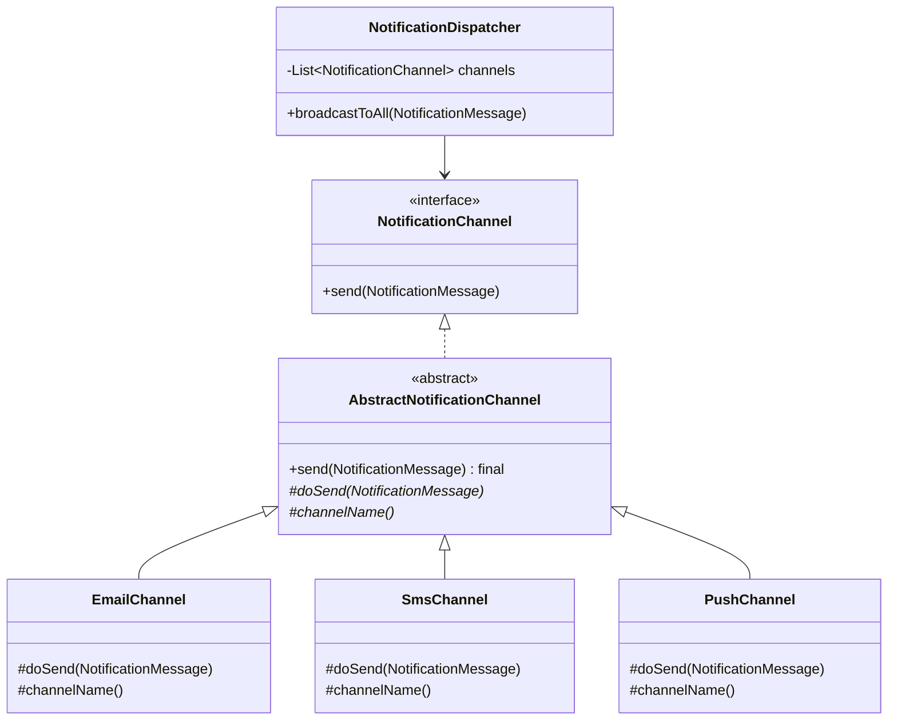
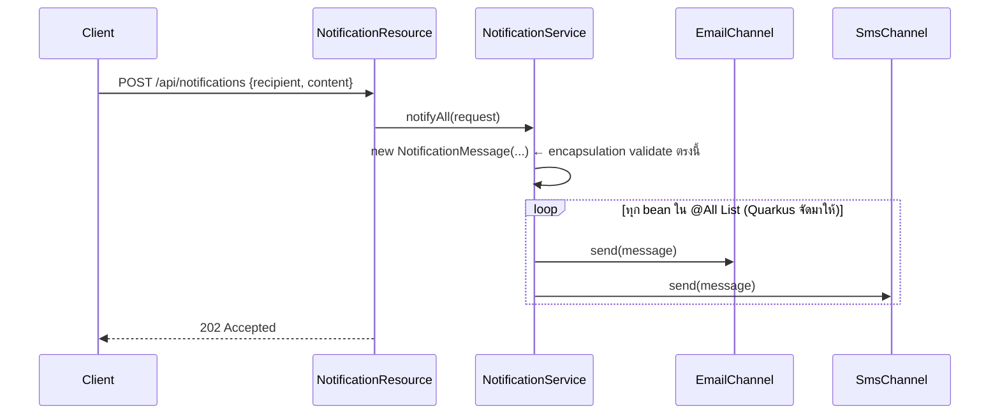

---
tags:
  - java
  - oop
type: reference
created: 2026-09-30
---

# 🧱 Java OOP — 4 เสาหลัก พร้อมตัวอย่างจริง

> **OOP ไม่ใช่แค่ทฤษฎีท่องจำตอบสัมภาษณ์** แต่ละเสาหลักมีไว้แก้ปัญหาจริงตอนโค้ดโตขึ้น — โน้ตนี้ใช้ domain เดียวกันต่อเนื่องทั้งโน้ต (**ระบบส่งการแจ้งเตือน** — Email/SMS/Push) ให้เห็นว่าแต่ละเสาหลักแก้ปัญหาอะไรจริงๆ ไม่ใช่แค่นิยาม โค้ดทุกชิ้น**คอมไพล์และรันผ่านจริงบน JDK 17**

| เสาหลัก | แก้ปัญหาอะไร |
|---|---|
| **Encapsulation** | กัน object เข้า state ที่ไม่ควรมีได้ |
| **Abstraction** | ซ่อน "ทำยังไง" ไว้หลัง "ทำอะไร" ผู้เรียกไม่ต้องรู้รายละเอียด |
| **Inheritance** | แชร์โค้ด/พฤติกรรมร่วมกันระหว่าง class ที่เป็น "ชนิดเดียวกัน" จริงๆ |
| **Polymorphism** | เรียกผ่าน type เดียว ได้พฤติกรรมต่างกันจริงตอน runtime |

---

## 1. Encapsulation — กัน object เข้า state ที่ไม่ควรมีได้

```java
final class NotificationMessage {
    private final String recipient;
    private final String content;

    NotificationMessage(String recipient, String content) {
        if (recipient == null || recipient.isBlank()) {
            throw new IllegalArgumentException("recipient ห้ามว่าง");
        }
        if (content == null || content.isBlank()) {
            throw new IllegalArgumentException("content ห้ามว่าง");
        }
        this.recipient = recipient;
        this.content = content;
    }

    String recipient() { return recipient; }
    String content() { return content; }
}
```

**ไม่มีทางสร้าง `NotificationMessage` ที่ recipient ว่างเปล่าได้เลย** — field เป็น `private final` ไม่มี setter ตรงไปตรงมา ทุก instance ที่มีอยู่การันตีว่าผ่าน validation ในตอน constructor มาแล้วเสมอ ไม่ต้องเช็คซ้ำทุกจุดที่ใช้งาน object นี้

```
❌ ถ้าเป็น public field ธรรมดา:
   message.recipient = "";           // compile ผ่าน แต่ตอน runtime พังที่อื่น
   ไม่รู้เลยว่า object ไหนถูกแก้จากที่ไหนบ้าง

✅ เป็น private + constructor validate:
   new NotificationMessage("", "x")  // throw ทันทีตรงจุดที่สร้าง ไม่ต้องรอไปพังทีหลัง
```

---

## 2. Abstraction — ซ่อน "ทำยังไง" ไว้หลัง "ทำอะไร"

```java
interface NotificationChannel {
    void send(NotificationMessage message);
}
```

โค้ดฝั่งที่**เรียกใช้** (`NotificationDispatcher` ข้อ 4) ไม่ต้องรู้เลยว่าข้างหลัง `send()` เป็น SMTP, SMS gateway, หรือ FCM — รู้แค่ "เรียก `send()` แล้วข้อความจะถูกส่งไป" ส่วน "ต่อ SMTP ยังไง", "ยิง API ของ SMS provider ตัวไหน" ถูกซ่อนไว้หลัง interface หมด

### Interface vs Abstract class — ใช้ผิดกันบ่อย

| | Interface | Abstract class |
|---|---|---|
| implement/extends ได้กี่ตัว | หลายตัว (`implements A, B, C`) | ตัวเดียว (Java single inheritance) |
| เก็บ state (field ที่ไม่ใช่ constant) ได้ไหม | ไม่ได้ | ได้ |
| มี default implementation ได้ไหม | ได้ (`default`/`static` method, Java 8+) | ได้ |
| ใช้เมื่อ | นิยาม "ทำอะไรได้" (capability/contract) ข้ามหลาย hierarchy ที่ไม่เกี่ยวข้องกัน | แชร์โค้ด/state ร่วมกันจริงในกลุ่ม class ที่เป็น "ชนิดเดียวกัน" |

**กับดัก:** Java 8 เพิ่ม `default` method ให้ interface แล้วหลายคนเข้าใจผิดว่า "interface = abstract class ไปแล้ว" — ยังต่างกันตรง interface เก็บ state ไม่ได้ และ class หนึ่ง implement ได้หลาย interface แต่ extends ได้ class เดียว

---

## 3. Inheritance — แชร์พฤติกรรมร่วมกันระหว่าง class

```java
abstract class AbstractNotificationChannel implements NotificationChannel {

    private static final Logger LOG = Logger.getLogger(AbstractNotificationChannel.class.getName());

    @Override
    public final void send(NotificationMessage message) {
        try {
            doSend(message);
            LOG.info(() -> "ส่งสำเร็จผ่าน " + channelName() + " ถึง " + message.recipient());
        } catch (Exception e) {
            LOG.severe(() -> "ส่งไม่สำเร็จผ่าน " + channelName() + ": " + e.getMessage());
            throw new NotificationException(channelName() + " ส่งไม่สำเร็จ", e);
        }
    }

    protected abstract void doSend(NotificationMessage message);
    protected abstract String channelName();
}
```

```java
class EmailChannel extends AbstractNotificationChannel {
    @Override
    protected void doSend(NotificationMessage message) {
        System.out.println("  [SMTP] เชื่อมต่อ mail server แล้วส่งถึง " + message.recipient());
    }
    @Override
    protected String channelName() { return "Email"; }
}

class SmsChannel extends AbstractNotificationChannel {
    @Override
    protected void doSend(NotificationMessage message) {
        System.out.println("  [SMS Gateway] ส่ง SMS ถึง " + message.recipient());
    }
    @Override
    protected String channelName() { return "SMS"; }
}
```

**logic การ log/wrap-exception เขียนครั้งเดียวใน `AbstractNotificationChannel`** แต่ละ channel implement แค่ส่วนที่ต่างจริงๆ (`doSend`, `channelName`) — `send()` เป็น `final` กันไม่ให้ subclass override แล้วลืม log/error-handling ไปเฉยๆ (แพทเทิร์นนี้เรียกว่า **Template Method** — ยังไม่มีโน้ตแยกในวอลต์นี้)

### ⚠️ กับดักของ inheritance — ใช้เพราะ "อยากแชร์โค้ด" ทั้งที่ไม่ใช่ IS-A จริง

ถ้าวันหนึ่งอยากได้ channel ที่ retry คนละแบบจาก `AbstractNotificationChannel` เดิม (เช่น SMS ต้อง retry 3 ครั้งห่างกัน 5 วิ แต่ Email retry ครั้งเดียว) จะลำบากทันที เพราะ logic ถูก "ล็อก" ไว้ใน parent class ตัวเดียว — นี่คือเหตุผลที่ **Joshua Bloch (Effective Java, Item 18)** แนะนำ **"favor composition over inheritance"**: extends ข้าม package จาก concrete class ที่ไม่ได้ออกแบบมาให้ extend อันตรายกว่าที่คิด เพราะ subclass ผูกติดกับรายละเอียดภายในของ parent — **inheritance ทำลาย encapsulation ได้เองถ้าใช้ไม่ระวัง** (parent เปลี่ยน implementation นิดเดียว subclass ทั้งหมดพังตาม) ทางแก้คือฉีด behavior เข้าไปแทนสืบทอด — ดู [[Strategy Pattern]]

---

## 4. Polymorphism — เรียกผ่าน type เดียว ได้พฤติกรรมต่างกันจริง

```java
class NotificationDispatcher {
    private final List<NotificationChannel> channels;

    NotificationDispatcher(List<NotificationChannel> channels) {
        this.channels = channels;
    }

    void broadcastToAll(NotificationMessage message) {
        for (NotificationChannel channel : channels) {
            channel.send(message);   // ← runtime ตัดสินว่าเรียก EmailChannel หรือ SmsChannel จริง
        }
    }
}
```

```java
var dispatcher = new NotificationDispatcher(List.of(
    new EmailChannel(),
    new SmsChannel(),
    new PushChannel()
));
dispatcher.broadcastToAll(new NotificationMessage("081-234-5678", "มี order ใหม่"));
```

```
[SMTP] เชื่อมต่อ mail server แล้วส่งถึง 081-234-5678
INFO: ส่งสำเร็จผ่าน Email ถึง 081-234-5678
[SMS Gateway] ส่ง SMS ถึง 081-234-5678
INFO: ส่งสำเร็จผ่าน SMS ถึง 081-234-5678
[FCM] ส่ง push notification ถึง 081-234-5678
INFO: ส่งสำเร็จผ่าน Push ถึง 081-234-5678
```

**`NotificationDispatcher` ไม่รู้จัก `EmailChannel`/`SmsChannel`/`PushChannel` เลยสักตัว** — รู้จักแค่ `NotificationChannel` ตัวเดียว เพิ่ม channel ใหม่ (เช่น `LineChannel`) ได้โดย**ไม่ต้องแก้ `NotificationDispatcher` เลยสักบรรทัด** — นี่คือ **Open/Closed Principle** (เปิดให้ขยาย ปิดไม่ให้แก้ของเดิม หนึ่งใน SOLID ที่ยังไม่มีโน้ตแยกในวอลต์นี้) ทำงานได้จริงเพราะ polymorphism ล้วนๆ



**จุดสำคัญของ diagram นี้:** `NotificationDispatcher` ลูกศรชี้ไปแค่ `NotificationChannel` (interface) เส้นเดียว ไม่มีเส้นไปหา `EmailChannel`/`SmsChannel`/`PushChannel` เลย — ตรงนี้คือ abstraction กับ polymorphism ทำงานร่วมกัน: ผู้เรียกผูกกับ**สัญญา** ไม่ผูกกับ**ของจริง**

---

## 5. เอาไปใช้จริงใน REST API (Quarkus) — 4 เสาหลักไม่ใช่แค่ตัวอย่างในหนังสือ

`NotificationDispatcher` ในข้อ 4 คือของเล่นจำลอง — ของจริงใน Quarkus **framework ทำหน้าที่นั้นให้เองผ่าน CDI** ใช้ domain เดิมทุกอย่าง (`NotificationChannel`, `AbstractNotificationChannel`, `NotificationMessage` จากข้อ 1-3 ไม่ต้องแก้เลย) เพิ่มแค่ชั้น API บางๆ ทับเข้าไป:

```java
// 1) DTO ชั้น API — ไม่ใช่ domain object (แยกชั้นตามกฎข้อ 2 ของ [[Java]])
record SendNotificationRequest(String recipient, String content) {}
```

```java
// 2) แต่ละ channel กลายเป็น CDI bean จริง (ทำไมต้องมี @ApplicationScoped ดู [[Quarkus Bean]])
@ApplicationScoped
class EmailChannel extends AbstractNotificationChannel { /* เหมือนข้อ 3 เดิม */ }

@ApplicationScoped
class SmsChannel extends AbstractNotificationChannel { /* เหมือนข้อ 3 เดิม */ }
```

```java
// 3) service ขอ "ทุก bean ที่ implement NotificationChannel" จาก Quarkus ตรงๆ
import io.quarkus.arc.All;

@ApplicationScoped
class NotificationService {

    @Inject
    @All
    List<NotificationChannel> channels;   // ← Quarkus ยัด bean ทุกตัวที่ implement interface นี้ให้เอง

    void notifyAll(SendNotificationRequest request) {
        var message = new NotificationMessage(request.recipient(), request.content());
        for (NotificationChannel channel : channels) {
            channel.send(message);
        }
    }
}
```

```java
@Path("/api/notifications")
public class NotificationResource {

    @Inject NotificationService service;

    @POST
    public Response send(SendNotificationRequest request) {
        service.notifyAll(request);
        return Response.accepted().build();
    }
}
```

```bash
curl -X POST http://localhost:8080/api/notifications \
  -H "Content-Type: application/json" \
  -d '{"recipient": "081-234-5678", "content": "มี order ใหม่"}'
```



**จุดที่ควรเห็นภาพชัดที่สุด:** `NotificationResource` และ `NotificationService` **ไม่เคย import `EmailChannel`/`SmsChannel` เลยสักตัว** — เพิ่ม `PushChannel` ใหม่พร้อม `@ApplicationScoped` เท่านั้น Quarkus จะเห็นแล้วยัดเข้า `@All List` ให้เองตอน startup **ไม่ต้องแก้โค้ดใน service หรือ resource เลยสักบรรทัด** — Open/Closed Principle (ข้อ 4) ที่ดูเป็นทฤษฎีในหนังสือ กลายเป็นกลไกจริงที่ framework ใช้ทำงานทุกวัน

`@All` (`io.quarkus.arc.All`) เป็นฟีเจอร์เฉพาะของ Quarkus ArC ไม่ใช่ CDI มาตรฐาน — ฝั่ง CDI มาตรฐานทำแบบเดียวกันได้ด้วย `@Inject Instance<NotificationChannel> channels;` แล้ว loop เอง (`Instance<T>` เป็น `Iterable`) แต่ `@All` เขียนสั้นกว่าและได้ `List` ตรงๆ

---

## 🎯 แนวทางการเริ่มศึกษา

1. **เริ่มต้น** — เข้าใจ encapsulation กับ abstraction ก่อน (ปิดรายละเอียดข้างใน + เปิดสัญญาให้เรียกใช้) เพราะเป็นฐานที่ inheritance/polymorphism ต่อยอดมาอีกที
2. **ลงมือทำจริง** — เขียนตัวอย่างในโน้ตนี้เอง แล้วลองเพิ่ม `LineChannel` ใหม่เอง ดูว่า `NotificationDispatcher` ไม่ต้องแก้จริงไหม — เห็น Open/Closed Principle ทำงานด้วยตาตัวเองครั้งเดียวจำได้แม่นกว่าอ่านนิยาม
3. **ใช้งานได้คล่อง** — รู้ว่าเมื่อไหร่ inheritance ไม่ใช่คำตอบที่ดีที่สุด (ข้อ 3), แยก interface vs abstract class ให้ถูก (ข้อ 2), เห็นว่า framework จริง (Quarkus CDI) ใช้ abstraction/polymorphism ตรงๆ ยังไง (ข้อ 5), แล้วต่อยอดไปดู design pattern จริงที่วอลต์มี ([[Strategy Pattern]]/[[Observer Pattern]]) ว่าเป็นการประยุกต์ 4 เสาหลักนี้ในสถานการณ์เฉพาะยังไง

---

## กับดัก

- **ใส่ getter/setter ให้ทุก field อัตโนมัติโดยไม่คิด** (มือหรือ Lombok `@Data`) — ทำลาย encapsulation ทั้งที่ตั้งใจป้องกัน เปิดทางให้ใครก็แก้ state ได้ตรงๆ ข้าม validation ทั้งหมด (ดู [[Java Lombok]])
- **ใช้ inheritance เพราะ "อยากแชร์โค้ด" ทั้งที่ความสัมพันธ์จริงไม่ใช่ IS-A** เช่น `SmsChannel extends EmailChannel` เพราะขี้เกียจ copy code ทั้งที่ SMS ไม่ใช่ "ชนิดหนึ่งของ" Email เลย — composition/interface ดีกว่าเสมอถ้าไม่ใช่ IS-A จริง (ข้อ 3)
- **Deep inheritance hierarchy (3-4 ชั้นขึ้นไป)** — debug ยากมากว่า behavior จริงมาจากชั้นไหน "favor composition over inheritance" (Effective Java Item 18) คือคำแนะนำมาตรฐานตรงนี้
- **ลืมว่า Java เป็น single inheritance** — `extends` ได้ทีเดียว แต่ `implements` ได้หลาย interface สับสนตอนออกแบบ hierarchy ที่ต้องแชร์พฤติกรรมจากหลายที่
- **override `equals()`/`hashCode()` ไม่ครบคู่** — ยังไม่มีโน้ตแยกในวอลต์นี้ (ดู [[Java]] แผนที่ความรู้ที่ยังไม่ได้เขียน) แต่เป็นกับดักคลาสสิกที่กระทบ `HashMap`/`HashSet` โดยตรง
- **`@All` เรียงลำดับ `List` ตาม `@Priority` เลข**มาก**ไปน้อย** (priority สูงสุดอยู่หัว list) — **ทิศทางตรงข้ามกับ CDI interceptor** ที่เลขน้อยทำงานก่อน ([[Quarkus Interceptor]] ข้อ 3) ใช้ `@All` กับ interceptor พร้อมกันแล้วจำทิศทางสลับกัน ลำดับจะผิดที่คาดไว้ทันที

---

## Cheat sheet

```java
// Encapsulation — private field + constructor validation, ไม่มี naked setter
// Abstraction    — interface/abstract class นิยาม "ทำอะไร" ซ่อน "ทำยังไง"
// Inheritance    — extends แชร์โค้ด/state (single เท่านั้นใน Java, ระวัง IS-A ปลอม)
// Polymorphism   — เรียกผ่าน parent type ได้ behavior ของ child จริงตอน runtime
```

| อาการ | สาเหตุ |
|---|---|
| แก้ field แล้ว object เข้า state ที่ไม่ควรมีได้ | ไม่มี encapsulation — เปิด setter/field ตรงๆ ไม่ validate |
| เพิ่ม class ใหม่ต้องแก้โค้ดเดิมหลายที่ | ไม่ได้เขียนผ่าน interface/abstraction — โค้ดผูกกับ concrete class ตรงๆ |
| แก้ parent class แล้ว subclass พังหลายตัวไม่คาดคิด | inheritance hierarchy ลึกเกินไป หรือใช้ inheritance ทั้งที่ไม่ใช่ IS-A จริง |
| compile ไม่ผ่านตอนพยายาม `extends` 2 class | Java single inheritance — ใช้ `implements` หลาย interface แทน |

---

## 🔗 เกี่ยวข้อง

- [[Design Patterns]] — Strategy/Observer/Singleton คือการประยุกต์ 4 เสาหลักนี้ในสถานการณ์เฉพาะ
- [[Strategy Pattern]] — ทางเลือกแทน inheritance ตอนอยากสลับ behavior โดยไม่ผูก IS-A
- [[Java Lombok]] — `@Data` auto-gen getter/setter ทุกตัว ระวังทำลาย encapsulation ถ้าใช้ไม่คิด
- [[Quarkus Bean]] — interface + polymorphism คือกลไกที่ CDI ใช้เลือก concrete implementation ตอน inject จริง
- [[Background Job Processor (Quarkus)]] — โปรเจกต์จริงที่ใช้แนวคิด notification channel แบบเดียวกับโน้ตนี้
- [[Java]] — หน้ารวม

## 📖 อ่านต่อ

- [Oracle Java Tutorials — Object-Oriented Programming Concepts](https://docs.oracle.com/javase/tutorial/java/concepts/)
- Joshua Bloch — *Effective Java* (3rd Edition), Item 18: Favor composition over inheritance
