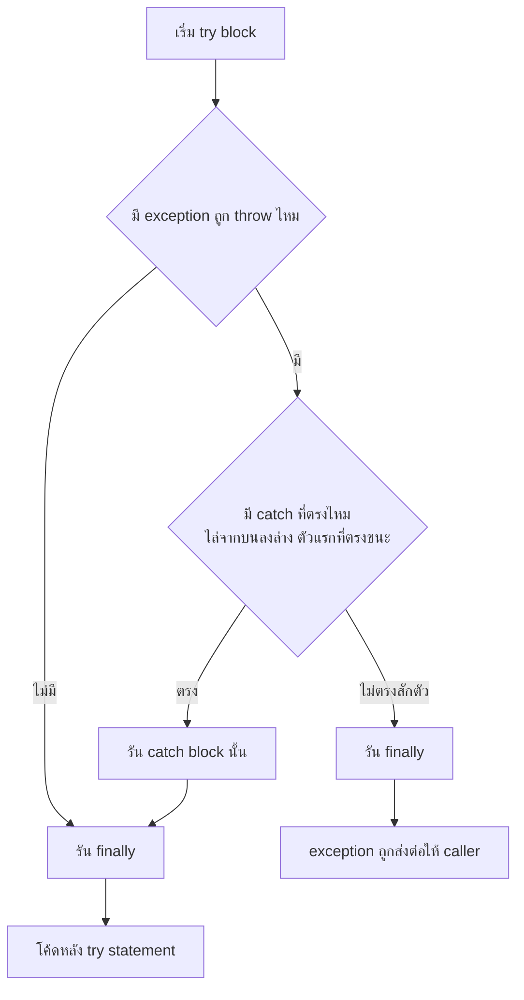

---
tags:
  - java
  - exception
  - try-catch
  - error-handling
type: reference
created: 2026-09-25
---

# 🎣 Java try / catch / finally — กลไกจริงและกับดัก

> โน้ตนี้เจาะ **กลไกของ `try`/`catch`/`finally`** — ลำดับการทำงาน, catch จับตัวไหนก่อน, `finally` ไม่ได้รันเสมอไป, try-with-resources ทำงานยังไงข้างใน, rethrow, `InterruptedException`
> ส่วนภาพรวม `Throwable` hierarchy, checked vs unchecked, และการออกแบบ exception เอง อยู่ที่ [[Java Exception]] — โน้ตนี้ต่อจากตรงนั้น

---

## 1. ลำดับการทำงาน

```java
static void demo(String input) {
    try {
        System.out.println("1. try เริ่ม");
        int n = Integer.parseInt(input);  // NumberFormatException ถ้าไม่ใช่ตัวเลข
        System.out.println("2. parse ได้ " + n);
    } catch (NumberFormatException e) {
        System.out.println("3. catch: " + e.getMessage());
    } finally {
        System.out.println("4. finally");
    }
    System.out.println("5. โค้ดหลัง try");
}
```

```
demo("42")   →  1, 2, 4, 5
demo("abc")  →  1, 3, 4, 5  (ข้ามบรรทัด 2 — throw หยุด try ทันที ไม่รันโค้ดที่เหลือใน try)
```



| สถานการณ์ | ผลที่เกิดขึ้น |
|---|---|
| ไม่มี exception | `try` จบปกติ → ข้าม `catch` → รัน `finally` → ไปต่อ |
| exception ตรงกับ `catch` | หยุด `try` ตรงจุดที่ throw → `catch` ตัวแรกที่ตรง → `finally` → ไปต่อ |
| exception **ไม่ตรง** `catch` ใดเลย | `finally` รัน → exception ถูกส่งต่อให้ caller |
| exception เกิด**ใน `catch` block เอง** | `finally` รัน → exception ใหม่ถูกส่งต่อ (exception เดิมหายถ้าไม่ chain) — **ไม่ถูก `catch` ตัวถัดไปของ `try` เดียวกันจับ** |
| `return` ใน `try` | ค่าที่ return ถูกคำนวณเก็บไว้ก่อน → `finally` รัน → ค่านั้นถูกส่งออกไปจริง |
| `finally` เกิด exception / `return` | **แทนที่ทุกอย่าง**จาก `try`/`catch` (ดู [[Java Exception]] ข้อ 3) |

**`try` ต้องมี `catch` หรือ `finally` อย่างน้อยหนึ่งอย่าง** (ยกเว้น try-with-resources ที่ไม่ต้องมีทั้งคู่ก็ได้)

---

## 2. catch — จับตัวไหนก่อน

### 2.1 ไล่จากบนลงล่าง ตัวแรกที่ "ตรง" ชนะ และ subclass ตรงกับ catch ของ superclass

```java
try {
    new FileReader("x.txt");                    // throws FileNotFoundException
} catch (IOException e) {                       // FileNotFoundException เป็น subclass → ถูกจับที่นี่
    ...
} catch (FileNotFoundException e) {             // ❌ compile error: exception FileNotFoundException has already been caught
    ...
}
```

**เรียงจากเฉพาะเจาะจง → กว้าง เสมอ** — ถ้าเอา superclass ขึ้นก่อน catch ของ subclass จะไม่มีวันถูกเรียก ซึ่งคอมไพเลอร์ตรวจให้และไม่ยอม compile

```java
} catch (FileNotFoundException e) {             // ✅ เฉพาะเจาะจงก่อน
    ...
} catch (IOException e) {                       // ✅ กว้างทีหลัง
    ...
}
```

### 2.2 Multi-catch — จับหลายตัวด้วยการจัดการเดียวกัน

```java
catch (IOException | SQLException e) { ... }            // ✅ สองตัวไม่เกี่ยวกัน
catch (IOException | FileNotFoundException e) { ... }   // ❌ compile error — FileNotFoundException เป็น subclass ของ IOException
```

- **alternative ห้ามสืบทอดกัน** — ตัวที่เป็น subclass ซ้ำซ้อนอยู่แล้ว คอมไพเลอร์ถือว่าเป็นความผิดพลาด
- **catch parameter เป็น `final` โดยปริยาย** — `e = null;` ใน multi-catch คอมไพล์ไม่ผ่าน
- type ของ `e` คือ union — เรียกได้เฉพาะ method ที่ supertype ร่วมกันมี

### 2.3 ⚠️ Java 22+: ตัวแปรที่ไม่ได้ใช้ ใช้ `_` ได้

```java
try {
    parse(input);
} catch (NumberFormatException _) {          // ✅ Java 22+ (JEP 456) — ไม่ใช้ตัว exception เลย
    return defaultValue;
}
```

**ใช้ไม่ได้บน Java 17** (เวอร์ชันอ้างอิงของวอลต์นี้) และบน **Java 21 ก็ยังเป็น preview** ต้องเปิด `--enable-preview` (เช็คด้วย javac จริงแล้ว: ไม่เปิดจะได้ error `unnamed variables are a preview feature`) — เป็นฟีเจอร์เต็มตั้งแต่ 22 ก่อนหน้านั้นต้องตั้งชื่อ `e` ไปตามเดิม ดู [[Java Updates]]

---

## 3. finally — ไม่ได้ "รันเสมอ" จริง ๆ

### 3.1 ค่าที่ return ถูกเก็บไว้ก่อน finally รัน

```java
static int a() {
    int x = 1;
    try { return x; }
    finally { x = 2; }              // แก้ตัวแปรหลังจากค่าถูกเก็บไปแล้ว → ไม่มีผล
}
// a() → 1

static StringBuilder b() {
    StringBuilder sb = new StringBuilder("A");
    try { return sb; }
    finally { sb.append("B"); }     // แก้ "ตัว object" ที่ reference ชี้อยู่ → มีผล
}
// b() → "AB"
```

primitive ถูกคัดลอกค่าไปแล้ว `finally` แก้ตัวแปรทีหลังไม่กระทบ แต่ถ้า return **reference** ของ object แล้ว `finally` แก้ตัว object นั้น การเปลี่ยนแปลงจะเห็นผลที่ caller

### 3.2 กรณีที่ `finally` ไม่รัน

```java
try {
    System.out.println("try");
    System.exit(0);                          // ← JVM ปิดตรงนี้
} finally {
    System.out.println("finally");           // ❌ ไม่ถูกพิมพ์
}
```

| กรณี | ทำไม |
|---|---|
| `System.exit()` | `Runtime.exit()` เริ่ม shutdown sequence (รัน shutdown hook) แล้ว**ไม่ return กลับมา** — stack ของ thread ที่เรียกไม่ถูก unwind เลยไม่เจอ `finally` |
| `Runtime.halt()` | ยิ่งแรงกว่า — ปิด JVM ทันที **ข้าม shutdown hook ด้วย** |
| `try` วนไม่จบ / block รอตลอดไป | ไม่มีวันไปถึง `finally` |
| JVM crash, ไฟดับ, `kill -9` | process ตายก่อนมีโอกาสรันอะไร |

**อย่าพึ่ง `finally` เป็นกลไกเดียวที่ทำให้ข้อมูลไม่เสียหาย** — เช่นเขียนไฟล์ครึ่งทางแล้วหวังว่า `finally` จะลบ/ปิดให้เสมอ ถ้าจำเป็นต้องล้างตอน JVM ปิดจริง ๆ ใช้ shutdown hook (`Runtime.addShutdownHook`) เสริม และออกแบบให้ข้อมูลเสียหายกลางทางได้ไม่พัง (เช่นเขียนไฟล์ชั่วคราวแล้ว rename, ใช้ transaction)

---

## 4. try-with-resources — ลึกกว่าแค่ "ปิดให้อัตโนมัติ"

### 4.1 ทำไมมันถึงถูกสร้างขึ้นมา — suppressed exception

```java
class Res implements AutoCloseable {
    public void close() throws Exception { throw new Exception("close failed"); }
}
```

**แบบ try-finally เดิม — exception จริงหาย:**

```java
try {
    Res r = new Res();
    try {
        throw new RuntimeException("body failed");
    } finally {
        r.close();                       // throw → แทนที่ exception จาก try
    }
} catch (Exception e) {
    System.out.println(e.getMessage());  // close failed   ← "body failed" หายไปเลย
}
```

**แบบ try-with-resources — เก็บทั้งสองตัว:**

```java
try (Res r = new Res()) {
    throw new RuntimeException("body failed");
} catch (Exception e) {
    System.out.println(e.getMessage());                      // body failed
    System.out.println(e.getSuppressed()[0].getMessage());   // close failed
}
```

**exception จาก body คือตัวหลัก ส่วน exception จาก `close()` ถูกเก็บเป็น *suppressed*** (`getSuppressed()`) ไม่ทับกัน — นี่คือเหตุผลหลักที่ Java 7 สร้างกลไกนี้ ไม่ใช่แค่ "ประหยัดการเขียน `finally`" ตามกฎของภาษา exception จาก `close()` ถูก suppress **ก็ต่อเมื่อ**ตัว `try` block เองก็ throw อยู่แล้วเท่านั้น

ถ้า body จบปกติแต่ `close()` throw → exception จาก `close()` ถูกโยนออกมาตรง ๆ (ถ้ามีหลาย resource ตัวแรกที่ throw เป็นตัวหลัก ตัวถัดไปเป็น suppressed)

### 4.2 ลำดับปิด และกรณี resource ตัวที่สองสร้างไม่สำเร็จ

```java
try (A a = new A(); B b = new B()) {     // ถ้า new B() throw → a ที่เปิดไปแล้วยังถูกปิดให้
    ...
}                                        // ปิดเรียงย้อนกลับ: b ก่อน แล้วค่อย a
```

resource ที่เปิดสำเร็จไปแล้วจะถูกปิดเสมอแม้ตัวถัดไปสร้างไม่สำเร็จ — จุดที่เขียน `finally` เองมักพลาด (ดูกับดักใน [[Java Exception]])

### 4.3 Java 9+ — ใช้ตัวแปรที่มีอยู่แล้วได้

```java
Res r = new Res();
try (r) {                                // ✅ Java 9+ — ตัวแปรต้อง final หรือ effectively final
    ...
}
```

ใช้ได้บน Java 17

### 4.4 `AutoCloseable` vs `Closeable` — เรื่อง idempotent

| | `close()` โยนอะไร | ต้อง idempotent ไหม |
|---|---|---|
| `Closeable` | `IOException` | ✅ **ต้อง** — เรียกซ้ำต้องไม่มีผล |
| `AutoCloseable` | `Exception` | ❌ ไม่บังคับ แต่ Javadoc "สนับสนุนอย่างยิ่ง" ให้ทำ |

เขียน resource เองแล้วเรียก `close()` ซ้ำได้ (เช่นถูกปิดจากสองที่) ควรทำให้ [[Idempotency|idempotent]] — และ **`close()` ไม่ควร throw `InterruptedException`** (Javadoc เตือน เพราะถูก suppress แล้วทำให้ interrupt status พังโดยไม่รู้ตัว ดูข้อ 6)

---

## 5. Rethrow

### 5.1 `throw e` ไม่ทำให้ stack trace เดิมหาย

Java บันทึก stack trace ตอน**สร้าง** exception object ไม่ใช่ตอน `throw` — rethrow ตัวเดิมแล้ว trace ยังชี้ไปที่จุดที่เกิดจริงเหมือนเดิม

### 5.2 ห่อแล้ว throw ใหม่ — ต้องส่ง `cause`

```java
catch (SQLException e) {
    throw new RepositoryException("failed to save order", e);   // ✅ ส่ง e เป็น cause
}
```

รายละเอียดว่าทำไมต้องส่ง `cause` ดู [[Java Exception]] ข้อ 6.2

### 5.3 Precise rethrow (Java 7) — catch กว้าง แต่ประกาศ throws แคบได้

```java
void process() throws FirstException, SecondException {   // ประกาศแค่ตัวที่ try โยนได้จริง
    try {
        doWork();                        // throws FirstException, SecondException
    } catch (Exception e) {              // catch กว้าง (เพื่อ log)
        log.error("failed", e);
        throw e;                         // ✅ compile ผ่าน — คอมไพเลอร์รู้ว่า e เป็นได้แค่สองตัวนั้น
    }
}
```

**เงื่อนไข: ห้าม assign ค่าใหม่ให้ `e` ใน catch block** — ถ้า assign การวิเคราะห์นี้ปิดทันที ต้องประกาศ `throws Exception` แทน (ก่อน Java 7 ทำแบบนี้ไม่ได้เลย)

### 5.4 ⚠️ แนวปฏิบัติ: อย่า log แล้ว throw ต่อทุกชั้น

```java
catch (SQLException e) {
    log.error("db error", e);            // log ตรงนี้
    throw new ServiceException("...", e); // แล้ว throw ต่อ → ชั้นบนก็ log อีก → stack trace เดียวกันโผล่ซ้ำหลายรอบ
}
```

**handle หรือ propagate — เลือกอย่างใดอย่างหนึ่งต่อชั้น** ปล่อย exception ขึ้นไปแล้ว log ครั้งเดียวที่จุดที่ตัดสินใจจัดการจริง ๆ (ขอบระบบ เช่น global handler — ดู [[Quarkus Exception Mapper]])

---

## 6. `InterruptedException` — catch แล้วเงียบไม่ได้

`Thread.sleep()`, `Object.wait()`, `BlockingQueue.take()`, `Future.get()` ฯลฯ โยน `InterruptedException` (checked) เมื่อ thread ถูกสั่ง interrupt — และ**ตอนที่ exception นี้ถูกโยน JVM ล้าง interrupt flag ทิ้งให้แล้ว**

```java
// ❌ กลืนเงียบ — สัญญาณ "ให้หยุด" หายไป thread ไม่รู้ตัวว่าถูกสั่งเลิก
try {
    Thread.sleep(1000);
} catch (InterruptedException e) {
    // ว่างเปล่า
}
```

```java
// ✅ ทางเลือก 1: ปล่อยขึ้นไป
void run() throws InterruptedException {
    Thread.sleep(1000);
}

// ✅ ทางเลือก 2: คืน flag แล้วเลิกทำงาน
try {
    Thread.sleep(1000);
} catch (InterruptedException e) {
    Thread.currentThread().interrupt();  // คืน flag ให้โค้ดชั้นบน/loop เห็น
    return;                              // แล้วเลิกทำงานต่อ
}
```

**นี่คือกลไกที่ใช้สั่งหยุด thread อย่างสุภาพ** — worker loop ที่ catch แล้วเงียบจะปิดไม่ลงตอน shutdown เพราะไม่เคยรู้ว่าถูกสั่งให้หยุด (เกี่ยวข้องตรง ๆ กับ background worker ใน [[Background Job Processor (Quarkus)]])

---

## 7. ประสิทธิภาพ — `try` ไม่แพง `throw` แพง

- **`try` block ไม่มี cost ตอนไม่เกิด exception** — การ catch เทียบได้กับ `goto` ใน frame เดียว ไม่ได้ทำให้ happy path ช้าลง
- **ราคาอยู่ที่การ*สร้าง* exception** — `fillInStackTrace()` เดิน stack ทุกชั้นแล้วจดลง object ยิ่ง stack ลึกยิ่งแพง (ตัวเลขจากการวัดต่างกันเป็นร้อยเท่าระหว่างมีกับไม่มี stack trace) บวกค่า unwind

**ข้อสรุป:** ครอบ `try` ตรงไหนก็ได้ตามความเหมาะสมของโค้ด ไม่ต้องกลัวเรื่องความเร็ว — แต่อย่าใช้ exception เป็นกลไก flow ปกติใน path ที่ทำงานถี่ ๆ (ดูกับดักใน [[Java Exception]])

---

## 8. เวอร์ชัน Java — อะไรใช้ได้ตอนไหน

| ฟีเจอร์ | ตั้งแต่ | ใช้ได้บน 17? |
|---|---|---|
| multi-catch, precise rethrow, try-with-resources | Java 7 | ✅ |
| `try (existingVariable)` | Java 9 | ✅ |
| `catch (X _)` (unnamed variable) | Java 22 (preview ใน 21) | ❌ |

---

## 9. กับดัก

- **เรียง `catch` ผิด (superclass ก่อน subclass)** — compile error `has already been caught` (ข้อ 2.1)
- **ใส่ subclass คู่กับ superclass ใน multi-catch** — compile error (ข้อ 2.2)
- **พึ่ง `finally` เป็นด่านเดียวกันข้อมูลเสียหาย** — `System.exit()`/crash ข้ามมันได้ (ข้อ 3.2)
- **ใช้ try-finally ปิด resource แทน try-with-resources** — exception จาก `close()` ทับ exception จริงจนหาต้นตอไม่เจอ (ข้อ 4.1)
- **กลืน `InterruptedException`** — thread ปิดไม่ลง (ข้อ 6)
- **log แล้ว throw ต่อทุกชั้น** — stack trace เดียวกันซ้ำหลายรอบใน log อ่านยาก (ข้อ 5.4)
- **assign ค่าใหม่ให้ catch parameter** — precise rethrow ปิด ต้องประกาศ `throws Exception` แทน (ข้อ 5.3)
- **ครอบ `try` ทั้ง method ใหญ่ ๆ** — `catch` ไม่รู้ว่าพังจากบรรทัดไหน ควรครอบแคบ ๆ รอบ statement ที่ throw จริง (ระวังตัวแปรที่ต้องใช้หลัง `try` ต้องประกาศไว้นอก block)
- **เขียน `catch (X _)` บนโปรเจกต์ Java 17** — compile ไม่ผ่านจนกว่าจะอัปเป็น 22+ (ข้อ 2.3)

---

## 10. Cheat sheet

```java
// โครง
try { ... }
catch (Specific e) { ... }            // เฉพาะเจาะจงก่อน
catch (A | B e) { ... }               // อย่าให้ A/B สืบทอดกัน
finally { ... }                       // ไม่รันเมื่อ System.exit()/crash

// resource
try (var r = open(); var s = open2()) { ... }   // ปิดย้อนกลับ, เก็บ suppressed
try (existing) { ... }                          // Java 9+

// rethrow
throw new AppException("msg", e);     // ห่อพร้อม cause
throw e;                              // ตัวเดิม trace ไม่หาย

// interrupt
Thread.currentThread().interrupt();   // catch InterruptedException แล้วต้องคืน flag
```

| อาการ | สาเหตุ |
|---|---|
| compile error `has already been caught` | superclass อยู่ก่อน subclass ใน `catch` |
| exception จริงหาย เห็นแต่ error ของ `close()` | ใช้ try-finally แทน try-with-resources |
| `finally` ไม่ถูกเรียก | `System.exit()` / `halt` / crash / loop ไม่จบ |
| worker thread ปิดไม่ลง | กลืน `InterruptedException` |
| log เต็มไปด้วย stack trace ซ้ำ | log แล้ว throw ต่อทุกชั้น |
| `throw e` compile ไม่ผ่านทั้งที่ catch กว้าง | assign ค่าใหม่ให้ `e` ทำให้ precise rethrow ปิด |

---

## 🔗 เกี่ยวข้อง

- [[Java Exception]] — hierarchy, checked vs unchecked, ออกแบบ exception เอง (โน้ตนี้ต่อจากตรงนั้น)
- [[Idempotency]] — `close()` ควร idempotent, หลักการเดียวกับ retry ที่ปลอดภัย
- [[Quarkus Exception Mapper]] — จุดที่ควร log exception แทนการ log ทุกชั้น
- [[Java Lambda]] — checked exception ใน lambda ที่ `try`/`catch` ธรรมดาช่วยไม่ได้ตรง ๆ
- [[Java Updates]] — unnamed variable `_` (JEP 456, Java 22)
- [[Background Job Processor (Quarkus)]] — worker ต้องจัดการ `InterruptedException` ให้ถูก
- [[Java]] — หน้ารวม

## 📖 อ่านต่อ

- [JLS §14.20 — The try statement](https://docs.oracle.com/javase/specs/jls/se21/html/jls-14.html#jls-14.20)
- [Oracle — Catching Multiple Exception Types and Rethrowing Exceptions with Improved Type Checking](https://docs.oracle.com/javase/8/docs/technotes/guides/language/catch-multiple.html)
- [AutoCloseable (Javadoc)](https://docs.oracle.com/en/java/javase/21/docs/api/java.base/java/lang/AutoCloseable.html)
- [Runtime.exit / halt (Javadoc)](https://docs.oracle.com/en/java/javase/21/docs/api/java.base/java/lang/Runtime.html)
- [Shipilev — The Exceptional Performance of Lil' Exception](https://shipilev.net/blog/2014/exceptional-performance/)
- [JEP 456: Unnamed Variables & Patterns](https://openjdk.org/jeps/456)
