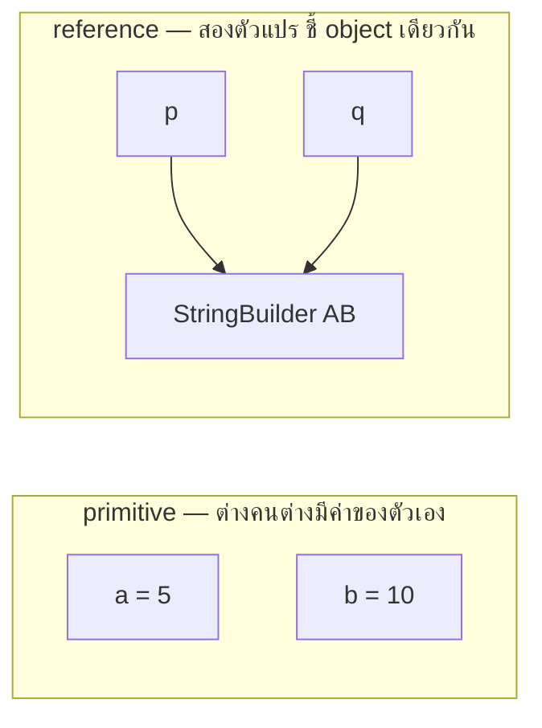
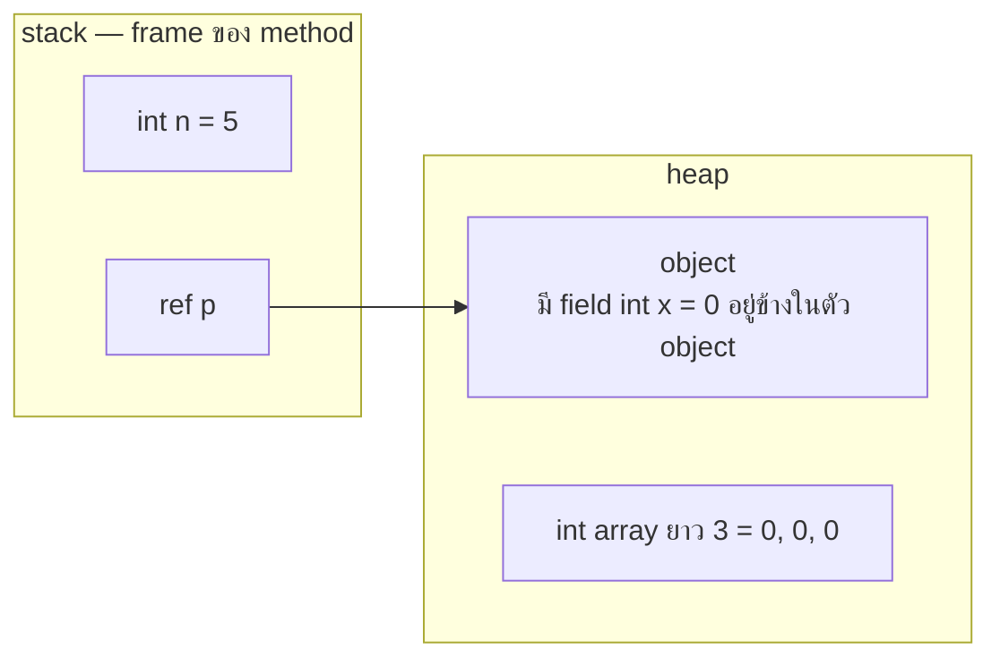

---
tags:
  - java
  - data-types
  - pass-by-value
  - references
type: reference
created: 2026-09-25
---

# 🔀 Java Value vs Reference — primitive กับ non-primitive ต่างกันตอนใช้จริง

> [[Java Data Type]] อธิบาย "มีอะไรบ้าง" (primitive 8 ตัว, wrapper, cast) ไปแล้ว โน้ตนี้ต่อจากตรงนั้นด้วยคำถามที่ถูกถามในสัมภาษณ์บ่อยที่สุด — **พอ copy / ส่งเข้า method / เทียบ `==` แล้ว primitive กับ non-primitive (reference) ทำตัวต่างกันยังไง**
>
> **สรุปบรรทัดเดียว:** ตัวแปร primitive เก็บ**ค่า** ส่วนตัวแปร reference เก็บ**ที่อยู่ของ object** — ทุกความต่างในโน้ตนี้มาจากข้อเดียวนี้

โค้ดตัวอย่างในโน้ตนี้รันจริงบน JDK 21 (compile ด้วย `--release 17`) แล้ว ผลลัพธ์ที่ลงไว้คือของจริง

---

## 1. Copy ตัวแปร — copy "ค่า" vs copy "ที่อยู่"

```java
int a = 5;
int b = a;                       // copy ค่า
b = 10;
// a = 5, b = 10  → เป็นอิสระต่อกัน

StringBuilder p = new StringBuilder("A");
StringBuilder q = p;             // copy "ที่อยู่" → ชี้ object เดียวกัน (alias)
q.append("B");
// p = "AB", q = "AB", p == q → true
```



พอมีสองตัวแปรชี้ object เดียวกัน (**aliasing**) แก้ผ่านตัวไหนอีกตัวก็เห็นด้วย — ต้นตอของบั๊กแบบ "ใครแอบแก้ข้อมูลฉัน" ทั้งหมด

---

## 2. ส่งเข้า method — Java เป็น pass-by-value เสมอ

> **คำตอบสัมภาษณ์:** Java เป็น pass-by-value เสมอ — สิ่งที่ถูก copy เข้า method คือ *ค่าของ argument* สำหรับ reference type ค่านั้นคือ **reference (ที่อยู่)** ไม่ใช่ตัว object ดังนั้นแก้ state ของ object ผ่าน parameter ได้ แต่เปลี่ยนให้ parameter ไปชี้ object อื่นไม่กระทบตัวแปรของ caller

```java
static void incr(int n)                { n++; }
static void add(List<String> l)        { l.add("x"); }
static void reassign(List<String> l)   { l = new ArrayList<>(); l.add("y"); }
static void swap(Integer a, Integer b) { Integer t = a; a = b; b = t; }
static void setFirst(int[] arr)        { arr[0] = 99; }
```

```
int n = 1;                              incr(n)         → n = 1        (แก้สำเนา ไม่กระทบ)

List<String> list = new ArrayList<>();  add(list)       → [x]          (แก้ตัว object ที่ชี้ร่วมกัน → เห็นผล)
                                        reassign(list)  → ยัง [x]       (ไปชี้ object ใหม่ แต่แค่สำเนา → ไม่กระทบ)
                                        
Integer x = 1, y = 2;                   swap(x, y)      → x=1, y=2     (swap ไม่ได้)
int[] arr = {1, 2};                     setFirst(arr)   → arr[0] = 99  (แก้ element ในตัว array → เห็นผล)
```

| ทำอะไรกับ parameter ใน method | caller เห็นผลไหม |
|---|---|
| แก้ค่า primitive (`n++`) | ❌ แก้แค่สำเนา |
| เรียก method/แก้ field ของ object ที่ parameter ชี้อยู่ (`l.add`, `sb.append`, `arr[0] = ...`) | ✅ reference ที่ copy มาชี้ object เดียวกับของ caller |
| กำหนดค่าใหม่ให้ตัว parameter (`l = new ...`) | ❌ แค่เปลี่ยนสำเนาของ reference |
| `swap(a, b)` | ❌ ทั้ง primitive และ reference — เขียน swap ผ่าน method ไม่ได้ |

**ทำไมคนเข้าใจผิดว่าเป็น pass-by-reference:** เพราะแก้ object ผ่าน parameter แล้วเห็นผลที่ caller — แต่ pass-by-reference จริง (เช่น `int&` ของ C++) ต้องทำให้ *ตัวแปรของ caller เอง* ถูกแทนที่ได้ ซึ่ง `swap` ข้างบนพิสูจน์แล้วว่า Java ทำไม่ได้

---

## 3. Immutable type — ทำให้ดูเหมือน "ส่งค่า" ทั้งที่เป็น reference

```java
static void appendStr(String s)        { s += "!"; }
static void appendSb(StringBuilder sb) { sb.append("!"); }
```

```
String s = "hi";                        appendStr(s)   → s = "hi"    (ไม่เปลี่ยน)
StringBuilder sb = new StringBuilder("hi"); appendSb(sb) → sb = "hi!"  (เปลี่ยน)
```

`String` เป็น reference type เหมือนกัน แต่ **immutable** — `s += "!"` สร้าง String ตัวใหม่แล้วให้ตัวแปร `s` (สำเนาใน method) ไปชี้ตัวใหม่ ตัวของ caller ไม่เกี่ยว ส่วน `StringBuilder` แก้ตัวเดิม (mutable) `Integer`, `BigDecimal`, `LocalDate` ก็เป็น immutable เหมือน `String` — จึงเป็นเหตุผลว่าทำไมส่งของพวกนี้เข้า method แล้วปลอดภัยเรื่อง aliasing (ดู [[Java Date Time]])

**ส่ง mutable object (`List`, array, entity) เข้าไปแล้ว method แอบแก้ = caller โดนผลข้างเคียง** — ถ้าไม่อยากให้แก้ ส่ง copy หรือ immutable view (ปัญหาเดียวกับ record ที่ไม่ immutable ลึก ดู [[Java Record]] ข้อ 6.1)

---

## 4. `==` vs `equals()` ของ reference — และ String pool

- primitive: `==` เทียบ**ค่า**
- reference: `==` เทียบว่าเป็น **object เดียวกัน (identity)** ไหม — เทียบเนื้อหาต้องใช้ `equals()`

```java
String a = "hi", b = "hi", c = new String("hi");
```

| expression | ผล | เหตุผล |
|---|---|---|
| `a == b` | ✅ `true` | string literal ถูกเก็บใน **string pool** — literal เดียวกันได้ object ตัวเดียวกัน |
| `a == c` | ❌ `false` | `new String(...)` สร้าง object ใหม่นอก pool |
| `a.equals(c)` | ✅ `true` | เทียบเนื้อหา |
| `c.intern() == a` | ✅ `true` | `intern()` คืนตัวที่อยู่ใน pool |
| `("h" + "i") == a` | ✅ `true` | เป็น compile-time constant → คอมไพเลอร์ต่อให้เสร็จตอน compile |
| `(d + "i") == a` โดย `String d = "h"` | ❌ `false` | ต่อตอน runtime ได้ object ใหม่ |
| `(f + "i") == a` โดย `final String f = "h"` | ✅ `true` | `f` เป็นตัวแปร constant (`final` + literal) จึงยังเป็น constant expression |

**กฎ: เทียบ String และ object ทุกชนิดด้วย `equals()` เสมอ** (หรือ `Objects.equals(a, b)` ถ้า `a` อาจเป็น `null`) — `==` บน String บางทีถูกเพราะ pool แต่ผลขึ้นกับว่า string มาจากไหน ห้ามพึ่ง กับดัก `Integer` cache (`127` vs `128`) เป็นเรื่องเดียวกัน ดู [[Java Data Type]] ข้อ 5

---

## 5. `null` และ unboxing NPE

**primitive เป็น `null` ไม่ได้ → แทน "ไม่มีค่า" ไม่ได้** ส่วน wrapper/reference เป็น `null` ได้ ตัวอย่างจริง: JDBC `ResultSet.getInt()` ของคอลัมน์ที่เป็น SQL `NULL` **คืน `0`** ไม่ใช่ error — แยก NULL กับ 0 จริง ๆ ไม่ได้ถ้าไม่เรียก `wasNull()` ต่อ

**พอ unbox wrapper ที่เป็น `null` → `NullPointerException`** (ผลจริงจาก JDK 21):

```java
Map<String, Integer> m = new HashMap<>();
int c = m.get("x");
// NPE: Cannot invoke "java.lang.Integer.intValue()" because the return value of "java.util.Map.get(Object)" is null

Boolean bo = null;
if (bo) { }
// NPE: Cannot invoke "java.lang.Boolean.booleanValue()" ...
```

**สามกรณีของ `?:` ที่ต้องแยกให้ออก:**

```java
boolean flag = true; Integer n = null;

int     r1 = flag ? n : 0;                  // ❌ NPE — Integer กับ int → ผลลัพธ์เป็น int → ต้อง unbox n
Integer r2 = flag ? n : Integer.valueOf(0); // ✅ null  — ทั้งคู่เป็น Integer ไม่ unbox
Integer r3 = flag ? null : 0;               // ✅ null  — ผลลัพธ์เป็น Integer
```

**แก้:** ใช้ `map.getOrDefault(k, 0)`, เช็ค `null` ก่อน unbox, หรือเก็บเป็น wrapper ไว้จนกว่าจะแน่ใจว่ามีค่า (NPE เป็น unchecked ดู [[Java Exception]])

**message ของ NPE ละเอียดแบบนี้ (บอกว่าอะไรเป็น null) มีตั้งแต่ Java 15 เป็นค่า default** — ถ้าคอมไพล์ไม่มีข้อมูลชื่อตัวแปร (`-g`) จะเห็น `"<local3>"` แทนชื่อตัวแปร

---

## 6. หน่วยความจำ — "primitive อยู่บน stack" ไม่จริงเสมอไป

ตาม JVM Specification (ข้อ 2.5, 2.6):
- **local variable** (ทั้ง primitive และ reference) อยู่ใน **frame ของ method** บน stack ของแต่ละ thread
- **object และ array ทุกตัว** ถูกสร้างบน **heap**



ผลที่ตามมา:
- **primitive field ของ object อยู่ในตัว object บน heap** ไม่ใช่ stack — "primitive อยู่บน stack" จริงเฉพาะ *local variable*
- **array เป็น object เสมอ แม้ element เป็น primitive** — `int[]` เป็น reference type (`class [I`), เป็น `null` ได้ ตัวเลขทุกตัวอยู่ข้างในตัว array บน heap
- `Integer[]` ต่างกัน — element แต่ละช่องเป็น *reference* (default `null`) ไปหา object `Integer` อีกที

```
int[]     → [0, 0, 0]              (element เป็นค่า default ของ int)
Integer[] → [null, null, null]     (element เป็น reference default = null)
```

| | ได้ค่า default อัตโนมัติไหม |
|---|---|
| field (instance/static) | ✅ `0` / `0.0` / `false` / `null` |
| element ของ array | ✅ ตามชนิด element |
| **local variable** | ❌ ต้อง assign ก่อนใช้ ไม่งั้น compile error `variable x might not have been initialized` |

> "stack vs heap" คือ model ตาม spec — JIT compiler บางครั้งเลี่ยงการสร้าง object จริงบน heap ได้ถ้าพิสูจน์ว่า object ไม่หลุดออกนอก method (escape analysis) แต่ใช้คิด semantics ของภาษาได้ตรงตามนี้

---

## 7. ต้นทุนของ boxing

- `int` = **4 ไบต์**
- `Integer` = **object เต็มตัว 16 ไบต์** (object header 12 + ค่า 4 บน HotSpot 64-bit ค่า default) **บวก** reference 4 ไบต์ที่ชี้มาหา (ถ้าเปิด compressed oops ซึ่งเป็นค่า default เมื่อ heap ไม่ใหญ่เกิน ~32GB)
- `int[]` เก็บค่าติดกันตรง ๆ ส่วน `Integer[]`/`List<Integer>` เก็บ reference ไป object แยกกัน — ประมาณ ~20 ไบต์/element เทียบกับ 4 (กรณีเลวร้ายสุด; ค่า -128..127 ใช้ object ร่วมกันจาก Integer cache)

**boxed accumulator ใน loop = สร้าง object ซ้ำทุกรอบ:**

```java
Long sum = 0L;                          // ❌ box/unbox ทุกรอบ
for (long i = 0; i <= Integer.MAX_VALUE; i++) sum += i;

long sum2 = 0L;                         // ✅
```

*Effective Java Item 61* วัดไว้ว่าเปลี่ยน `Long` เป็น `long` ลดเวลาจาก 43 วินาทีเหลือ 6.8 วินาที (เครื่องของผู้เขียน ไม่ใช่ benchmark ของวอลต์นี้ — ตัวเลขขึ้นกับเครื่อง/JVM แต่ทิศทางเหมือนกัน) — เหตุผลเดียวกับที่ `IntStream`/`LongStream` มีอยู่ ดู [[Java Stream]]

**หลักเลือก:** ใช้ **primitive เป็นค่าเริ่มต้น** ใช้ wrapper เมื่อ (1) ต้องเป็น `null` ได้ เช่น ค่าจากคอลัมน์ที่ nullable (2) ต้องใส่ generics (`List<Integer>`)

---

## 8. อนาคต — Project Valhalla กำลังลดช่องว่างนี้ (ณ 2026-09-25)

**JEP 401: Value Objects (Preview)** — สถานะ Integrated **target JDK 28 (มี.ค. 2027)** — JDK 27 (ก.ย. 2026) ยังไม่มี:

- **value object = ไม่มี identity** — `==` เทียบตาม**ค่าของ field** แทนการเทียบว่าเป็น object เดียวกัน
- เมื่อเปิด preview, **30 class ของ JDK กลายเป็น value class** เช่น `Integer`/`Long`/`Double` และ wrapper อื่น, `Optional*`, `LocalDate` และ java.time ส่วนใหญ่ → กับดัก `Integer` cache (`127` vs `128` ด้วย `==`) จะหายไปในโหมดนี้
- **primitive ไม่เปลี่ยน** — JEP เขียนไว้ชัดว่าไม่ใช่เป้าหมายที่จะเปลี่ยนการปฏิบัติต่อ primitive และ null-restricted type (ชนิดที่ห้ามเป็น `null`) ไม่ได้อยู่ใน JEP นี้ (ต้องรอ enhancement ในอนาคต)
- ต้อง `--enable-preview` ทั้งตอน compile และ run และ **ไม่ได้แปลว่าเลิกใช้ `equals()`**

เป็นฟีเจอร์ preview ที่ยังไม่ถึง JDK ที่วอลต์นี้ใช้อ้างอิง (17) — เรื่องในข้อ 1-7 ยังเป็นจริงทั้งหมดบน Java ที่ใช้อยู่จริงตอนนี้

---

## 9. กับดัก

- **คิดว่า Java เป็น pass-by-reference** เพราะแก้ object ผ่าน parameter แล้วเห็นผล (ข้อ 2)
- **เขียน `swap(a, b)` เป็น method** — ไม่มีทางได้ผล ทั้ง primitive และ reference (ข้อ 2)
- **method แอบแก้ `List`/array/entity ที่ส่งเข้าไป** — caller โดนผลข้างเคียง ส่ง copy หรือ immutable view (ข้อ 3)
- **เทียบ `String` ด้วย `==`** — บางทีถูก (pool) บางทีผิด ขึ้นกับที่มาของ string (ข้อ 4)
- **`int x = map.get(k)` เมื่อ key ไม่มี** — NPE จาก unboxing `null` ใช้ `getOrDefault` (ข้อ 5)
- **`flag ? integerOrNull : 0`** — ผลลัพธ์เป็น `int` แล้ว unbox → NPE ถ้าค่าเป็น `null` (ข้อ 5)
- **ใช้ `getInt()` ของ JDBC กับคอลัมน์ที่เป็น NULL ได้** — ได้ `0` เงียบ ๆ ต้องเช็ค `wasNull()` (ข้อ 5)
- **ใช้ primitive กับค่าที่ "ไม่มีค่า" ได้** (แทนด้วย `0`/`-1`) — ตีความผิดว่ามีค่าจริง ใช้ wrapper แล้วเช็ค `null` แทน
- **ใช้ `Long`/`Integer` เป็นตัวนับ/ตัวสะสมใน loop ที่ทำงานหนัก** — box/unbox ทุกรอบ (ข้อ 7)
- **ใช้ wrapper เป็น field ทั้งที่ไม่มีทางเป็น `null`** — เปิดช่อง NPE และเปลืองหน่วยความจำเปล่า ๆ
- **local variable ไม่ได้ assign ก่อนใช้** — compile error (ข้อ 6)

---

## 10. Cheat sheet

```java
// copy
int b = a;                  // ค่าแยกกัน
Obj q = p;                  // ชี้ object เดียวกัน (alias)

// ส่งเข้า method (pass-by-value เสมอ)
void f(int n)               // n = สำเนา → แก้ไม่กระทบ caller
void g(List<X> l)           // l = สำเนาของ reference → l.add() กระทบ / l = new ... ไม่กระทบ

// เทียบ
a == b                      // primitive: ค่า | reference: identity
x.equals(y)                 // เนื้อหา
Objects.equals(x, y)        // null-safe

// null
int c = map.getOrDefault(k, 0);     // แทน int c = map.get(k)
```

| อาการ | สาเหตุ |
|---|---|
| แก้ค่าใน method แล้ว caller ไม่เปลี่ยน | ส่งเป็น pass-by-value — primitive/reassign แก้แค่สำเนา |
| แก้ค่าใน method แล้ว caller เปลี่ยนโดยไม่ตั้งใจ | ส่ง mutable object เข้าไป แก้ state ตัวเดิม |
| `==` บน String ให้ผลไม่แน่นอน | string pool — ต้องใช้ `equals()` |
| NPE ตรงบรรทัดที่ดูเหมือนไม่มี object | unboxing wrapper ที่เป็น `null` |
| ได้ `0` แทน NULL จาก DB | JDBC `getInt()` คืน `0` เมื่อ SQL NULL |
| loop ช้าผิดปกติ ใช้ memory เยอะ | ตัวสะสมเป็น `Long`/`Integer` หรือ `List<Integer>` ขนาดใหญ่ |
| compile error `might not have been initialized` | local variable ไม่มี default value |

---

## 🔗 เกี่ยวข้อง

- [[Java Data Type]] — primitive 8 ตัว, wrapper class, Integer cache, cast (โน้ตนี้ต่อจากตรงนั้น)
- [[Java Record]] — record ไม่ immutable ลึก = ปัญหา aliasing ข้อ 1-3 เอง
- [[Java Stream]] — primitive stream ไว้เลี่ยง boxing
- [[Java Date Time]] — ตัวอย่าง reference type ที่ออกแบบให้ immutable
- [[Java Exception]] — `NullPointerException` อยู่ตรงไหนใน hierarchy
- [[Java]] — หน้ารวม

## 📖 อ่านต่อ

- [JVMS §2 — Run-Time Data Areas (stack, frames, heap)](https://docs.oracle.com/javase/specs/jvms/se21/html/jvms-2.html)
- [JLS §4 — Types, Values, and Variables](https://docs.oracle.com/javase/specs/jls/se17/html/jls-4.html)
- [JEP 401: Value Objects (Preview)](https://openjdk.org/jeps/401)
- [InfoQ — Project Valhalla's First Preview: JEP 401 Redefines == for Java Objects](https://www.infoq.com/news/2026/08/jep401-value-objects-preview/)
- [ResultSet.getInt / wasNull (Javadoc)](https://docs.oracle.com/en/java/javase/21/docs/api/java.sql/java/sql/ResultSet.html)
- Effective Java (3rd ed.) — Item 61: Prefer primitive types to boxed primitives
