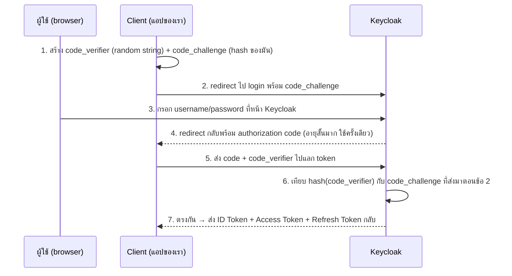

---
tags:
  - keycloak
  - security
  - oauth2
  - oidc
  - iam
type: reference
created: 2026-09-17
---

# 🔐 Keycloak คืออะไร

> **Keycloak คือ open-source Identity and Access Management (IAM) server** — ระบบกลางที่จัดการ "ใครคือใคร" (authentication) และ "ใครทำอะไรได้บ้าง" (authorization) แทนที่จะให้ทุกแอปเขียนระบบ login/เก็บรหัสผ่านผู้ใช้เอง พูดสั้นสุด: **ไม่ต้องเขียนระบบ login เองอีกต่อไป**

---

## 1. ใช้ทำอะไรได้บ้าง — ไม่ใช่แค่ "login"

| ความสามารถ | คืออะไร |
|---|---|
| **Single Sign-On (SSO)** | login ครั้งเดียว ใช้ได้หลายแอปในองค์กรเดียวกัน ไม่ต้อง login ซ้ำทีละแอป |
| **Identity Brokering** | ให้ผู้ใช้ login ผ่าน provider ภายนอกได้ (Google, GitHub, องค์กรอื่นผ่าน SAML) โดยแอปเราไม่ต้องรู้จัก provider พวกนั้นเลย |
| **User Federation** | ดึงผู้ใช้ที่มีอยู่แล้วจาก LDAP/Active Directory มาใช้ตรง ๆ ไม่ต้อง migrate/สร้างซ้ำ |
| **Multi-Factor Authentication (MFA)** | เปิด OTP/WebAuthn ได้จาก config ฝั่ง Keycloak โดยแอปไม่ต้องเขียนเอง |
| **Account Console** | หน้าที่ผู้ใช้จัดการบัญชีตัวเอง (เปลี่ยนรหัสผ่าน, ตั้ง MFA, ดู session ที่ login อยู่) — Keycloak ทำหน้าเว็บให้แล้ว |
| **Authorization Services** | สิทธิ์แบบละเอียดกว่า role ธรรมดา (fine-grained, policy-based) ถ้า role อย่างเดียวไม่พอ |
| **Admin REST API** | จัดการ user/realm/client ผ่าน API ได้ทั้งหมด เขียนระบบ automation/provisioning เองได้ |
| **Multi-tenancy ผ่าน Realm** | แยกกลุ่มผู้ใช้/สิทธิ์อิสระจากกันในเครื่อง Keycloak เดียว เหมาะกับ SaaS ที่มีหลายลูกค้า |

**จุดสำคัญ:** ส่วนใหญ่รู้จัก Keycloak แค่ "เอาไว้ทำ login" แต่ของจริงคือผู้ใช้ **ไม่เคยต้องคุยกับแอปของเราโดยตรงเพื่อทำอะไรพวกนี้เลย** — MFA, เปลี่ยนรหัสผ่าน, social login ล้วนเป็นแค่ "เปิด config" ฝั่ง Keycloak ไม่ต้องเขียนโค้ดในแอปเพิ่มสักบรรทัด

---

## 2. กระบวนการ Auth — OAuth2/OIDC ที่อยู่เบื้องหลัง

หัวข้อนี้คือ protocol มาตรฐานที่ Keycloak implement ตาม ไม่ใช่สิ่งที่ Keycloak คิดขึ้นเอง (Auth0, Okta, Azure AD ก็ใช้มาตรฐานเดียวกันนี้)

### OAuth2 vs OIDC ต่างกันตรงไหน

| | OAuth2 | OIDC (OpenID Connect) |
|---|---|---|
| แก้ปัญหาอะไร | **Authorization** — ให้สิทธิ์เข้าถึง resource | **Authentication** — พิสูจน์ว่าใครคือใคร |
| ความสัมพันธ์ | มาตรฐานฐาน | สร้างต่อยอดจาก OAuth2 เพิ่มชั้น identity เข้าไป |
| ได้ token อะไร | Access Token | Access Token + **ID Token** (ส่วนที่เพิ่มมา) |

**Keycloak ใช้ OIDC** — OAuth2 อย่างเดียวบอกได้แค่ "แอปนี้มีสิทธิ์เรียก API ได้" แต่ไม่ได้รับรองว่า "ผู้ใช้คนนี้คือใคร" จริง ๆ OIDC เติมส่วนนั้นเข้าไปด้วย ID Token

### 3 token ที่ต้องแยกให้ออก

| Token | ใครใช้ | ใช้ทำอะไร |
|---|---|---|
| **ID Token** | client (แอป) เก็บไว้ดูเอง | บอกว่า "ผู้ใช้คนนี้คือใคร" (username, email) — **ห้ามส่งไปให้ API อื่นใช้ยืนยันตัวตน** |
| **Access Token** | ส่งไปกับทุก request หา API | พิสูจน์สิทธิ์เรียก API — API เป็นคนตรวจ ไม่ใช่ client |
| **Refresh Token** | เก็บไว้ขอ token ใหม่ | อายุยาวกว่า ใช้ต่ออายุ access token โดยไม่ต้อง login ซ้ำ |

**กับดักที่พบบ่อย: เอา ID Token ไปเรียก API แทน Access Token** — ทำงานได้บางกรณีเพราะทั้งคู่เป็น JWT หน้าตาคล้ายกัน แต่ผิดหลักการ (ID Token มี audience เป็น client ไม่ใช่ API) ระบบที่เข้มงวดจะปฏิเสธ

### Authorization Code Flow + PKCE — flow มาตรฐานที่ควรใช้เกือบทุกกรณี



**PKCE (Proof Key for Code Exchange) มีไว้ทำไม:** ถ้ามีใครดักจับ authorization code ระหว่างทาง (ข้อ 4) เอาไปแลก token เองไม่ได้ เพราะไม่มี `code_verifier` ตัวจริงที่สร้างไว้ตั้งแต่ข้อ 1 (เก็บอยู่ในเครื่อง client เท่านั้น ไม่เคยถูกส่งผ่านเครือข่ายเป็น plain text) — **มาตรฐานปัจจุบัน (RFC 9700, 2026) แนะนำให้ใช้ PKCE กับ client ทุกประเภท ไม่ใช่แค่ public client/SPA เหมือนเดิม**

---

## 3. เราต้อง implement ยังไง — checklist ทั่วไป (ไม่ผูกกับ stack ไหน)

1. **รัน Keycloak** — Docker เร็วสุด (image `quay.io/keycloak/keycloak`)
2. **สร้าง Realm** — แยกจาก `master` เสมอ (`master` มีไว้จัดการ Keycloak เอง ไม่ใช่ที่เก็บ user ของระบบงานจริง)
3. **สร้าง Client** ต่อแอป — frontend (public, ไม่มี secret) แยกจาก backend (confidential, มี secret)
4. **ตั้งค่า redirect URI/Web origins** ให้ตรงกับแอปจริง — Keycloak ปฏิเสธ redirect ที่ไม่ได้อนุญาตไว้เป็น security feature ไม่ใช่บั๊ก
5. **สร้าง Role แล้วผูกกับ user** — ตัดสินใจก่อนว่าจะใช้ realm role (ใช้ร่วมกันได้ทุก client) หรือ client role (เฉพาะ client เดียว)
6. **ฝั่ง backend (resource server):** validate JWT ที่ส่งมาด้วย public key จาก Keycloak (JWKS endpoint) — ทุกภาษา/framework มี library ทำเรื่องนี้ให้ ไม่ต้องเขียน JWT validation เอง
7. **ฝั่ง frontend:** redirect ไป Keycloak login, รับ token กลับมา, แนบ `Authorization: Bearer <token>` กับทุก request ไป backend, จัดการ refresh token ก่อนหมดอายุ

**ตัวอย่าง implement เต็มรูปแบบพร้อมโค้ดจริงทั้ง Angular + Quarkus ดูที่ [[Quarkus Keycloak]]** — โน้ตนี้เน้นเข้าใจ "ทำไม"/protocol เบื้องหลัง ส่วนโน้ตนั้นเน้น "โค้ดจริงเขียนยังไง" ทีละขั้นตอน

---

## 🎯 แนวทางการเริ่มศึกษา

1. **เริ่มต้น** — เข้าใจ OAuth2 vs OIDC ให้ออกก่อน แล้วจำ 3 token ให้แม่น (ID/Access/Refresh, ข้อ 2) — ก่อนแตะ config ใด ๆ เลย เพราะทุก field/setting หลังจากนี้อ้างอิงกับ 3 อย่างนี้ตลอด
2. **ลงมือทำจริง** — ทำตาม checklist ข้อ 3 ทั้ง 7 ขั้นกับแอปทดลองเล็ก ๆ (จะมีแค่ backend อย่างเดียวก่อนก็ได้ ยังไม่ต้องมี frontend) แล้วขอ token ด้วย `curl` มาทดสอบตรง ๆ ก่อนต่อ frontend จริง — เห็นว่า Keycloak/backend ทำงานถูกไหมโดยไม่มีตัวแปรจาก frontend มาปน
3. **ใช้งานได้คล่อง** — เข้าใจว่าทำไม PKCE ควรเปิดกับ client ทุกประเภท (ไม่ใช่แค่ public client), รู้จัก BFF pattern สำหรับ SPA ที่ต้องการความปลอดภัยสูงสุด, และแยก public/confidential client ให้ถูกต้องเสมอไม่ปนกัน

---

## 4. กับดัก

- **เข้าใจว่า Keycloak มีไว้แค่ทำ login** — พลาดโอกาสใช้ social login/LDAP federation/MFA/account self-service ที่ Keycloak ทำให้ฟรีโดยไม่ต้องเขียนโค้ดเพิ่ม (ข้อ 1)
- **เอา ID Token ไปยิง API แทน Access Token** — ผิดหลักการ OIDC (ข้อ 2) บาง backend ที่เข้มงวดจะปฏิเสธ
- **สร้าง client เดียวใช้ทั้ง frontend และ backend** — frontend ควรเป็น public client เสมอ (ไม่มี secret เก็บได้ปลอดภัยในเบราว์เซอร์) backend เป็น confidential ได้เพราะรันบน server เก็บ secret ได้จริง ผสมกันแล้ว secret รั่วง่ายมาก
- **ไม่เปิด PKCE เพราะคิดว่า "ใช้ confidential client อยู่แล้วไม่จำเป็น"** — มาตรฐานปัจจุบัน (RFC 9700) แนะนำให้เปิดทุก client แล้ว ไม่ใช่แค่ public client
- **ใช้ path แบบเก่า `/auth/realms/...`** — Keycloak ตัด `/auth` ออกจาก path ตั้งแต่รุ่น 17 (เปลี่ยนไปใช้ฐาน Quarkus) ตัวอย่างเก่าบนเว็บจำนวนมากยังเขียนแบบเดิม
- **ให้ SPA เก็บ token ไว้ใน `localStorage`** — เสี่ยง XSS ขโมย token ได้ตรง ๆ แนวทางที่ปลอดภัยกว่าคือ pattern **BFF (Backend-for-Frontend)** ที่ token อยู่ฝั่ง server เท่านั้น ฝั่ง browser ได้แค่ httpOnly cookie

---

## 5. Cheat sheet

```
Realm     = พื้นที่แยกผู้ใช้/สิทธิ์ ของแต่ละระบบ (อย่าปนกับ master)
Client    = แอปที่ขอใช้ Keycloak — public (frontend) vs confidential (backend)
Role      = สิทธิ์ — realm role (ใช้ร่วมกันได้ทุก client) vs client role (เฉพาะตัว)

ID Token      → บอกว่าใครคือใคร (client เก็บเอง)
Access Token  → ยิง API ด้วยตัวนี้เท่านั้น
Refresh Token → ขอ token ใหม่โดยไม่ต้อง login ซ้ำ

Flow มาตรฐาน: Authorization Code + PKCE (ทุก client type ตาม RFC 9700)
```

| ต้องการ | ใช้ฟีเจอร์ไหนของ Keycloak |
|---|---|
| login ครั้งเดียวใช้ได้หลายแอป | SSO |
| ผู้ใช้ login ผ่าน Google/GitHub | Identity Brokering |
| ใช้ผู้ใช้เดิมจาก LDAP/AD | User Federation |
| สิทธิ์ซับซ้อนกว่า role ธรรมดา | Authorization Services |
| จัดการ user/client แบบ automate | Admin REST API |
| แยกลูกค้าแต่ละรายไม่ให้เห็นกัน (SaaS) | Realm ต่อ tenant |

## 🔗 เกี่ยวข้อง

- [[Quarkus Keycloak]] — implement เต็มรูปแบบ Angular + Quarkus พร้อมโค้ดจริงทุกขั้นตอน
- [[Angular HttpClient]] — interceptor ที่ใช้แนบ Access Token กับทุก request

## 📖 อ่านต่อ

- [Keycloak — Documentation](https://www.keycloak.org/documentation)
- [Keycloak — Securing Applications and Services Guide](https://www.keycloak.org/docs/latest/securing_apps/)
- [OAuth 2.0 — PKCE](https://oauth.net/2/pkce/)
- [ID Tokens vs Access Tokens — OAuth.net](https://oauth.net/id-tokens-vs-access-tokens/)
