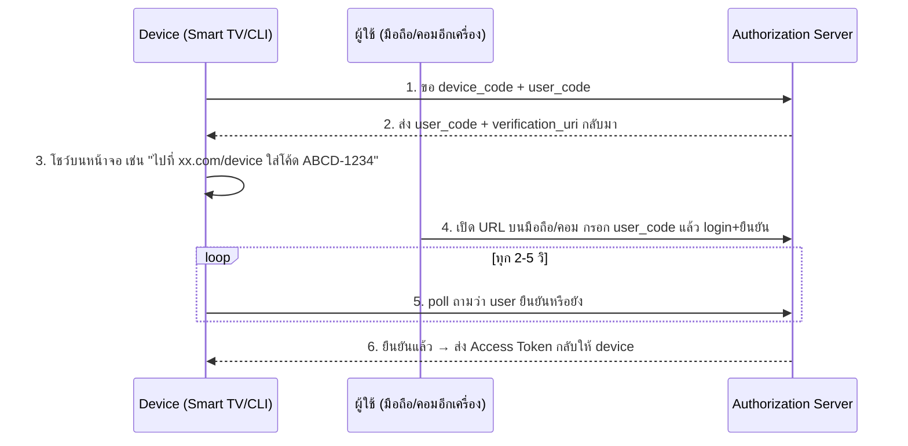

---
tags:
  - oauth2
  - oidc
  - security
  - auth
type: reference
created: 2026-09-29
---

# 🔑 OAuth 2.0 — Grant Type มีกี่แบบ และมีบริการอะไรให้ใช้

> **OAuth 2.0 (RFC 6749) คือ authorization framework** — มาตรฐานสำหรับ "ให้สิทธิ์เข้าถึง resource" **ไม่ใช่** "พิสูจน์ตัวตน" (นั่นเป็นหน้าที่ของ OIDC ที่สร้างต่อยอดมาอีกชั้น) ความต่าง OAuth2 vs OIDC และ 3 token หลัก (ID/Access/Refresh) อธิบายไว้แล้วที่ [[Keycloak]] ข้อ 2 **ไม่พูดซ้ำที่นี่**
>
> โน้ตนี้ตอบ 2 คำถามที่ยังไม่มีที่ไหนในนี้ครอบคลุมเต็ม: **"OAuth มี grant type (flow) กี่แบบ ใช้แบบไหนตอนไหน"** (ข้อ 2) และ **"มีบริการ/provider อะไรให้เลือกใช้บ้าง ไม่ใช่แค่ Keycloak"** (ข้อ 3)

---

## 1. 4 ตัวละครของ OAuth2 — ต้องแยกให้ออกก่อน

| Role | คือใคร | ตัวอย่าง |
|---|---|---|
| **Resource Owner** | เจ้าของข้อมูล/สิทธิ์ตัวจริง | ผู้ใช้ที่กด "อนุญาต" |
| **Client** | แอปที่ขอสิทธิ์เข้าถึง resource แทนผู้ใช้ | Angular app, mobile app, CLI |
| **Authorization Server** | คนออก token หลังตรวจสอบตัวตน/สิทธิ์แล้ว | Keycloak, Auth0, Okta, Google |
| **Resource Server** | API ที่เจ้าของ resource จริง คอยตรวจ token ก่อนตอบข้อมูล | Quarkus/Spring API หลังบ้าน |

**Client กับ Resource Owner เป็นคนละคนเสมอ** — นี่คือใจความของคำว่า "แทน" (on behalf of) ที่ทำให้ OAuth ต่างจากการ login ตรงๆแบบเก่า (ผู้ใช้กรอก user/pass ให้แอปเก็บไว้เอง)

---

## 2. Grant type — มีกี่แบบ ใช้ตอนไหน

### 2.1 Authorization Code + PKCE — มาตรฐานหลัก ใช้เกือบทุกกรณี

ผู้ใช้ login ผ่านหน้า Authorization Server แล้วได้ authorization code กลับมาแลกเป็น token อีกที (ไม่ส่ง token ตรงๆผ่าน browser) — diagram เต็ม + เหตุผลของ PKCE ดูที่ [[Keycloak]] ข้อ 2 (ไม่วาดซ้ำที่นี่) ใช้ได้ทั้ง server-rendered web app, SPA, และ mobile app

### 2.2 Client Credentials — Service-to-service (M2M)

ไม่มีผู้ใช้เกี่ยวข้องเลย — client (เช่น backend service ตัวหนึ่ง) authenticate ด้วยตัวเอง (client id + secret) แล้วได้ access token มาเรียก service อื่นตรงๆ โค้ดจริงพร้อม config ดูที่ [[Quarkus Keycloak]] ข้อ 7

### 2.3 Device Authorization Grant (RFC 8628) — อุปกรณ์ที่พิมพ์ลำบาก



ออกแบบมาให้ device ที่ไม่มีเบราว์เซอร์สะดวก หรือพิมพ์ลำบาก (Smart TV, เครื่องพิมพ์, CLI tool อย่าง `gh auth login`/`docker login`) ให้ผู้ใช้ไปยืนยันที่อุปกรณ์อีกเครื่องแทน — device เป็นฝ่าย poll ถามเองเป็นระยะจนกว่าจะรู้ผล

### 2.4 Refresh Token grant — ต่ออายุโดยไม่ login ใหม่

ใช้คู่กับแทบทุก flow ข้างบน — ส่ง refresh token (อายุยาว) ไปแลก access token ใหม่ (อายุสั้น) โดยผู้ใช้ไม่ต้องกรอก password ซ้ำ

### 2.5 ⚠️ Resource Owner Password Credentials (ROPC / "Direct Grant") — Deprecated

Client รับ username/password จากผู้ใช้ตรงๆ แล้วส่งไปแลก token เอง (ตัวอย่าง `grant_type=password` ที่เห็นในคำสั่ง curl ของ [[Quarkus Keycloak]] ข้อ 10) — **[RFC 9700](https://www.rfc-editor.org/info/rfc9700/) (OAuth 2.0 Security Best Current Practice) ประกาศเลิกใช้ (deprecated) อย่างเป็นทางการแล้ว** เพราะ client เห็น password ตัวจริงตรงๆ ขัดกับหลักการที่ OAuth ควรมีไว้แก้ (ผู้ใช้ไม่ต้องให้ password กับ client โดยตรง) — เหมาะกับแค่ debug/ทดสอบเร็วๆ หรือ legacy migration ชั่วคราวเท่านั้น

### 2.6 ❌ Implicit Grant — Deprecated เต็มตัว

เคยเป็นทางเลือกสำหรับ SPA ยุคก่อนมี PKCE (ส่ง access token กลับมาตรงๆทาง URL fragment โดยไม่มีขั้นตอนแลก code) — **RFC 9700 บอกห้ามใช้เลย** แนะนำให้ย้ายไป Authorization Code + PKCE ทั้งหมด เพราะ token หลุดออกทาง URL ตรงๆเสี่ยงรั่วง่ายกว่ามาก (ผ่าน browser history, referrer header, log)

### เปรียบเทียบทั้งหมด

| Grant type | ใช้เมื่อ | สถานะ |
|---|---|---|
| Authorization Code + PKCE | Web app / SPA / Mobile ที่มีผู้ใช้ login ผ่าน browser | ✅ มาตรฐานหลัก ([[Keycloak]] ข้อ 2) |
| Client Credentials | Service-to-service ไม่มีผู้ใช้ | ✅ มาตรฐาน M2M ([[Quarkus Keycloak]] ข้อ 7) |
| Device Authorization Grant | Smart TV, CLI, IoT ที่พิมพ์ลำบาก | ✅ มาตรฐาน (RFC 8628) |
| Refresh Token | ต่ออายุ token | ✅ ใช้คู่กับแทบทุก flow |
| ROPC (Password) | Legacy migration ชั่วคราวเท่านั้น | ⚠️ Deprecated (RFC 9700) |
| Implicit | — | ❌ Deprecated เต็มตัว (RFC 9700) |

---

## 3. บริการ/Provider ที่ใช้ได้จริง — ไม่ต้องเขียน Authorization Server เอง

**แทบไม่มีใครเขียน Authorization Server เองจากศูนย์แล้วในปัจจุบัน** — เลือกระหว่าง self-host กับ managed (SaaS) แทน

| บริการ                                                        | รูปแบบ                                    | จุดเด่น                                                      | เหมาะกับ                                                  | Agent Skill / MCP                                                                                                                                                                                                                                                     |
| ------------------------------------------------------------- | ----------------------------------------- | ------------------------------------------------------------ | --------------------------------------------------------- | --------------------------------------------------------------------------------------------------------------------------------------------------------------------------------------------------------------------------------------------------------------------- |
| **[[Keycloak]]**                                              | Self-host (OSS ฟรี)                       | ยืดหยุ่นสุด คุม data user เอง                                | ทีมมี DevOps ดูแลเองได้                                   | ไม่มี official MCP สำหรับจัดการ (มีแต่ community) — Keycloak เอง[ใช้เป็น authorization server ให้ MCP server อื่นได้](https://www.keycloak.org/securing-apps/mcp-authz-server) ซึ่งเป็นคนละเรื่อง                                                                     |
| **Auth0**                                                     | SaaS (มี private cloud สำหรับ enterprise) | Developer experience ดีมาก, SDK ครบ                          | Startup ที่อยากขึ้นเร็ว ไม่อยากดูแล infra                 | ✅ มีทั้ง [official Agent Skill](https://auth0.com/blog/what-ai-tools-mcp-servers-and-skills-actually-do/) (`npx skills add auth0/agent-skills`) และ [official MCP Server](https://auth0.com/blog/announcement-auth0-mcp-server-is-here/) จัดการ tenant ด้วยภาษาธรรมดา |
| **Okta**                                                      | SaaS                                      | Enterprise-grade, compliance certification เยอะ (SOC2/HIPAA) | องค์กรใหญ่ที่ต้อง compliance                              | ✅ [official open-source MCP server](https://developer.okta.com/docs/concepts/mcp-server/) (GA) + มีเวอร์ชัน managed/hosted ด้วย                                                                                                                                       |
| **Microsoft Entra ID** (เดิม Azure AD B2C)                    | SaaS                                      | ผูกกับ ecosystem Microsoft/Azure/M365 แน่น                   | องค์กรที่ใช้ Microsoft 365/Azure อยู่แล้ว                 | ✅ [Microsoft MCP Server for Enterprise](https://learn.microsoft.com/en-us/graph/mcp-server/overview) (public preview) — แต่เน้น query ข้อมูล directory แบบ read-only ผ่าน Graph API ไม่ใช่ auth flow ของแอปเราตรงๆ                                                    |
| **AWS Cognito**                                               | SaaS                                      | ผูกกับ AWS ecosystem, ราคาตาม MAU                            | ระบบที่ deploy บน AWS อยู่แล้ว                            | ❌ ยังไม่มี official MCP เฉพาะ Cognito (AWS ย้ายไปทำ "Agent Toolkit for AWS" แบบรวมทุก service แทน มีแค่ community MCP สำหรับ Cognito)                                                                                                                                 |
| **Firebase Authentication**                                   | SaaS                                      | Free tier กว้าง, SDK มือถือดีมาก                             | Mobile app / โปรเจกต์ที่ใช้ Firebase อยู่แล้ว             | ✅ [official MCP server](https://firebase.google.com/docs/ai-assistance/mcp-server) อยู่ใน `firebase-tools` (ครอบคลุมทั้ง Firebase ไม่ใช่แค่ Auth)                                                                                                                     |
| **Supabase Auth**                                             | SaaS (open-source, self-host ได้)         | ผูกกับ Postgres ตรงๆ, row-level security ต่อ user ทันที      | โปรเจกต์ที่ใช้ Supabase เป็น backend อยู่แล้ว             | ดู [[Supabase]] หัวข้อ Agent Skill/MCP (มีอยู่แล้ว ไม่พูดซ้ำ)                                                                                                                                                                                                         |
| **Social login ตรงๆ** (Google/GitHub/Apple "Sign in with...") | ฟรี                                       | ไม่ต้องมี user DB เอง ผู้ใช้ไม่ต้องจำรหัสใหม่                | แอปเล็กที่ยอมรับได้ว่า login ได้แค่ผ่าน provider เหล่านี้ | — (เป็น identity provider ปลายทาง ไม่ใช่ platform ที่มี admin tooling ให้จัดการ)                                                                                                                                                                                      |

**สิ่งที่ต้องคิดก่อนเลือก** (ไม่ใช่แค่ดู feature list):
- **Data residency** — ข้อมูลผู้ใช้เก็บอยู่ที่ไหนตามกฎหมาย (เช่น PDPA) — self-host (Keycloak) คุมได้เต็มที่ SaaS ต้องเช็ค region ที่ provider เสนอ
- **Pricing ตาม MAU** — SaaS ส่วนใหญ่คิดราคาตาม Monthly Active Users ราคาพุ่งเร็วตอน scale ต้องคำนวณล่วงหน้า
- **Vendor lock-in** — token claim/format, user ID ไม่เหมือนกันข้าม provider — ย้ายทีหลังไม่ใช่แค่เปลี่ยน config แต่ต้อง migrate user จริง

---

## 🎯 แนวทางการเริ่มศึกษา

1. **เริ่มต้น** — เข้าใจ 4 roles (ข้อ 1) และแยก OAuth2 (authorization) vs OIDC (authentication) ให้ออกก่อน (ดู [[Keycloak]] ข้อ 2) ก่อนแตะ flow ไหนเลย
2. **ลงมือทำจริง** — รัน Keycloak ผ่าน Docker (ฟรี ไม่ต้องสมัครอะไร) แล้วลองทำ Authorization Code + PKCE จริงจนเห็น token กลับมา ตามขั้นตอนที่ [[Quarkus Keycloak]]
3. **ใช้งานได้คล่อง** — รู้จัก grant type อื่นที่ต้องเลือกให้ตรงกับสถานการณ์ (ข้อ 2) ไม่ใช้ Authorization Code กับทุกเคสเหมือนไม้บรรทัดเดียว, เข้าใจว่าทำไม ROPC/Implicit เลิกใช้แล้ว, และรู้ trade-off self-host vs SaaS (ข้อ 3) ก่อนเลือก provider ให้ระบบจริง

---

## กับดัก

- **ใช้ Authorization Code แบบไม่มี PKCE เพราะคิดว่า "เป็น confidential client อยู่แล้ว"** — RFC 9700 แนะนำเปิด PKCE กับ client ทุกประเภทแล้ว ไม่ใช่แค่ public client (ดู [[Keycloak]] ข้อ 2)
- **เผลอใช้ ROPC (`grant_type=password`) ใน production client จริง** — ควรมีไว้แค่ debug หรือ migration ชั่วคราว ไม่ใช่ flow ปกติของแอป
- **ยังมีโค้ดเก่าที่ใช้ Implicit Grant กับ SPA** — ตัวอย่างก่อนปี ~2020 จำนวนมากยังสอนแบบนี้ ทั้งที่ deprecated ไปแล้ว ย้ายไป Authorization Code + PKCE
- **เลือก provider จาก feature list เฉยๆ ไม่ดู pricing model ตาม MAU** — ราคาที่ดูถูกตอน demo อาจพุ่งแรงมากตอนมี user จริงหลักหมื่น/แสน
- **คิดว่า "มี official MCP server" แปลว่า "ใช้ MCP นั้นแทน SDK auth ปกติได้"** — MCP server ของ provider เหล่านี้ (ตารางข้อ 3) มีไว้ให้ AI agent **จัดการ tenant/config** (สร้าง user, ดู log, ตั้งค่า) ไม่ใช่สิ่งที่แอปของผู้ใช้จริงเรียกใช้ตอน runtime — คนละเรื่องกับ OAuth flow ที่แอปต้อง implement เอง (ข้อ 2)

---

## Cheat sheet

| สถานการณ์ | ใช้ |
|---|---|
| Web app / SPA / Mobile ที่มี user login | Authorization Code + PKCE (2.1) |
| Service เรียก service กันเอง ไม่มี user | Client Credentials (2.2) |
| Smart TV / CLI / IoT พิมพ์ลำบาก | Device Authorization Grant (2.3) |
| ต่ออายุ session โดยไม่ login ใหม่ | Refresh Token (2.4) |
| ❌ อย่าใช้ | ROPC (ยกเว้น migration ชั่วคราว), Implicit (2.5-2.6) |
| อยากคุม data/infra เอง | Keycloak self-host |
| อยากขึ้นเร็ว ไม่อยากดูแล infra | Auth0 / Okta / Firebase Auth / Supabase Auth |

```
Grant ที่ใช้ได้ทุกวันนี้: Authorization Code + PKCE, Client Credentials, Device Authorization
Grant ที่เลิกใช้แล้ว (RFC 9700): Implicit, ROPC (Password)
```

---

## 🔗 เกี่ยวข้อง

- [[Keycloak]] — OAuth2 vs OIDC, 3 token (ID/Access/Refresh), Authorization Code+PKCE แบบเต็ม, checklist implement ทั่วไป
- [[Quarkus Keycloak]] — โค้ดจริง Angular + Quarkus ทุกขั้นตอน รวม Client Credentials (ข้อ 7)
- [[Supabase]] — ตัวอย่าง Agent Skill/MCP ของ auth provider หนึ่งเจ้า
- [[Idempotency]] — หลักการที่เกี่ยวกับ token/retry (idempotency key ก็เป็นแนวคิดคู่กับ OAuth client credential rotation)

## 📖 อ่านต่อ

- [RFC 6749 — The OAuth 2.0 Authorization Framework](https://www.rfc-editor.org/info/rfc6749/)
- [RFC 9700 — Best Current Practice for OAuth 2.0 Security](https://www.rfc-editor.org/info/rfc9700/)
- [RFC 8628 — OAuth 2.0 Device Authorization Grant](https://www.rfc-editor.org/info/rfc8628/)
- [OAuth.net — OAuth 2.0 Security Best Current Practice](https://oauth.net/2/oauth-best-practice/)
- [OWASP — OAuth2 Cheat Sheet](https://cheatsheetseries.owasp.org/cheatsheets/OAuth2_Cheat_Sheet.html)
