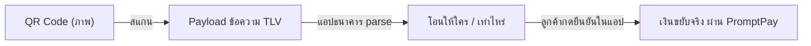
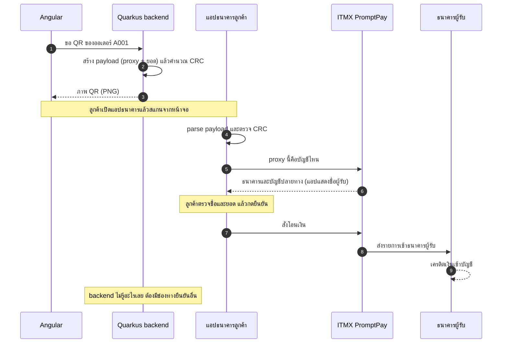
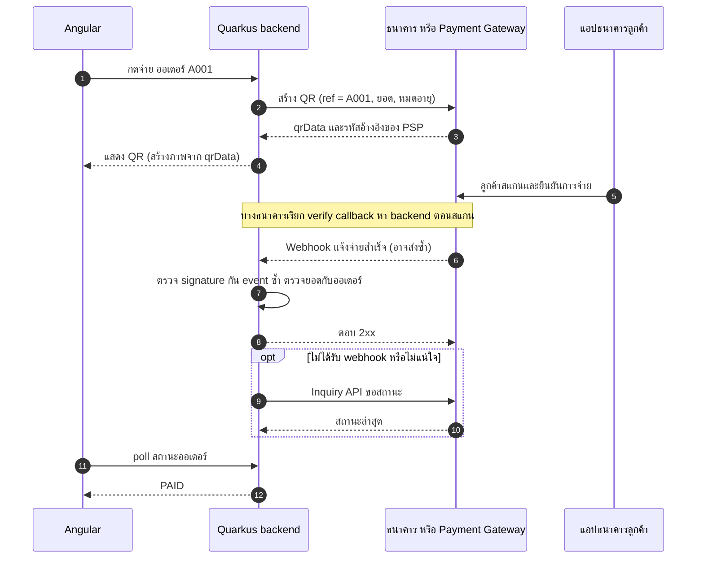

---
tags:
  - payment
  - promptpay
  - thai-qr
  - qr-code
type: reference
created: 2026-09-25
---

# 💸 QR Code Payment ในไทย — PromptPay / Thai QR

> **QR ไม่ได้จ่ายเงิน** — มันคือ *ข้อความก้อนเดียว* ที่บอกแอปธนาคารว่า "โอนให้ใคร เท่าไหร่" เงินขยับจริงตอนที่ลูกค้ากดยืนยันในแอปธนาคาร ไม่ใช่ตอนที่กล้องสแกน QR ติด
>
> เขียนให้ Fullstack dev (Java/Quarkus + Angular) ที่อยากเข้าใจทั้งหลักการและการเอาไปใช้จริงในระบบ
>
> ⚠️ **สเปกนี้ขยับได้ตามรอบ** (มี tag / sub-tag / AID เพิ่ม) จุดไหนที่ตรวจกับเอกสารทางการโดยตรงไม่ได้ ติดป้าย **🔎 ตรวจกับสเปกทางการ** ไว้ — ก่อนขึ้น production ตรวจกับธนาคาร / ITMX / ธปท. อีกรอบเสมอ (ตรวจข้อมูลล่าสุด 2026-09-25)
>
> **สิ่งที่ตรวจแล้วจริง ไม่ใช่แค่อ่านมา:** โครง TLV / CRC / ลำดับ tag อ่านจาก EMVCo MPM spec v1.1 ตัวจริง · โค้ด Java ในโน้ตนี้ compile + รันจริง — payload ตรงกับ library `promptpay-qr` (npm) ทุกไบต์ (เมื่อเรียง tag เหมือนกัน), CRC ตรง check value มาตรฐาน `29B1` และตรงกับ Python, QR ที่ทำด้วย ZXing decode กลับได้ payload เดิม, unit test ผ่านครบ

---

## 1. ภาพรวม

### 1.1 QR Payment คืออะไร



QR Code (ISO/IEC 18004) เป็นแค่ "ซอง" ห่อข้อความ ข้อความข้างในเรียกว่า **payload** เขียนตามมาตรฐานที่แอปธนาคารทุกเจ้าเข้าใจ

| QR มีอะไร | QR **ไม่มี**อะไร |
|---|---|
| ผู้รับ (เป็น proxy/รหัส ไม่ใช่เลขบัญชี), ยอด (ถ้าใส่), สกุลเงิน, reference (บางแบบ), CRC | เงิน · สถานะว่าจ่ายแล้วหรือยัง · การยืนยันใดๆ · การบังคับ "ใช้ครั้งเดียว/หมดอายุ" ในตัวมันเอง |

โน้ตนี้พูดถึง **Merchant-Presented Mode** (ร้าน/เว็บแสดง QR ลูกค้าสแกน) — อีกโหมดคือ Consumer-Presented (ลูกค้าแสดง QR ให้เครื่องร้านสแกน) ซึ่ง EMVCo มีสเปกแยก

### 1.2 มาตรฐานสองชั้น (+ ตัวระบบที่รันจริง)

| ชั้น | ใครกำหนด | ทำหน้าที่ |
|---|---|---|
| **EMV QR Code Specification for Payment Systems (EMV QRCPS)** — Merchant-Presented Mode | EMVCo (องค์กรมาตรฐานกลางของเครือข่ายบัตร Visa / Mastercard / JCB / UnionPay ฯลฯ) | วางกรอบ: โครง TLV, ความหมาย tag 00–99, CRC, และ "template" ให้แต่ละ payment network เอาไปเติมเนื้อ |
| **Thai QR Code Standard** | ธปท. ร่วมกับสมาคมธนาคารไทย และสมาคมการค้าผู้ให้บริการชำระเงินอิเล็กทรอนิกส์ไทย (ประกาศปี 2017) | เอา EMVCo เป็นฐาน แล้วกำหนดเนื้อของไทย: Tag 29 (PromptPay โอนเงิน), Tag 30 (Bill Payment), AID, สกุลเงิน THB |
| **PromptPay** | ระบบโอนเงินกลางที่ ธปท. ผลักดัน โดย National ITMX (ITMX) เป็นผู้ให้บริการโครงข่าย | ตัวระบบที่เก็บทะเบียน proxy และ route เงินระหว่างธนาคารจริง ๆ |

**EMVCo วางกรอบ ไทยเติมเนื้อ** — template ID `26`–`51` ของ EMVCo เปิดให้แต่ละ payment network ใช้ และทุก template ต้องมี sub-tag `00` = *Globally Unique Identifier* (ในไทยคือ AID ของ PromptPay) ซึ่ง "ตั้ง context" ว่า sub-tag ที่เหลือแปลว่าอะไร — เลยเป็นเหตุผลที่ Tag 29 กับ Tag 30 ใช้ sub-tag `01`, `02` คนละความหมายกันได้

> เอกสารที่ผมอ่านคือ EMV QRCPS Merchant-Presented Mode **v1.1 (2020)** — เช็คฉบับล่าสุดที่ emvco.com เสมอ

---

## 2. โครงสร้างข้อมูล (payload)

### 2.1 TLV — Tag / Length / Value

ทุกก้อนข้อมูล = `ID (2 หลัก)` + `Length (2 หลัก)` + `Value`

- ID `00`–`99` · Length `01`–`99` (**เลขทศนิยมปกติ ไม่ใช่ hex**) · Value ยาว 1–99 ตัวอักษร
- ID เดียวกันซ้ำไม่ได้ ทั้งใน root และใน template เดียวกัน
- **Nested TLV:** Value ของ template คือ TLV ชุดเล็กที่ซ้อนอยู่ข้างใน — Length ของ template = ความยาวรวมของลูกทั้งหมด (รวม ID+Length ของลูกด้วย) และรวมแล้วต้องไม่เกิน 99

ตัวอย่างจริงที่ generate จากโค้ดในข้อ 5 (เบอร์สมมติ `0812345678`, ยอด 100.00):

```
00020101021229370016A0000006770101110113006681234567853037645406100.005802TH6304F142
```

แกะออกมาทีละก้อน:

```
00 02  01                        ← Payload Format Indicator (เวอร์ชัน "01")
01 02  12                        ← Point of Initiation: 12 = dynamic (มียอด)
29 37                            ← template PromptPay — 37 = ความยาวของก้อนข้างล่างทั้งหมด
   00 16  A000000677010111       ←   AID: บอกว่านี่คือโอนผ่านพร้อมเพย์
   01 13  0066812345678          ←   proxy เป็นเบอร์มือถือ (แปลงจาก 0812345678 แล้ว)
53 03  764                       ← สกุลเงิน THB
54 06  100.00                    ← จำนวนเงิน
58 02  TH                        ← ประเทศ
63 04  F142                      ← CRC (ต้องเป็นก้อนสุดท้าย)
```

นับเองได้: `29 37` มาจาก (4 + 16) + (4 + 13) = 37

> **ลำดับ tag ยืดหยุ่นได้** — EMVCo กำหนดแค่ `00` ต้องมาก่อนสุด และ `63` (CRC) ต้องมาท้ายสุด ที่เหลือลำดับใดก็ได้ (ทั้งใน root และใน template) ผลคือ library ยอดนิยมบางตัว (`promptpay-qr`) ใส่ `58` ก่อน `53` ส่วนโค้ดในโน้ตนี้เรียงตามเลข → **สตริงต่างกัน CRC ต่างกัน แต่ความหมายเหมือนกัน** ตอนเขียนเทสต์ อย่าเทียบ payload เป็นสตริงกับ fixture ที่ generate จาก library อื่น ให้ parse แล้วเทียบ tag/ค่าแทน

### 2.2 ตาราง tag สำคัญ

| Tag | ชื่อ | ค่า / รูปแบบ | หมายเหตุ |
|---|---|---|---|
| `00` | Payload Format Indicator | `01` | ต้องเป็นก้อนแรก |
| `01` | Point of Initiation Method | `11` static / `12` dynamic | ตามนิยาม EMVCo: `11` = ใช้ QR ใบเดิมกับหลายรายการ, `12` = แสดง QR ใหม่ทุกรายการ — เป็น "ธรรมเนียมการแสดง" ไม่ได้บังคับใช้ครั้งเดียว (ดูข้อ 6.7) |
| `26`–`51` | Merchant Account Information (template) | ไทยใช้ **`29`** (PromptPay) และ **`30`** (Bill Payment) | ข้างในต้องมี sub-tag `00` เป็น AID |
| `52` | Merchant Category Code | 4 หลัก | EMVCo กำหนดเป็น mandatory · แต่ library ยอดนิยมอย่าง `promptpay-qr` สร้าง payload Tag 29 แบบสั้นที่ไม่มี `52`/`59`/`60` และใช้กันแพร่หลาย 🔎 ตรวจกับสเปก Thai QR ทางการ |
| `53` | Transaction Currency | `764` (THB ตาม ISO 4217) | |
| `54` | Transaction Amount | เช่น `100.00` | ไม่ใส่ = แอปให้คนสแกนกรอกยอดเอง · ใส่ = แอปแสดงยอด · ต้องไม่เป็นศูนย์, เลขล้วนกับ `.` ตัวเดียว, ยาวสูงสุด 13 ตัวอักษร |
| `58` | Country Code | `TH` | |
| `59` / `60` | Merchant Name / City | ≤25 / ≤15 ตัวอักษร | EMVCo กำหนดเป็น mandatory · QR ร้านค้าเต็มรูปแบบมักมีครบ 🔎 |
| `62` | Additional Data Field Template | sub-tag เช่น `01` Bill Number, `05` Reference Label, `07` Terminal Label | ที่ฝากข้อมูลเสริม (ธนาคารบางเจ้าใช้ทำ Ref3) |
| `63` | CRC | hex 4 ตัวพิมพ์ใหญ่ | ต้องเป็นก้อนสุดท้าย (ข้อ 2.5) |

### 2.3 Tag 29 — PromptPay โอนเงิน (Credit Transfer)

| Sub-tag | ความหมาย | รูปแบบ |
|---|---|---|
| `00` | AID | `A000000677010111` |
| `01` | เบอร์มือถือ | **13 ตัวอักษร** = `0066` + เบอร์ตัด `0` นำหน้า — `0812345678` → `0066812345678` |
| `02` | เลขบัตรประชาชน / เลขผู้เสียภาษี | 13 หลัก |
| `03` | e-Wallet ID | 15 หลัก |
| `04` | เลขบัญชีธนาคาร | รหัสธนาคาร 3 หลัก + เลขบัญชี 🔎 (เจอใน library อ้างอิง แต่ไม่ค่อยเห็นใช้จริง) |
| `05` | OTA (One-Time Authorization) | AID ต่างออกไปเป็น `A000000677010114`, code 10 ตัว 🔎 |

QR หนึ่งใบเลือก proxy ชนิดเดียว (ตามที่ library อ้างอิงทำ) — สามแบบแรกคือที่ใช้จริงเกือบทั้งหมด

> ⚠️ **เลขบัตรประชาชนใน QR = ข้อมูลส่วนบุคคลแบบ plaintext** — QR ไม่เข้ารหัส ใครสแกนแล้วแกะ payload ก็อ่านเลข 13 หลักได้ ไม่แนะนำให้พิมพ์/เผยแพร่ QR ที่ฝังเลขบัตรประชาชน ใช้เบอร์ / e-Wallet / Biller ID แทน (คำแนะนำของผม ไม่ใช่ข้อบังคับของสเปก)

### 2.4 Tag 30 — Bill Payment

| Sub-tag | ความหมาย | รูปแบบ |
|---|---|---|
| `00` | AID | `A000000677010112` |
| `01` | Biller ID | รหัสผู้เรียกเก็บที่**ธนาคารออกให้** — เอกสาร Bangkok Bank ระบุ 15 ตัวอักษร = เลขผู้เสียภาษี 13 หลัก + suffix 2 หลัก 🔎 |
| `02` | Ref1 | เลขอ้างอิงหลัก (บังคับ) — ตัวอย่าง Bangkok Bank ≤20 ตัวอักษร |
| `03` | Ref2 | เลขอ้างอิงรอง (optional) — ≤20 |
| Tag `62` sub `07` | Ref3 (ที่ใช้กันจริง) | Terminal Label ของ EMVCo ถูกยืมมาใช้เป็น Ref3 🔎 |

ต่างจาก Tag 29 ตรงที่**ต้องสมัครเป็นผู้เรียกเก็บกับธนาคารก่อน** ได้ Biller ID มา แลกกับการที่มี Ref ต่อบิล และธนาคารแจ้งผลกลับให้ (ข้อ 4, 7)

### 2.5 CRC (Tag 63)

- **CRC-16/CCITT-FALSE** — polynomial `0x1021`, initial `0xFFFF`, ไม่ reflect, ไม่ XOR out (EMVCo เขียนว่า ISO/IEC 13239 poly `1021` init `FFFF`)
- คำนวณจาก**ข้อความทั้งหมดที่อยู่หน้า CRC + `6304` (ID และ Length ของ CRC เอง)** แต่ไม่รวมค่า 4 ตัวท้ายที่กำลังจะคำนวณ
- ผลเป็น **hex ตัวพิมพ์ใหญ่ 4 ตัว** (`0x007B` → `6304007B`) — คำนวณบน byte แบบ UTF-8

```
ป้อนเข้า CRC:  …5802TH6304      ← ข้อความทั้งหมด "รวม 6304" (ไม่มี F142)
ได้ผล:         F142
ต่อท้ายเป็น:   …5802TH6304F142
```

**check value มาตรฐานสำหรับทดสอบ implementation:** `CRC("123456789") = 0x29B1`

ที่พลาดบ่อย: ลืมรวม `6304` เข้าไปในข้อมูลที่คำนวณ · ไม่ pad ศูนย์นำหน้า (`%04X` ไม่ใช่ `%X`) · ใช้ตัวพิมพ์เล็ก · ตั้ง init เป็น `0x0000` (นั่นคือ XMODEM คนละตัว)

> **CRC ป้องกันแค่ "พิมพ์ผิด/สแกนเพี้ยน" ไม่ใช่ security** — ใครก็คำนวณ CRC ใหม่ได้ QR ปลอมจึงมี CRC ถูกต้องเสมอ (ดูข้อ 6.5)

---

## 3. ทำไมไม่ต้องใช้เลขบัญชี / เลขสาขา

### 3.1 Proxy และ PromptPay Directory

QR ไม่ได้เก็บเลขบัญชี — เก็บ **proxy** (ใน PromptPay เรียก AnyID) คือตัวระบุที่เจ้าของลงทะเบียนผูกกับบัญชีจริง: เบอร์มือถือ, เลขบัตรประชาชน / เลขผู้เสียภาษี, e-Wallet ID ฯลฯ

- ทะเบียนกลางอยู่ที่ **ITMX** (National ITMX Co., Ltd. ผู้ให้บริการโครงข่ายกลางของ PromptPay) ตอนลูกค้ากดโอน ระบบแปลง proxy → ธนาคาร + บัญชีปลายทาง แล้ว route รายการไปให้ธนาคารผู้รับ
- ธปท. ระบุว่า **เบอร์เดียวกันผูกได้กับบัญชีเดียวเท่านั้น** (ณ เวลาหนึ่ง)
- ผลดี: ร้านไม่ต้องเปิดเผยเลขบัญชี · ลูกค้าไม่ต้องรู้ว่าร้านใช้ธนาคารไหน · เจ้าของ**ย้ายบัญชีได้โดย QR ใบเดิมยังใช้ต่อ** (ยกเลิก/เปลี่ยนการผูกผ่านแอปธนาคารได้ เช่นวิธีของ SCB Easy)

### 3.2 เทียบกับ DNS

| DNS | PromptPay |
|---|---|
| ชื่อโดเมน `shop.example.com` | proxy (เบอร์ `0812345678`) |
| IP address | บัญชีธนาคารจริง (ธนาคาร + เลขบัญชี) |
| ระบบ DNS ที่ resolve ให้ | PromptPay Directory ที่ ITMX |
| ย้าย server ได้โดยชื่อไม่เปลี่ยน | ย้ายบัญชี/ธนาคารได้โดยเบอร์และ QR ไม่เปลี่ยน |
| resolve ตอน**ใช้งาน** (ตอนมี request) | resolve ตอน**โอน** (ไม่ใช่ตอนสร้าง QR) |

จุดที่ต่าง: DNS เป็นระบบกระจายหลายชั้นและมี cache ส่วน PromptPay Directory เป็นทะเบียนกลาง — ล่มหรือผิดที่เดียวกระทบทั้งระบบ

### 3.3 Tag 29 / Tag 30 / QR บัตร — ใช้อะไรระบุผู้รับ ใครแปลงเป็นบัญชี

| แบบ | ระบุผู้รับด้วย | ใครแปลงเป็นบัญชี |
|---|---|---|
| **Tag 29** PromptPay | proxy: เบอร์ / เลขบัตรประชาชน-Tax ID / e-Wallet ID | **PromptPay Directory ที่ ITMX** — เจ้าของ proxy ลงทะเบียนเองผ่านแอปธนาคาร ไม่ต้องมีสัญญากับใคร |
| **Tag 30** Bill Payment | Biller ID (+ Ref1/Ref2) | **ธนาคารที่ออก Biller ID** ผูก Biller ID กับบัญชีผู้เรียกเก็บตอนสมัคร (ต้องมีสัญญากับธนาคาร) 🔎 ลำดับ route ภายในไม่เปิดเผยละเอียดในเอกสารสาธารณะที่ตรวจ |
| **QR บัตร** (Visa / Mastercard / UnionPay / JCB …) | tag ของ scheme (EMVCo จอง `02`–`03` Visa, `04`–`05` Mastercard, `13`–`14` JCB, `15`–`16` UnionPay ฯลฯ) ซึ่งอ้าง Merchant ID / Terminal ID ของร้าน | **acquirer** (ธนาคาร/ผู้รับชำระบัตรของร้าน) แปลง Merchant ID → บัญชี settlement ของร้าน 🔎 |

ตัวอย่างคำถามที่ตอบได้จากตารางนี้: "ร้านย้ายธนาคารแล้ว QR เดิมใช้ต่อได้ไหม" — Tag 29 ได้ (แค่ย้ายการผูก proxy) · Tag 30 ต้องคุยกับธนาคารเรื่อง Biller ID · QR บัตรต้องเปลี่ยน acquirer/MID ตามสัญญา

---

## 4. Flow ตั้งแต่สร้าง QR จนระบบรู้ว่าเงินเข้า

### 4.1 แบบทำเอง (Tag 29) — ระบบเราไม่มีทางรู้ว่าจ่ายแล้ว



ภาพนี้ย่อ — ลำดับข้อความจริงระหว่างธนาคารกับ ITMX เป็นรายละเอียดภายใน 🔎 ตรวจกับเอกสารของ ITMX

**จุดสำคัญที่สุดของโน้ตนี้อยู่บรรทัดสุดท้าย:** ฝั่งร้านรู้ได้แค่ทางที่ธนาคารแจ้ง*ผู้รับ*เอง (เช่นแจ้งเตือนในแอป/SMS) ซึ่งเป็นข้อความถึง**คน** — ไม่มี webhook ไม่มี API ที่ backend เราจะรู้ว่า "ออเดอร์ A001 จ่ายแล้ว"

### 4.2 แบบผ่านธนาคาร / Payment Gateway — ได้ webhook + inquiry



ตัวอย่างจริงของแบบนี้ — **Bangkok Bank QR Payment API** (developer portal สาธารณะ): เรียก `POST /biller/v1/qr-generate` ส่ง `billerId` + `reference1` (+ `reference2`/`reference3`) + `amount` ได้ `qrCodeId` กับ `qrData` กลับมา · ตอนลูกค้าสแกน ธนาคารเรียก **verify callback** ไปที่ endpoint ของร้านก่อนให้จ่าย (ตอบ `responseCode` `000` = ผ่าน) · จ่ายเสร็จธนาคารเรียก **notification URL** ของร้านพร้อม `retryFlag` (`D` = ข้อความต้นฉบับ, `Y` = ส่งซ้ำ) · มี `payment-inquiry` / `qr-inquiry` ไว้ถามสถานะเอง · auth ด้วย OAuth 2.0 (client credentials) + ลายเซ็น JWT RSA256 ใน header `Signature` — **ธนาคารอื่นหน้าตาคล้ายกันแต่รายละเอียดต่าง** ตรวจกับเอกสารของเจ้าที่จะใช้เสมอ

---

## 5. โค้ด Java — generate PromptPay payload (Tag 29) + CRC

### 5.1 Dependency สำหรับทำเป็นภาพ QR

```xml
<dependency>
    <groupId>com.google.zxing</groupId>
    <artifactId>core</artifactId>
    <version>3.5.4</version>
</dependency>
<dependency>
    <groupId>com.google.zxing</groupId>
    <artifactId>javase</artifactId>       <!-- MatrixToImageWriter อยู่ในตัวนี้ -->
    <version>3.5.4</version>
</dependency>
```

**ZXing** เป็น library มาตรฐานฝั่ง Java (3.5.4 คือเวอร์ชันล่าสุดบน Maven Central ตอนตรวจ) — payload ตัวเองไม่ต้องพึ่ง library เลย เขียนเองได้ในไม่กี่สิบบรรทัดตามข้างล่าง

### 5.2 `PromptPayPayload.java` (compile บน Java 17 และรันจริง)

```java
import java.math.BigDecimal;
import java.math.RoundingMode;
import java.nio.charset.StandardCharsets;

public final class PromptPayPayload {

    private static final String AID_CREDIT_TRANSFER = "A000000677010111";

    public enum ProxyType {
        MOBILE("01"), NATIONAL_ID("02"), EWALLET("03");
        final String subTag;
        ProxyType(String subTag) { this.subTag = subTag; }
    }

    private PromptPayPayload() {}

    /** amount == null → static QR (คนสแกนกรอกยอดเอง) ; มี amount → dynamic */
    public static String build(ProxyType type, String proxy, BigDecimal amount) {
        String account = tlv("00", AID_CREDIT_TRANSFER)
                       + tlv(type.subTag, normalize(type, proxy));

        StringBuilder sb = new StringBuilder()
                .append(tlv("00", "01"))                           // Payload Format Indicator
                .append(tlv("01", amount == null ? "11" : "12"))   // 11 = static, 12 = dynamic
                .append(tlv("29", account))                        // PromptPay credit transfer (nested TLV)
                .append(tlv("53", "764"));                         // THB
        if (amount != null) {
            sb.append(tlv("54", formatAmount(amount)));
        }
        sb.append(tlv("58", "TH"));
        sb.append("6304");                                         // ID+Length ของ CRC ต้องอยู่ในข้อมูลที่ใช้คำนวณ
        return sb.append(crc16(sb.toString())).toString();
    }

    static String tlv(String id, String value) {
        if (value.length() < 1 || value.length() > 99) {
            throw new IllegalArgumentException("value length must be 1..99: tag " + id);
        }
        return id + String.format("%02d", value.length()) + value;
    }

    static String formatAmount(BigDecimal amount) {
        if (amount.signum() <= 0) throw new IllegalArgumentException("amount must be > 0");
        // ไม่ปัดเศษเงียบ ๆ: ทศนิยมเกิน 2 ตำแหน่ง → ArithmeticException
        String s = amount.setScale(2, RoundingMode.UNNECESSARY).toPlainString();
        if (s.length() > 13) throw new IllegalArgumentException("amount too large for tag 54");
        return s;
    }

    static String normalize(ProxyType type, String raw) {
        String d = raw.replaceAll("[^0-9]", "");                   // ตัด - เว้นวรรค +
        switch (type) {
            case MOBILE:
                if (d.length() == 10 && d.startsWith("0"))    return "0066" + d.substring(1);  // 0812345678
                if (d.length() == 11 && d.startsWith("66"))   return "0066" + d.substring(2);  // +66812345678
                if (d.length() == 13 && d.startsWith("0066")) return d;                        // แปลงมาแล้ว
                throw new IllegalArgumentException("invalid Thai mobile number");
            case NATIONAL_ID:
                if (d.length() == 13) return d;
                throw new IllegalArgumentException("national/tax ID must be 13 digits");
            case EWALLET:
                if (d.length() == 15) return d;
                throw new IllegalArgumentException("e-wallet ID must be 15 digits");
            default:
                throw new IllegalStateException();
        }
    }

    /** CRC-16/CCITT-FALSE: poly 0x1021, init 0xFFFF, ไม่ reflect, ไม่ xor out */
    static String crc16(String data) {
        int crc = 0xFFFF;
        for (byte b : data.getBytes(StandardCharsets.UTF_8)) {
            crc ^= (b & 0xFF) << 8;
            for (int i = 0; i < 8; i++) {
                crc = (crc & 0x8000) != 0 ? (crc << 1) ^ 0x1021 : crc << 1;
                crc &= 0xFFFF;
            }
        }
        return String.format("%04X", crc);                         // hex ตัวพิมพ์ใหญ่ 4 หลัก
    }

    /** ตรวจ CRC ของ payload ที่ได้มา (ของเราเองหรือของธนาคาร) */
    public static boolean isCrcValid(String payload) {
        int n = payload.length();
        if (n < 8 || !payload.startsWith("6304", n - 8)) return false;
        return crc16(payload.substring(0, n - 4)).equalsIgnoreCase(payload.substring(n - 4));
    }

    /** พิมพ์ TLV เป็นต้นไม้ (template 26-51, 62, 64, 80-99 ถูกแตกลูกให้) — ไว้ debug QR ที่ได้จากธนาคาร */
    public static void dump(String s, String indent) {
        for (int i = 0; i < s.length(); ) {
            String id = s.substring(i, i + 2);
            int len = Integer.parseInt(s.substring(i + 2, i + 4));
            String val = s.substring(i + 4, i + 4 + len);
            int n = Integer.parseInt(id);
            boolean template = (n >= 26 && n <= 51) || n == 62 || n == 64 || n >= 80;
            System.out.println(indent + id + " " + String.format("%02d", len) + (template ? "" : "  " + val));
            if (template) dump(val, indent + "   ");
            i += 4 + len;
        }
    }
}
```

**จุดที่ตั้งใจออกแบบ:**
- ยอดเป็น `BigDecimal` และ**ปฏิเสธทศนิยมเกิน 2 ตำแหน่ง** แทนการปัดเงียบ ๆ — เรื่องเงินห้ามใช้ `double` (`0.1 + 0.2 != 0.3` ดู [[Java Data Type]])
- `setScale(2, UNNECESSARY)` เติมศูนย์ให้ได้ (`100` → `100.00`) แต่ถ้าต้องปัดจะ throw
- `isCrcValid` เทียบแบบไม่สนตัวพิมพ์ เพราะเจอ QR จากบางผู้ให้บริการที่ CRC เป็นตัวพิมพ์เล็ก
- regex ใช้ `[^0-9]` แทน `\D` เพื่อเลี่ยงปัญหา escape ในตัวอย่าง (ผลเหมือนกัน)

### 5.3 ใช้งาน และผลลัพธ์จริง

```java
String p = PromptPayPayload.build(
        PromptPayPayload.ProxyType.MOBILE, "081-234-5678", new BigDecimal("100.00"));
// 00020101021229370016A0000006770101110113006681234567853037645406100.005802TH6304F142

String s = PromptPayPayload.build(
        PromptPayPayload.ProxyType.MOBILE, "0812345678", null);          // static ไม่มียอด
// 00020101021129370016A0000006770101110113006681234567853037645802TH6304823E
```

```
input ผิด → error ทันที ไม่สร้าง QR เพี้ยน:
  ยอด 100.005   → ArithmeticException: Rounding necessary
  ยอด 0         → IllegalArgumentException: amount must be > 0
  เบอร์ "12345" → IllegalArgumentException: invalid Thai mobile number
```

### 5.4 Unit test (JUnit 5 — รันผ่านครบ 5 ตัว)

```java
class PromptPayPayloadTest {

    @Test
    void crcMatchesStandardCheckValue() {
        assertEquals("29B1", PromptPayPayload.crc16("123456789"));
    }

    @Test
    void buildsExpectedPayload() {
        String p = PromptPayPayload.build(PromptPayPayload.ProxyType.MOBILE, "081-234-5678", new BigDecimal("100.00"));
        assertEquals("00020101021229370016A0000006770101110113006681234567853037645406100.005802TH6304F142", p);
        assertTrue(PromptPayPayload.isCrcValid(p));
    }

    @Test
    void tamperedAmountFailsCrcCheck() {
        String p = PromptPayPayload.build(PromptPayPayload.ProxyType.MOBILE, "0812345678", new BigDecimal("100.00"));
        assertFalse(PromptPayPayload.isCrcValid(p.replace("100.00", "900.00")));
    }

    @Test
    void rejectsMoreThanTwoDecimalsInsteadOfRoundingSilently() {
        assertThrows(ArithmeticException.class, () ->
                PromptPayPayload.build(PromptPayPayload.ProxyType.MOBILE, "0812345678", new BigDecimal("100.005")));
    }

    @Test
    void staticQrHasNoAmountTag() {
        String p = PromptPayPayload.build(PromptPayPayload.ProxyType.MOBILE, "0812345678", null);
        assertTrue(p.contains("010211"));       // POI = 11 static
        assertFalse(p.contains("54"));
    }
}
```

พื้นฐานของ JUnit ดู [[Java JUnit 5]] — ข้อควรจำ: fixture ที่เทียบสตริงเป๊ะ ๆ ได้ผลเฉพาะ payload ที่ generate จากโค้ดนี้ ถ้าเทียบกับ library อื่นให้ parse เทียบ tag (ดูกล่องเตือนข้อ 2.1)

### 5.5 ทำเป็นภาพ QR ด้วย ZXing

```java
import com.google.zxing.BarcodeFormat;
import com.google.zxing.EncodeHintType;
import com.google.zxing.client.j2se.MatrixToImageWriter;
import com.google.zxing.common.BitMatrix;
import com.google.zxing.qrcode.QRCodeWriter;
import com.google.zxing.qrcode.decoder.ErrorCorrectionLevel;

import java.io.ByteArrayOutputStream;
import java.util.Map;

public final class QrImage {
    private QrImage() {}

    public static byte[] toPng(String payload, int sizePx) throws Exception {
        Map<EncodeHintType, Object> hints = Map.of(
                EncodeHintType.ERROR_CORRECTION, ErrorCorrectionLevel.M,
                EncodeHintType.MARGIN, 2,                       // quiet zone (โมดูล) — อย่าตั้งเป็น 0 ไม่งั้นบางแอปอ่านไม่ออก
                EncodeHintType.CHARACTER_SET, "UTF-8");
        BitMatrix matrix = new QRCodeWriter().encode(payload, BarcodeFormat.QR_CODE, sizePx, sizePx, hints);
        ByteArrayOutputStream out = new ByteArrayOutputStream();
        MatrixToImageWriter.writeToStream(matrix, "PNG", out);
        return out.toByteArray();
    }
}
```

**ทดสอบ round trip แล้ว:** สร้าง PNG 320×320 → ให้ ZXing (`MultiFormatReader`) decode กลับ → ได้ข้อความเดียวกับ payload ทุกตัวอักษร และ CRC ผ่าน

ในสเปก EMVCo ฉบับที่อ่านไม่พบการกำหนดระดับ error correction (แค่อ้าง ISO/IEC 18004) — ตัวอย่างใช้ `M` ถ้าจะซ้อนโลโก้ตรงกลางให้ขยับเป็น `Q`/`H` และทดสอบสแกนกับแอปธนาคารจริงหลายเจ้าก่อน

### 5.6 Quarkus endpoint + ฝั่ง Angular

```java
@Path("/api/orders/{orderId}/promptpay-qr")
public class PromptPayQrResource {

    @Inject OrderService orders;                                 // service จริงของคุณ

    @ConfigProperty(name = "shop.promptpay.mobile")
    String receiverMobile;

    @GET
    @Produces("image/png")
    public Response qr(@PathParam("orderId") String orderId) throws Exception {
        BigDecimal amount = orders.amountToPay(orderId);          // ยอดต้องมาจาก server ห้ามรับจาก client
        String payload = PromptPayPayload.build(
                PromptPayPayload.ProxyType.MOBILE, receiverMobile, amount);
        return Response.ok(QrImage.toPng(payload, 320))
                       .header("Cache-Control", "no-store")       // ยอดฝังอยู่ใน QR ห้าม cache
                       .build();
    }
}
```

(compile กับ `jakarta.ws.rs` / `jakarta.inject` / MicroProfile Config API จริงแล้ว โค้ดใหม่ใน Quarkus แนะนำ `RestResponse<byte[]>` แทน `Response` ดู [[Quarkus Response]])

```ts
// ฝั่ง Angular: แค่แสดงภาพ + poll สถานะออเดอร์จาก backend — ไม่ตัดสินเองว่า "จ่ายแล้ว"
readonly qrUrl = `/api/orders/${orderId}/promptpay-qr`;         // 

readonly status$ = timer(0, 3000).pipe(
  switchMap(() => this.http.get<{ status: 'PENDING' | 'PAID' | 'EXPIRED' }>(`/api/orders/${orderId}`)),
  takeWhile(o => o.status === 'PENDING', true),               // true = ปล่อยค่าสุดท้าย (PAID) ออกมาด้วยแล้วค่อยจบ
);
```

pipeline นี้รันกับ RxJS จริงแล้ว: ได้ `PENDING → PENDING → PAID` แล้ว complete ([[switchMap]] ยกเลิก request เก่าอัตโนมัติถ้ายังไม่กลับ) · ใช้ `status$ | async` ใน template ให้ unsubscribe เอง · อยากได้ push แทน poll ดู [[Quarkus WebSocket]]

**ทำไมสร้าง payload ที่ server:** ยอดกับผู้รับต้องมาจากที่ที่เราเชื่อใจได้ ถ้าให้ browser ประกอบ QR เอง ใครแก้ยอดใน DevTools ก็ได้ — และ library ฝั่ง client ที่เรนเดอร์ QR (เช่น `angularx-qrcode`) รับ payload string จาก server มาเรนเดอร์อย่างเดียวได้ถ้าอยากไม่สร้างภาพที่ server

---

## 6. ข้อควรระวังในระบบจริง

### 6.1 QR ไม่ได้ยืนยันว่าจ่ายแล้ว

สแกนได้ ≠ จ่ายแล้ว · หน้า "สำเร็จ" ที่ browser redirect กลับมา ≠ จ่ายแล้ว · **หลักฐานเดียวคือ webhook / inquiry API จากธนาคารหรือ PSP** ที่ backend ตรวจเอง แล้วเปลี่ยนสถานะออเดอร์ที่ฝั่ง server เท่านั้น

Tag 29 แบบทำเอง**ไม่มีช่องทางแบบนี้เลย** (ข้อ 4.1) — คนต้องเปิดแอป/statement ดู หรือ reconcile ไฟล์ธนาคารเอง 🔎

### 6.2 อย่าเชื่อสลิปที่ลูกค้าอัปโหลด

รูปสลิปแก้ไขได้ · ปลอมได้ · ของจริงก็เอามาใช้ซ้ำข้ามออเดอร์ได้ ทางที่ถูกคือ**ถามธนาคาร**: สลิปอิเล็กทรอนิกส์มี Mini QR (ไม่ใช่ QR แบบ EMVCo ปกติ — มี CRC ตัวเองใน tag `91`) ที่พก *รหัสธนาคารผู้ส่ง + เลขอ้างอิงรายการ* ร้านส่งค่าสองตัวนี้ไปให้ **Slip Verification API** ของธนาคาร (ต้องสมัครกับธนาคารนั้น เช่น KBank) หรือผ่านผู้ให้บริการตรวจสลิป แล้วธนาคารตอบรายละเอียดรายการกลับมา

ต่อให้ตรวจผ่านธนาคารแล้ว ยังต้องเช็ค 3 อย่างเอง: **ยอดตรงไหม · ผู้รับเป็นบัญชีเราไหม · เลขอ้างอิงนี้เคยถูกใช้ไปแล้วหรือยัง** (เก็บเลขอ้างอิงเป็น unique — ไม่งั้นสลิปจริงใบเดียวใช้ปลดล็อกได้หลายออเดอร์)

### 6.3 Tag 29 ไม่มี Reference — จับคู่ออเดอร์ยาก

| เวลา | เหตุการณ์ | ระบบเรารู้อะไร |
|---|---|---|
| 10:00 | ลูกค้า A จ่าย 100.00 (ออเดอร์ A001) | ไม่รู้ (ไม่มี webhook) |
| 10:00 | ลูกค้า B จ่าย 100.00 (ออเดอร์ A002) | ไม่รู้ |
| 10:05 | แอปธนาคารผู้รับเด้ง "รับเงิน 100.00" สองครั้ง | ยอดเท่ากัน — ตอบไม่ได้ว่าใครเป็นของออเดอร์ไหน |

ทางเลี่ยงที่ร้านเล็กใช้กันคือ**ทำเศษสตางค์ไม่ซ้ำต่อออเดอร์** (100.37 / 100.52) แล้วจับคู่ด้วยยอด — เป็น workaround ที่ยอดเพี้ยนจากราคาจริง ชนกันได้เมื่อออเดอร์เยอะ และยังไม่ได้แก้ปัญหา "ไม่รู้ว่าจ่ายแล้ว" (ข้อ 6.1) ทางที่ถูกคือใช้ QR ที่มี Ref ต่อออเดอร์ (Tag 30 / gateway) ดูข้อ 7

### 6.4 Idempotency ของ webhook

ผู้ให้บริการส่ง webhook ซ้ำเป็นเรื่องปกติ (Bangkok Bank มี `retryFlag` บอกเลยว่าเป็นข้อความที่ส่งซ้ำ) เพราะถ้า endpoint ของเราตอบช้าหรือไม่ตอบ 2xx เขาจะส่งใหม่ — handler ที่ไม่ idempotent จะ "ตัดสต็อก/ส่งของ/ออกใบเสร็จ" ซ้ำ

```java
// sketch — โครงคิดของ handler (ไม่ได้ compile: OrderRepo/EventRepo เป็น placeholder)
@Transactional
public void onPaymentNotified(PaymentEvent e) {
    if (!signatureVerifier.isValid(e)) throw new ForbiddenException();   // 1) มาจากผู้ให้บริการจริงไหม
    if (!processedEvents.tryInsert(e.transactionRef())) return;          // 2) claim ก่อน: unique constraint ชน = เคยทำแล้ว
    Order o = orders.findByRef(e.reference1());
    if (o.amount().compareTo(e.amount()) != 0) { alert(e); return; }     // 3) ยอดตรงออเดอร์ไหม
    o.markPaid(e.transactionRef(), e.paidAt());                          // 4) เปลี่ยนสถานะ
}
```

- **claim ก่อนแล้วค่อยทำ** — เช็คว่าเคยทำแล้วค่อย insert ทีหลัง (check-then-act) มีช่อง race เมื่อ webhook ซ้ำมาพร้อมกัน ใช้ unique constraint เป็นตัวตัดสิน (รายละเอียดใน [[Idempotency]] ข้อ 4.2 และ 5)
- **ตอบ 2xx เร็ว แล้วส่งงานหนักไปทำต่อแบบ async** ผ่านคิว/worker ([[RabbitMQ]] · [[Background Job Processor (Quarkus)]]) · dedupe key จะเก็บใน Redis ก็ได้ ([[Quarkus Redis]] ข้อ 5.4)
- **ไม่มี webhook หรือไม่แน่ใจ → ถามเองด้วย Inquiry API** อย่าปล่อยออเดอร์ค้างเป็น pending ตลอดไป
- ตรวจว่า webhook มาจากผู้ให้บริการจริง (ลายเซ็น / mTLS / IP allow-list ตามที่เขากำหนด) — endpoint นี้เปิดสู่ internet เท่ากับใครก็ยิง "จ่ายแล้ว" ปลอมมาได้
- เรียก API ธนาคาร/PSP ฝั่งขาออกต้องมี timeout + retry ที่ระวัง idempotency ([[Quarkus REST Client]])

### 6.5 สติกเกอร์ QR ปลอมทับ

กลโกงจริงที่มีคนออกมาเตือน (เช่น LMWN Merchant Center ส่วนธนาคาร/สมาคมธนาคารก็เตือนเรื่อง QR ปลอมในภาพรวม): มิจฉาชีพแปะ QR ของตัวเองทับ QR ร้านค้า ลูกค้าสแกนแล้ว**เงินเข้าบัญชีมิจฉาชีพ** — และ QR ปลอมมี CRC ถูกต้องเสมอ (ข้อ 2.5)

| ฝั่งร้านหน้าร้าน | ฝั่งเว็บ / แอปของเรา |
|---|---|
| ตรวจ QR ที่ติดอยู่ทุกวัน · กล้องวงจรปิด · อบรมพนักงาน | สร้าง QR ที่ server และส่งผ่าน HTTPS |
| ให้ลูกค้าตรวจ**ชื่อบัญชีผู้รับที่แอปธนาคารแสดง**ก่อนกดยืนยัน | แสดงชื่อผู้รับ + ยอด + เลขออเดอร์ใต้ QR ให้ลูกค้าเทียบกับหน้าจอแอปธนาคาร |
| ใช้อุปกรณ์/QR ที่มีเสียงหรือจอแจ้งยอดเข้าแบบ real-time | CSP กัน XSS ที่จะสลับ QR บนหน้าเว็บ (คำแนะนำของผม) |

### 6.6 Proxy ย้ายไปผูกบัญชีอื่นได้

QR ชี้ที่ **proxy ไม่ใช่บัญชี** และ resolve ตอนโอน (ข้อ 3) — เจ้าของ proxy ยกเลิก/ย้ายการผูกไปบัญชีหรือธนาคารอื่นเมื่อไหร่ **เงินที่โอนหลังจากนั้นตามไปบัญชีใหม่ทันที** โดยที่ QR ใบเดิมไม่ได้เปลี่ยนสักตัวอักษร

- ข้อดี: ร้านย้ายธนาคารได้โดยไม่ต้องพิมพ์ QR ใหม่
- ข้อควรระวัง: **อย่าใช้เบอร์ส่วนตัวของพนักงาน** เป็น proxy รับเงินร้าน (ลาออกแล้วย้ายบัญชี เงินร้านตามไปด้วย) · **เบอร์มือถือที่เปลี่ยนมือหรือหมดสิทธิ์** ก็เป็นความเสี่ยงเชิงหลักการของ alias ทุกชนิด (ข้อ 8) 🔎 ยังไม่ได้ตรวจว่า ธปท./ITMX/ผู้ให้บริการเครือข่ายมีกลไกป้องกันกรณีนี้อย่างไร ถามธนาคารก่อนใช้เบอร์เป็นช่องทางรับเงินหลัก

### 6.7 QR ไม่มีสถานะ — "dynamic" ไม่ได้แปลว่าใช้ได้ครั้งเดียว

`12` (dynamic) เป็นแค่ธงบอก "แสดง QR ใหม่ทุกรายการ" — QR Tag 29 ที่มียอดแล้ว**จ่ายกี่รอบก็ได้** ไม่มีใครที่รู้ว่า QR ใบนี้เคยถูกจ่ายแล้ว เพราะ payload เป็นข้อความล้วนที่ไม่มีสถานะ ความหมาย "ใช้ครั้งเดียว/หมดอายุ" ต้องมาจากฝั่งที่จำสถานะได้: ออเดอร์ของเรา (state machine `PENDING → PAID/EXPIRED`) หรือธนาคาร/PSP ที่ออก QR (เช่น verify callback ของ Bangkok Bank ที่ถามร้านตอนสแกนว่ายังจ่ายได้ไหม, Stripe PromptPay ที่เป็น QR ใช้ครั้งเดียว)

### 6.8 อีกนิดที่มักพลาด

- **เงินเป็น `double`** — ใช้ `BigDecimal` เสมอ (ข้อ 5.2)
- **เลขบัตรประชาชนใน QR** — plaintext ใครก็แกะได้ (ข้อ 2.3)
- **เอา payload/QR ของลูกค้าลง log** — มีเบอร์/ยอด อย่าเก็บเกินจำเป็น
- **เทียบ payload เป็นสตริงในเทสต์** — ลำดับ tag ต่างแต่ความหมายเหมือน (ข้อ 2.1)
- **รับยอดจาก client แล้วประกอบ QR** — ต้องมาจาก server เท่านั้น (ข้อ 5.6)
- **ลืมกรณีจ่ายเกิน/จ่ายขาด/จ่ายหลังหมดอายุ** — Tag 29 QR ที่ไม่มียอดล็อกให้คนกรอกเองได้ ต้องมีทางจัดการ (คืนเงิน/ทำ credit) ตั้งแต่ออกแบบ

---

## 7. ทางเลือก: Tag 29 ทำเอง / Tag 30 / Payment Gateway หรือ Bank API

| | **Tag 29 ทำเอง** | **Tag 30 Bill Payment** (ผ่านธนาคาร) | **Payment Gateway / Bank API** |
|---|---|---|---|
| เหมาะกับ | โอนหาบุคคล · ร้านเล็ก · บริจาค · prototype | ผู้เรียกเก็บที่มีบิลจำนวนมาก (สาธารณูปโภค, ค่าเทอม, เรียกเก็บรายเดือน) | e-commerce / SaaS / POS ที่ต้องอัตโนมัติ |
| ต้องมีสัญญาไหม | ไม่ (แค่ผูกพร้อมเพย์) | ใช่ — สมัครเป็น Biller กับธนาคาร | ใช่ — สมัครกับ PSP/ธนาคาร (KYC) |
| Reference ต่อออเดอร์ | ❌ ไม่มี | ✅ Ref1 / Ref2 (/ Ref3) | ✅ ผูกกับ order / payment |
| รู้ว่าจ่ายแล้วยังไง | ❌ ดูแอป/statement เอง | ✅ ธนาคารแจ้งกลับ (callback / webhook / ไฟล์ — ขึ้นกับธนาคาร) + inquiry | ✅ webhook + status API |
| หมดอายุ / ใช้ครั้งเดียว | ❌ QR ไม่บังคับ | ✅ ธนาคารบังคับได้ผ่าน ref และ verify | ✅ (เช่น Stripe PromptPay เป็น QR ใช้ครั้งเดียว) |
| Reconciliation | ทำมือ | ไฟล์ / API ธนาคาร | รายงาน + API |
| Integration | เขียนเอง ชั่วโมงเดียวจบ | ต่อธนาคารทีละเจ้า (API ต่างกันหมด) + UAT | SDK / เอกสารพร้อม เร็วกว่า |
| ข้อจำกัด / ความเสี่ยง | จับคู่ยาก · สลิปปลอม · ยึดกับบัญชีบุคคล (เช็คเงื่อนไขธนาคาร/ภาษีถ้ารับเงินเชิงธุรกิจ 🔎) | ต้องผ่านขั้นตอนสมัคร · ผูกกับธนาคารเจ้าเดียว | พึ่ง vendor · ค่าธรรมเนียมขึ้นกับสัญญา (ไม่ได้ตรวจตัวเลขในโน้ตนี้) · ข้อจำกัดเฉพาะเจ้า เช่น Stripe ไทยรับ PromptPay เป็น THB เท่านั้นและไม่รองรับ recurring |

### ควรเลือกอะไรสำหรับ production

**Payment Gateway / Bank API** (หรือ Tag 30 ผ่านธนาคาร ถ้างานคือเรียกเก็บบิลปริมาณมากกับธนาคารที่ตกลงกันไว้แล้ว) — เหตุผลเดียวที่ตัดสินได้เลย: **ระบบ production ต้องรู้เองว่าออเดอร์ไหนจ่ายแล้ว** และ Tag 29 แบบทำเองให้ทั้งสองอย่างไม่ได้ (ไม่มี reference ต่อออเดอร์ · ไม่มีการแจ้งผลกลับ) ที่เหลือคือของแถมที่ตามมา: หมดอายุ/ใช้ครั้งเดียวที่บังคับได้จริง, reconciliation, refund, ที่ให้คนอื่นรับผิดชอบเรื่อง compliance

**Tag 29 ทำเอง** ใช้ได้กับ: prototype เพื่อเรียนรู้ (ข้อ 5), ร้านเล็กที่คนเฝ้าดูแอปธนาคารเองทุกรายการ, QR บริจาค — ถ้าต้องเริ่มวันนี้ ทำ `PaymentProvider` เป็น interface แล้วเสียบ provider ทีหลังสลับได้โดยไม่รื้อออเดอร์

---

## 8. Concept ที่พกไปใช้ต่อ: Indirection / Alias Lookup

หัวใจของ PromptPay ไม่ใช่ QR — คือ **"อย่าให้ทุกคนถือของจริง ให้ถือชื่อเรียก แล้วมีทะเบียนกลางแปลงตอนใช้"**

| ระบบ | alias (คนใช้) | ของจริงที่ resolve ไปหา | ทะเบียนกลาง |
|---|---|---|---|
| **PromptPay** | เบอร์ / เลขบัตรประชาชน | บัญชีธนาคาร | PromptPay Directory (ITMX) |
| **DNS** ([[Cloudflare]]) | ชื่อโดเมน | IP | ระบบ DNS |
| **Docker network** ([[Docker Network and Volume]]) | ชื่อ container | IP ของ container | embedded DNS ใน user-defined bridge |
| **Kubernetes Service** | ชื่อ Service (DNS ในคลัสเตอร์) | Pod IP หลายตัวที่เกิด/ตายตลอด | control plane (Endpoints / EndpointSlice) |
| **Keycloak / OIDC** ([[Keycloak]]) | `username` / email | `sub` (ปกติคือ user ID แบบ UUID ที่ไม่เปลี่ยน) | ฐานข้อมูล user |
| **URL shortener** ([[URL Shortener (Quarkus)]]) | short code | URL ปลายทาง | DB ของผู้ให้บริการ |

**บทเรียนที่เอาไปใช้ได้:**

1. **ผูกความสัมพันธ์ที่เปลี่ยนได้ไว้ที่ทะเบียนเดียว** — คนอื่นถือ alias ที่นิ่ง (ย้ายบัญชี / ย้าย server / เปลี่ยน username ได้โดยของที่อ้างถึงไม่พัง)
2. **ตัดสินใจว่า resolve ตอนไหน** — ตอนสร้าง (early binding) หรือตอนใช้ (late binding) PromptPay เป็นแบบหลัง จึงยืดหยุ่น แต่ alias ที่เปลี่ยนเจ้าของแล้ว ของเก่าที่เคยอ้างอยู่ก็ตามไปที่เจ้าใหม่ด้วย
3. **ทะเบียนกลาง = จุดพึ่งพา** — ITMX ล่ม โอนไม่ได้ · URL shortener ปิดตัว ลิงก์ตายทั้งหมด ([[URL Shortener (Quarkus)]] เขียนเรื่องนี้ไว้)
4. **alias เปลี่ยนมือได้ ห้ามใช้เป็น "ตัวตน"** — เก็บ FK / อ้างอิงข้ามระบบด้วย ID ที่ immutable (`sub` ไม่ใช่ username; ระวังกรณี user federation ที่รูปแบบ ID ต่างออกไป ตรวจกับ realm ของคุณ)
5. **ในระบบเราเอง**: ใช้ pattern เดียวกับ service discovery, feature flag key, config key, tenant alias — มีตารางเดียวที่รู้ว่า alias ไหนชี้ไปหาอะไร

---

## แนวทางการเริ่มศึกษา

**1. เริ่มต้น — concept ที่ต้องเข้าใจก่อนแตะโค้ด**
- **QR = ข้อความ ไม่ใช่เงิน และไม่มีสถานะ** (ข้อ 1) — เข้าใจตรงนี้แล้วข้อ 6 ทั้งหมดจะเป็นเหตุเป็นผลกัน
- **TLV + nested TLV + CRC** — ลองแกะ payload ตัวอย่างข้อ 2.1 ด้วยมือ แล้วลองแก้ยอดทีละตัวอักษรดูว่า CRC เปลี่ยนยังไง
- **Proxy กับเลขบัญชี** (ข้อ 3) — ใครแปลงอะไรให้ใคร

**2. ลงมือทำจริง — โปรเจกต์เล็กแรกที่เห็นครบทั้งเส้น**
- ใส่โค้ดข้อ 5.2 + endpoint ข้อ 5.6 ในโปรเจกต์ Quarkus เล็ก ๆ, ทำหน้า Angular แสดง QR + poll สถานะ
- สแกนด้วยแอปธนาคารจริง (ยอดน้อย ๆ ไปเบอร์/บัญชีที่เป็นของตัวเอง) แล้วดูว่า **backend ไม่รู้เลยว่าจ่ายแล้ว** — บทเรียนสำคัญที่สุดของทั้งโน้ตอยู่ตรงนี้
- ต่อด้วยเสียบ sandbox ของ gateway หรือธนาคารสักเจ้า (ข้อ 4.2) เพื่อเห็น webhook + inquiry ของจริง แล้วเขียน handler ตามข้อ 6.4

**3. ใช้งานเป็น — เรื่องที่ทำให้ระบบเงินไม่พัง**
- webhook: signature, idempotency, retry, ลำดับเหตุการณ์ผิดลำดับ (webhook มาก่อนออเดอร์บันทึกเสร็จ)
- state machine ของ payment (`PENDING → PAID / EXPIRED / REFUNDED`) และกรณีจ่ายเกิน/ขาด/หลังหมดอายุ
- reconciliation รายวัน: ยอดในระบบเรา vs รายงานธนาคาร/PSP — alert เมื่อไม่ตรง
- PDPA / ข้อมูลใน QR และ log · เงื่อนไขธนาคาร/ภาษีเรื่องการรับเงินเชิงธุรกิจ 🔎
- ทดสอบสแกนกับแอปธนาคารหลายเจ้า และตรวจสเปกฉบับล่าสุดก่อนขึ้น production

---

## 🤖 Agent Skill / MCP

ตัวโครงข่าย PromptPay / ITMX / ธปท. **ไม่มี MCP หรือ Agent Skill ทางการที่ตรวจเจอ** (ที่เจอเป็นของชุมชน) — ส่วนนี้จึงว่าด้วย gateway ที่ยกเป็นตัวอย่างในข้อ 7:

**Stripe** (รับ PromptPay ในไทยได้ — THB เท่านั้น, QR ใช้ครั้งเดียว, ยืนยันด้วย event `payment_intent.succeeded`) มี MCP server ทางการ:

```bash
# เพิ่ม Stripe MCP server ให้ Claude Code แล้ว authenticate ผ่าน OAuth
claude mcp add --transport http stripe https://mcp.stripe.com/
claude /mcp
```

หรือ `npm install -g @stripe/cli@latest` แล้ว `stripe agent setup` — Stripe ระบุว่าคำสั่งนี้ตรวจหา agent ที่ใช้อยู่ แล้วติดตั้ง MCP server + skills ให้อัตโนมัติ

- MCP นี้อ่าน/เขียน Stripe account จริงได้ (`stripe_api_read` / `stripe_api_write`) — ใช้ **sandbox** ก่อนเสมอ · งานเสี่ยงอย่าง refund Stripe บังคับให้คนกด confirm
- ⚠️ ตั้งแต่ **31 ต.ค. 2026** Stripe MCP จะไม่รับ secret key แบบ full-access หรือ restricted key ที่ไม่มี tag Agent — ใช้ OAuth หรือสร้าง Agent key แทน

---

## สรุป 5 บรรทัด

1. **QR = ข้อความ TLV** (EMVCo กรอบ + Thai QR เนื้อ) ที่บอก "โอนให้ใคร เท่าไหร่" — ไม่ใช่การจ่ายเงิน และ**ไม่มีสถานะ**
2. **Tag 29 ใช้ proxy ไม่ใช่เลขบัญชี** (เบอร์ → `0066…` 13 ตัว, บัตร ปชช., e-Wallet) ITMX แปลงเป็นบัญชีตอนโอน (เหมือน DNS) · CRC-16/CCITT-FALSE (`0x1021`, init `0xFFFF`) คำนวณ**รวม `6304`**
3. **รู้ว่าจ่ายแล้วได้ทางเดียว: webhook / inquiry จากธนาคารหรือ PSP** — ไม่ใช่ QR ไม่ใช่สลิป ไม่ใช่หน้า success ของ browser
4. **Tag 29 ทำเองไม่มี reference ต่อออเดอร์** → production ใช้ Gateway / Bank API (หรือ Tag 30 ผ่านธนาคาร) + webhook ที่ idempotent + ตรวจ signature
5. **Pattern ที่พกไปใช้ต่อ: alias → ทะเบียนกลาง → ของจริง** (DNS, K8s Service, Keycloak `sub`) — ระวังจุดพึ่งพากลางกับ alias ที่เปลี่ยนมือได้

---

## 🔗 เกี่ยวข้อง

- [[Idempotency]] — หลักการเบื้องหลัง webhook handler (claim ก่อนทำ, unique constraint) และ retry ที่ปลอดภัย
- [[Quarkus REST Client]] — เรียก API ธนาคาร/PSP: timeout, retry, idempotency key
- [[Quarkus Redis]] — เก็บ dedupe key / idempotency key ของ webhook
- [[RabbitMQ]] · [[Background Job Processor (Quarkus)]] — ตอบ webhook เร็วแล้วส่งงานต่อให้ worker
- [[Quarkus Response]] · [[Quarkus WebSocket]] — คืนภาพ QR ด้วย `RestResponse` / push สถานะแทน poll
- [[switchMap]] — pattern poll สถานะฝั่ง Angular
- [[Java Data Type]] — ทำไมเงินห้ามใช้ `double` · [[Java JUnit 5]] — เขียนเทสต์ payload
- [[Keycloak]] · [[Quarkus Keycloak]] — `sub` เป็น alias ที่นิ่งของ user (ข้อ 8)
- [[URL Shortener (Quarkus)]] · [[Cloudflare]] · [[Docker Network and Volume]] — ตัวอย่าง indirection ในโน้ตอื่น

## 📖 แหล่งอ้างอิง

**มาตรฐาน / ระบบ**
- [EMVCo — EMV QR Codes](https://www.emvco.com/emv-technologies/qr-codes/) · [EMV QRCPS Merchant-Presented Mode v1.1 (PDF ที่อ่านจริง)](https://mvallim.github.io/emv-qrcode/docs/EMVCo-Merchant-Presented-QR-Specification-v1.1.pdf)
- [ธปท. — PromptPay](https://www.bot.or.th/en/financial-innovation/digital-finance/digital-payment/promptpay.html) · [ITMX — PromptPay](https://www.itmx.co.th/product-and-service/MTY2NjU0Mjk0MA==)
- [TechTalkThai — สมาคมธนาคารไทยประกาศมาตรฐานชำระเงินผ่าน QR Code (30 ส.ค. 2017)](https://www.techtalkthai.com/standardized-qr-code-for-electronic-payment/)
- [Blognone — แกะสเปค PromptPay QR](https://www.blognone.com/node/95133) · [Blognone — Thai QR Payment ฟิลด์ 30](https://www.blognone.com/node/98335)
- [thai-qr-payment — Spec coverage](https://thai-qr-payment.js.org/reference/spec/) — แหล่งรองที่ใช้ยืนยัน sub-tag `04`/`05`, AID `A000000677010114`, Slip Verify Mini-QR (🔎 ตรวจกับสเปกทางการ)

**Implementation / ตัวอย่างจริง**
- [`promptpay-qr` (npm / GitHub: dtinth)](https://github.com/dtinth/promptpay-qr) — library อ้างอิงที่ใช้เทียบ payload
- [Bangkok Bank Developer Portal — QR Payment API](https://apiportal.bangkokbank.com/en/api/qr-payment/api-documents)
- [ZXing core บน Maven Central](https://repo1.maven.org/maven2/com/google/zxing/core/maven-metadata.xml)
- [Stripe — PromptPay](https://stripe.com/payment-method/promptpay) · [Stripe — MCP](https://docs.stripe.com/mcp)

**ความปลอดภัย / การใช้งานจริง**
- [LMWN Merchant Center — มิจฉาชีพสลับ QR Code ปลอม](https://www.lmwnmerchantcenter.com/news-content/qrcode-scammer)
- [SCB — วิธียกเลิกบริการพร้อมเพย์บนแอป SCB EASY](https://www.scb.co.th/th/personal-banking/digital-banking/scb-easy/how-to/promptpay-unregis)
- [ตัวอย่างบริการตรวจสลิป (ทำงานผ่าน Mini QR + API ธนาคาร)](https://thunder.in.th/api-slip-verifications/)
