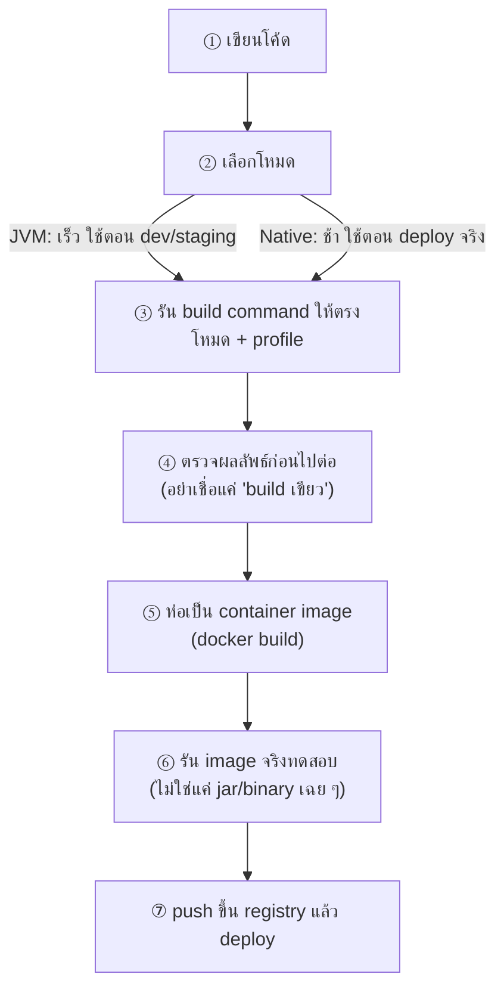

---
tags:
  - java
  - quarkus
  - build
  - native-image
  - docker
type: reference
created: 2026-08-18
---

# 🏗️ Quarkus Build — JVM และ Native

> **หลักการที่ต้องเข้าใจก่อน:** Quarkus ย้ายงานจาก runtime มาทำตอน **build**
> framework ทั่วไปจะ scan classpath / อ่าน annotation / สร้าง proxy ตอน start
> Quarkus ทำทั้งหมดนั้นตอน compile แล้ว "อบ" ผลลัพธ์ติดไปกับ artifact
>
> **ผลที่ตามมา:** config บางตัวเปลี่ยนตอน runtime ไม่ได้ ต้องเลือกตั้งแต่ตอน build

---

## 1. สองโหมด ต่างกันตรงไหน

| | JVM mode | Native mode |
|---|---|---|
| ผลลัพธ์ | JAR + JVM | binary ของ OS นั้นโดยเฉพาะ |
| เวลา build | ~1 นาที | **10-30 นาที** |
| RAM ตอน build | ปกติ | **8-16 GB** |
| เวลา start | ~1-2 วินาที | **~0.02 วินาที** |
| RAM ตอนรัน | ~200-400 MB | ~50-100 MB |
| reflection / dynamic class | ทำได้อิสระ | **ต้องประกาศล่วงหน้า** |
| debug | ปกติ | ยาก |

**Native ไม่ได้ทำให้ throughput ดีขึ้น** — มันชนะเรื่อง start time กับ memory เท่านั้น
ถ้า workload เป็นแบบรันยาว ๆ ตลอดเวลา JIT ของ JVM อาจเร็วกว่าด้วยซ้ำหลังอุ่นเครื่องแล้ว
คุ้มเมื่อ: scale to zero, serverless, container เยอะ ๆ, หรือ RAM แพง

---

## 2. ขั้นตอนการ build แบบเต็ม — จาก source จนได้ container พร้อมรัน

ภาพรวมทั้งเส้นทาง ก่อนลงรายละเอียดแต่ละขั้นในหัวข้อถัดไป



### ① เขียนโค้ด — ไม่มีอะไรพิเศษ

โค้ด Java ปกติ ยังไม่มีผลกับ build จนกว่าจะถึงขั้นตอนถัดไป

### ② เลือกโหมด — ตัดสินจากตารางข้อ 1

**อย่าลังเลถ้าไม่ชัวร์ — เริ่มด้วย JVM เสมอ** JVM build เร็ว (~1 นาที) debug ง่าย เหมาะกับระหว่างพัฒนาและ staging
ขยับไป native เฉพาะตอนจะ deploy จริง หรือกำลังจะทดสอบว่า native ทำงานถูกก่อน deploy

### ③ รัน build command

```bash
# JVM
mvn clean package

# Native (ต้องมี container runtime เช่น Docker)
mvn clean package -Pnative -Dquarkus.native.container-runtime=docker -Dquarkus.profile=prod -DskipTests=true
```

**ระบุ `-Dquarkus.profile=prod` ทุกครั้งที่ build ของจริงที่จะ deploy** ไม่ใช่แค่ตอน native — เหตุผลอยู่ในข้อ 4 ด้านล่าง (build-time config) ถ้าลืม artifact จะจำค่าของ dev ติดไปด้วย

**เวลาที่ควรเผื่อ:** JVM ~1 นาที, native **10-30 นาที** และกิน RAM 8-16 GB ระหว่าง build — ถ้าเครื่อง build มี RAM จำกัด ให้เผื่อเวลาไว้เยอะกว่าปกติ หรือลดจำนวน build ที่รันพร้อมกัน

### ④ ตรวจผลลัพธ์ก่อนไปต่อ — ขั้นที่คนข้ามบ่อยที่สุด

```bash
# JVM — ต้องมีไฟล์นี้
ls target/quarkus-app/quarkus-run.jar

# Native — ต้องมีไฟล์ที่รันได้ (นามสกุลลงท้าย -runner)
ls target/*-runner
```

**"build ผ่าน" (exit code 0) ไม่ได้แปลว่า artifact ใช้งานได้จริง** โดยเฉพาะ native ที่ GraalVM ไม่รู้ว่าโค้ดจะถูกเรียกยังไงตอน runtime (ดูข้อ 6) — **รันสั้น ๆ ทดสอบก่อนเสมอ** อย่าเพิ่งไปขั้นถัดไป

```bash
# JVM
java -jar target/quarkus-app/quarkus-run.jar &
curl http://localhost:8080/q/health
kill %1

# Native — รัน binary ตรง ๆ (บน Linux/container เท่านั้น ดูหมายเหตุข้อ 3)
./target/*-runner &
curl http://localhost:8080/q/health
kill %1
```

ดู [[Quarkus Health Check]] ถ้ายังไม่มี health endpoint ให้เช็คแบบนี้

### ⑤ ห่อเป็น container image

```bash
docker build -f src/main/docker/Dockerfile.jvm -t myapp:1.0 .
# หรือ native:
docker build -f src/main/docker/Dockerfile.native -t myapp:1.0 .
```

**เลือก Dockerfile ให้ตรงกับ artifact ที่เพิ่ง build** — Dockerfile ฝั่ง JVM คาดหวัง `target/quarkus-app/` ส่วนฝั่ง native คาดหวัง `target/*-runner` ใช้ผิดคู่กันจะ build image ไม่ผ่านหรือได้ image ที่รันไม่ได้ ดู [[Docker Dockerfile]] ถ้ายังไม่เข้าใจกลไก Dockerfile พื้นฐาน (ไฟล์ที่ไม่ถูก copy เข้า image ดูตัวอย่างที่ข้อ 7.3)

### ⑥ รัน image จริงทดสอบ — คนละขั้นกับข้อ ④

ข้อ ④ ทดสอบ jar/binary ตรง ๆ บนเครื่อง build แต่ **container มีสภาพแวดล้อมต่างจากเครื่อง build** (ไม่มี font, path ไฟล์ต่างกัน, user สิทธิ์ต่ำกว่า) — ต้องทดสอบผ่าน container จริงอีกรอบก่อนเชื่อว่าใช้งานได้

```bash
docker run --rm -p 8080:8080 myapp:1.0
curl http://localhost:8080/q/health
```

**อาการที่เจอบ่อยตรงขั้นนี้:** ผ่านข้อ ④ (รันตรง ๆ บนเครื่อง build ได้) แต่พังตรงนี้ — มักเป็นเพราะไฟล์ที่แอปต้องอ่าน (template, font, config) ไม่ได้ถูก `COPY` เข้า image (ดูข้อ 6.3) หรือ path ผูกกับ profile ผิด (ข้อ 5)

### ⑦ push และ deploy

```bash
docker tag myapp:1.0 myregistry/myapp:1.0
docker push myregistry/myapp:1.0
```

รายละเอียดเรื่อง tag/registry/deploy จริงอยู่ที่ [[Docker Compose and Deploy]] และ [[Versioning and Tagging Strategy]] (ตัดสินว่าจะตั้ง tag ยังไงให้ trace กลับได้) — ถ้าทำเป็น pipeline อัตโนมัติ ดู [[GitHub Actions Workflow Syntax]] และ [[Docker Layer Caching in CI]] เพิ่มเรื่อง cache ที่จะช้าลงถ้าไม่ได้ตั้ง CI ให้ถูก

---

## 3. Build แบบ JVM

```bash
mvn clean package
```

ได้ `target/quarkus-app/` หน้าตาแบบนี้

```
target/quarkus-app/
├── quarkus-run.jar      ← ตัวที่รัน
├── lib/                 ← dependency แยกไว้
├── app/                 ← โค้ดเรา
└── quarkus/             ← ผลลัพธ์ที่ Quarkus อบไว้ตอน build
```

```bash
java -jar target/quarkus-app/quarkus-run.jar
```

### ทำไมแยกเป็นหลายโฟลเดอร์ — **fast-jar**

เป็น default ตั้งแต่ Quarkus 1.12 การแยก `lib/` ออกมาทำให้ **Docker layer cache ทำงานได้จริง**
dependency ไม่ค่อยเปลี่ยน → layer นั้นถูก cache ไว้ แก้โค้ดแล้ว build image ใหม่จะ push แค่ layer เล็ก ๆ

```dockerfile
# เรียงแบบนี้ตั้งใจ — ของที่เปลี่ยนน้อยอยู่บน
COPY target/quarkus-app/lib/     /deployments/lib/
COPY target/quarkus-app/*.jar    /deployments/
COPY target/quarkus-app/app/     /deployments/app/
COPY target/quarkus-app/quarkus/ /deployments/quarkus/
```

| package type | ใช้เมื่อ |
|---|---|
| `fast-jar` | default — ใช้อันนี้ |
| `legacy-jar` | tool เก่าที่ต้องการ JAR เดียวแบบเดิม |
| `uber-jar` | ต้องการไฟล์เดียวจบ ไม่มี `lib/` — เสีย layer caching |
| `mutable-jar` | remote dev mode เท่านั้น ห้ามใช้ prod |

---

## 4. Build แบบ Native

### ทางเลือก: ลง GraalVM เอง หรือ build ในคอนเทนเนอร์

**container build ง่ายกว่ามาก** — ไม่ต้องลง GraalVM/Mandrel บนเครื่อง และได้ผลลัพธ์เหมือนกันทุกเครื่อง

```bash
mvn clean package -Pnative -Dquarkus.native.container-runtime=docker
```

Quarkus จะดึง builder image (Mandrel) มารันให้เอง ได้ผลเป็น `target/*-runner`

> **binary ที่ได้เป็นของ Linux** เพราะ build ในคอนเทนเนอร์ — รันบน Windows/macOS ตรง ๆ ไม่ได้ ต้องเอาไปใส่ image

### Base image สำหรับ native

| base image | ใช้เมื่อ |
|---|---|
| `ubi-minimal` | ทั่วไป มี shell/utility ติดมาด้วย debug ง่าย |
| `quarkus-micro-image` | เล็กที่สุด แทบไม่มีอะไรนอกจาก binary |
| distroless | เล็กและ attack surface ต่ำ แต่ debug ยากมาก |

```dockerfile
FROM quay.io/quarkus/quarkus-micro-image:2.0
WORKDIR /work/
COPY --chown=1001:root target/*-runner /work/application
EXPOSE 8080
USER 1001
CMD ["./application", "-Dquarkus.http.host=0.0.0.0"]
```

### ⚠️ ถ้าแอปใช้ AWT (สร้าง PDF / รูปภาพ / กราฟ)

image ขนาดเล็กมาก **ไม่มี font และ native library ที่ AWT ต้องใช้**
ผลคือตัวอักษรออกมาเป็นกล่องสี่เหลี่ยม หรือ crash ตอน render

แก้ด้วย multi-stage — เอา image ที่มี font มาเป็นแหล่ง แล้ว copy เฉพาะที่ต้องการ

```dockerfile
FROM registry.access.redhat.com/ubi8/ubi-minimal:8.9 as BUILD
RUN microdnf install freetype fontconfig

FROM quay.io/quarkus/quarkus-micro-image:2.0
COPY --from=BUILD /lib64/libfreetype.so.6 /lib64/libpng16.so.16 \
                  /lib64/libbz2.so.1 /lib64/libexpat.so.1 /lib64/
COPY --from=BUILD /usr/lib64/libfontconfig.so.1 /usr/lib64/
COPY --from=BUILD /usr/share/fonts   /usr/share/fonts
COPY --from=BUILD /etc/fonts         /etc/fonts
...
```

ได้ทั้งขนาดเล็กและ font ครบ

---

## 5. build-time config vs runtime config

config บางส่วนถูกอบติดไปกับ artifact ตั้งแต่ตอน build **เปลี่ยนตอน deploy ไม่ได้**

```bash
mvn clean package -Pnative -Dquarkus.profile=prod
```

**ถ้าลืมระบุ profile ตอน build** → artifact จะจำค่าของ profile เริ่มต้น (dev) ไว้ → ขึ้น prod แล้วพฤติกรรมผิด

ตัวอย่างคลาสสิก: path ของไฟล์ที่แอปต้องอ่าน

```properties
%dev.app.template-path=./src/main/resources/templates
%prod.app.template-path=/work/templates
```

ค่าฝั่ง prod ต้องตรงกับที่ Dockerfile วางไฟล์ไว้

```dockerfile
COPY target/classes/templates/ /work/templates
RUN ls /work/templates          # ← เช็คตอน build image ว่ามีจริง
```

> `RUN ls` บรรทัดนั้นเป็นเทคนิคที่คุ้ม — มันทำให้ **build image พังทันทีถ้าไฟล์หาย** แทนที่จะไปพังตอน runtime บน prod

---

## 6. Native พังตรงไหนบ้าง

GraalVM ทำ **closed-world analysis** — ต้องรู้ตั้งแต่ตอน build ว่าโค้ดไหนถูกเรียกบ้าง
อะไรที่ตัดสินใจตอน runtime มันมองไม่เห็น แล้ว**ตัดทิ้ง**

| ทำอะไร | ผลตอน native |
|---|---|
| `Class.forName("...")` จาก string | ClassNotFound ตอน runtime |
| reflection บนคลาสที่ไม่ได้ประกาศ | field/method หายเงียบ ๆ |
| อ่านไฟล์จาก classpath | ไม่ถูกใส่ใน binary |
| dynamic proxy | ต้องประกาศล่วงหน้า |
| serialization (Jackson, Java serial) | มัก reflection ต้องประกาศ |

### วิธีแก้

**ทางที่ควรใช้ก่อน — annotation** ในโค้ดตัวเอง อ่านง่ายและอยู่ใกล้ของที่เกี่ยวข้อง

```java
@RegisterForReflection
public class MyDto { ... }
```

**ถ้าคลาสอยู่ใน library ที่แก้ไม่ได้** ใช้ไฟล์ config

```properties
quarkus.native.additional-build-args=\
  -H:ReflectionConfigurationFiles=reflection-config.json,\
  -H:ResourceConfigurationFiles=resources-config.json
```

**อาการที่เจอบ่อยที่สุด: build ผ่าน แต่ runtime พัง**
เพราะ GraalVM ไม่รู้ว่าเราจะเรียกอะไรตอนไหน มันเลยไม่เตือน
→ **ต้องรันของจริงทดสอบทุกครั้ง อย่าเชื่อแค่ว่า build เขียว**

---

## 7. กับดักตอนตั้งค่า native build

### ⚠️ 7.1 property ซ้ำใน `pom.xml` — ตัวสุดท้ายทับหมด

`quarkus.native.additional-build-args` เป็น property ตัวเดียว รับค่าเป็น **รายการคั่นด้วยคอมมา**
คนมักเผลอเขียนแยกเป็นหลาย tag แบบนี้

```xml
<!-- ❌ Maven เก็บแค่ตัวสุดท้าย อีก 3 บรรทัดเป็นโค้ดตาย -->
<properties>
    <quarkus.native.additional-build-args>-H:+JNI</quarkus.native.additional-build-args>
    <quarkus.native.additional-build-args>-H:EnableURLProtocols=http,https</quarkus.native.additional-build-args>
    <quarkus.native.additional-build-args>-H:ReflectionConfigurationFiles=reflection-config.json</quarkus.native.additional-build-args>
    <quarkus.native.additional-build-args>-H:IncludeResources=templates</quarkus.native.additional-build-args>
</properties>
```

```xml
<!-- ✅ รวมเป็นตัวเดียว คั่นด้วยคอมมา -->
<properties>
    <quarkus.native.additional-build-args>
        -H:+JNI,
        -H:EnableURLProtocols=http\,https,
        -H:ReflectionConfigurationFiles=reflection-config.json,
        -H:IncludeResources=templates
    </quarkus.native.additional-build-args>
</properties>
```

> ค่าที่มีคอมมาอยู่ข้างในต้อง escape ด้วย `\,` ไม่งั้นมันถูกตีความเป็นตัวคั่น

**อาการของบั๊กนี้ร้ายตรงที่ build ยังผ่าน** — แค่ argument ที่ตั้งใจใส่ไม่ได้ถูกส่งไปจริง แล้วไปพังตอน runtime แทน

**วิธีเช็คว่า argument ไหนถูกส่งไปจริง:** ดู log ตอน build หาบรรทัดที่ขึ้นต้นว่า `Executing: ... native-image ...` แล้วอ่าน command line ที่แท้จริง

### ⚠️ 7.2 flag เก่าที่ถูกถอดออกจาก GraalVM แล้ว

ตัวอย่างที่ยังเจอในบล็อกเก่า ๆ และ copy ต่อกันมา

| flag | สถานะ |
|---|---|
| `--allow-incomplete-classpath` | **ถอดออกแล้ว** ใส่แล้ว build fail |
| `--enable-all-security-services` | deprecated ตั้งแต่ GraalVM 21 |
| `-H:+ReportUnsupportedElementsAtRuntime` | deprecated |

**ระวังลำดับการแก้:** ถ้าโปรเจกต์มีบั๊กข้อ 7.1 อยู่ (flag เก่าไม่เคยถูกส่งไปจริง) แล้วไป "แก้" ด้วยการรวมทุกบรรทัดเข้าด้วยกัน **build จะพังทันที** เพราะ flag เก่าเพิ่งถูกส่งไปจริงเป็นครั้งแรก
→ ต้องล้าง flag ที่เลิกใช้แล้วออกไปพร้อมกันในครั้งเดียว

### 7.3 ไฟล์ที่ต้องติดไปกับ image

`COPY` เฉพาะ binary อย่างเดียวไม่พอ ถ้าแอปอ่านไฟล์จากดิสก์ตอน runtime (template, script, config)
ตรวจว่า Dockerfile copy ครบทุกโฟลเดอร์ที่ config ชี้ไป — ของที่ประกาศใน properties แต่ไม่ได้ copy จะเงียบจนกว่าจะมีคนเรียกใช้

---

## 8. เวอร์ชันกับชื่อ property

`quarkus.package.type=native` **deprecated ตั้งแต่ Quarkus 3.8** เปลี่ยนเป็น

```properties
quarkus.native.enabled=true
quarkus.package.jar.type=fast-jar
```

ของเก่ายังใช้ได้อยู่ระยะหนึ่ง แต่จำไว้ตอนอัปเวอร์ชัน

---

## 9. Cheat sheet

```bash
# dev — live reload
mvn compile quarkus:dev

# JVM build
mvn clean package
java -jar target/quarkus-app/quarkus-run.jar

# native build ในคอนเทนเนอร์
mvn clean package -Pnative \
  -Dquarkus.native.container-runtime=docker \
  -Dquarkus.profile=prod \
  -DskipTests=true

# build image
docker build -f src/main/docker/Dockerfile.native -t myapp:1.0 .
```

| อาการ | สาเหตุ |
|---|---|
| native build ค้าง / เครื่องหน่วง | RAM ไม่พอ ต้องการ 8-16 GB |
| build ผ่าน แต่ start แล้วพังหา class ไม่เจอ | ขาด reflection config |
| หาไฟล์ไม่เจอบน prod | ลืมระบุ profile ตอน build หรือ Dockerfile ไม่ได้ copy ไฟล์นั้น |
| ตัวอักษรใน PDF/รูป เป็นกล่องสี่เหลี่ยม | image ไม่มี font — ต้อง copy font library เข้าไป |
| ใส่ native build arg แล้วไม่มีผล | property ซ้ำใน pom — ตัวสุดท้ายทับหมด |
| แก้ config แล้วไม่มีผล | เป็น build-time config ต้อง build ใหม่ |

---

## 🔗 เกี่ยวข้อง

- [[Quarkus]] — หน้ารวม
- [[Quarkus Hibernate]] — entity ที่อยู่นอก package ที่ประกาศไว้จะหายเงียบตอน native
- [[Docker Dockerfile]] — พื้นฐาน Dockerfile/layer/multi-stage ที่ Dockerfile ของ Quarkus ใช้อยู่จริง

## 📖 อ่านต่อ

- [Quarkus — Building a Native Executable](https://quarkus.io/guides/building-native-image)
- [Quarkus — Native Reference Guide](https://quarkus.io/guides/native-reference)
- [Quarkus — Container Images](https://quarkus.io/guides/container-image)
