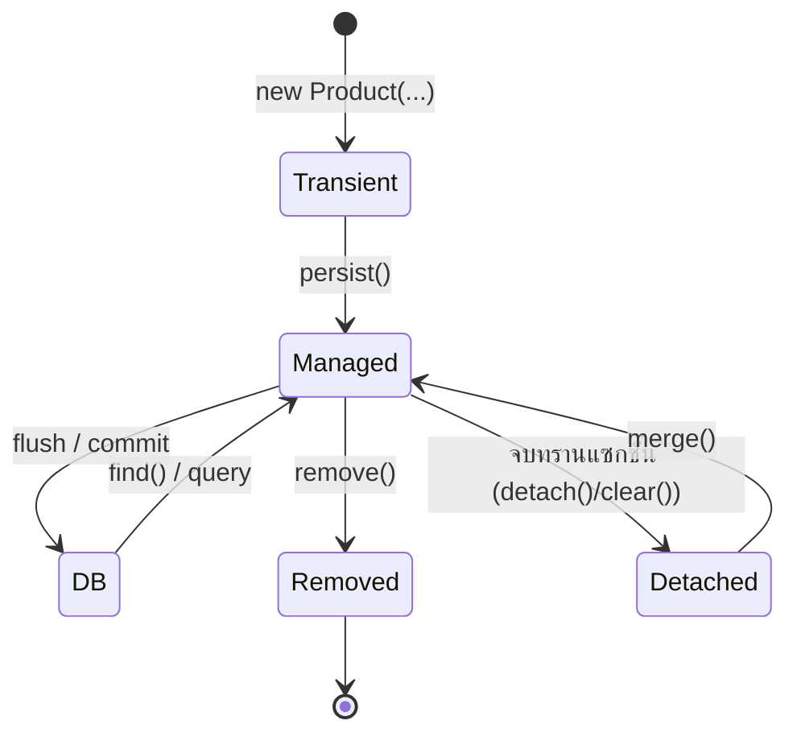

---
tags:
  - java
  - quarkus
  - hibernate
  - jpa
  - entitymanager
type: reference
created: 2026-08-18
---

# 🧭 EntityManager — สไตล์การเขียนที่ควรใช้

> คู่มือสำหรับคนที่ใช้ `EntityManager` ตรง ๆ ไม่ผ่าน [[Quarkus Panache]]
> ทฤษฎีเบื้องหลัง (transaction, N+1, type mapping) อยู่ที่ [[Quarkus Hibernate]] — อันนี้เน้นว่า**เขียนออกมาหน้าตาแบบไหน**

---

## 1. EntityManager คืออะไรกันแน่

ไม่ใช่แค่ "ตัวยิง query" — มันคือ **persistence context** ซึ่งเป็นสมุดจดว่าตอนนี้เรากำลังถือ entity ตัวไหนอยู่บ้าง และแต่ละตัวมีค่าอะไร

หน้าที่ที่มันทำให้เงียบ ๆ:

- **first-level cache** — `find()` ตัวเดิมสองครั้งในทรานแซกชันเดียว ยิง SQL แค่ครั้งเดียว
- **dirty checking** — จำค่าตอนโหลดมา แล้วเทียบตอน commit ถ้าต่างก็ `UPDATE` ให้เอง
- **identity guarantee** — entity id เดียวกันในทรานแซกชันเดียว คือ object ตัวเดียวกันเสมอ (`==` เป็นจริง)

**อายุของ persistence context = อายุของทรานแซกชัน** ออกนอกทรานแซกชันเมื่อไหร่ สมุดจดถูกปิด entity ทั้งหมดกลายเป็น detached

---

## 2. โครงพื้นฐาน — วางของให้ถูกชั้น

```java
@ApplicationScoped
public class ProductRepository {

    @Inject EntityManager em;          // ← inject ได้เลย ไม่ต้องสร้างเอง ไม่ต้องปิด

    public Optional<Product> findByCode(String code) {
        return em.createQuery("""
                    select p from Product p
                    where p.code = :code
                    """, Product.class)
                 .setParameter("code", code)
                 .getResultStream()
                 .findFirst();
    }

    public void save(Product p) {
        em.persist(p);
    }
}
```

```java
@ApplicationScoped
public class ProductService {

    @Inject ProductRepository repo;

    // อ่านอย่างเดียว — ไม่ต้องมี @Transactional
    public ProductResponse get(String code) {
        return repo.findByCode(code)
                   .map(ProductResponse::from)
                   .orElseThrow(() -> new NotFoundException("product " + code));
    }

    @Transactional                      // ← ขอบเขตทรานแซกชันอยู่ตรงนี้ที่เดียว
    public ProductResponse create(CreateRequest req) {
        repo.findByCode(req.code()).ifPresent(x -> {
            throw new IllegalArgumentException("duplicate code");
        });
        Product p = new Product(req.code(), req.name(), req.price());
        repo.save(p);
        return ProductResponse.from(p);
    }
}
```

**กฎการวาง 3 ข้อ**

| ชั้น | หน้าที่ | ห้ามมี |
|---|---|---|
| Resource | รับ/ส่ง HTTP แปลง DTO | `EntityManager`, `@Transactional` |
| Service | business logic, ขอบเขตทรานแซกชัน | JPQL |
| Repository | คุยกับ DB อย่างเดียว | `@Transactional`, business rule |

`@Transactional` อยู่ที่ **service** เพราะทรานแซกชันคือหน่วยของ *งานทางธุรกิจ* ไม่ใช่หน่วยของการเขียน DB ถ้าไปวางที่ repository แล้วหนึ่ง use case ต้องเขียนสามตาราง จะกลายเป็นสามทรานแซกชันแยกกัน — พังครึ่งทางแล้วข้อมูลค้างไม่ครบ

---

## 3. สถานะของ entity — เข้าใจอันนี้แล้วเรื่องอื่นง่ายหมด



| สถานะ | แปลว่า | แก้ค่าแล้วบันทึกไหม |
|---|---|---|
| **Transient** | เพิ่ง `new` ยังไม่เคยรู้จัก DB | ❌ |
| **Managed** | อยู่ใน persistence context | ✅ **อัตโนมัติ ไม่ต้องเรียกอะไร** |
| **Detached** | เคย managed แต่ทรานแซกชันจบแล้ว | ❌ |
| **Removed** | สั่ง `remove()` แล้ว รอ `DELETE` ตอน commit | — |

**ข้อที่คนใหม่แปลกใจที่สุด**

```java
@Transactional
public void rename(Long id, String name) {
    Product p = em.find(Product.class, id);
    p.setName(name);
    // ไม่ต้องเรียก em.merge() หรือ em.persist() — dirty checking จัดการตอน commit
}
```

การเรียก `merge()` กับ entity ที่ managed อยู่แล้ว **ไม่ผิด แต่ไม่จำเป็น** และทำให้คนอ่านโค้ดเข้าใจผิดว่าจำเป็น

---

## 4. เมธอดที่มีให้ใช้

| เมธอด | ทำอะไร | ใช้เมื่อ |
|---|---|---|
| `persist(e)` | เอา entity **ใหม่** เข้า context | สร้างของใหม่เท่านั้น |
| `merge(e)` | คัดลอกค่าจาก detached เข้า context **แล้วคืน object ตัวใหม่** | รับ object จากข้างนอกทรานแซกชัน |
| `find(C, id)` | โหลดทันที คืน `null` ถ้าไม่เจอ | ต้องใช้ค่าข้างใน |
| `getReference(C, id)` | คืน proxy ยังไม่ยิง SQL | แค่จะเอาไปผูกเป็น FK |
| `remove(e)` | ลบ (entity ต้อง managed) | — |
| `flush()` | ดันคำสั่งที่ค้างลง DB เดี๋ยวนี้ | อยากได้ id ทันที หรือ bulk insert |
| `clear()` | ล้าง context ทั้งหมด entity กลายเป็น detached | bulk operation |
| `detach(e)` | ถอด entity ตัวเดียวออก | นาน ๆ ใช้ที |
| `refresh(e)` | โหลดค่าใหม่จาก DB ทับของในมือ | หลัง bulk update |
| `createQuery(...)` | JPQL | ส่วนใหญ่ใช้ตัวนี้ |
| `createNamedQuery(...)` | query ที่ประกาศไว้บน entity | query ตายตัวที่ใช้ซ้ำ |
| `createNativeQuery(...)` | SQL ดิบ | ฟีเจอร์เฉพาะของ DB |
| `getCriteriaBuilder()` | สร้าง query แบบประกอบทีละชิ้น | เงื่อนไขเปลี่ยนตาม input จริง ๆ |

---

## 5. `persist` กับ `merge` — จุดที่พลาดกันบ่อย

```java
// ✅ ของใหม่
Product p = new Product("P001", "Widget");
em.persist(p);          // ตัว p เองกลายเป็น managed, id ถูกเติมให้

// ✅ ของที่หลุดออกมาจากทรานแซกชันก่อนหน้า
Product merged = em.merge(detachedProduct);
merged.setName("x");    // ← ต้องแก้ที่ตัวที่ merge คืนมา
```

**`merge()` คืน object คนละตัวกับที่ส่งเข้าไป** — ตัวที่ส่งเข้าไปยังคง detached เหมือนเดิม แก้ค่ามันต่อไปก็ไม่มีผล

```java
em.merge(p);
p.setName("ใหม่");      // ❌ ไม่ถูกบันทึก — p ยัง detached อยู่
```

**อย่าใช้ `merge` เป็นค่าเริ่มต้นเพราะ "มันทำงานได้ทุกกรณี"** — `merge` ต้อง `SELECT` ก่อนเสมอเพื่อดูว่าของเดิมเป็นยังไง เปลืองกว่า `persist` โดยไม่จำเป็น และซ่อนบั๊กประเภท "ตั้งใจสร้างใหม่แต่ไปทับของเก่า"

---

## 6. `find` กับ `getReference`

```java
// ต้องใช้ค่าข้างใน → find
Product p = em.find(Product.class, id);
if (p == null) throw new NotFoundException();

// แค่เอาไปผูกเป็น FK → getReference (ไม่ยิง SELECT)
order.setProduct(em.getReference(Product.class, productId));
em.persist(order);
```

`getReference` ประหยัด round trip ได้จริงเมื่อผูกความสัมพันธ์เป็นชุด ๆ

> **ข้อควรระวัง:** ถ้า id ไม่มีอยู่จริง `getReference` จะไม่พังทันที แต่ไป throw `EntityNotFoundException` ตอนที่มีคนแตะ field แรก ซึ่งอาจเป็นคนละที่คนละเวลากับต้นเหตุ — ใช้เฉพาะตอนที่มั่นใจว่า id มีจริง

---

## 7. เขียน query — เลือกให้ถูกแบบ

| แบบ | เขียนยังไง | ตรวจตอนไหน | ใช้เมื่อ |
|---|---|---|---|
| **JPQL** | `createQuery(jpql, Class)` | runtime | **ค่าเริ่มต้น ใช้ตัวนี้** |
| **Named query** | `@NamedQuery` บน entity | **ตอนแอปสตาร์ต** | query ตายตัวที่ใช้หลายที่ |
| **Criteria API** | `getCriteriaBuilder()` | compile | เงื่อนไขเปลี่ยนตาม input จริง ๆ |
| **Native SQL** | `createNativeQuery(sql)` | runtime | window function, hint, ฟีเจอร์เฉพาะ DB |

### JPQL — ใช้ text block เสมอ

```java
public List<Product> findActiveByCategory(String category) {
    return em.createQuery("""
                select p
                from Product p
                where p.status = :status
                  and p.category.name = :category
                order by p.code
                """, Product.class)          // ← ระบุ type เสมอ
             .setParameter("status", Status.ACTIVE)
             .setParameter("category", category)
             .getResultList();
}
```

**สามข้อที่ทำให้อ่านง่ายขึ้นทันที** — text block แทนการต่อ string, `setParameter` แบบชื่อแทนเลขลำดับ, และระบุคลาสผลลัพธ์ใน `createQuery` เพื่อไม่ต้อง cast

### Named query — ได้ fail fast ฟรี

```java
@Entity
@NamedQuery(name = "Product.findByStatus",
            query = "select p from Product p where p.status = :status")
public class Product { ... }
```

```java
em.createNamedQuery("Product.findByStatus", Product.class)
  .setParameter("status", Status.ACTIVE)
  .getResultList();
```

**ข้อดีจริงคือมันถูกตรวจตอนแอปสตาร์ต** — พิมพ์ชื่อ field ผิด แอปไม่ขึ้นเลย ดีกว่าไปพังตอนมีคนกดใช้ฟีเจอร์นั้นบน prod

### Criteria API — เฉพาะที่จำเป็น

```java
public List<Product> search(String keyword, Status status) {
    var cb = em.getCriteriaBuilder();
    var cq = cb.createQuery(Product.class);
    var root = cq.from(Product.class);

    var predicates = new ArrayList<Predicate>();
    if (keyword != null)
        predicates.add(cb.like(cb.lower(root.get("name")), "%" + keyword.toLowerCase() + "%"));
    if (status != null)
        predicates.add(cb.equal(root.get("status"), status));

    cq.where(predicates.toArray(Predicate[]::new));
    return em.createQuery(cq).getResultList();
}
```

**Criteria ยาวและอ่านยากกว่ามาก** ใช้เมื่อจำนวนเงื่อนไขเปลี่ยนจริง ๆ เท่านั้น
ถ้าเงื่อนไขมีไม่กี่แบบ เขียน JPQL ที่รองรับพารามิเตอร์ว่างอ่านง่ายกว่าเยอะ

```java
where (:keyword is null or lower(p.name) like :keyword)
  and (:status  is null or p.status = :status)
```

---

## 8. `createNativeQuery` — ยิง SQL ดิบ

### 8.1 ใช้เมื่อไหร่

JPQL ครอบคลุมงานส่วนใหญ่ แต่มีของที่มันทำไม่ได้เพราะไม่ได้อยู่ในสเปก

| ทำอะไรได้ที่ JPQL ทำไม่ได้ | ตัวอย่าง |
|---|---|
| **Window function** | `row_number()`, `rank()`, `lag()`, `sum() over (...)` |
| **CTE / recursive** | `with recursive tree as (...)` — ไล่โครงสร้างต้นไม้ |
| **ฟังก์ชันเฉพาะ DB** | `json_extract`, `group_concat`, `date_format`, full-text search |
| **คำสั่งเฉพาะยี่ห้อ** | `insert ... on duplicate key update`, `upsert` |
| **แตะตารางที่ไม่ได้ map เป็น entity** | ตาราง log, ตาราง staging, view สำหรับรายงาน |
| **query รายงานที่ join หลายตารางแบบไม่มี relation** | สรุปยอดข้ามระบบ |

**เกณฑ์ตัดสิน:** ใช้ native เมื่อ JPQL **ทำไม่ได้จริง ๆ** ไม่ใช่เพราะ "เขียน SQL ถนัดกว่า" — สิ่งที่แลกไปคือความสามารถในการเปลี่ยน DB และการตรวจสอบตอนสตาร์ต

### 8.2 ผลลัพธ์มีสามแบบ เลือกให้ถูก

#### แบบที่ 1 — `Object[]` (ค่าเริ่มต้น) — **เลี่ยงถ้าเลี่ยงได้**

```java
List<Object[]> rows = em.createNativeQuery("""
        select p.code, p.name, sum(o.qty)
        from product p
        join order_item o on o.product_id = p.id
        group by p.code, p.name
        """).getResultList();

for (Object[] r : rows) {
    String code = (String) r[0];        // ← อ้างด้วยเลข index
    Long total  = (Long)   r[2];        // ← จะระเบิดตรงนี้ ดูข้อ 8.4
}
```

**ปัญหาคือมันเปราะมาก** — สลับลำดับคอลัมน์ใน SQL เมื่อไหร่ โค้ด Java พังทันทีโดยไม่มีอะไรเตือน และ `r[2]` ก็ไม่ได้บอกว่ามันคืออะไร

#### แบบที่ 2 — `Tuple` — อ้างด้วยชื่อคอลัมน์

```java
List<Tuple> rows = em.createNativeQuery("""
        select p.code as code, p.name as name, coalesce(sum(o.qty), 0) as total
        from product p
        left join order_item o on o.product_id = p.id
        group by p.code, p.name
        """, Tuple.class).getResultList();

for (Tuple t : rows) {
    String code  = t.get("code", String.class);
    long   total = ((Number) t.get("total")).longValue();
}
```

**ดีกว่า `Object[]` ชัดเจน** — ตั้ง alias ใน SQL แล้วอ้างด้วยชื่อ สลับลำดับคอลัมน์ก็ไม่พัง และอ่านรู้เรื่องว่ากำลังหยิบอะไร

#### แบบที่ 3 — map เป็น entity หรือ DTO

```java
// เป็น entity — ต้อง select ครบทุกคอลัมน์ที่ entity map ไว้
List<Product> ps = em.createNativeQuery(
        "select * from product where match(name) against (:kw in boolean mode)",
        Product.class)
    .setParameter("kw", keyword)
    .getResultList();
```

> **ถ้า select ไม่ครบทุกคอลัมน์ที่ entity ประกาศไว้ จะพัง** และผลลัพธ์จะเข้า persistence context ด้วย (dirty checking ทำงาน) ซึ่งบางทีก็ไม่ใช่สิ่งที่ต้องการสำหรับ query รายงาน

```java
// เป็น DTO ผ่าน @SqlResultSetMapping — ประกาศไว้บน entity ตัวใดตัวหนึ่ง
@SqlResultSetMapping(
    name = "ProductSalesMapping",
    classes = @ConstructorResult(
        targetClass = ProductSales.class,
        columns = {
            @ColumnResult(name = "code",  type = String.class),
            @ColumnResult(name = "total", type = Long.class)     // ← บังคับ type ตรงนี้
        }))
public class Product { ... }
```

```java
public record ProductSales(String code, Long total) {}

List<ProductSales> rows = em.createNativeQuery(sql, "ProductSalesMapping")
                            .getResultList();
```

**`@ColumnResult(type = ...)` แก้ปัญหา type แปลก ๆ ให้ในตัว** — Hibernate แปลงให้ตามที่ประกาศ ไม่ต้องมานั่ง cast เอง เป็นทางที่สะอาดที่สุดถ้า query นั้นใช้ซ้ำหลายที่

### 8.3 พารามิเตอร์ — เหมือนเดิม ห้ามต่อ string

```java
em.createNativeQuery("select * from product where code = :code", Product.class)
  .setParameter("code", code);
```

`:name` และ `?1` ใช้ได้ทั้งคู่ **ข้อห้ามเรื่องการต่อ string เข้มกว่า JPQL อีก** เพราะที่นี่ไม่มีชั้นแปลภาษาช่วยกรองอะไรเลย — ที่พิมพ์ไปคือที่ DB ได้รับตรง ๆ

**`in` clause** ผูกเป็น collection ได้

```java
.setParameter("ids", List.of(1L, 2L, 3L))    // where id in (:ids)
```

### 8.4 🛡️ ดัก null และ type ให้ไม่ระเบิด

**นี่คือส่วนที่ native query ต่างจาก JPQL มากที่สุด** เพราะไม่มีชั้นไหนมาช่วยแปลง type หรือกัน null ให้เลย

#### ปัญหาที่ 1 — `sum()` / `max()` / `avg()` คืน `NULL` เมื่อไม่มีแถว

```sql
-- ไม่มีแถวตรงเงื่อนไข → คืน NULL ไม่ใช่ 0
select sum(qty) from order_item where product_id = 999
```

```java
Long total = (Long) query.getSingleResult();
long x = total;                              // ❌ NullPointerException ตอน unbox
```

**แก้ที่ SQL ไม่ใช่ที่ Java**

```sql
select coalesce(sum(qty), 0) as total from order_item where product_id = :id
```

> **`count()` ต่างจากพวกนี้ — มันคืน 0 เสมอ ไม่เคยคืน NULL** อย่าเผลอเหมารวมว่า aggregate ทุกตัวเหมือนกัน

#### ปัญหาที่ 2 — `left join` ทำให้คอลัมน์เป็น null

ทุกคอลัมน์ที่มาจากฝั่งขวาของ `left join` เป็น null ได้เสมอ ใส่ `coalesce` ให้ครบ

```sql
select p.code,
       coalesce(c.name, '-')        as category_name,
       coalesce(sum(o.qty), 0)      as total
from product p
left join category   c on c.id = p.category_id
left join order_item o on o.product_id = p.id
group by p.code, c.name
```

#### ปัญหาที่ 3 — ตัวเลขกลับมาเป็น type ที่ไม่คาดคิด

driver แต่ละยี่ห้อคืนตัวเลขเป็นคนละคลาส — `Integer`, `Long`, `BigInteger`, `BigDecimal` และ**เปลี่ยนได้เมื่ออัปเกรด driver**

```java
Long n = (Long) row[0];               // ❌ ClassCastException: BigDecimal → Long
```

**ทางแก้: cast เป็น `Number` แล้วแปลงเอา** — `Integer`, `Long`, `BigInteger`, `BigDecimal` สืบทอดจาก `Number` ทั้งหมด

```java
long n = ((Number) row[0]).longValue();       // ✅ ใช้ได้กับทุกกรณี
```

#### ตัวช่วยที่ควรมีติดโปรเจกต์

เขียนครั้งเดียวแล้วใช้ทุกที่ ดีกว่ากระจาย null check ไปทั่ว

```java
public final class Sql {
    private Sql() {}

    public static long toLong(Object v)          { return toLong(v, 0L); }
    public static long toLong(Object v, long d)  { return v == null ? d : ((Number) v).longValue(); }

    public static BigDecimal toDecimal(Object v) {
        return v == null ? BigDecimal.ZERO
             : v instanceof BigDecimal b ? b
             : BigDecimal.valueOf(((Number) v).doubleValue());
    }

    public static String toStr(Object v)         { return v == null ? "" : v.toString(); }

    public static LocalDate toDate(Object v) {
        return v == null ? null
             : v instanceof java.sql.Date d ? d.toLocalDate()
             : ((java.sql.Timestamp) v).toLocalDateTime().toLocalDate();
    }

    public static boolean toBool(Object v)       { return v != null && ((Number) v).intValue() != 0; }
}
```

```java
for (Tuple t : rows) {
    var dto = new ProductSales(
        Sql.toStr(t.get("code")),
        Sql.toLong(t.get("total")),
        Sql.toDecimal(t.get("amount")));
}
```

#### ปัญหาที่ 4 — ส่ง `null` เป็นพารามิเตอร์

```java
.setParameter("status", null)       // ⚠️ driver บางตัวเดา type ไม่ออก
```

driver ต้องรู้ว่า null นั้นเป็น type อะไรถึงจะ bind ได้ **ทางที่ปลอดภัยคือเขียน SQL ให้รองรับพารามิเตอร์ว่างไปเลย** แทนที่จะส่ง null เข้าไปตรง ๆ

```sql
where (:status is null or p.status = :status)
```

หรือถ้าเลี่ยงไม่ได้จริง ๆ ให้ระบุ type ผ่าน Hibernate

```java
query.unwrap(org.hibernate.query.NativeQuery.class)
     .setParameter("status", null, StandardBasicTypes.STRING);
```

### 8.5 กฎการเขียนให้อ่านรอด

```java
public List<ProductSales> salesReport(LocalDate from, LocalDate to) {
    return em.createNativeQuery("""
            select p.code                    as code,
                   coalesce(sum(o.qty), 0)   as total_qty,
                   coalesce(sum(o.amount), 0) as total_amount
            from product p
            left join order_item o on o.product_id = p.id
                                  and o.order_date between :from and :to
            group by p.code
            order by total_amount desc
            """, Tuple.class)
        .setParameter("from", from)
        .setParameter("to", to)
        .getResultList()
        .stream()
        .map(t -> new ProductSales(
                Sql.toStr(t.get("code")),
                Sql.toLong(t.get("total_qty")),
                Sql.toDecimal(t.get("total_amount"))))
        .toList();
}
```

**หกข้อที่ทำให้โค้ดชุดนี้ต่างจากที่คนส่วนใหญ่เขียน**

1. **text block** — SQL หลายบรรทัดอ่านได้เหมือนตอนรันใน DB client
2. **ตั้ง alias ให้ทุกคอลัมน์** — บังคับให้อ้างด้วยชื่อได้ และตั้งชื่อที่สื่อความหมาย
3. **`coalesce` ทุก aggregate และทุกคอลัมน์จากฝั่ง `left join`** — กัน null ตั้งแต่ที่ต้นทาง
4. **`Tuple` ไม่ใช่ `Object[]`** — สลับลำดับคอลัมน์แล้วไม่พัง
5. **แปลงเป็น record ทันทีในเมธอดเดียวกัน** — ไม่ปล่อยให้ `Tuple` หลุดออกไปนอก repository
6. **ผ่านตัวช่วย `Sql.*`** — null และ type แปลก ๆ ถูกจัดการที่เดียว

### 8.6 คำสั่งที่แก้ข้อมูล

```java
@Transactional
public int archiveOld(LocalDate before) {
    int n = em.createNativeQuery("""
            insert into product_archive (id, code, archived_at)
            select id, code, now() from product where released_on < :d
            """)
        .setParameter("d", before)
        .executeUpdate();
    em.clear();          // ← สำคัญ
    return n;
}
```

**native query ที่แก้ข้อมูลไม่ผ่าน persistence context เลย** Hibernate ไม่รู้ว่ามีอะไรเปลี่ยน entity ที่โหลดไว้ก่อนหน้าจะยังเป็นค่าเก่า และที่แย่กว่านั้นคือ**ถ้ามีของค้างรอ flush อยู่ มันอาจถูกเขียนทีหลังแล้วทับผลของ native query** — เรียก `em.flush()` ก่อนและ `em.clear()` หลัง เมื่อทำงานปนกัน

### 8.7 มีหลาย field — ทางเลือกที่ไม่ต้องนั่ง map เอง

`Tuple` + แปลงมือ ใช้ได้ดีกับ 3–5 คอลัมน์ แต่พอมี 15 คอลัมน์มันกลายเป็นงานน่าเบื่อและพลาดง่าย มีทางเลือกอยู่ 4 แบบ

#### ทางที่ 1 — ถ้าเขียนเป็น JPQL ได้ ใช้ constructor expression (ดีที่สุด)

**ก่อนจะไปหาทางแก้ฝั่ง native ให้เช็คก่อนว่าจำเป็นต้อง native จริงไหม** เพราะ JPQL ทำ DTO projection ได้โดยไม่ต้องประกาศอะไรเพิ่มเลย

```java
public record ProductSales(String code, String name, Long qty, BigDecimal amount) {}
```

```java
em.createQuery("""
        select new org.acme.ProductSales(p.code, p.name, sum(o.qty), sum(o.amount))
        from Product p left join p.orderItems o
        group by p.code, p.name
        """, ProductSales.class).getResultList();
```

ใช้ได้กับ record ตรง ๆ ไม่ต้องมี annotation ไม่ต้องมี transformer และมี type safety ระดับหนึ่ง

#### ทางที่ 2 — `@SqlResultSetMapping` + `@ConstructorResult` (มาตรฐาน JPA)

ประกาศครั้งเดียว ใช้ได้ตลอด **ไม่มีโค้ด map ต่อการเรียกใช้เลย**

```java
@SqlResultSetMapping(
    name = "ProductSalesMapping",
    classes = @ConstructorResult(
        targetClass = ProductSales.class,
        columns = {
            @ColumnResult(name = "code",   type = String.class),
            @ColumnResult(name = "name",   type = String.class),
            @ColumnResult(name = "qty",    type = Long.class),
            @ColumnResult(name = "amount", type = BigDecimal.class)
        }))
@Entity
public class Product { ... }
```

```java
List<ProductSales> rows = em.createNativeQuery(sql, "ProductSalesMapping").getResultList();
```

| ข้อดี | ข้อเสีย |
|---|---|
| ใช้ได้กับ **record** | annotation ยาว |
| บังคับ type ให้ ไม่ต้อง cast | **ลำดับใน `columns` ต้องตรงกับลำดับพารามิเตอร์ของ constructor** |
| เป็นมาตรฐาน JPA ไม่ผูกกับ Hibernate | ประกาศอยู่บน entity ซึ่งดูแปลก ๆ ถ้า query ไม่เกี่ยวกับ entity นั้น |

> ตัวประกาศจะอยู่บน entity ตัวไหนก็ได้ ไม่จำเป็นต้องเกี่ยวกับ query — ถ้ามีหลายอันแนะนำสร้าง entity เปล่า ๆ ไว้เก็บ mapping โดยเฉพาะ หรือย้ายไปประกาศใน `orm.xml`

#### ทางที่ 3 — `AliasToBeanResultTransformer` (ไม่ต้องประกาศอะไรเลย)

จับคู่ **alias ใน SQL กับ property ของคลาส** ด้วย reflection — เขียน SQL อย่างเดียวก็จบ

```java
public class ProductSalesDto {          // ← ต้องเป็นคลาสธรรมดา ไม่ใช่ record
    private String code;
    private String name;
    private Long qty;
    private BigDecimal amount;
    // no-arg constructor + setter ครบทุกตัว
}
```

```java
List<ProductSalesDto> rows = em.createNativeQuery("""
        select p.code as code, p.name as name,
               coalesce(sum(o.qty), 0) as qty,
               coalesce(sum(o.amount), 0) as amount
        from product p ...
        """)
    .unwrap(org.hibernate.query.NativeQuery.class)
    .setTupleTransformer(new AliasToBeanResultTransformer<>(ProductSalesDto.class))
    .getResultList();
```

**เหมาะสุดเมื่อมีคอลัมน์เยอะมาก** เพราะเพิ่มคอลัมน์ = เพิ่ม field + alias เท่านั้น ไม่ต้องแก้ที่อื่น

**สามข้อที่ต้องรู้ก่อนใช้**

- **ใช้กับ record ไม่ได้** — มันต้องการ no-arg constructor แล้วเรียก setter ซึ่งขัดกับ record โดยสิ้นเชิง ถ้ายืนยันจะใช้ record ต้องกลับไปทางที่ 2
- **alias ต้องสะกดตรงกับชื่อ property เป๊ะ ๆ** — `total_qty` ไม่เข้ากับ `totalQty` ต้องตั้ง alias เป็น `totalQty` และ DB บางตัวคืน alias เป็นตัวพิมพ์ใหญ่หมด ต้องลองจริงก่อน
- **ผูกกับ Hibernate** ไม่ใช่ API มาตรฐาน JPA และเคยถูกปรับโครงมาแล้วรอบหนึ่งตอน Hibernate 6 (ย้ายจาก `ResultTransformer` มาเป็น `TupleTransformer`) — มีโอกาสเปลี่ยนอีก

#### ทางที่ 4 — `@Subselect` + `@Immutable` (เมื่อ query นั้นใช้บ่อยมาก)

**ทางนี้คนรู้จักน้อยแต่ทรงพลังที่สุด** — map ทั้ง SQL query เป็น entity อ่านอย่างเดียว แล้วหลังจากนั้น**ใช้ JPQL กับมันได้เหมือนตารางปกติ**

```java
@Entity
@Immutable                    // Hibernate จะไม่พยายามเขียนกลับ
@Subselect("""
    select p.id           as id,
           p.code         as code,
           p.name         as name,
           coalesce(sum(o.qty), 0)    as qty,
           coalesce(sum(o.amount), 0) as amount
    from product p
    left join order_item o on o.product_id = p.id
    group by p.id, p.code, p.name
    """)
@Synchronize({"product", "order_item"})   // บอกว่าอิงตารางไหน เพื่อให้ flush ถูกจังหวะ
public class ProductSalesView {
    @Id private Long id;
    private String code;
    private String name;
    private Long qty;
    private BigDecimal amount;
    // getter อย่างเดียว ไม่ต้องมี setter
}
```

```java
// จากนี้ไปใช้ JPQL ได้เลย — filter, sort, paginate, projection ครบ
em.createQuery("""
        select v from ProductSalesView v
        where v.amount > :min
        order by v.amount desc
        """, ProductSalesView.class)
    .setParameter("min", min)
    .setFirstResult(0).setMaxResults(20)
    .getResultList();
```

| ได้อะไร | ต้องแลกอะไร |
|---|---|
| เขียน SQL ครั้งเดียว หลังจากนั้นเป็น JPQL หมด | อ่านอย่างเดียว เขียนไม่ได้ |
| filter / sort / paginate ได้โดยไม่ต้องแก้ SQL | ต้องมี `@Id` ที่ unique จริงในผลลัพธ์ |
| ไม่มีโค้ด map เลยสักบรรทัด | ถ้า subselect หนัก การ filter ข้างนอกอาจไม่ถูก optimize อย่างที่คิด |
| ใช้ `@ColumnResult` ไม่ต้อง cast ไม่ต้องกัน null ซ้ำ | ผูกกับ Hibernate |

> ถ้าควบคุม schema ได้ **สร้าง VIEW ใน DB แล้ว map เป็น `@Immutable @Entity` ธรรมดาก็ให้ผลเหมือนกัน** และดีกว่าตรงที่ SQL ไปอยู่ใน DB ให้ DBA ช่วยดู optimize ได้

#### เลือกยังไง

| สถานการณ์ | ใช้ |
|---|---|
| เขียนเป็น JPQL ได้ | **constructor expression** — จบ ไม่ต้องคิดต่อ |
| ต้อง native, ใช้ครั้งเดียว, อยากได้ record | `@SqlResultSetMapping` |
| ต้อง native, คอลัมน์เยอะมาก, ไม่ซีเรียสว่าต้องเป็น record | `AliasToBeanResultTransformer` |
| เป็นรายงานที่เรียกซ้ำ ๆ ด้วยเงื่อนไขต่างกัน | **`@Subselect` หรือ VIEW** |
| แค่ 3–5 คอลัมน์ | `Tuple` ก็พอ ไม่ต้องหาอะไรมาเพิ่ม |

---

### 8.8 กับดักของ native query

| กับดัก | ผล |
|---|---|
| ไม่มีการตรวจตอน compile หรือตอนสตาร์ต | พิมพ์ผิดรู้ตอน runtime เท่านั้น |
| ผูกกับ DB ยี่ห้อเดียว | เปลี่ยน DB = แก้ query ทุกตัว |
| ชื่อคอลัมน์ case-sensitive ไม่เหมือนกันทุก DB | ย้าย DB แล้วหาคอลัมน์ไม่เจอ |
| map เป็น entity แต่ select ไม่ครบ | error ตอนรัน |
| entity จาก native query เข้า persistence context | dirty checking ทำงานทั้งที่ตั้งใจแค่อ่าน |
| `Object[]` + อ้างด้วย index | สลับคอลัมน์ใน SQL แล้วพังเงียบ ๆ |
| ลืม `coalesce` | `NullPointerException` เฉพาะตอนที่ข้อมูลว่าง — ซึ่ง dev มักไม่เจอ |

> **เขียน integration test ให้ native query ทุกตัว** เพราะไม่มีอะไรมาตรวจให้เลย — และ**ต้องมีเคสที่ข้อมูลว่างด้วย** เพราะนั่นคือเคสที่ null โผล่

---

## 9. 🔒 การผูกพารามิเตอร์ — ห้ามต่อ string เด็ดขาด

```java
// ❌ SQL injection
em.createQuery("select p from Product p where p.code = '" + code + "'")

// ✅
em.createQuery("select p from Product p where p.code = :code", Product.class)
  .setParameter("code", code)
```

ข้อนี้ไม่มีข้อยกเว้น รวมถึงตอนที่ "ค่ามาจากระบบเราเอง" เพราะวันหนึ่งมันจะมาจากผู้ใช้

**ส่วนที่ต่อ string ได้อย่างเดียวคือโครงสร้างของ query** เช่นชื่อคอลัมน์ที่จะ `order by` — และต้อง**ตรวจกับรายการที่อนุญาตไว้ก่อนเสมอ** ห้ามเอาค่าจากผู้ใช้ไปวางตรง ๆ

```java
private static final Set<String> SORTABLE = Set.of("code", "name", "price");

String sortBy = SORTABLE.contains(req.sortBy()) ? req.sortBy() : "code";
```

---

## 10. Projection — อย่าโหลดทั้ง entity ถ้าใช้แค่ 3 คอลัมน์

```java
public record ProductSummary(Long id, String code, String name) {}
```

```java
em.createQuery("""
        select new org.acme.ProductSummary(p.id, p.code, p.name)
        from Product p
        where p.status = :status
        """, ProductSummary.class)
  .setParameter("status", Status.ACTIVE)
  .getResultList();
```

ต้องใช้**ชื่อคลาสเต็ม** และ record ต้องมี constructor ที่รับพารามิเตอร์เรียงตรงกัน

ประโยชน์ที่ได้: `select` เฉพาะคอลัมน์ที่ใช้, ผลลัพธ์ไม่เข้า persistence context (ไม่มี dirty checking ให้เปลือง), และเอาไปคืนออก REST ได้ทันทีโดยไม่เสี่ยง lazy loading ดู [[Java Record]]

### 10.1 MapStruct — ช่วยตรงไหน ไม่ช่วยตรงไหน

**MapStruct map object → object ตอน compile** มันอ่านโครงสร้างของ source กับ target แล้ว generate โค้ด `set`/constructor ให้เอง ไม่มี reflection ตอนรัน

**สิ่งที่มันทำไม่ได้ — และเป็นเรื่องที่คนคาดหวังผิดบ่อย**

```java
// ❌ MapStruct ทำอันนี้ให้ไม่ได้
Tuple    → ProductSalesDto
Object[] → ProductSalesDto
```

เพราะ `Object[]` กับ `Tuple` **ไม่มีโครงสร้างให้มันอ่านตอน compile** ไม่มีชื่อ field ไม่มี type ให้จับคู่ ถ้าเขียน mapper รับ `Tuple` ก็ต้องระบุ expression เองทุกบรรทัดอยู่ดี — ไม่ได้ประหยัดอะไรเลย

**เพราะฉะนั้น MapStruct ไม่ใช่ทางเลือกที่ 5 ของข้อ 8.7** — ชั้นแรก (SQL → object) ยังต้องใช้ `@SqlResultSetMapping`, `@Subselect` หรือ `Tuple` เหมือนเดิม

#### ที่มันคุ้มจริงคือชั้นถัดไป

```
native query ──► row record / entity ──► MapStruct ──► API DTO
                (@SqlResultSetMapping)              (หลายเวอร์ชันได้)
```

คุ้มเมื่อ:

- entity หนึ่งตัวต้องกลายเป็น DTO หลายแบบ (`ProductListItem`, `ProductDetail`, `ProductExportRow`)
- มี field เยอะและชื่อตรงกันเป็นส่วนใหญ่ — MapStruct จับคู่ชื่อเหมือนกันให้อัตโนมัติ เขียน `@Mapping` เฉพาะตัวที่ต่าง
- มี nested object ที่ต้องแปลงลงไปอีกชั้น

```java
@Mapper(componentModel = "jakarta-cdi")     // ← สำคัญ ดูด้านล่าง
public interface ProductMapper {

    ProductDetail toDetail(Product p);       // field ชื่อตรงกัน จับคู่ให้เอง

    @Mapping(target = "categoryName", source = "category.name")
    @Mapping(target = "priceText", expression = "java(fmt(p.getPrice()))")
    ProductListItem toListItem(Product p);

    List<ProductListItem> toListItems(List<Product> ps);   // collection ได้ฟรี
}
```

```java
@Inject ProductMapper mapper;
```

#### ⚙️ ตั้งค่าใน Quarkus

```xml
<dependency>
    <groupId>org.mapstruct</groupId>
    <artifactId>mapstruct</artifactId>
    <version>${mapstruct.version}</version>
</dependency>
```

```xml
<plugin>
    <artifactId>maven-compiler-plugin</artifactId>
    <configuration>
        <annotationProcessorPaths>
            <path>
                <groupId>org.projectlombok</groupId>
                <artifactId>lombok</artifactId>
                <version>${lombok.version}</version>
            </path>
            <path>
                <groupId>org.projectlombok</groupId>
                <artifactId>lombok-mapstruct-binding</artifactId>
                <version>0.2.0</version>
            </path>
            <path>
                <groupId>org.mapstruct</groupId>
                <artifactId>mapstruct-processor</artifactId>
                <version>${mapstruct.version}</version>
            </path>
        </annotationProcessorPaths>
    </configuration>
</plugin>
```

**สามข้อที่พลาดแล้วเสียเวลานาน**

1. **ใช้ `componentModel` ที่เป็น CDI เสมอ** (`"jakarta-cdi"` หรือ `"cdi"`) แล้ว `@Inject` ได้ปกติ — **และ native image ทำงานได้โดยไม่ต้องตั้งอะไรเพิ่ม** เพราะโค้ดที่ generate ออกมาเป็น Java ธรรมดา ไม่มี reflection
2. **อย่าใช้ `Mappers.getMapper(...)`** — มันใช้ reflection ข้างใน แล้วจะพังตอน native ดู [[Quarkus Build]]
3. **ถ้าใช้ Lombok ด้วย ต้องมี `lombok-mapstruct-binding`** และเรียง Lombok ไว้ก่อน MapStruct ใน `annotationProcessorPaths` ไม่งั้น MapStruct มองไม่เห็น getter/setter ที่ Lombok generate แล้วจะได้ mapper ที่ map ไม่ครบ **โดยไม่มี error** — เจอตอน runtime ว่าค่าเป็น null

> มี extension `quarkus-mapstruct` ของ Quarkiverse ที่จัดการ config พวกนี้ให้ ถ้าไม่อยากตั้งเอง

#### ⚠️ กับดักที่ตรงกับเรื่องในโน้ตนี้

**MapStruct map ทุก field ที่จับคู่ได้ รวมถึง lazy association** ถ้า DTO มี field ที่ตรงกับ relation ที่เป็น `LAZY` มันจะไปแตะ แล้วเกิดสองอย่าง:

- อยู่นอกทรานแซกชัน → `LazyInitializationException`
- อยู่ในทรานแซกชัน → **N+1 เงียบ ๆ** เพราะ mapper ไล่แตะทีละตัวในลูป

```java
@Mapping(target = "reviews", ignore = true)    // ตัดสิ่งที่ไม่ต้องการทิ้งให้ชัด
ProductListItem toListItem(Product p);
```

**และถ้า DTO ต้องการแค่ไม่กี่คอลัมน์ อย่าโหลด entity มาแล้วให้ MapStruct ตัด** — ทำ projection ที่ระดับ query ตั้งแต่แรกดีกว่า (ข้อ 10) MapStruct ไม่ได้ทำให้ query เบาลง มันแค่ย้ายข้อมูลระหว่าง object ที่โหลดมาแล้ว

| ใช้ MapStruct เมื่อ | อย่าใช้เมื่อ |
|---|---|
| entity → DTO หลายเวอร์ชัน field เยอะ | ต้องการแค่ 3–4 คอลัมน์ → ทำ projection ที่ query |
| ต้องแปลง nested object | source เป็น `Tuple` / `Object[]` |
| มี mapping ซ้ำ ๆ กระจายหลายที่ | mapping มีที่เดียวและสั้น — `ProductResponse::from` อ่านง่ายกว่า |

---

## 11. ⚠️ Pagination — กับดักที่แพงที่สุดในโน้ตนี้

```java
em.createQuery("select p from Product p order by p.code", Product.class)
  .setFirstResult(page * size)
  .setMaxResults(size)
  .getResultList();
```

แบบข้างบนปกติดี **แต่พอเติม `join fetch` ของ collection เข้าไป เรื่องเปลี่ยนทันที**

```java
// ❌ ระเบิด
em.createQuery("""
        select p from Product p
        left join fetch p.reviews          ← collection
        """, Product.class)
  .setFirstResult(0).setMaxResults(20)
```

Hibernate จะขึ้น warning

```
HHH000104: firstResult/maxResults specified with collection fetch; applying in memory!
```

แล้ว **ยิง SQL โดยไม่มี `LIMIT` เลย — ดึงทั้งตารางเข้า memory แล้วค่อยตัดหน้าใน JVM**

เหตุผลคือ join กับ collection ทำให้หนึ่ง entity กลายเป็นหลายแถว ถ้าตัดด้วย `LIMIT` จะตัดกลาง collection แล้วได้ entity ที่มีลูกไม่ครบ Hibernate เลยเลือกความถูกต้องไว้ก่อน — และแลกด้วยการที่ตารางใหญ่ ๆ ทำ JVM ตายได้

**วิธีแก้ที่ถูก — แยกเป็นสอง query**

```java
// 1) หา id ของหน้านั้น — ไม่มี fetch ใช้ LIMIT ได้จริง
List<Long> ids = em.createQuery("""
        select p.id from Product p
        where p.status = :status
        order by p.code
        """, Long.class)
    .setParameter("status", Status.ACTIVE)
    .setFirstResult(page * size)
    .setMaxResults(size)
    .getResultList();

if (ids.isEmpty()) return List.of();

// 2) โหลดเต็มพร้อม fetch เฉพาะ id เหล่านั้น
return em.createQuery("""
        select distinct p from Product p
        left join fetch p.reviews
        where p.id in :ids
        order by p.code
        """, Product.class)
    .setParameter("ids", ids)
    .getResultList();
```

> การ fetch **`@ManyToOne`** พร้อม pagination ไม่มีปัญหานี้ เพราะไม่ทำให้จำนวนแถวเพิ่ม — ปัญหาเกิดเฉพาะ collection (`@OneToMany` / `@ManyToMany`)

---

## 12. รับผลลัพธ์ — เลี่ยง `getSingleResult()`

```java
// ❌ throw ทั้งตอนไม่เจอ (NoResultException) และตอนเจอเกินหนึ่ง
Product p = query.getSingleResult();

// ✅ "ไม่เจอ" เป็นเรื่องปกติของ business logic ไม่ใช่ exception
Optional<Product> p = query.getResultStream().findFirst();
```

**คืน `Optional` ออกจาก repository เสมอ อย่าคืน `null`** — คนเรียกจะได้ถูกบังคับให้คิดว่ากรณีไม่เจอทำยังไง แทนที่จะไปเจอ `NullPointerException` ทีหลัง

---

## 13. Bulk operation

```java
@Transactional
public void importAll(List<Row> rows) {
    for (int i = 0; i < rows.size(); i++) {
        em.persist(toEntity(rows.get(i)));
        if (i % 50 == 0) {
            em.flush();
            em.clear();      // ← ขาดตัวนี้ = memory บวมจนตาย
        }
    }
}
```

```properties
quarkus.hibernate-orm.jdbc.statement-batch-size=50
```

### update/delete เป็นก้อน

```java
@Transactional
public int discontinueBefore(LocalDate d) {
    int n = em.createQuery("""
            update Product p set p.status = :status
            where p.releasedOn < :date
            """)
        .setParameter("status", Status.DISCONTINUED)
        .setParameter("date", d)
        .executeUpdate();
    em.clear();          // ← entity ที่โหลดไว้ก่อนหน้ายังเป็นค่าเก่า
    return n;
}
```

**bulk statement ยิงตรงไปที่ DB ข้าม persistence context** ถ้าไม่ `clear()` แล้วใช้ entity เดิมต่อ จะได้ค่าก่อนอัปเดต — เป็นบั๊กที่หาสาเหตุยากมากเพราะโค้ดดูถูกทุกบรรทัด

---

## 14. สไตล์ที่แนะนำ — สรุปเป็นกฎ

**โครงสร้าง**

- repository หนึ่งตัวต่อหนึ่ง aggregate root ไม่ใช่ต่อหนึ่งตาราง
- `@Transactional` อยู่ที่ service ชั้นเดียว
- method ที่แค่อ่านไม่ต้องมี `@Transactional`
- **`EntityManager` ห้ามหลุดออกไปนอก repository**

**การเขียน query**

- JPQL ใน text block, ระบุ type ใน `createQuery` เสมอ
- named parameter (`:code`) ไม่ใช้เลขลำดับ (`?1`)
- named query สำหรับ query ตายตัวที่ใช้ซ้ำ เพื่อให้พังตอนสตาร์ตแทนตอนใช้งาน
- Criteria API เฉพาะตอนเงื่อนไขเปลี่ยนจริง

**การคืนค่า**

- repository คืน `Optional<T>` หรือ `List<T>` ไม่คืน `null`
- **ห้ามคืน entity ออกจาก REST** แปลงเป็น record ก่อนเสมอ
- ตั้งชื่อเมธอดตามสิ่งที่ถาม: `findByCode`, `existsByCode`, `countActive` — ไม่ใช่ `getData`, `query1`

**ประสิทธิภาพ**

- `join fetch` ทุกที่ที่รู้ว่าจะแตะ relation ต่อ
- pagination + fetch collection → แยกสอง query (ข้อ 11)
- bulk → `flush()` + `clear()` ทุก 50 แถว
- projection เมื่อใช้ไม่กี่คอลัมน์

---

## 15. สิ่งที่ควรเลี่ยง

| อย่าทำ | เพราะ |
|---|---|
| ต่อ string ใส่ค่าลง query | SQL injection |
| `merge()` เป็นค่าเริ่มต้นสำหรับทุกกรณี | เปลือง `SELECT` และซ่อนบั๊ก |
| คืน entity ออก REST | lazy loading ระเบิดตอน serialize |
| `getSingleResult()` ในเคสที่ไม่เจอได้ปกติ | ใช้ exception เป็น control flow |
| `EntityManager` ใน resource | ทำให้ขอบเขตทรานแซกชันเลอะเทอะ |
| `setMaxResults` คู่กับ fetch collection | ดึงทั้งตารางเข้า memory |
| `@Transactional` บนเมธอดที่แค่อ่าน | เปิดทรานแซกชันโดยไม่จำเป็น |
| native SQL เพราะ "เขียนง่ายกว่า" | เสียการตรวจสอบและผูกกับ DB ยี่ห้อเดียว |
| เก็บ entity ไว้ใน static / cache นาน ๆ | มันเป็น detached และค่าจะเก่าโดยไม่มีใครรู้ |

---

## 16. Cheat sheet

```java
@Inject EntityManager em;

// อ่าน
em.find(Product.class, id);                     // null ถ้าไม่เจอ
em.getReference(Product.class, id);             // proxy ไม่ยิง SELECT
em.createQuery(jpql, Product.class)
  .setParameter("code", code)
  .getResultStream().findFirst();               // → Optional
em.createQuery(jpql, Product.class)
  .setFirstResult(page*size).setMaxResults(size)
  .getResultList();

// เขียน — ต้องอยู่ใน @Transactional
em.persist(newEntity);
Product managed = em.merge(detached);
em.remove(em.find(Product.class, id));
em.flush(); em.clear();

// bulk
em.createQuery("update ...").executeUpdate();
em.createQuery("delete ...").executeUpdate();
```

| อาการ | สาเหตุ |
|---|---|
| แก้ค่าแล้วไม่บันทึก | entity เป็น detached หรืออยู่นอก `@Transactional` |
| `merge()` แล้วค่าไม่เปลี่ยน | แก้ที่ตัวเดิม ไม่ได้แก้ที่ตัวที่ `merge` คืนมา |
| `LazyInitializationException` | แตะ lazy field นอกทรานแซกชัน — มัก serialize entity ตรง ๆ |
| หน่วยความจำพุ่งตอนแบ่งหน้า | `setMaxResults` + `join fetch` collection |
| import ช้าลงเรื่อย ๆ | ไม่ได้ `em.clear()` |
| ค่าเก่าหลัง bulk update | ไม่ได้ `em.clear()` หลัง `executeUpdate()` |
| `NoResultException` โผล่บน prod | ใช้ `getSingleResult()` ในเคสที่ไม่เจอได้ปกติ |
| `NullPointerException` ใน native query ตอนข้อมูลว่าง | `sum()`/`max()` คืน NULL — ต้อง `coalesce(..., 0)` ที่ SQL |
| `ClassCastException: BigDecimal → Long` | driver คืนตัวเลขคนละคลาส — cast เป็น `Number` แล้ว `.longValue()` |
| native query พังหลังแก้ SQL นิดเดียว | อ้างผลลัพธ์ด้วย index ของ `Object[]` — ใช้ `Tuple` + alias แทน |
| แอปสตาร์ตไม่ขึ้นหลังแก้ entity | named query อ้างถึง field ที่เปลี่ยนชื่อไปแล้ว — **นี่คือฟีเจอร์ ไม่ใช่บั๊ก** |

---

## 🔗 เกี่ยวข้อง

- [[Quarkus Hibernate]] — transaction, N+1, type mapping, multitenancy
- [[Quarkus Panache]] — ชั้นที่ครอบ EntityManager ให้เขียนสั้นลง
- [[Quarkus Panache Example]] — โค้ดชุดเดียวกันในสไตล์ Panache
- [[Java Record]] — ใช้เป็น projection และ DTO

## 📖 อ่านต่อ

- [Quarkus — Using Hibernate ORM and Jakarta Persistence](https://quarkus.io/guides/hibernate-orm)
- [Vlad Mihalcea — How do persist and merge work in JPA](https://vladmihalcea.com/jpa-persist-and-merge/)
- [Vlad Mihalcea — Fix the HHH000104 pagination warning](https://vladmihalcea.com/fix-hibernate-hhh000104-entity-fetch-pagination-warning-message/)
