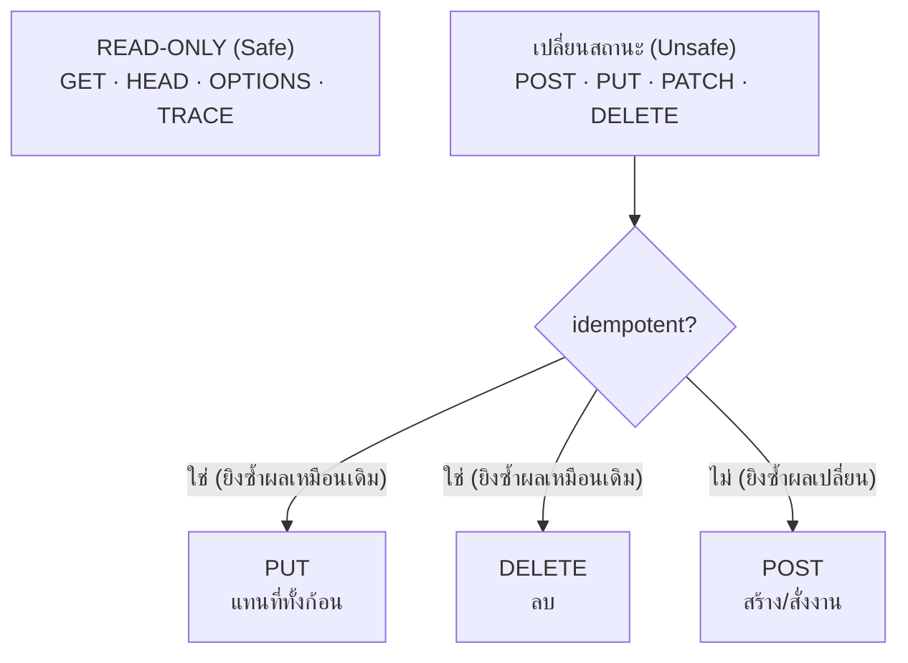

---
tags:
  - java
  - quarkus
  - http
  - rest
  - jax-rs
type: reference
created: 2026-08-18
---

# 🌐 HTTP Methods — มีอะไรบ้าง และใช้ยังไงใน Quarkus

> HTTP method คือ**คำกริยา** ที่บอกว่าอยากทำอะไรกับ resource ที่ URL ชี้ไป
> ตัว URL บอกว่า "อะไร" (`/products/1`) ส่วน method บอกว่า "ทำอะไร" (อ่าน/สร้าง/แก้/ลบ)
> ในเชิง REST resource เดียวกัน ใช้ URL เดียวกันได้ทุก method — ต่างกันแค่คำกริยา

---

## 1. มีอะไรบ้าง — ครบทั้ง 9 ตัว



| Method | ทำอะไร | ตัวอย่างใช้จริง |
|---|---|---|
| **GET** | ขอข้อมูล ไม่แก้อะไร | โหลดรายการสินค้า |
| **HEAD** | เหมือน GET แต่เอาแค่ header ไม่เอา body | เช็คว่าไฟล์มีอยู่ไหมก่อนดาวน์โหลด |
| **POST** | สร้างของใหม่ หรือสั่งให้ทำบางอย่าง | สร้างออเดอร์ใหม่, ยิงรายงาน, login |
| **PUT** | แทนที่ resource ทั้งก้อนด้วยของใหม่ | บันทึกโปรไฟล์ผู้ใช้ทั้งหมด |
| **PATCH** | แก้บางส่วนของ resource | เปลี่ยนแค่สถานะออเดอร์ |
| **DELETE** | ลบ resource | ลบสินค้า |
| **OPTIONS** | ถามว่า resource นี้รองรับ method อะไรบ้าง | CORS preflight (browser ยิงให้อัตโนมัติ) |
| **TRACE** | สะท้อน request กลับมาดูว่าทางผ่านมีใครแก้ไหม | debug proxy — ใช้น้อยมาก มักถูกปิด |
| **CONNECT** | เปิด tunnel ผ่าน proxy | HTTPS ผ่าน proxy — เบราว์เซอร์จัดการเอง ไม่เขียนเอง |

**ที่ใช้จริงในงาน API 95% คือ 5 ตัวแรก** ส่วน OPTIONS ส่วนใหญ่ browser ยิงเองอัตโนมัติตอนทำ CORS, TRACE กับ CONNECT แทบไม่ได้แตะเองเลย

---

## 2. คุณสมบัติ 3 อย่างที่ต้องรู้ — Safe / Idempotent / Cacheable

นี่คือของที่กำหนด**พฤติกรรมที่คาดหวังได้** ของแต่ละ method ตามสเปก ไม่ใช่แค่ชื่อเรียก

| Method | Safe (อ่านอย่างเดียว) | Idempotent (ยิงซ้ำผลเหมือนเดิม) | Cacheable |
|---|:---:|:---:|:---:|
| GET | ✅ | ✅ | ✅ |
| HEAD | ✅ | ✅ | ✅ |
| OPTIONS | ✅ | ✅ | ❌ |
| TRACE | ✅ | ✅ | ❌ |
| PUT | ❌ | ✅ | ❌ |
| DELETE | ❌ | ✅ | ❌ |
| **POST** | ❌ | **❌** | บางกรณี* |
| **PATCH** | ❌ | ⚠️ **แล้วแต่ implementation** | ❌ |

\* POST cache ได้เฉพาะเมื่อ response มี freshness header ชัดเจน ซึ่งเจอน้อยมากในทางปฏิบัติ

### ความหมายจริงของแต่ละคำ

**Safe** = ไม่มีผลข้างเคียงต่อ server ยิงกี่ครั้งก็ได้อย่างสบายใจ — browser prefetch, crawler กด GET ได้ไม่ต้องกลัวข้อมูลเปลี่ยน

**Idempotent** = ยิงซ้ำแล้ว **state ของ server เหมือนเดิมกับยิงครั้งเดียว** (ไม่ได้แปลว่า response เหมือนเดิมเป๊ะ)

```
DELETE /products/1   ครั้งที่ 1 → 204 (ลบสำเร็จ)
DELETE /products/1   ครั้งที่ 2 → 404 (ไม่มีให้ลบแล้ว)
```

response ต่างกัน (204 vs 404) แต่ **state สุดท้ายเหมือนกัน** — สินค้าหายไปแล้วทั้งคู่ ถือว่า idempotent

```
PUT /products/1 {name: "A"}   ครั้งที่ 1 → บันทึก name=A
PUT /products/1 {name: "A"}   ครั้งที่ 2 → บันทึก name=A (ซ้ำ ไม่มีอะไรเปลี่ยน)
```

```
POST /products {name: "A"}   ครั้งที่ 1 → สร้างสินค้า id=1
POST /products {name: "A"}   ครั้งที่ 2 → สร้างสินค้า id=2   ⚠️ ได้ของเพิ่มอีกชิ้น
```

**นี่คือเหตุผลที่ retry logic ต้องรู้ว่า method ไหน idempotent** — retry `PUT`/`DELETE` อัตโนมัติได้อย่างปลอดภัย แต่ retry `POST` เฉย ๆ เสี่ยงสร้างของซ้ำ (ดูเรื่อง idempotency key ที่ [[Quarkus REST Client]])

**PATCH ทำไมกำกวม:** สเปกไม่บังคับว่าต้อง idempotent — `PATCH {op: "increment", field: "qty"}` ยิงสองครั้งได้ผลไม่เท่ากัน แต่ `PATCH {status: "PAID"}` ยิงกี่ครั้งก็ได้ผลเดิม **ขึ้นกับว่าคนออกแบบ API เขียนยังไง**

---

## 3. ใช้ใน Quarkus — annotation คู่กับ method

Quarkus ใช้ JAX-RS (Jakarta REST) annotation ตรงตัวกับ HTTP method เลย

```java
@Path("/products")
public class ProductResource {

    @GET
    @Produces(MediaType.APPLICATION_JSON)
    public List<ProductSummary> list() { ... }

    @GET
    @Path("/{id}")
    @Produces(MediaType.APPLICATION_JSON)
    public ProductDetail get(@PathParam("id") Long id) { ... }

    @POST
    @Consumes(MediaType.APPLICATION_JSON)
    @Produces(MediaType.APPLICATION_JSON)
    public Response create(@Valid ProductCreateRequest req) {
        Product p = service.create(req);
        return Response.created(URI.create("/products/" + p.id))
                       .entity(ProductDetail.from(p))
                       .build();
    }

    @PUT
    @Path("/{id}")
    @Consumes(MediaType.APPLICATION_JSON)
    public Response replace(@PathParam("id") Long id, @Valid ProductPutRequest req) {
        service.replace(id, req);
        return Response.noContent().build();
    }

    @PATCH
    @Path("/{id}")
    @Consumes(MediaType.APPLICATION_JSON)
    public ProductDetail patch(@PathParam("id") Long id, ProductPatchRequest req) {
        return service.patch(id, req);
    }

    @DELETE
    @Path("/{id}")
    public Response delete(@PathParam("id") Long id) {
        service.delete(id);
        return Response.noContent().build();
    }

    @HEAD
    @Path("/{id}")
    public Response exists(@PathParam("id") Long id) {
        return service.existsById(id)
             ? Response.ok().build()
             : Response.status(404).build();
    }
}
```

**หนึ่ง `@Path` ใช้ได้กับหลาย method** — นี่คือแก่นของ REST: URL คือ "อะไร" annotation คือ "ทำอะไร"

```
GET    /products         → list()
POST   /products         → create()
GET    /products/{id}    → get()
PUT    /products/{id}    → replace()
PATCH  /products/{id}    → patch()
DELETE /products/{id}    → delete()
```

---

## 4. GET — ต้องไม่มีผลข้างเคียง

```java
@GET
@Path("/{id}")
public ProductDetail get(@PathParam("id") Long id) {
    return service.get(id);      // อ่านอย่างเดียว ห้ามแก้อะไร
}
```

**ข้อห้ามเด็ดขาด: อย่าให้ GET แก้ข้อมูล** เช่น `GET /products/1/increment-view-count` แม้จะเขียนได้และทำงานได้ แต่ผิดสัญญาของ HTTP — browser prefetch, monitoring bot, หรือ CDN cache อาจกด endpoint นี้โดยไม่ได้ตั้งใจ แล้วข้อมูลเปลี่ยนไปโดยไม่มีใครขอ

**GET ไม่มี body** (ตามสเปก แม้บาง client จะยอมส่งก็ตาม) — ส่งเงื่อนไขค้นหาผ่าน query parameter แทน

```java
@GET
public List<ProductSummary> search(
        @QueryParam("keyword") String keyword,
        @QueryParam("status") Status status,
        @QueryParam("page") @DefaultValue("0") int page) { ... }
```

---

## 5. POST — สร้างของใหม่ หรือสั่งให้ทำงาน

```java
@POST
public Response create(@Valid ProductCreateRequest req) {
    Product p = service.create(req);
    return Response.created(URI.create("/products/" + p.id))   // 201 + Location header
                   .entity(ProductDetail.from(p))
                   .build();
}
```

**status code ที่ถูกต้องคือ 201 Created พร้อม header `Location`** ชี้ไปที่ resource ที่สร้างใหม่ — ไม่ใช่ 200 เฉย ๆ

POST ยังใช้กับ**การสั่งงานที่ไม่ใช่ CRUD** ได้ด้วย เพราะมันคือ "ทำสิ่งนี้ที" แบบกว้าง ๆ

```java
@POST
@Path("/{id}/confirm")
public Response confirm(@PathParam("id") Long id) {
    service.confirmOrder(id);
    return Response.ok().build();
}
```

> **POST ไม่ idempotent โดยธรรมชาติ** — ถ้า endpoint นี้เสี่ยงถูกกดซ้ำ (เช่นปุ่ม submit บนฟอร์ม) ต้องมี idempotency key เอง ดู [[Quarkus REST Client]] ส่วน retry

---

## 6. PUT — แทนที่ทั้งก้อน

```java
@PUT
@Path("/{id}")
public Response replace(@PathParam("id") Long id, @Valid ProductPutRequest req) {
    // req ต้องมีครบทุก field — field ไหนไม่ส่งมา = ถูกล้างเป็นค่าว่าง
    service.replace(id, req);
    return Response.noContent().build();      // 204
}
```

**"แทนที่ทั้งก้อน" หมายความจริง ๆ ว่า field ที่ไม่ส่งมาจะถูกล้าง** ไม่ใช่แค่ merge เข้ากับของเดิม — ถ้า client ส่งมาแค่ `{name: "ใหม่"}` โดยไม่ส่ง `price` มาด้วย ตามสเปก `price` ควรถูกล้างหรือกลับเป็น default **นี่คือความต่างสำคัญจาก PATCH**

**PUT ยังใช้ "สร้างแบบระบุ id เอง" ได้** ต่างจาก POST ที่ server เป็นคนกำหนด id

```java
@PUT
@Path("/{id}")
public Response upsert(@PathParam("id") String id, ProductPutRequest req) {
    boolean existed = service.existsById(id);
    service.replaceOrCreate(id, req);
    return existed
         ? Response.noContent().build()                    // 204 = แก้ของเดิม
         : Response.created(URI.create("/products/" + id)).build();  // 201 = สร้างใหม่
}
```

---

## 7. PATCH — แก้บางส่วน

```java
public record ProductPatchRequest(
        Optional<String> name,
        Optional<BigDecimal> price) {}

@PATCH
@Path("/{id}")
public ProductDetail patch(@PathParam("id") Long id, ProductPatchRequest req) {
    Product p = service.get(id);
    req.name().ifPresent(n -> p.name = n);
    req.price().ifPresent(pr -> p.price = pr);
    return ProductDetail.from(p);
}
```

**field ที่ไม่ส่งมา = ไม่แตะ** ต่างจาก PUT ชัดเจน — นี่คือเหตุผลที่ PATCH ต้องใช้ **class ธรรมดา ไม่ใช่ record ปกติ** เพราะต้องแยกให้ออกระหว่าง "ไม่ได้ส่งมา" กับ "ส่งมาเป็น null" (ดู [[Java Record]] เรื่องข้อจำกัดของ record กับ PATCH)

### JSON Patch — มาตรฐานสำหรับ PATCH ที่ซับซ้อน

ถ้าการแก้ไม่ใช่แค่ set ค่า แต่เป็นลำดับ operation

```json
[
  { "op": "replace", "path": "/name", "value": "ใหม่" },
  { "op": "remove",  "path": "/tags/0" }
]
```

```java
@PATCH
@Path("/{id}")
@Consumes("application/json-patch+json")
public ProductDetail patchJson(@PathParam("id") Long id, JsonPatch patch) {
    ...
}
```

**ใช้เมื่อ:** ต้องแก้ array/nested structure ที่ merge object ธรรมดาทำไม่ได้ชัดเจน — สำหรับ CRUD ทั่วไป `Optional<T>` แบบข้างบนพอเพียงและอ่านง่ายกว่ามาก

---

## 8. DELETE

```java
@DELETE
@Path("/{id}")
public Response delete(@PathParam("id") Long id) {
    service.delete(id);        // ควรไม่ throw ถ้าลบซ้ำ — คืน 204 เหมือนเดิม (idempotent)
    return Response.noContent().build();
}
```

**เพื่อให้ idempotent จริงตามสเปก** ลบซ้ำครั้งที่สองไม่ควร throw error รุนแรง แนวทางที่ยอมรับกันคือคืน `204` เหมือนเดิม หรือ `404` ก็ได้ (ทั้งคู่ยัง idempotent เพราะ state สุดท้ายเหมือนกัน) — สิ่งที่ไม่ควรทำคือ throw `500`

### Bulk delete — DELETE มี body ได้ไหม

ตามสเปก DELETE **มี body ได้** แต่ server/proxy จำนวนมากไม่รองรับหรือเมิน วิธีที่ปลอดภัยกว่าสำหรับลบหลายรายการคือใช้ POST แทน

```java
@POST
@Path("/bulk-delete")
public Response bulkDelete(List<Long> ids) { ... }
```

---

## 9. HEAD และ OPTIONS — ใช้น้อยแต่มีประโยชน์

```java
@HEAD
@Path("/{id}")
public Response exists(@PathParam("id") Long id) {
    return service.existsById(id) ? Response.ok().build() : Response.status(404).build();
}
```

**HEAD คือ GET ที่ไม่มี body** — ตอบ header เดียวกับ GET เป๊ะ (รวม `Content-Length`) แต่ไม่ส่งเนื้อหา ใช้เช็คว่าไฟล์มีอยู่ไหม/ขนาดเท่าไหร่ก่อนดาวน์โหลดจริง โดยไม่เปลืองแบนด์วิดท์

**OPTIONS ส่วนใหญ่ไม่ต้องเขียนเอง** — Quarkus/browser จัดการให้อัตโนมัติตอนทำ CORS preflight เขียนเองเฉพาะกรณีอยากให้ client ถามว่า endpoint นี้รองรับ method อะไรบ้าง

---

## 10. Status code ที่ควรคู่กับแต่ละ method

| Method | สำเร็จ | สร้างของใหม่ | ไม่มีเนื้อหาจะคืน |
|---|---|---|---|
| GET | `200 OK` | — | `404 Not Found` ถ้าไม่เจอ |
| POST (สร้าง) | — | `201 Created` + `Location` | — |
| POST (สั่งงาน) | `200 OK` | — | `202 Accepted` ถ้าเป็น async |
| PUT | `200 OK` (คืนของที่แก้แล้ว) หรือ `204` | `201 Created` (ถ้าใช้แบบ upsert) | — |
| PATCH | `200 OK` หรือ `204` | — | — |
| DELETE | `200 OK` หรือ `204 No Content` | — | — |

**`204 No Content` สำคัญกว่าที่คิด** — บอก client ชัดเจนว่า "สำเร็จ แต่ไม่มีอะไรให้อ่านต่อ" ต่างจาก `200` กับ body ว่างที่คลุมเครือว่าตั้งใจว่างหรือลืมใส่

---

## 11. รูปแบบที่เจอบ่อย — ทั้งชุดในหน้าจอเดียว

```java
@Path("/orders")
@Produces(MediaType.APPLICATION_JSON)
@Consumes(MediaType.APPLICATION_JSON)
public class OrderResource {

    @Inject OrderService service;

    @GET
    public PageResult<OrderSummary> search(@BeanParam SearchCriteria c) {
        return service.search(c);
    }

    @GET
    @Path("/{id}")
    public OrderDetail get(@PathParam("id") Long id) {
        return service.get(id);
    }

    @POST
    public Response create(@Valid OrderCreateRequest req) {
        Order o = service.create(req);
        return Response.created(URI.create("/orders/" + o.id))
                       .entity(OrderDetail.from(o)).build();
    }

    @PATCH
    @Path("/{id}/status")
    public OrderDetail changeStatus(@PathParam("id") Long id, StatusChangeRequest req) {
        return service.changeStatus(id, req.status());
    }

    @POST
    @Path("/{id}/cancel")           // ← การกระทำที่ไม่ใช่ CRUD ธรรมดา ใช้ POST
    public Response cancel(@PathParam("id") Long id) {
        service.cancel(id);
        return Response.ok().build();
    }

    @DELETE
    @Path("/{id}")
    public Response delete(@PathParam("id") Long id) {
        service.softDelete(id);
        return Response.noContent().build();
    }
}
```

**สังเกต `/{id}/cancel` เป็น POST ไม่ใช่ PATCH** — "ยกเลิกออเดอร์" เป็นการกระทำที่มี business logic เยอะ (คืนสต็อก, แจ้งเตือน, บันทึกเหตุผล) ไม่ใช่แค่เปลี่ยนค่า field ตรง ๆ **PATCH เหมาะกับการแก้ข้อมูลเชิง data ล้วน ๆ ส่วน POST เหมาะกับ "การกระทำ" ที่มีความหมายทางธุรกิจ**

---

## 12. กับดัก

- **ใช้ GET แล้วแก้ข้อมูล** — ผิดสัญญา HTTP โดนแคชหรือ prefetch แล้วพังแบบหาสาเหตุยาก
- **POST แล้วไม่กัน retry ซ้ำ** — ปุ่มกดสองครั้งเพราะเน็ตช้า = สร้างของซ้ำ ต้องมี idempotency key
- **PUT แบบ partial โดยไม่รู้ตัว** — ส่งแค่บาง field ผ่าน PUT แล้ว field อื่นหายไปเงียบ ๆ เพราะถูกล้างเป็น default (ที่ถูกคือ PATCH)
- **DELETE ครั้งที่สอง throw 500** — ทำให้ไม่ idempotent จริง ควรคืน 204/404 เหมือนเดิม
- **สร้าง endpoint แล้วคืน 200 ทุกกรณี** — เสียโอกาสสื่อความหมาย (201 = สร้างสำเร็จ, 204 = สำเร็จไม่มีเนื้อหา, 202 = รับงานแล้วกำลังทำ)
- **ใช้ PATCH กับ record ตรง ๆ** — record ไม่มีทางบอกได้ว่า field ไหน "ไม่ได้ส่งมา" เทียบกับ "ส่งมาเป็น null" ต้องห่อด้วย `Optional<T>` หรือใช้ class ธรรมดา
- **DELETE ใส่ body แล้วงงว่าทำไม client บางตัวไม่ส่งให้** — เลี่ยงด้วยการทำ bulk operation เป็น POST แทน

---

## 13. Cheat sheet

```java
@GET                        // อ่าน, safe, idempotent, cacheable
@HEAD                       // เหมือน GET ไม่มี body
@POST                       // สร้าง/สั่งงาน, ไม่ idempotent
@PUT     @Path("/{id}")     // แทนที่ทั้งก้อน, idempotent
@PATCH   @Path("/{id}")     // แก้บางส่วน, idempotent ไม่การันตี
@DELETE  @Path("/{id}")     // ลบ, idempotent
@OPTIONS                    // ปกติ browser จัดการเอง (CORS)
```

| ต้องการ | ใช้ |
|---|---|
| ดึงรายการ / รายละเอียด | GET |
| สร้างของใหม่ ให้ server ตั้ง id | POST → 201 + Location |
| สร้างของใหม่ client ระบุ id เอง | PUT (upsert) → 201 หรือ 204 |
| แก้ทั้งก้อน ยอมรับว่า field ที่ไม่ส่งจะถูกล้าง | PUT |
| แก้บางส่วน | PATCH |
| สั่งงาน/การกระทำเชิงธุรกิจ (cancel, confirm, approve) | POST |
| ลบ | DELETE → 204 |
| เช็คว่ามีอยู่ไหมโดยไม่เอา body | HEAD |
| ลบหลายรายการพร้อมกัน | POST `/bulk-delete` (ไม่ใช่ DELETE + body) |

| อาการ | สาเหตุ |
|---|---|
| ข้อมูลเปลี่ยนจาก request ที่ไม่ได้ตั้งใจ | ใช้ GET ทำสิ่งที่มีผลข้างเคียง |
| ของถูกสร้างซ้ำหลายชิ้น | POST ไม่มี idempotency key แล้วโดน retry/กดซ้ำ |
| field หายไปหลัง update | ใช้ PUT ทั้งที่ตั้งใจแก้แค่บางส่วน — ควรใช้ PATCH |
| PATCH แยกไม่ออกว่า field ไหนถูกส่งมา | ใช้ record ธรรมดาแทนที่จะห่อด้วย `Optional<T>` |
| retry อัตโนมัติทำให้ข้อมูลซ้ำ | retry ไปโดนตัว POST ที่ไม่ idempotent |

---

## 🔗 เกี่ยวข้อง

- [[Quarkus]] — หน้ารวม
- [[Quarkus REST Client]] — idempotency key, retry, timeout ฝั่งที่เป็น client
- [[Quarkus Health Check]] — endpoint พิเศษที่ก็อยู่บนโปรโตคอลเดียวกันนี้
- [[Java Record]] — ข้อจำกัดของ record เวลาต้องแยก "ไม่ส่งมา" กับ "ส่งเป็น null"

## 📖 อ่านต่อ

- [MDN — HTTP request methods](https://developer.mozilla.org/en-US/docs/Web/HTTP/Reference/Methods)
- [RFC 9110 — HTTP Semantics](https://www.restguide.info/rfc-9110)
- [Quarkus — Writing REST Services](https://quarkus.io/guides/rest)
