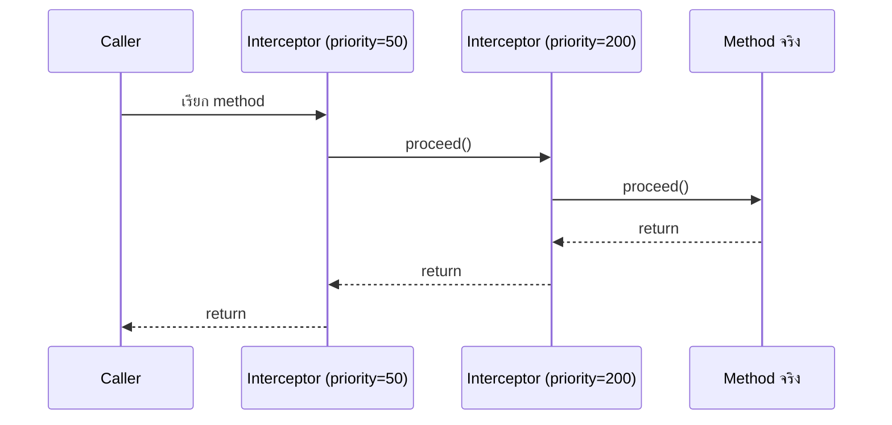

---
tags:
  - quarkus
  - java
  - cdi
  - aop
type: reference
created: 2026-09-30
---

# 🎯 Quarkus Interceptor — CDI AOP

> **Interceptor คือกลไกมาตรฐาน Jakarta (CDI/Jakarta Interceptors spec) ที่ครอบ logic รอบๆ method call ได้ โดยไม่ต้องแก้โค้ดข้างในเมธอดนั้นเลย** — เป็น AOP (Aspect-Oriented Programming) แบบหนึ่ง
>
> **สิ่งที่ทำให้โน้ตนี้คุ้มค่า:** `@Transactional` ([[Quarkus Transaction]]) และ `@CacheResult`/`@CacheInvalidate` ([[Quarkus Redis]] ข้อ 2) ที่ใช้กันมาแล้วในวอลต์นี้ **ล้วนเป็น interceptor ทั้งคู่** — โน้ตนี้เปิดฝาดูว่ามันทำงานยังไงข้างใน แล้วสอนเขียน custom interceptor เอง
>
> ⚠️ **อย่าสับสนกับ "interceptor" อีกความหมาย** — [[Angular HttpClient]] มี `HttpInterceptor` และ JAX-RS มี `ClientRequestFilter` ที่คนเรียกว่า interceptor เหมือนกันแต่เป็นคนละชั้น (ข้อ 4) และยังมี **[[Quarkus Hibernate Interceptor]]** (`org.hibernate.Interceptor`) ที่ดักวงจรชีวิต entity ในชั้น ORM โดยเฉพาะ — implement คนละ interface กันเลย ไม่เกี่ยวข้องกับโน้ตนี้

---

## 1. 4 ชิ้นส่วนของ interceptor — ตัวอย่างเต็ม `@Timed`

### ① สร้าง binding annotation ของตัวเอง

```java
import jakarta.interceptor.InterceptorBinding;
import java.lang.annotation.ElementType;
import java.lang.annotation.Retention;
import java.lang.annotation.RetentionPolicy;
import java.lang.annotation.Target;

@InterceptorBinding
@Retention(RetentionPolicy.RUNTIME)
@Target({ElementType.TYPE, ElementType.METHOD})
public @interface Timed {
}
```

### ② เขียน interceptor class — ผูกกับ binding annotation + `@Priority`

```java
import jakarta.annotation.Priority;
import jakarta.interceptor.AroundInvoke;
import jakarta.interceptor.Interceptor;
import jakarta.interceptor.InvocationContext;
import org.jboss.logging.Logger;

@Timed
@Interceptor
@Priority(Interceptor.Priority.APPLICATION)
public class TimedInterceptor {

    private static final Logger LOG = Logger.getLogger(TimedInterceptor.class);

    @AroundInvoke
    Object time(InvocationContext ctx) throws Exception {
        long start = System.nanoTime();
        try {
            return ctx.proceed();     // ③ ต้องเรียกเสมอ ไม่งั้น method จริงไม่ทำงานเลย
        } finally {
            long ms = (System.nanoTime() - start) / 1_000_000;
            LOG.infof("%s.%s ใช้เวลา %d ms",
                ctx.getTarget().getClass().getSimpleName(),
                ctx.getMethod().getName(), ms);
        }
    }
}
```

**`try/finally` ครอบ `ctx.proceed()` ไว้เสมอ** — รับประกันว่า log เวลาทำงานแม้ method จริงจะ throw exception (หลักการเดียวกับ [[Java Try Catch]])

### ④ เอา annotation ไปแปะเป้าหมาย

```java
@ApplicationScoped
public class ProductService {

    @Timed
    public List<Product> findAll() { ... }
}
```

แค่นี้ — ทุกครั้งที่ `findAll()` ถูกเรียก จะมี log เวลาทำงานออกมาโดยไม่ต้องแก้โค้ดใน `ProductService` เลยสักบรรทัด

---

## 2. `InvocationContext` — สิ่งที่ `@AroundInvoke` มีให้ใช้

| Method | ใช้ทำอะไร |
|---|---|
| `proceed()` | เรียก method จริง (หรือ interceptor ถัดไปใน chain) — **ต้องเรียกเสมอ ไม่งั้น logic จริงไม่ทำงาน** |
| `getMethod()` | `Method` object ของ method ที่ถูกเรียก (reflection) |
| `getParameters()` / `setParameters(Object[])` | อ่าน/แก้ argument ก่อนส่งต่อ |
| `getTarget()` | instance จริงที่ถูกเรียก — **เป็น `null` ถ้า intercept static method** (ไม่มี instance) |
| `getContextData()` | `Map<String,Object>` ส่งข้อมูลข้าม interceptor หลายตัวใน chain เดียวกัน |

---

## 3. หลาย interceptor ซ้อนกัน — ใครทำงานก่อน



**`@Priority` เลขน้อยกว่า = ทำงานก่อน = ชั้นนอกสุด** (ห่อ interceptor เลขมากกว่าไว้ข้างใน)

| ค่าคงที่ | เลข | ใครควรใช้ช่วงนี้ |
|---|---|---|
| `PLATFORM_BEFORE` | 0 | container/platform เอง |
| `LIBRARY_BEFORE` | 1000 | library ที่อยากทำงานก่อน interceptor ของแอป |
| **`APPLICATION`** | 2000 | **จุดเริ่มมาตรฐานสำหรับ interceptor ของแอปเราเอง** |
| `LIBRARY_AFTER` | 3000 | library ที่อยากทำงานหลัง interceptor ของแอป |
| `PLATFORM_AFTER` | 4000 | container/platform เอง |

ถ้ามี interceptor หลายตัวของแอปเอง ใช้ `APPLICATION + n` ไล่เลข (`APPLICATION`, `APPLICATION + 100`, `APPLICATION + 200`) กำหนดลำดับที่ต้องการได้ตรงๆ

---

## 4. Interceptor (CDI) vs Filter (HTTP-level) — คนละชั้นกัน

| | CDI Interceptor (โน้ตนี้) | HTTP-level Filter |
|---|---|---|
| ดักอะไร | **การเรียก method** ระดับ Java | **request/response** ระดับ HTTP |
| ตัวอย่าง | `@Transactional`, `@CacheResult`, `@Timed` | `ClientRequestFilter`/`ContainerRequestFilter` (JAX-RS), `HttpInterceptor` ([[Angular HttpClient]]) |
| ทำงานตอนไหน | ทุกครั้งที่ method ถูกเรียก ไม่ว่าจะมาจาก HTTP request, message consumer, หรือ scheduled job | เฉพาะตอนมี HTTP request/response ผ่านเข้า-ออกจริงๆ ก่อน/หลัง dispatch เข้า method ใดๆ |

**endpoint หนึ่งอาจผ่านทั้งสองชั้น** — filter ทำงานก่อนตอน HTTP request เข้ามา แล้วค่อยถึง method จริงที่อาจมี CDI interceptor ครอบอยู่อีกชั้นหนึ่ง

---

## 5. ตัวอย่างจริงที่เคยเจอแล้วในวอลต์นี้ — ล้วนเป็น interceptor

| annotation | ทำอะไร | ดูโค้ดจริงที่ |
|---|---|---|
| `@Transactional` | เปิด/ปิด/rollback transaction รอบ method | [[Quarkus Transaction]] |
| `@CacheResult` / `@CacheInvalidate` | cache ผลลัพธ์ method | [[Quarkus Redis]] ข้อ 2 |

ทั้งสองตัวมี "กับดักเรื่อง self-invocation" ที่บันทึกไว้แล้วในโน้ตของมันเอง — อธิบายเชิงกลไกต่อในข้อ 6

---

## 🎯 แนวทางการเริ่มศึกษา

1. **เริ่มต้น** — เข้าใจว่า interceptor คือ AOP: "ครอบ logic รอบ method โดยไม่แก้โค้ดข้างใน" แล้วจำ 4 ชิ้นส่วนให้ขึ้นใจ (binding annotation → interceptor class → `@AroundInvoke` → `proceed()`, ข้อ 1)
2. **ลงมือทำจริง** — เขียน `@Timed` ตามตัวอย่างข้อ 1 แปะกับ method ที่มีอยู่แล้วในโปรเจกต์ทดลอง รัน dev mode ดู log เวลาจริง แล้วลองลบ `ctx.proceed()` ออกดูว่าเกิดอะไรขึ้น — เห็นผลของ "ลืม proceed" ด้วยตาตัวเองครั้งเดียวจำได้แม่นกว่าอ่านกับดักเฉยๆ
3. **ใช้งานได้คล่อง** — เข้าใจ priority ordering เวลามีหลาย interceptor ซ้อนกัน (ข้อ 3), รู้ข้อจำกัด/พฤติกรรมเฉพาะของ Quarkus ArC (ข้อ 6), และแยกให้ออกว่า interceptor กับ filter ระดับ HTTP ใช้ทำคนละงาน (ข้อ 4)

---

## 6. กับดัก — พฤติกรรมเฉพาะของ Quarkus ArC

- **ห้ามแปะ binding annotation บน private method** — Quarkus บังคับด้วย build-time check จริงๆ ไม่ใช่แค่เตือนเฉยๆ (`quarkus.arc.fail-on-intercepted-private-method` default `true` → **build fail ทันที**) ต้องเป็น public/package-private/protected เท่านั้น
- **`final` class/method ปกติสร้าง proxy ไม่ได้** — แต่ Quarkus แก้ให้เองด้วย `quarkus.arc.transform-unproxyable-classes` (เปิดอยู่โดย default) ที่ตัด `final` ออกให้ตอน build โดยอัตโนมัติ — **ไม่ควรพึ่งพฤติกรรมนี้** เพราะเป็นการ "แก้ให้เงียบๆ" ที่ทำให้งงตอน debug ถ้าลืมว่ามันมีอยู่ เขียนไม่ให้ `final` ตั้งแต่แรกดีกว่า
- **Static method ก็แปะได้ แต่ `getTarget()` จะเป็น `null`** — เพราะ static method ไม่มี instance ให้ get ถ้าโค้ด interceptor เรียก `getTarget()` โดยไม่เช็ค null ก่อน จะพังทันทีตอนใช้กับ static method
- **ลืม `@Nonbinding` บน member ของ binding annotation** — ถ้า annotation มี member (เช่น `String value()`) แล้วไม่ใส่ `@Nonbinding` (`jakarta.enterprise.util.Nonbinding`) CDI จะมองว่าค่า member ต่างกัน = คนละ binding กันไปเลย ซึ่งมักไม่ใช่พฤติกรรมที่ตั้งใจ
- **Self-invocation — Quarkus ArC รองรับ ต่างจาก CDI มาตรฐาน (Weld)/Spring AOP** — [เอกสารทางการยืนยันด้วยตัวอย่าง `@Transactional`](https://quarkus.io/guides/cdi-reference/) ว่า method ที่เรียกตัวเอง (`this.xxx()`) จาก method อื่นในคลาสเดียวกัน **ยัง trigger interceptor ได้ตามปกติ** โดยไม่ต้อง config เพิ่ม — CDI spec มาตรฐานไม่รับประกันพฤติกรรมนี้เลย (Weld/Spring AOP ทั่วไปจะ**ไม่** trigger)
  > ⚠️ **จุดที่ยังไม่ชัวร์ 100%:** [[Quarkus Redis]] บันทึกไว้ว่า `@CacheResult` มีปัญหา self-invocation (เรียกจากในคลาสเดียวกันแล้ว cache ไม่ทำงาน) ซึ่งดูเหมือนขัดกับพฤติกรรมทั่วไปของ ArC ข้างต้น — อาจเป็นเพราะพฤติกรรม self-invocation ถูกเพิ่มเข้ามาทีหลัง หรือ `@CacheResult` มีกลไกพิเศษที่ต่างจาก custom interceptor ทั่วไป ยังหาแหล่งข้อมูลที่ยืนยันชัดเจนทั้งสองทางไม่ได้ **ถ้าพึ่งพฤติกรรมนี้จริงจัง ควรทดสอบเองกับ Quarkus เวอร์ชันที่ใช้อยู่ก่อนเชื่อ 100%**

---

## Cheat sheet

```java
import jakarta.enterprise.util.Nonbinding;
import jakarta.interceptor.InterceptorBinding;

@InterceptorBinding
@Retention(RetentionPolicy.RUNTIME)
@Target({ElementType.TYPE, ElementType.METHOD})
public @interface MyBinding {
    @Nonbinding String value() default "";   // ใส่ @Nonbinding ถ้าไม่อยากให้ค่าต่างกันกลายเป็นคนละ binding
}

@MyBinding
@Interceptor
@Priority(Interceptor.Priority.APPLICATION)
public class MyInterceptor {
    @AroundInvoke
    Object around(InvocationContext ctx) throws Exception {
        // ก่อนเรียกจริง
        Object result = ctx.proceed();       // ห้ามลืม
        // หลังเรียกจริงสำเร็จ
        return result;
    }
}
```

| อาการ | สาเหตุ |
|---|---|
| Interceptor ไม่ทำงานเลย | ลืมแปะ binding annotation ที่ target หรือ bean ไม่ได้ถูก CDI จัดการ (`new` เอง แทนที่จะ `@Inject` — ดู [[Quarkus Bean]] ข้อ 6) |
| Method จริงไม่ทำงาน ได้แต่ log | ลืมเรียก `ctx.proceed()` ใน `@AroundInvoke` |
| Build fail พูดถึง private method | มี binding annotation อยู่บน private method |
| ใส่ค่า `value` ต่างกันแล้ว interceptor ดูเหมือนไม่ทำงานบางเคส | ลืม `@Nonbinding` บน member ของ binding annotation |
| `ctx.getTarget()` เป็น `null` | เป็น static method ที่ถูก intercept |
| หลาย interceptor ทำงานผิดลำดับที่คาดไว้ | ลืมตั้ง `@Priority` หรือเข้าใจทิศทางผิด (เลขน้อย = ก่อน) |

---

## 🔗 เกี่ยวข้อง

- [[Quarkus Transaction]] — `@Transactional` ตัวอย่าง interceptor จริงที่ใช้บ่อยที่สุดใน Quarkus
- [[Quarkus Redis]] — `@CacheResult`/`@CacheInvalidate` อีกตัวอย่างของ interceptor จริง (ข้อ 2)
- [[Java Try Catch]] — `try/finally` pattern ที่ใช้ใน `@AroundInvoke` บ่อยมาก
- [[Design Patterns]] — interceptor คือการประยุกต์แนวคิด AOP/Decorator ระดับ framework
- [[Angular HttpClient]] — `HttpInterceptor` ฝั่ง frontend ชื่อคล้ายกันแต่คนละชั้น (ข้อ 4)
- [[Quarkus Hibernate Interceptor]] — `org.hibernate.Interceptor` ดักวงจรชีวิต entity ชื่อคล้ายกันแต่คนละ interface โดยสิ้นเชิง
- [[Quarkus Bean]] — bean คืออะไร ทำไม interceptor ทำงานได้เฉพาะกับ CDI bean เท่านั้น
- [[Quarkus]] — หน้ารวม

## 📖 อ่านต่อ

- [Quarkus — Contexts and Dependency Injection (CDI reference guide)](https://quarkus.io/guides/cdi-reference/)
- [Jakarta Interceptors 2.1 Specification](https://jakarta.ee/specifications/interceptors/2.1/jakarta-interceptors-spec-2.1)
- [Quarkus GitHub — Clarify possible self-invocation as CDI extension (#41545)](https://github.com/quarkusio/quarkus/issues/41545)
- [QuarkFlix Guard Duty — A Hands-On CDI Interceptor Tutorial with Quarkus](https://www.the-main-thread.com/p/quarkus-cdi-interceptors-real-world)
