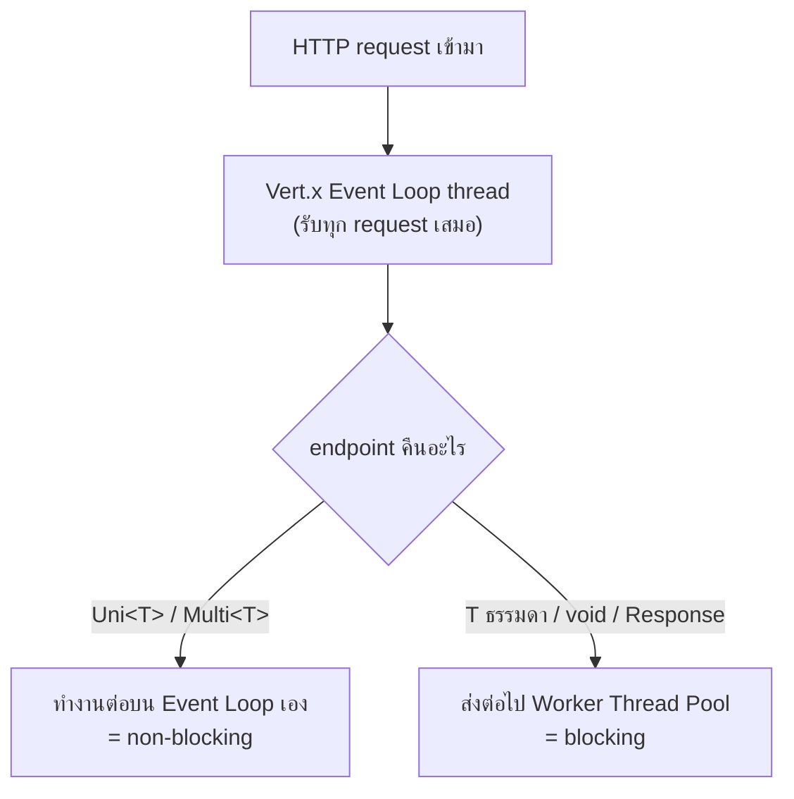

---
tags:
  - java
  - quarkus
  - rest
  - reactive
type: reference
created: 2026-09-16
---

# 🌐 Quarkus REST Layer — Blocking vs Non-blocking

> **HTTP method บอกว่า "ทำอะไร" (ดู [[Quarkus HTTP Methods]]) — โน้ตนี้บอกว่า "endpoint รันบน thread ไหน" ซึ่งเป็นคนละเรื่องกันเลย**
> คำถามที่ตัดสินใจทุกอย่าง: **endpoint ของเราคืนอะไร** — คืน `Uni<T>`/`Multi<T>` แปลว่ารันบน event loop (non-blocking), คืนอย่างอื่น (`T` ธรรมดา, `void`, `Response`) แปลว่ารันบน worker thread (blocking) **โดยอัตโนมัติ** ไม่ต้องประกาศอะไรเพิ่มในกรณีปกติ

---

## 1. RESTEasy Classic vs Quarkus REST — สองคนละโลก

| | RESTEasy Classic | **Quarkus REST** (ชื่อเดิม RESTEasy Reactive) |
|---|---|---|
| รุ่น | เก่ากว่า, servlet-based | ค่าเริ่มต้นของโปรเจกต์ใหม่ทุกตัว |
| โมเดล execution | thread-per-request เสมอ | event-loop + worker thread แบบ smart dispatch (ข้อ 2) |
| รองรับ blocking code | ✅ | ✅ (คนเข้าใจผิดว่าไม่รองรับ — ดูข้อ 1.1) |
| รองรับ `Uni`/`Multi`, streaming, SSE | ❌ / จำกัด | ✅ เต็มรูป |
| ได้ฟีเจอร์ใหม่ต่อไปไหม | ❌ ไม่ได้รับฟีเจอร์ใหม่แล้ว | ✅ ตัวเดียวที่ยังพัฒนาต่อ |

### 1.1 ทำไมเปลี่ยนชื่อจาก "RESTEasy Reactive" เป็น "Quarkus REST" ตอน 3.9

**คำว่า "Reactive" ทำให้คนเข้าใจผิดสองทาง** — บางคนคิดว่าใช้กับ blocking code (JDBC ปกติ, Hibernate ORM classic) ไม่ได้เลยเพราะชื่อมีคำว่า reactive จึงเลี่ยงไปใช้ตัวเก่า ทั้งที่จริง ๆ รองรับ blocking ได้ปกติมาตลอด, บางคนคิดว่าต้องใช้คู่กับ Hibernate Reactive เท่านั้น ทั้งที่ไม่เกี่ยวกัน — เปลี่ยนชื่อเพื่อเลิกความสับสนนี้ (ตรงกับกฎที่เขียนไว้แล้วใน [[Quarkus]]: "เวอร์ชันเปลี่ยนชื่อของบ่อย")

---

## 2. Smart dispatch — Quarkus ตัดสินใจให้อัตโนมัติจาก return type



```java
// คืน Uni → non-blocking โดยอัตโนมัติ รันบน event loop
@GET
@Path("/{id}")
public Uni<ProductDetail> get(@PathParam("id") Long id) {
    return productService.findAsync(id);
}

// คืน type ธรรมดา → blocking โดยอัตโนมัติ รันบน worker thread pool
@GET
@Path("/{id}")
public ProductDetail getBlocking(@PathParam("id") Long id) {
    return productService.find(id);   // เรียก JDBC ธรรมดา ได้ปกติ
}
```

**ไม่ต้องประกาศ `@Blocking`/`@NonBlocking` เองในกรณีปกติ** — Quarkus อ่าน return type แล้วเลือก thread ที่เหมาะสมให้เอง

### `@Blocking` / `@NonBlocking` — override เมื่อ heuristic เดาผิด

```java
@GET
@Path("/report")
@Blocking                          // บังคับให้ไปรันที่ worker thread แม้คืน Uni
public Uni<Report> generateReport() {
    return Uni.createFrom().item(() -> heavyBlockingWork());
}
```

**ใช้ `@Blocking` เมื่อ:** ข้างในคืน `Uni`/`Multi` แต่โค้ดข้างในยังเรียก blocking library อยู่ (เช่น Hibernate ORM classic ที่ยังไม่ใช่ Hibernate Reactive) — บอก Quarkus ตรง ๆ ว่าอย่าเชื่อ heuristic

**ใช้ `@NonBlocking` เฉพาะงานที่สั้นจริง ๆ เท่านั้น** — คำนวณในหน่วยความจำสั้น ๆ หรือ I/O ที่ non-blocking จริง ไม่ใช่ "ลองดูว่าเร็วพอไหม"

---

## 3. ทำไม block event loop ถึงร้ายแรงกว่าที่คิด

**Event loop มี thread จำนวนน้อยมาก (ปกติเท่าจำนวน CPU core) และ thread กลุ่มนี้รับ "ทุก request ของทั้งแอป" ไม่ใช่แค่ request เดียว**

```
ปกติ: event loop thread ทำงานสั้น ๆ เร็ว ๆ สลับกันหลาย request ต่อวินาที
      รับ request → ยิง query async → วางมือทันที → ไปรับ request ถัดไป

ถ้า block: event loop thread ค้างรอ (เช่น JDBC blocking call) อยู่ตรงนั้น
      → ไม่มีใครไปรับ request อื่นเลย → ทั้งแอปหยุดตอบสนองทันที
      ไม่ใช่แค่ endpoint ที่ block ช้า — endpoint อื่นที่ไม่เกี่ยวก็ค้างตามไปด้วย
```

**Quarkus ตรวจจับและเตือนแบบชัดเจนมาก** ถ้า event loop ถูก block เกินเวลาที่กำหนด จะเห็น log แบบนี้:

```
WARNING: Thread Thread[vert.x-eventloop-thread-1] has been blocked for XXXX ms
```

เจอ log แบบนี้ = มีที่ไหนสักแห่งเรียก blocking call อยู่ใน method ที่ควรจะ non-blocking — ต้องหาแล้วแก้ด้วย `@Blocking` หรือเปลี่ยนไปใช้ library แบบ reactive จริง

---

## 4. `Uni` และ `Multi` — พื้นฐานจาก Mutiny

| type | แทนอะไร | เทียบได้กับ |
|---|---|---|
| **`Uni<T>`** | ผลลัพธ์ 0 หรือ 1 ค่าในอนาคต | `CompletionStage`/`Promise` แบบ lazy |
| **`Multi<T>`** | ผลลัพธ์ 0 ถึง N ค่า (หรือไม่จบเลย) ทยอยมาตามเวลา | Stream ที่ทำงานแบบ async — **mental model เดียวกับ [[Observable]]** เป๊ะ |

```java
// Uni — ค่าเดียว
public Uni<ProductDetail> get(Long id) {
    return productRepository.findById(id)
        .onItem().ifNull().failWith(() -> new NotFoundException())
        .onItem().transform(ProductDetail::from);
}

// Multi — สตรีมของค่า
@GET
@Produces(MediaType.SERVER_SENT_EVENTS)
public Multi<Notification> stream() {
    return notificationBus.subscribe()
        .onItem().transform(this::toDto);
}
```

**ทั้งคู่ lazy เหมือน [[Java Stream]]/[[Observable]]** — สร้าง `Uni`/`Multi` เฉย ๆ ยังไม่ทำงานอะไรจนกว่าจะมีคน subscribe (ใน context ของ REST endpoint คือตอน framework เรียก subscribe ให้อัตโนมัติเพื่อส่ง response กลับ) — operator (`onItem()`, `onFailure()`) ต่อกันเป็น pipeline ได้แบบเดียวกับ Stream/Observable

---

## 5. คำแนะนำเชิงปฏิบัติ — เมื่อไหร่ควรเขียนแบบไหน

**ส่วนใหญ่ในงานจริง: เขียนแบบ blocking ธรรมดาไปก่อน** ถ้ายัง:

- ใช้ Hibernate ORM classic (ไม่ใช่ Hibernate Reactive)
- ใช้ JDBC driver ธรรมดา
- เรียก REST client แบบ blocking

**Reactive คุ้มจริงก็ต่อเมื่อทั้งสาย (DB driver → repository → service → endpoint) เป็น reactive หมดทุกชั้น** — เขียน endpoint คืน `Uni` แต่ข้างในยังเรียก Hibernate ORM classic แบบ blocking อยู่ดี **ไม่ได้อะไรเพิ่มเลย** (ยังบล็อกอยู่ดี แค่ซ่อนไว้ในเปลือกของ `Uni`) กลับแย่กว่าเดิมด้วยซ้ำถ้าลืมใส่ `@Blocking` เพราะจะไปบล็อก event loop แทนที่จะบล็อกแค่ worker thread

---

## 6. กับดัก

- **เรียก blocking code ข้างใน method ที่คืน `Uni` โดยไม่ใส่ `@Blocking`** — บล็อก event loop ทั้งแอป ไม่ใช่แค่ endpoint นั้น (ข้อ 3) นี่คืออันตรายที่สุดในหัวข้อนี้
- **คิดว่า "คืน `Uni`" = ปลอดภัยจากปัญหา blocking โดยอัตโนมัติ** — ไม่จริง โค้ดข้างในยัง block ได้เหมือนเดิมถ้าเรียก library ที่ blocking
- **`.await().indefinitely()` บน `Uni` ข้างในโค้ดที่รันบน event loop** — เป็นการบล็อก thread ตัวเองรอผลลัพธ์แบบ synchronous ทำลายจุดประสงค์ของ reactive ทั้งหมด (ใช้ได้เฉพาะตอนอยู่นอก reactive context จริง ๆ เช่น `main()` method หรือ test)
- **ใช้ RESTEasy Classic กับโปรเจกต์ใหม่โดยไม่มีเหตุผลเฉพาะ** — เสียโอกาสฟีเจอร์ใหม่ที่มีแต่ Quarkus REST (Classic ไม่ได้รับฟีเจอร์ใหม่แล้ว)
- **เข้าใจผิดว่าต้องเขียนทุกอย่างเป็น reactive ถึงจะ "ทันสมัย"** — ถ้า stack ยังเป็น blocking DB driver การเขียน endpoint แบบ blocking ธรรมดาคือทางที่ถูกและง่ายกว่า ไม่ใช่ความล้าหลัง
- **ไม่สนใจ log warning เรื่อง event loop thread blocked** — เป็นสัญญาณเตือนที่ตรงจุดที่สุดแล้ว ควรหาสาเหตุทันทีไม่ใช่ปล่อยผ่าน

---

## 7. Cheat sheet

```java
// blocking (default เมื่อคืน type ธรรมดา)
@GET public ProductDetail get(Long id) { return service.find(id); }

// non-blocking (default เมื่อคืน Uni/Multi)
@GET public Uni<ProductDetail> get(Long id) { return service.findAsync(id); }

// บังคับ override
@Blocking     // ให้ไปรันที่ worker thread แม้คืน Uni
@NonBlocking  // ให้ไปรันที่ event loop แม้ปกติจะถือว่า blocking (ใช้เฉพาะงานสั้นจริง ๆ)
```

| อาการ | สาเหตุ |
|---|---|
| `Thread ... has been blocked for XXXX ms` ใน log | เรียก blocking call ใน method ที่ไม่ได้ตั้งใจให้ blocking (ข้อ 3) |
| ทั้งแอปค้าง ไม่ใช่แค่ endpoint เดียว | event loop thread ถูก block — กระทบทุก request ที่ใช้ event loop เดียวกัน |
| endpoint คืน `Uni` แล้วยังช้า/ค้างเหมือนเดิม | โค้ดข้างในยังเรียก blocking library อยู่ ไม่ได้เปลี่ยนเป็น reactive จริง |
| `IllegalStateException: The current thread cannot be blocked` | เรียก blocking operation ตรง ๆ บน event loop thread โดยไม่มี `@Blocking` |
| ฟีเจอร์ใหม่บางตัวใช้ไม่ได้ | ยังอยู่บน RESTEasy Classic — ต้องย้ายมา Quarkus REST |

---

## 🔗 เกี่ยวข้อง

- [[Quarkus HTTP Methods]] — HTTP method บอก "ทำอะไร" ส่วนโน้ตนี้บอก "รันบน thread ไหน"
- [[Quarkus Thread Pool]] — worker thread pool ที่ blocking endpoint ถูก dispatch ไปใช้งานจริง
- [[Observable]] / [[Java Stream]] — mental model แบบ lazy pipeline เดียวกับ `Uni`/`Multi`

## 📖 อ่านต่อ

- [Quarkus — RESTEasy Reactive: To block or not to block](https://quarkus.io/blog/resteasy-reactive-smart-dispatch/)
- [Quarkus — Mutiny primer](https://quarkus.io/guides/mutiny-primer/)
- [Quarkus 3.9 — Big Reactive Rename](https://quarkus.io/blog/quarkus-3-9-1-released/)
