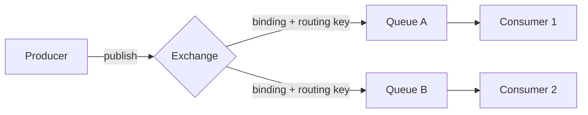
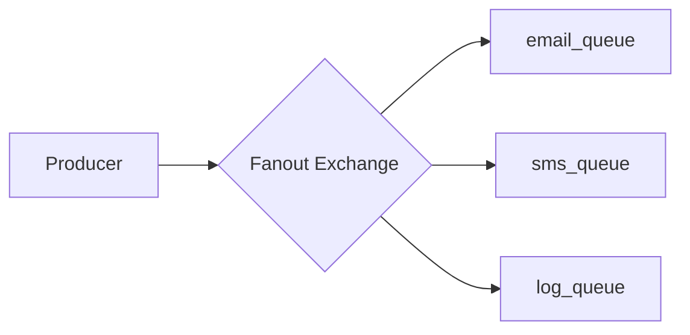
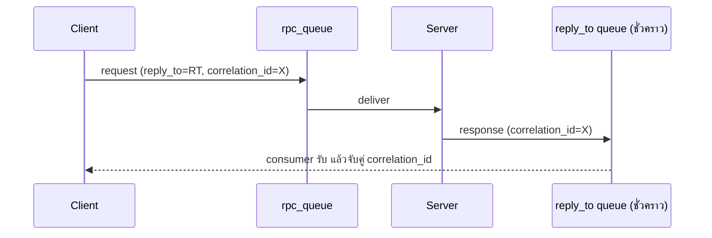
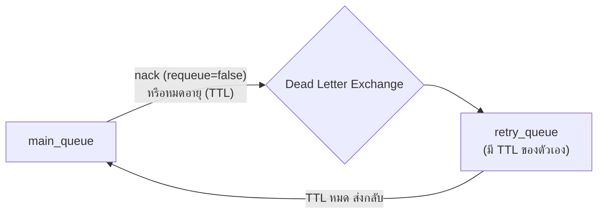

---
tags:
  - rabbitmq
  - message-queue
  - amqp
  - infra
type: reference
created: 2026-09-16
---

# 🐰 RabbitMQ — คืออะไร ใช้ทำอะไรได้บ้าง

> **RabbitMQ คือ message broker** — ตัวกลางที่รับข้อความจากคนส่ง (producer) แล้วส่งต่อไปให้คนรับ (consumer) โดยที่**สองฝั่งไม่ต้องรู้จักกันหรือทำงานพร้อมกันเลย**
> ต่างจาก HTTP ที่ผู้ส่งต้องรอผู้รับตอบกลับทันที — message queue ให้ผู้ส่ง "วางข้อความไว้แล้วเดินจากไปได้เลย" ผู้รับค่อยมาหยิบไปทำตอนไหนก็ได้

---

## 1. Core concept — สี่ชิ้นส่วนที่ต้องรู้จักก่อนอย่างอื่น



| ชิ้นส่วน | หน้าที่ |
|---|---|
| **Producer** | แอปที่ส่งข้อความเข้าระบบ |
| **Exchange** | รับข้อความจาก producer แล้ว**ตัดสินใจว่าจะส่งไป queue ไหน** — ไม่เก็บข้อความเอง แค่ routing เท่านั้น |
| **Binding** | กฎที่ผูก exchange เข้ากับ queue (มี routing key/pattern กำกับว่าจับคู่กันยังไง) |
| **Queue** | ที่เก็บข้อความรอ consumer มาหยิบ |
| **Consumer** | แอปที่รับข้อความจาก queue ไปประมวลผล |

**ข้อสำคัญที่สุด: producer ไม่เคยส่งข้อความเข้า queue ตรง ๆ** — ส่งเข้า exchange เสมอ แล้ว exchange เป็นคนตัดสินใจกระจายไปตาม binding ที่ตั้งไว้ นี่คือจุดที่ทำให้ RabbitMQ ยืดหยุ่นกว่า queue ธรรมดามาก (เปลี่ยนปลายทางได้โดยไม่ต้องแก้โค้ด producer เลย)

---

## 2. Exchange 4 แบบ — เลือก routing logic ให้ตรงงาน

| ประเภท | จับคู่ยังไง | ใช้เมื่อ |
|---|---|---|
| **Direct** | routing key ตรงกันเป๊ะ | ส่งไปคิวที่เจาะจงตัวเดียว (`error` → error_queue) |
| **Fanout** | ไม่สนใจ routing key เลย — ส่งให้**ทุก**queue ที่ผูกไว้ | broadcast เหมือนกันทุก queue |
| **Topic** | pattern matching (`*` = หนึ่งคำ, `#` = กี่คำก็ได้) | routing ซับซ้อน เช่น `order.*.created` |
| **Headers** | จับคู่จาก header ของข้อความ ไม่ใช่ routing key | เงื่อนไขซับซ้อนกว่า string ธรรมดา (ใช้น้อยสุด) |

### Fanout — broadcast ให้ทุก queue พร้อมกัน



หนึ่ง event (เช่น "มี order ใหม่") กระจายไปให้หลายระบบพร้อมกัน แต่ละ queue เอาไปทำคนละเรื่อง (ส่งอีเมล, ส่ง SMS, บันทึก log) โดย producer ไม่ต้องรู้เลยว่ามีใครฟังอยู่บ้าง

### Topic — routing แบบมี pattern

```properties
binding key: order.*.created     ← ตรงกับ order.th.created, order.us.created (แค่ 1 คำแทน *)
binding key: order.#             ← ตรงกับ order.created, order.th.created.urgent (กี่คำก็ได้แทน #)
```

---

## 3. Message acknowledgment — ทำไมข้อความไม่หายแม้ consumer พัง

**consumer ต้องบอก RabbitMQ ว่า "ทำเสร็จแล้ว" (`ack`) ก่อนข้อความจะถูกลบออกจาก queue จริง** — ถ้า consumer ตายกลางทางโดยไม่ ack ข้อความนั้นจะถูกส่งให้ consumer ตัวอื่นใหม่โดยอัตโนมัติ ไม่หายไปไหน

| การกระทำของ consumer | ผลลัพธ์ |
|---|---|
| `ack` | ลบข้อความออกจาก queue — ถือว่าสำเร็จ |
| `nack` (requeue=true) | ส่งกลับเข้า queue ให้ลองใหม่ (อาจได้ consumer ตัวเดิมหรือตัวอื่น) |
| `nack` (requeue=false) | ไม่ส่งกลับ — ไปที่ **dead letter** ถ้าตั้งไว้ (ข้อ 5.5) ไม่งั้นหายไปเลย |
| consumer หลุดการเชื่อมต่อโดยไม่ ack | RabbitMQ requeue ให้อัตโนมัติ |

**ความทนทานเต็มรูปต้องมีครบ 3 อย่าง:** queue ประกาศเป็น `durable`, message ส่งแบบ `persistent`, และ consumer ใช้ manual ack (ไม่ใช่ auto-ack) — ขาดข้อไหนไปก็เสี่ยงข้อความหายตอน broker restart หรือ consumer พังกลางทาง

---

## 4. Design pattern ที่ใช้บ่อย

### 4.1 Work Queue — กระจายงานให้หลาย worker

Producer ส่งงานเข้า queue เดียว หลาย consumer แย่งกันหยิบ (แต่ละข้อความไปหา consumer แค่ตัวเดียว ไม่ซ้ำ) — เหมาะกับงานหนักที่อยากประมวลผลขนานกันหลาย worker (resize รูป, ส่งอีเมลจำนวนมาก, export report)

### 4.2 Pub/Sub — ใช้ Fanout exchange (ข้อ 2)

ต่างจาก Redis Pub/Sub ตรงที่**ข้อความไม่หายแม้ subscriber ยังไม่พร้อม** — ถ้า queue ผูกไว้กับ exchange แล้วแต่ consumer ยังไม่ได้เชื่อมต่อ ข้อความรอใน queue อยู่ (ดูเปรียบเทียบเต็ม ๆ ที่ [[Redis]] ข้อ 7)

### 4.3 RPC pattern — ขอผลลัพธ์กลับผ่าน message queue



ใช้เมื่ออยากได้ผลลัพธ์กลับ (ไม่ใช่แค่ fire-and-forget) แต่ยังอยากได้ความทนทานของ message queue — client แนบ `reply_to` (queue ชั่วคราวที่รอผลตอบกลับ) กับ `correlation_id` (จับคู่ request กับ response ที่ถูกต้อง เพราะอาจมีหลาย request ค้างพร้อมกัน)

### 4.4 Dead Letter Queue (DLQ) — safety net สำหรับข้อความที่ fail



ข้อความที่ประมวลผลไม่สำเร็จ (nack แบบไม่ requeue หรือหมดอายุ) ไม่หายไปเฉย ๆ แต่ถูกส่งต่อไป **Dead Letter Exchange (DLX)** ที่ตั้งไว้ — ใช้ทำ retry-with-delay ได้โดยไม่ต้องเขียน retry logic เองในแอป (retry_queue มี TTL ของตัวเอง พอหมดอายุ RabbitMQ ส่งข้อความกลับเข้า main queue ให้อัตโนมัติ) และป้องกัน **poison message** (ข้อความที่ทำให้ consumer พังซ้ำ ๆ ไม่รู้จบ) ไม่ให้วนลูปตลอดไป — ต้องนับจำนวนครั้งที่ retry ผ่าน header เอง แล้วหยุดส่งกลับเมื่อเกิน limit

---

## 5. Webapp เอาไปใช้ประโยชน์อะไรได้บ้าง

- **แยก service ออกจากกัน (decouple)** — service A ไม่ต้องรู้จักหรือรอ service B ตอบ แค่ส่งข้อความเข้า queue แล้วทำงานต่อได้เลย
- **ทำงานหนักแบบ async ไม่บล็อก HTTP response** — เช่น กดสั่งซื้อแล้วตอบ `202 Accepted` ทันที ส่วนงานส่งอีเมล/สร้าง PDF ใบเสร็จไปทำเบื้องหลังผ่าน queue
- **รองรับ traffic พุ่งโดยไม่ล้ม (load leveling)** — ช่วง peak ข้อความกองใน queue รอ ระบบประมวลผลตามความเร็วที่ไหวจริง ไม่ต้องขยายเซิร์ฟเวอร์ตามพีคเสมอไป
- **retry งานที่ fail ได้อย่างน่าเชื่อถือ** — ผ่าน DLQ pattern (ข้อ 4.4) โดยไม่ต้องเขียน retry loop เองในโค้ดแอป
- **Event-driven architecture** — หลาย service ฟัง event เดียวกันแล้วทำงานคนละอย่าง (ข้อ 4.2) เพิ่ม consumer ใหม่ทีหลังได้โดยไม่กระทบ producer เดิมเลย

---

## 6. กับดัก

- **queue โตไม่จำกัดถ้าไม่มี consumer** — ไม่มีใครหยิบข้อความออกเลย memory/disk เต็มได้ ต้องมี monitoring ดูขนาด queue เสมอ
- **ไม่การันตีลำดับข้ามหลาย consumer บน queue เดียว** — ถ้าต้องการลำดับเป๊ะ (strict ordering) ต้องใช้ single consumer หรือออกแบบ partition key เอง (คล้ายแนวคิด Kafka partition)
- **poison message วนลูปไม่จบถ้าไม่มี DLQ** — ข้อความที่ทำให้ consumer error ทุกครั้งจะถูก requeue กลับมาเรื่อย ๆ กิน CPU ไปเปล่า ๆ
- **auto-ack ดูสะดวกแต่เสี่ยงข้อความหาย** — ถ้า consumer พังกลางทางหลัง auto-ack (ack ทันทีที่รับ ไม่รอประมวลผลเสร็จ) ข้อความถือว่าสำเร็จไปแล้วทั้งที่งานจริงไม่เสร็จ ควรใช้ manual ack แล้ว ack หลังทำงานเสร็จจริงเท่านั้น
- **ack เร็วเกินไป vs ช้าเกินไป** — ack ก่อนทำงานเสร็จ = เสี่ยงข้อมูลหายถ้า process ตาย, ack ช้าเกินไป (ไม่ตั้ง timeout/prefetch) = consumer ตัวหนึ่งถือข้อความค้างไว้นานจนตัวอื่นอดทำงาน
- **สับสนว่า RabbitMQ แทน database ได้** — RabbitMQ ไม่ใช่ที่เก็บข้อมูลถาวรระยะยาว ข้อความที่ consumer ประมวลผลแล้วควรถูกลบออกจาก queue เสมอ ไม่ใช่เก็บไว้เป็น log ถาวร (งานนั้นใช้ DB หรือ event store แทน)

---

## 7. Redis vs RabbitMQ — สั้น ๆ ก่อน (เต็ม ๆ ที่ [[Redis]])

| | RabbitMQ | Redis |
|---|---|---|
| จุดประสงค์หลัก | message broker โดยเฉพาะ | data store (cache, structure) — pub/sub เป็นของแถม |
| ข้อความหายได้ไหม | ไม่ได้ถ้าตั้ง durable + ack ถูกต้อง | ได้ ถ้าไม่ตั้ง persistence/ไม่มี subscriber |
| routing ซับซ้อนแค่ไหน | ทำได้เต็มรูป (4 แบบ exchange, pattern matching) | ไม่มี — pub/sub แบบ broadcast เดียว |
| ความเร็ว | ช้ากว่า (เพราะ reliability overhead) | เร็วกว่ามาก (sub-millisecond) |
| เหมาะกับ | งานที่ต้องรับประกันว่าประมวลผลครบทุกข้อความ, routing ซับซ้อน | cache, session, counter, lock, broadcast ที่พลาดได้บ้าง |

**หลายระบบใช้ทั้งคู่พร้อมกัน** — Redis จัดการความเร็ว, RabbitMQ จัดการความน่าเชื่อถือ

---

## 8. Cheat sheet

```
Producer → Exchange → (binding + routing key) → Queue → Consumer

Exchange types:
  Direct  → routing key ตรงเป๊ะ
  Fanout  → broadcast ทุก queue ไม่สน routing key
  Topic   → pattern (* = 1 คำ, # = กี่คำก็ได้)
  Headers → จับคู่จาก header

Reliability ต้องมีครบ:
  queue durable + message persistent + manual ack

DLQ pattern:
  main_queue --nack/TTL--> DLX --> retry_queue (มี TTL) --หมดอายุ--> main_queue
```

| อาการ | สาเหตุ |
|---|---|
| ข้อความหายหลัง restart broker | queue/message ไม่ได้ตั้งเป็น durable/persistent |
| ข้อความหายทั้งที่ consumer error | ใช้ auto-ack แทน manual ack |
| consumer เดียวถืองานค้างนาน ตัวอื่นว่าง | ไม่ได้ตั้ง prefetch/QoS ให้เหมาะ |
| ข้อความวนลูปไม่จบ | poison message ไม่มี DLQ + limit จำนวน retry |
| queue ใหญ่ขึ้นเรื่อย ๆ ไม่มีที่สิ้นสุด | ไม่มี consumer หรือ consumer ตามงานไม่ทัน |
| ลำดับข้อความสลับกัน | หลาย consumer แย่งกันหยิบจาก queue เดียว ไม่การันตีลำดับ |

---

## 🔗 เกี่ยวข้อง

- [[Redis]] — data store ที่มี pub/sub ในตัวแต่ไม่รับประกันการส่งข้อความเหมือน RabbitMQ
- [[Quarkus WebSocket]] — อีกรูปแบบของ real-time communication ที่ใช้เมื่อต้องคุยกับ browser โดยตรง (ต่างจาก RabbitMQ ที่เป็นการสื่อสารระหว่าง service)

## 📖 อ่านต่อ

- [RabbitMQ — AMQP 0-9-1 Model Explained](https://www.rabbitmq.com/tutorials/amqp-concepts)
- [RabbitMQ — Exchanges](https://www.rabbitmq.com/docs/exchanges)
- [CloudAMQP — RabbitMQ for beginners](https://www.cloudamqp.com/blog/part1-rabbitmq-for-beginners-what-is-rabbitmq.html)
