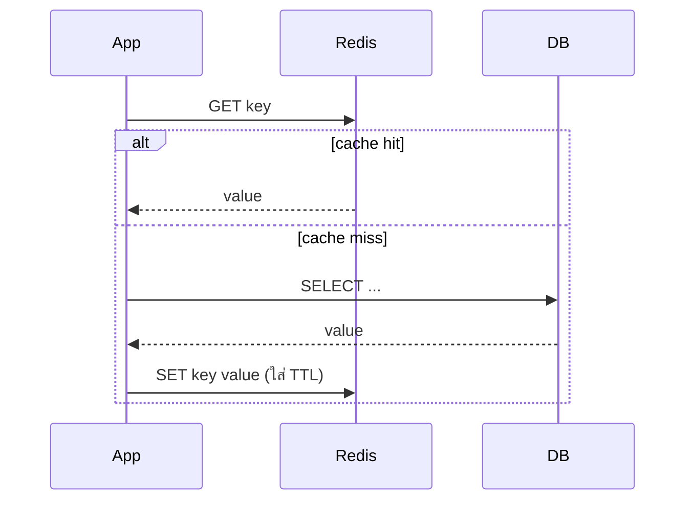
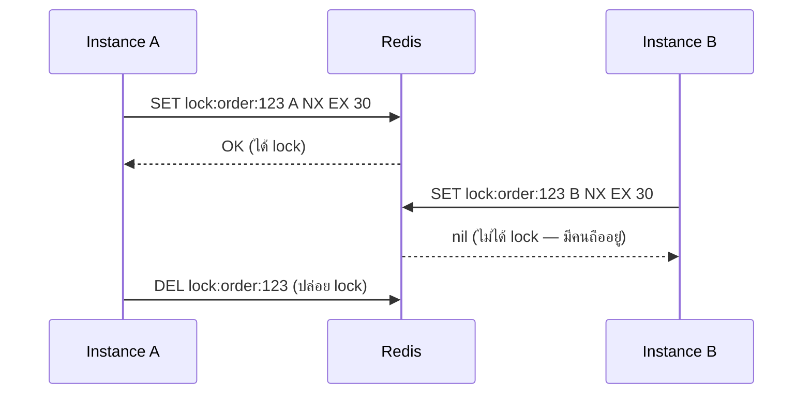

---
tags:
  - redis
  - database
  - cache
  - infra
type: reference
created: 2026-09-16
---

# 🔴 Redis — คืออะไร ใช้ทำอะไรได้บ้าง

> **Redis ไม่ใช่แค่ cache** — มันคือ **in-memory data structure store**: ที่เก็บข้อมูลบน RAM ที่รองรับโครงสร้างข้อมูลหลายแบบ (ไม่ใช่แค่ key-value ตัวอักษรเฉย ๆ) ซึ่งเปิดทางให้ทำหลายอย่างที่ทำในหน่วยความจำของแอปเดียวไม่ได้ — lock ข้ามเครื่อง, ตัวนับ atomic, คิว, leaderboard, สถานะที่หลาย instance แชร์กัน

---

## 1. ทำไมเร็ว

- **ข้อมูลอยู่บน RAM ทั้งหมด** ไม่ใช่ disk — อ่าน/เขียนเร็วกว่า DB ทั่วไปหลายเท่าตัว
- **single-threaded event loop** สำหรับคำสั่งหลัก — ฟังดูขัดกับสัญชาตญาณ (เธรดเดียวเร็วกว่า?) แต่เพราะไม่มี thread เข้ามาแย่ง lock กัน คำสั่งแต่ละอันจึงรันจบในตัวเดียว (atomic) โดยไม่ต้องมี locking overhead แบบระบบ multi-thread ทั่วไป
- คำสั่งส่วนใหญ่ทำงานที่ O(1) หรือ O(log n) — ออกแบบโครงสร้างข้อมูลมาให้เร็วโดยเฉพาะ ไม่ใช่ generic

---

## 2. Data structure หลัก — จุดต่างจาก key-value store ทั่วไป

| structure | เก็บอะไร | ใช้ทำอะไร |
|---|---|---|
| **String** | ข้อความ/ตัวเลข/binary (สูงสุด 512MB) | cache ค่าเดี่ยว, token, counter (`INCR`) |
| **Hash** | field-value คู่กันเหมือน object ย่อย | เก็บ object ทั้งก้อน (เช่น user profile) แก้ทีละ field ได้ |
| **List** | ลำดับของค่า ซ้ำได้ | queue, feed, recent items |
| **Set** | กลุ่มค่าไม่ซ้ำ ไม่มีลำดับ | เช็คว่ามีอยู่ไหมเร็ว, ความสัมพันธ์ (tag, follower) |
| **Sorted Set** | เหมือน Set แต่แต่ละค่ามี score เรียงลำดับ | leaderboard, ranking, priority queue |
| **Stream** | append-only log เรียงเวลา | event log, message queue อย่างง่าย (คล้าย Kafka แบบย่อ) |

```bash
SET user:1:name "สมชาย"
INCR page:home:views
HSET user:1 name "สมชาย" age 30
LPUSH queue:jobs "job-1"
SADD tags:post:1 "java" "quarkus"
ZADD leaderboard 100 "player1" 200 "player2"
```

**เลือก data structure ให้ตรงกับ "รูปร่าง" ของปัญหา** ไม่ใช่ยัดทุกอย่างเป็น String แล้ว serialize เป็น JSON เก็บ — ใช้ Hash แทน object, ใช้ Sorted Set แทน ranking จะได้ query ตรง ๆ ด้วยคำสั่งที่ Redis ออกแบบมาให้เร็วอยู่แล้ว

---

## 3. Persistence — RAM หายเมื่อไฟดับ ทำไมข้อมูลยังอยู่ได้

Redis เก็บข้อมูลใน RAM แต่มีกลไกกันข้อมูลหายตอน restart:

| แบบ | ทำยังไง | ข้อดี | ข้อเสีย |
|---|---|---|---|
| **RDB** (snapshot) | จับภาพข้อมูลทั้งหมด ณ ช่วงเวลาหนึ่ง เขียนเป็นไฟล์เดียว | ไฟล์เล็ก, restart เร็ว, เหมาะทำ backup | ข้อมูลระหว่าง snapshot ล่าสุดถึงตอนพังหายหมด |
| **AOF** (append-only) | log ทุกคำสั่งเขียนต่อท้ายไฟล์ แล้ว replay ตอน start | ข้อมูลหายน้อยมาก (เกือบ real-time) | ไฟล์ใหญ่ขึ้นเรื่อย ๆ, restart ช้ากว่า (ต้อง replay คำสั่งทั้งหมด) |
| **Hybrid** (Redis 7+) | ใช้ RDB เป็นฐานข้างใน AOF | ได้ทั้งเร็วตอน restart และข้อมูลหายน้อย | ตั้งค่าซับซ้อนขึ้นนิดหน่อย |

**ถ้าใช้ Redis แค่เป็น cache ธรรมดา (ข้อมูลจริงอยู่ใน DB อยู่แล้ว) ปิด persistence ไปเลยก็ได้** — ข้อมูลหายแล้วโหลดจาก DB ใหม่ได้ ไม่ต้องเสีย overhead — เปิด persistence เฉพาะตอนใช้ Redis เป็นแหล่งข้อมูลจริง (เช่น session, queue) ที่ข้อมูลหายแล้วเสียหายจริง

---

## 4. Design pattern ที่ใช้ Redis บ่อยที่สุด

### 4.1 Cache-aside — pattern ที่ใช้บ่อยที่สุด



แอปเช็ค cache ก่อนเสมอ พลาด (miss) ค่อยไปถาม DB แล้วเติมกลับเข้า cache — **ต้องตั้ง TTL เสมอ** ไม่งั้นข้อมูลเก่าค้างตลอดไปถ้าไม่มีใคร invalidate เอง

### 4.2 Distributed lock — กันสอง instance ทำงานเดียวกันซ้อนกัน



`NX` = ตั้งค่าได้เฉพาะตอนยังไม่มี key นี้ (atomic — กันสอง instance ชนะพร้อมกัน), `EX 30` = หมดอายุเองใน 30 วิ กันกรณี instance ที่ถือ lock ตายไปโดยไม่ได้ปล่อย

**สำหรับกรณีทั่วไป (กันงานซ้ำ, idempotency) `SET NX EX` ตัวเดียวพอ** — ใช้ **Redlock algorithm** (ขอ lock พร้อมกันจากหลาย Redis instance อิสระ ต้องได้เสียงข้างมาก) เฉพาะตอนที่ความถูกต้องของ lock สำคัญมากจริง ๆ (เช่น เงิน) และต้องทนต่อ network partition ได้

### 4.3 Rate limiting

```bash
INCR api:calls:{user_id}
EXPIRE api:calls:{user_id} 60      # ตั้งครั้งแรกที่สร้าง key เท่านั้น
```

นับจำนวน request ต่อ user ต่อช่วงเวลา ถ้าเกิน limit ปฏิเสธ — แบบละเอียดกว่านี้ใช้ **sliding window** (แม่นกว่า fixed window ตรงขอบเวลา) ผ่าน sorted set หรือ Lua script

### 4.4 Leaderboard — Sorted Set ออกแบบมาสำหรับเรื่องนี้โดยเฉพาะ

```bash
ZADD game:leaderboard 1500 "player1"
ZREVRANGE game:leaderboard 0 9 WITHSCORES    # top 10
ZRANK game:leaderboard "player1"              # อันดับของคนนี้
```

### 4.5 Session store — แชร์ session ข้าม instance

แอปที่ scale เป็นหลาย instance (หลาย pod/container) **เก็บ session ใน memory ของแต่ละ instance ใช้ไม่ได้** — request รอบถัดไปอาจไปตก instance อื่นที่ไม่มี session นั้น ย้าย session มาเก็บใน Redis กลาง ทุก instance เห็นชุดเดียวกัน

### 4.6 Pub/Sub — broadcast แบบง่าย (มีข้อจำกัดสำคัญ)

```bash
SUBSCRIBE notifications
PUBLISH notifications "มี order ใหม่"
```

**⚠️ Redis Pub/Sub เป็น fire-and-forget — ถ้าไม่มี subscriber ฟังอยู่ตอนนั้น ข้อความหายไปเลย ไม่มี queue เก็บไว้ให้** ต่างจาก message broker จริงจัง (ดู [[RabbitMQ]]) ที่รับประกันว่าข้อความไม่หาย เหมาะกับ broadcast ที่พลาดบางข้อความได้ (เช่น live notification บนหน้าจอ) ไม่เหมาะกับงานที่ต้องรับประกันว่าประมวลผลครบทุกข้อความ

---

## 5. Webapp เอาไปใช้ประโยชน์อะไรได้บ้าง

- **ลดโหลด DB** — cache ผลลัพธ์ query ที่ถามบ่อยแต่เปลี่ยนไม่บ่อย
- **แชร์ session ข้าม instance** — สเกลแอปเป็นหลาย instance ได้จริงโดยผู้ใช้ไม่หลุด login
- **rate limit API** — กัน endpoint โดนยิงถล่มหรือ scrape
- **distributed lock** — กันงานซ้ำตอนมีหลาย instance/หลาย worker แย่งกันทำงานเดียวกัน
- **leaderboard/ranking แบบ real-time** — Sorted Set ให้ query "top N" เร็วโดยไม่ต้อง sort ที่ฝั่งแอป
- **counter ที่ต้อง atomic** — ยอดวิว, ยอดไลก์ ที่หลาย request เขียนพร้อมกันได้โดยไม่ชนกัน (`INCR` เป็น atomic ในตัว)
- **temporary data ที่มี TTL ธรรมชาติ** — OTP, verification token, cart ชั่วคราวที่ควรหายไปเองถ้าไม่ใช้

---

## 6. กับดัก

- **Cache stampede** — cache หมดอายุพร้อมกันตอน traffic สูง ทำให้ request จำนวนมากยิง DB พร้อมกันในจังหวะเดียว (thundering herd) — แก้ด้วยการสุ่ม TTL เล็กน้อยไม่ให้หมดอายุพร้อมกันเป๊ะ หรือใช้ lock กันซ้ำตอน refetch
- **Cache invalidation ยากกว่าที่คิด** — ("มีสองเรื่องยากใน computer science: cache invalidation กับตั้งชื่อตัวแปร") ข้อมูลใน cache กับ DB ไม่ตรงกันได้ถ้า invalidate ไม่ครบทุก path ที่แก้ข้อมูล
- **RAM มีจำกัด** — ถ้าใส่ข้อมูลเกิน memory ที่ตั้งไว้ Redis จะ evict (ไล่) key ทิ้งตาม policy ที่ตั้ง (เช่น LRU) ต้องเลือก eviction policy ให้เหมาะกับงาน ไม่งั้น key สำคัญอาจถูกไล่ทิ้งไปเฉย ๆ
- **Pub/Sub message หายถ้าไม่มีคนฟัง** — ใช้ผิดที่ (คาดหวังว่าจะไม่หาย) ข้อมูลหายไปเงียบ ๆ (ข้อ 4.6)
- **Single point of failure ถ้าไม่มี replica** — Redis instance เดียวพังแล้วทุกอย่างที่พึ่งมันพังตาม ต้องมี replication/cluster สำหรับงานที่ downtime ยอมรับไม่ได้
- **ลืมตั้ง TTL** — ข้อมูลค้างอยู่ตลอดไปจนกิน memory หมด หรือข้อมูลเก่าที่ไม่อัปเดตอีกเลย

---

## 7. Redis vs RabbitMQ — สั้น ๆ ก่อน (เต็ม ๆ ที่ [[RabbitMQ]])

| | Redis | RabbitMQ |
|---|---|---|
| จุดประสงค์หลัก | data store (cache, structure) — pub/sub เป็นของแถม | message broker โดยเฉพาะ |
| ข้อความ/ข้อมูลหายได้ไหม | ได้ ถ้าไม่ตั้ง persistence/ไม่มี subscriber | ไม่ได้ถ้าตั้ง durable + ack ถูกต้อง |
| ความเร็ว | เร็วกว่ามาก (sub-millisecond) | ช้ากว่า (เพราะ reliability overhead) |
| เหมาะกับ | cache, session, counter, lock, broadcast ที่พลาดได้บ้าง | งานที่ต้องรับประกันว่าประมวลผลครบทุกข้อความ, routing ซับซ้อน |

**หลายระบบใช้ทั้งคู่พร้อมกัน** — Redis จัดการความเร็ว (cache/session/lock), RabbitMQ จัดการความน่าเชื่อถือ (งานที่ต้องส่งถึงแน่ ๆ ระหว่าง service)

---

## 8. Cheat sheet

```bash
# String
SET key value EX 60         # ตั้งค่าพร้อม TTL 60 วิ
INCR counter

# Hash
HSET user:1 name "A" age 30
HGETALL user:1

# List
LPUSH queue:jobs "job1"
RPOP queue:jobs

# Set
SADD tags "java" "quarkus"
SISMEMBER tags "java"

# Sorted Set
ZADD leaderboard 100 "player1"
ZREVRANGE leaderboard 0 9 WITHSCORES

# Lock
SET lock:x owner NX EX 30
DEL lock:x

# Pub/Sub
SUBSCRIBE channel
PUBLISH channel "message"
```

| อาการ | สาเหตุ |
|---|---|
| ข้อมูลหายหมดหลัง restart | ไม่ได้เปิด persistence (RDB/AOF) ทั้งที่ต้องการเก็บถาวร |
| request พุ่งเข้า DB พร้อมกันเป็นช่วง ๆ | cache stampede — TTL หมดอายุพร้อมกัน |
| memory เต็มแล้ว key สำคัญหาย | ไม่ได้ตั้ง eviction policy ให้เหมาะ หรือลืมตั้ง TTL |
| pub/sub message หายไปเฉย ๆ | ไม่มี subscriber ฟังอยู่ตอนนั้น (ข้อ 4.6) |
| สอง instance ทำงานเดียวกันซ้อนกัน | ไม่ได้ใช้ distributed lock หรือ lock หมดอายุเร็วเกินไป |

---

## 🔗 เกี่ยวข้อง

- [[RabbitMQ]] — message broker ที่รับประกันการส่งข้อความ ต่างจาก Redis Pub/Sub
- [[Quarkus Redis]] — วิธีใช้ Redis จริงในโค้ด Quarkus (`quarkus-cache` vs `quarkus-redis-client`, ตัวอย่าง Dev Services)

## 📖 อ่านต่อ

- [Redis — Data types](https://redis.io/docs/latest/develop/data-types/)
- [Redis — Persistence](https://redis.io/docs/latest/operate/oss_and_stack/management/persistence/)
- [Redis Deep Dive for System Design Interviews](https://www.hellointerview.com/learn/system-design/deep-dives/redis)
