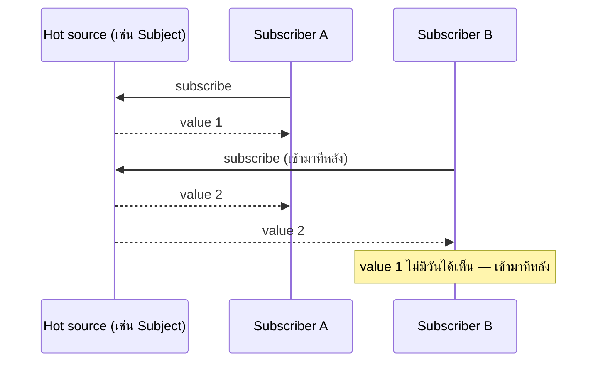

---
tags:
  - rxjs
  - reactive-programming
  - javascript
  - typescript
type: reference
created: 2026-09-15
---

# 🌊 Observable — หลักคิดเบื้องหลังการเขียนโปรแกรมแบบ Reactive

> **สลับมุมคิดแค่ข้อเดียว: จาก "เราไปขอค่า (pull)" เป็น "ค่าวิ่งมาหาเราเอง (push)"**
> โค้ดปกติเกือบทั้งหมดที่เขียนกันคือ pull — เรียกฟังก์ชัน วนลูป array เราเป็นฝ่าย "ไปเอา" ค่าเสมอ
> Observable คือรูปแบบที่ **source เป็นฝ่ายส่งค่ามาหาเราเอง** ตามเวลาที่มันพร้อม เราแค่บอกไว้ล่วงหน้าว่า "ถ้ามีอะไรมา ให้ทำแบบนี้"

---

## 1. ปัญหาที่ Observable แก้ — Pull vs Push

| | Pull (เราเรียกเอง) | Push (source ส่งมาเอง) |
|---|---|---|
| ใครเป็นฝ่ายเริ่ม | ผู้เรียก (consumer) | ผู้ผลิต (producer) |
| ตัวอย่าง | function call, วน array, `await` | event listener, callback, Promise, **Observable** |
| รู้ผลตอนไหน | รู้ทันทีที่เรียก (synchronous) หรือรอจนจบ | ไม่รู้ล่วงหน้าว่าจะมาเมื่อไหร่ |
| จุดอ่อน | ต้องรู้เวลาที่ถูกต้องว่าค่าพร้อมหรือยัง | โค้ดที่รับค่ามักกระจัดกระจาย ต่อกันเป็น pipeline ยาก (callback hell) |

**Observable คือ push model ที่ทำให้ compose (ต่อกันเป็น pipeline) ได้เหมือน array** — นี่คือสิ่งที่ event listener/callback ธรรมดาทำไม่ได้ และเป็นเหตุผลที่มันมีประโยชน์มากกว่าแค่ callback ที่ห่อสวยขึ้น

---

## 2. ตารางที่อธิบายทุกอย่าง — Single/Multiple × Pull/Push

นี่คือกรอบคิดที่ ReactiveX ใช้อธิบาย Observable เองตรง ๆ — วาง 4 ของที่ใช้ประจำในภาษาเขียนโปรแกรมลงในตาราง 2×2

| | **Single value** | **Multiple values** |
|---|---|---|
| **Pull** (เราเรียกเอง) | Function | Iterator / Array |
| **Push** (มันส่งมาเอง) | Promise | **Observable** |

- **Function** — เรียกแล้วได้ค่าเดียวทันที (synchronous, lazy — ไม่เรียกก็ไม่ทำงาน)
- **Iterator/Array** — วนได้หลายค่า แต่เราเป็นฝ่าย "ขอตัวถัดไป" ทุกครั้ง (`.next()`, `for...of`)
- **Promise** — ได้ค่าเดียวในอนาคต, source เป็นฝ่ายส่งมาเองตอนพร้อม (push) แต่ **สร้างปุ๊บทำงานทันที** (eager) และยกเลิกไม่ได้
- **Observable** — ได้หลายค่าในอนาคต, push เหมือน Promise **แต่ lazy** (ไม่ทำงานจนกว่าจะ `subscribe()`) และ **ยกเลิกได้** (`unsubscribe()`)

**Observable จึงเป็นช่องที่ไม่มีอะไรมาเติมมาก่อน** — "หลายค่า" + "push" + "ยกเลิกได้" คือ 3 อย่างที่ไม่มีของเดิมในภาษาให้ใช้ตรง ๆ ทำให้ต้องมี library แยก (RxJS เป็นเจ้าหลักในโลก JS/TS)

---

## 3. องค์ประกอบ 4 ชิ้นที่ต้องรู้จักเสมอ

```ts
import { Observable } from 'rxjs';

const obs$ = new Observable<number>(subscriber => {
  subscriber.next(1);
  subscriber.next(2);
  setTimeout(() => {
    subscriber.next(3);
    subscriber.complete();      // จบสตรีมแบบสำเร็จ
  }, 1000);
});

const subscription = obs$.subscribe({
  next: value => console.log('ได้ค่า:', value),
  error: err => console.error('พัง:', err),
  complete: () => console.log('จบแล้ว'),
});

// ยกเลิกได้ทุกเมื่อ — ถ้ายกเลิกก่อน 1 วิ จะไม่เห็นค่า 3 และ complete เลย
// subscription.unsubscribe();
```

**output:**
```
ได้ค่า: 1
ได้ค่า: 2
ได้ค่า: 3
จบแล้ว
```

| ชิ้นส่วน | คืออะไร |
|---|---|
| **Observable** | คำอธิบายว่า "จะผลิตค่ายังไง" — เก็บไว้เฉยๆ ยังไม่ทำอะไรจนกว่าจะมีคน subscribe (lazy) |
| **Observer** | ก้อนของ callback สามตัว `next`/`error`/`complete` ที่บอกว่า "ถ้ามีค่ามาทำอะไร" |
| **Subscription** | ตัวแทนของ "การทำงานที่กำลังเกิดขึ้นจริง" หลังเรียก `subscribe()` — มี `.unsubscribe()` ให้ยกเลิก |
| **Operator** | ฟังก์ชัน pure ที่รับ Observable เข้าไป คืน Observable ใหม่ออกมา — เอาไว้ต่อ pipeline (ข้อ 7) |

---

## 4. สัญญาที่ต้องรักษา — `next` / `error` / `complete`

**กฎตายตัวของ Observable ทุกตัว:**

```
next* (error | complete)?
```

- เรียก `next` ได้**กี่ครั้งก็ได้** (รวมถึงศูนย์ครั้ง)
- เรียก `error` **หรือ** `complete` ได้อย่างใดอย่างหนึ่ง **ครั้งเดียว** แล้วจบสตรีมทันที
- **หลัง `error`/`complete` แล้ว จะไม่มี `next` ตามมาอีกเด็ดขาด** — นี่คือสัญญาที่ operator ทุกตัวใน RxJS พึ่งพา ถ้า custom Observable ที่เขียนเองผิดสัญญานี้ operator downstream จะพฤติกรรมประหลาด

```ts
new Observable(subscriber => {
  subscriber.next(1);
  subscriber.complete();
  subscriber.next(2);          // ❌ ถูกเมิน — สัญญาบอกว่าหลัง complete ห้ามมี next อีก
});
```

---

## 5. Cold vs Hot — จุดที่งงที่สุดตอนเริ่มต้น

**Cold Observable** — แต่ละ `subscribe()` เริ่ม **execution ใหม่ของตัวเอง** (unicast) ตัวอย่างคลาสสิกคือ HTTP request

```ts
const obs$ = ajax.getJSON('/api/data');

obs$.subscribe(console.log);   // 🔥 ยิง HTTP request รอบที่ 1
obs$.subscribe(console.log);   // 🔥 ยิง HTTP request รอบที่ 2 (ไม่ใช่ค่าเดียวกัน!)
```

```
subscriber A subscribe ──► execution A เริ่มใหม่ ──► request 1 ──► response A
subscriber B subscribe ──► execution B เริ่มใหม่ ──► request 2 ──► response B
```

**Hot Observable** — มี execution เดียว **แชร์ (multicast)** ให้ทุก subscriber ที่ฟังอยู่ตอนนั้น ตัวอย่างคือ mouse event, WebSocket, `Subject`



| | Cold | Hot |
|---|---|---|
| execution | ใหม่ทุก subscribe | เดียว แชร์กัน |
| unicast/multicast | unicast | multicast |
| subscriber มาช้า | ได้ข้อมูลครบตั้งแต่ต้น | พลาดค่าที่ผ่านไปแล้ว |
| ตัวอย่าง | HTTP request, `of(1,2,3)` | mouse move, WebSocket, `Subject` |

**แปลง cold → hot ได้ด้วย `shareReplay()`** — ดู [[shareReplay]] ที่เขียนไว้แล้วในวอลต์นี้ ว่าทำไมถึงต้องแปลง และกับดักเรื่อง memory leak ถ้าใช้ผิดที่

---

## 6. Operator — หัวใจของการเขียนแบบ declarative

```ts
import { of } from 'rxjs';
import { map, filter } from 'rxjs/operators';

of(1, 2, 3, 4, 5).pipe(
  filter(n => n % 2 === 0),
  map(n => n * 10),
).subscribe(console.log);
```

**marble diagram — วิธีมาตรฐานที่ RxJS ใช้อธิบายว่า operator ทำอะไรกับค่าตามเวลา**

```
source:                 --1--2--3--4--5--|
filter(n => n % 2 === 0): -----2-----4-----|
map(n => n * 10):         -----20----40----|
```
(`-` = เวลาผ่านไป, ตัวเลข = ค่าที่ปล่อยออกมา, `|` = complete)

**operator ทุกตัวเป็น pure function** — รับ Observable เข้าไป คืน Observable ใหม่ออกมา ไม่แก้ตัวเดิม ต่อกันเป็นสายได้เรื่อยๆ ผ่าน `.pipe()`

**mental model นี้เหมือนกับ [[Java Stream]] เป๊ะ** — lazy (ไม่ทำงานจนกว่าจะมี "ตัวจบสาย": `subscribe()` ของ Observable ≈ terminal operation ของ Stream), ห้ามใช้ซ้ำ, ต่อ operator เป็น pipeline ได้อิสระ ต่างกันแค่ Stream จบครั้งเดียว (ค่าที่มีอยู่แล้ว) ส่วน Observable ทำงานได้กับค่าที่ **มาตามเวลา** (event, HTTP response ทีหลัง, WebSocket message) ด้วย

---

## 7. Flattening operator — เมื่อ Observable ซ้อน Observable

เคสที่เจอบ่อยที่สุด: event หนึ่งอัน (เช่นพิมพ์ค้นหา) ทำให้ต้องยิง Observable อีกอันซ้อนเข้าไป (เช่น HTTP request) — ต้อง "แบน" (flatten) มันออกมา และ**วิธีที่เลือกคือหลักคิดที่สำคัญที่สุดข้อหนึ่งของ RxJS**

| operator | inner Observable ใหม่มา ทำยังไงกับตัวเก่า | ใช้เมื่อ |
|---|---|---|
| `switchMap` | **ยกเลิกตัวเก่าทันที** สลับไปตัวใหม่ | สนใจแค่ผลลัพธ์ล่าสุด เช่น search-as-you-type |
| `mergeMap` | รันตัวเก่า**พร้อมกัน**กับตัวใหม่ ไม่รอ | ยิงพร้อมกันได้ ไม่สนลำดับ |
| `concatMap` | เข้าคิว รอตัวเก่าจบก่อนค่อยเริ่มตัวใหม่ | ลำดับสำคัญ ห้ามสลับ |
| `exhaustMap` | **เมินตัวใหม่ทั้งหมด** จนกว่าตัวเก่าจะจบ | กันกดซ้ำ เช่นปุ่ม submit |

```ts
searchInput$.pipe(
  debounceTime(300),
  switchMap(keyword => http.get(`/search?q=${keyword}`)),
  // พิมพ์คำใหม่ระหว่างที่ request เก่ายังไม่ตอบ → request เก่าถูกยกเลิกทันที
).subscribe(results => render(results));
```

**เลือกผิดตัวคือบั๊กที่เจอบ่อยที่สุดในโค้ด RxJS จริง** — ใช้ `mergeMap` กับ search-as-you-type แล้ว request เก่าที่ตอบช้ากว่าดันมาทับผลลัพธ์ของคำที่พิมพ์ใหม่กว่า (race condition), หรือใช้ `switchMap` กับ "กดบันทึก" แล้ว request บันทึกถูกยกเลิกกลางทางเพราะมี event อื่นมาแทรก

---

## 8. Unsubscribe — ทำไมสำคัญ

**Observable ที่ไม่เคย `complete()` เอง (เช่น event, WebSocket, interval) ต้อง unsubscribe เองเสมอ** ไม่งั้น subscription ค้างอยู่ใน memory ตลอดไป แม้ component ที่สร้างมันจะถูกทำลายไปแล้ว

```ts
class MyComponent {
  private sub = interval(1000).subscribe(n => console.log(n));

  ngOnDestroy() {
    this.sub.unsubscribe();   // ✅ ต้องทำเอง ไม่งั้น interval รันตลอดไปแม้ component หายไปแล้ว
  }
}
```

**ทางที่ปลอดภัยกว่าการ unsubscribe เอง**

- **`async` pipe ใน Angular template** — จัดการ subscribe/unsubscribe ให้อัตโนมัติตาม lifecycle ของ component ไม่ต้องเขียนเอง
- **`takeUntil(destroy$)`** — ปล่อยให้ stream จบตัวเองตอน component destroy แทนที่จะเก็บ `Subscription` ไว้ยกเลิกทีละตัว
- **Observable ที่ complete เองแล้ว** (เช่น HTTP request ปกติ) **ไม่ต้อง unsubscribe** เพราะ RxJS เคลียร์ให้เองหลัง `complete()`/`error()` อยู่แล้ว

---

## 9. มาจากไหน — ที่มาของ "หลักคิด"

Observable ไม่ได้คิดขึ้นมาใหม่ทั้งหมด แต่เป็นการ**รวมสามแนวคิดเก่าเข้าด้วยกัน**:

1. **Observer pattern** (GoF) — subject แจ้ง observer เมื่อมีการเปลี่ยนแปลง (`next`) — Observable ยกระดับมาเพิ่มแนวคิด "จบสตรีมได้" (`error`/`complete`) ที่ Observer pattern ดั้งเดิมไม่มี
2. **Iterator pattern** — ลำดับของค่าที่ดึงออกมาทีละตัว — Observable "พลิก" ทิศทางจาก pull (เรียก `.next()`) เป็น push (source ส่งมาเอง) นี่คือที่มาของชื่อเล่น **"Observable = Iterable แบบย้อนกลับ (dual)"**
3. **Functional programming** — operator เป็น pure function ต่อกันได้ (`map`, `filter`, `reduce` แบบเดียวกับ array/Stream) — ทำให้ compose pipeline ได้แทนที่จะเขียน callback ซ้อน callback

**ผลคือ Observable แก้จุดอ่อนของทั้งสองต้นแบบ:** Observer pattern ธรรมดา compose ไม่ได้ (ไม่มี operator), Iterator ธรรมดาเป็น pull ใช้กับ async event ไม่ได้ — Observable เอาจุดแข็งของทั้งคู่มารวมกัน

---

## 10. กับดัก

- **ลืม unsubscribe** — stream ที่ไม่จบเอง (interval, event, WebSocket, `Subject`) ค้างใน memory ตลอดไปถ้าไม่จัดการ (ข้อ 8)
- **เข้าใจผิดว่า cold observable แชร์ execution** — subscribe สองครั้งคิดว่าใช้ค่าเดียวกัน ที่จริงยิง source ใหม่ทุกครั้ง (ข้อ 5) — เจอบ่อยเวลามี HTTP call ซ้ำโดยไม่ตั้งใจ
- **ใช้ `mergeMap` ทั้งที่ต้องการ `switchMap`** — request เก่าตอบช้ากว่ามาทับผลลัพธ์ใหม่กว่า (ข้อ 7)
- **subscribe ซ้อน subscribe ("subscribe hell")** — เขียน callback ซ้อนกันเหมือนสมัย callback-based code ทั้งที่ควรใช้ operator (`switchMap`/`mergeMap`) ต่อ pipeline แทน
- **ลืมว่าหลัง `error`/`complete` จะไม่มี `next` อีก** — เขียน custom Observable เองแล้วผิดสัญญา ทำให้ operator downstream พฤติกรรมประหลาด (ข้อ 4)
- **Promise กับ Observable ปนกันโดยไม่ตั้งใจ** — `async/await` ดึงค่าจาก Observable ตรง ๆ ไม่ได้ ต้องแปลงก่อน (`firstValueFrom`) และจะได้แค่ค่าแรกค่าเดียว ไม่ใช่ทุกค่าที่ Observable จะปล่อยออกมา

---

## 11. Cheat sheet

```ts
// สร้าง
new Observable(subscriber => { subscriber.next(1); subscriber.complete(); })
of(1, 2, 3)
from(promiseOrArrayOrIterable)
interval(1000)

// subscribe
const sub = obs$.subscribe({ next, error, complete });
sub.unsubscribe();

// operator พื้นฐาน
obs$.pipe(map(fn), filter(fn), tap(sideEffect))

// flattening — เลือกให้ตรงกับความหมาย
switchMap()   // ยกเลิกตัวเก่า สนใจแค่ล่าสุด
mergeMap()    // รันพร้อมกันหมด
concatMap()   // เข้าคิว ตามลำดับ
exhaustMap()  // เมินตัวใหม่จนกว่าตัวเก่าจะจบ

// จัดการวงจรชีวิต
takeUntil(destroy$)
firstValueFrom(obs$)   // แปลงเป็น Promise เอาแค่ค่าแรก
```

| อาการ | สาเหตุ |
|---|---|
| HTTP request ยิงซ้ำโดยไม่ตั้งใจ | subscribe หลายครั้งบน cold observable |
| memory ค่อย ๆ โตขึ้นเรื่อย ๆ | ลืม unsubscribe stream ที่ไม่จบเอง |
| ผลลัพธ์การค้นหาสลับกันมั่ว | ใช้ `mergeMap` แทน `switchMap` |
| callback ซ้อนกันหลายชั้นอ่านไม่รู้เรื่อง | ไม่ได้ใช้ operator ต่อ pipeline |
| subscriber ที่เข้ามาทีหลังไม่เห็นค่าเก่า | เป็น hot observable โดยธรรมชาติ (ไม่ replay) |

---

## 🔗 เกี่ยวข้อง

- [[RxJS]] — หน้ารวม, ใช้ทำอะไรได้บ้างจริง ๆ, operator แบ่งตามหมวด
- [[shareReplay]] — operator ที่แปลง cold observable ให้กลายเป็น hot + replay ค่าล่าสุด
- [[Java Stream]] — mental model แบบ lazy pipeline เดียวกัน ฝั่ง Java (ทำงานกับค่าที่มีอยู่แล้ว ไม่ใช่ค่าที่มาตามเวลา)

## 📖 อ่านต่อ

- [RxJS — Observable](https://rxjs.dev/guide/observable)
- [ReactiveX — Observable documentation](https://reactivex.io/documentation/observable.html)
- [Angular — Comparing Observables](https://angular.dev/guide/observables/comparing-observables-to-other-techniques)
