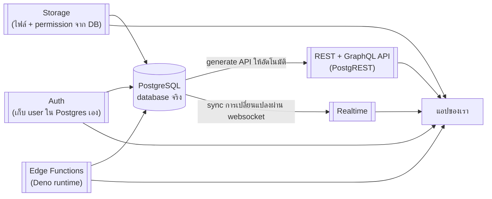

---
tags:
  - supabase
  - postgres
  - backend
type: reference
created: 2026-09-19
---

# 🟢 Supabase คืออะไร

> **"Open-source Firebase alternative ที่สร้างบน Postgres จริงๆ"** — ไม่ใช่ database แต่งใหม่ของตัวเอง แต่เป็น **PostgreSQL เต็มรูปแบบ** บวก service รอบๆ ที่ทำให้ไม่ต้องเขียน backend เองตั้งแต่ศูนย์ (auth, API, realtime, storage, edge function) — ทุกอย่างวางอยู่บน Postgres ตัวเดียวกัน ไม่ใช่คนละระบบแยกกันแบบ Firebase

---

## 1. องค์ประกอบหลัก



| ส่วน | ทำอะไร |
|---|---|
| **Database** | Postgres จริง 100% — join/transaction/SQL เต็มรูปแบบ ไม่ใช่ NoSQL ตัดทอน |
| **Auto-generated API** | สร้างตาราง → ได้ REST + GraphQL endpoint ทันที ไม่ต้องเขียน backend เอง (ใช้ PostgREST อ่าน schema แล้ว generate ให้) |
| **Auth** | sign-up/login/session — email-password, magic link, OTP ทางโทรศัพท์, social login (Google/GitHub/Apple ฯลฯ) — user เก็บอยู่ใน Postgres เดียวกันนี่เอง |
| **Storage** | เก็บไฟล์ (รูป/วิดีโอ/เอกสาร) ใช้ **ระบบสิทธิ์เดียวกับ database** — เขียนกฎเป็น SQL ไม่ต้องไปตั้งค่าคนละที่ |
| **Realtime** | sync ข้อมูลสดผ่าน websocket — ที่จริงคือ broadcast ของ Postgres replication log ออกมา |
| **Edge Functions** | รันโค้ด server-side (Deno runtime, เขียนเป็น TypeScript) สำหรับ logic ที่ทำจาก client ตรงๆ ไม่เหมาะ |
| **pgvector** | เก็บ embedding vector ใน Postgres ได้ตรงๆ ทำ semantic search/RAG ได้โดยไม่ต้องมี vector DB แยก |

---

## 2. จุดต่างจาก Firebase จริงๆ

- **Postgres จริง ไม่ใช่ NoSQL** — SQL query/join/transaction เต็มรูปแบบ ย้ายข้อมูลออกไปที่อื่นก็ยังเป็น standard Postgres ไม่ผูกกับ vendor
- **Row Level Security (RLS)** — กฎ access control เขียนเป็น SQL policy อยู่ที่ชั้น database เดียว ปลอดภัยแม้มีคนเรียก API ตรงๆ ข้าม backend ที่เขียนเอง (ดูข้อ 4)
- **Open source, self-host ได้เต็มรูปแบบ** — ทั้ง stack รันผ่าน Docker เองได้ ไม่ผูกกับบริษัทเดียวแบบ Firebase

---

## 3. ตัวอย่างโค้ด — เรียกใช้จริง

```javascript
import { createClient } from '@supabase/supabase-js'

const supabase = createClient(SUPABASE_URL, SUPABASE_ANON_KEY)

// อ่านข้อมูล — ไม่ต้องเขียน backend endpoint เอง
const { data, error } = await supabase
  .from('products')
  .select('*')
  .eq('category', 'electronics')

// เขียนข้อมูล
await supabase.from('products').insert({ name: 'Laptop', price: 999 })

// สมัคร/login
await supabase.auth.signUp({ email, password })

// Realtime — subscribe การเปลี่ยนแปลงสด
supabase.channel('products-changes')
  .on('postgres_changes', { event: '*', schema: 'public', table: 'products' },
      (payload) => console.log('เปลี่ยนแปลง!', payload))
  .subscribe()
```

---

## 4. Row Level Security — ตัวอย่างจริง

```sql
-- เปิด RLS ก่อนเสมอ (ค่า default ของตารางใหม่คือ "ปิด" — สำคัญมาก ดูกับดัก)
alter table products enable row level security;

-- อนุญาตให้ทุกคนอ่านได้
create policy "อ่านได้ทุกคน"
  on products for select
  using (true);

-- อนุญาตให้แก้ได้เฉพาะเจ้าของแถวนั้น
create policy "แก้ได้เฉพาะเจ้าของ"
  on products for update
  using (auth.uid() = owner_id);
```

`auth.uid()` คือ function ที่ Supabase เตรียมให้ — ดึง id ของ user ที่ login อยู่ตอนนั้นมาเทียบใน policy ได้ตรงๆ

---

## 5. แนวทางการเริ่มศึกษา

**1. เริ่มต้น** — เข้าใจว่า Supabase = Postgres จริง + service รอบๆ (ข้อ 1) และ RLS คือกลไกความปลอดภัยหลัก (ข้อ 4) ก่อนแตะโค้ดเลย เพราะทุกอย่างที่ทำต่อจากนี้จะพึ่งความเข้าใจสองเรื่องนี้ตลอด

**2. ลงมือทำจริง:**
1. **สมัคร supabase.com สร้างโปรเจกต์ฟรี** (หรือรัน local ผ่าน CLI — ดูด้านล่าง)
2. **สร้างตารางผ่าน Studio** (web UI ที่มากับทุกโปรเจกต์) หรือเขียน SQL ตรงๆ ก็ได้
3. **เปิด RLS ทันทีที่สร้างตาราง** แล้วเขียน policy พื้นฐานก่อนอย่างอื่น (ข้อ 4) — อย่าปล่อยว่างไว้แล้วค่อยกลับมาทำทีหลัง
4. **ติดตั้ง client library** (`@supabase/supabase-js` หรือภาษาอื่นที่รองรับ) เรียกใช้จาก frontend ตรงๆ
5. **เพิ่ม Auth** — เริ่มจาก email/password ง่ายสุด ค่อยเพิ่ม social login ทีหลัง

**3. ใช้งานได้คล่อง** — ค่อยต่อยอด Storage/Realtime/Edge Function ตามที่โปรเจกต์ต้องการจริง (ไม่ต้องเปิดทุกอย่างตั้งแต่แรก), แยก `anon` key กับ `service_role` key ให้ถูกต้องเสมอ (ข้อ 7), และรู้ว่า logic ไหนควรย้ายไปเป็น Postgres function/Edge Function แทนที่จะ query ตรงจาก client

### รัน local ผ่าน Docker (ไม่ต้องพึ่ง cloud เลยตอนหัดเล่น)

```bash
npx supabase init
npx supabase start   # รันทั้ง stack (Postgres, Auth, Storage, Realtime, Studio) ผ่าน Docker บนเครื่องตัวเอง
```

### ถ้าใช้ AI coding agent (Claude Code, Cursor ฯลฯ) — ลง official skill ก่อนเริ่มเลย

Supabase เองทำ **[[Claude Agent Skills|Agent Skill]] อย่างเป็นทางการ** ชื่อ `supabase/agent-skills` เพราะเจอปัญหาว่า agent ทั่วไปมัก **ลืมเปิด RLS, มโนคำสั่ง CLI ที่ไม่มีจริง, สร้าง view โดยไม่ใส่ `security_invoker = true`** — ลงตัวนี้แล้ว agent จะเช็ก doc ปัจจุบันและทำตาม security checklist ที่ถูกต้องให้อัตโนมัติ

```bash
npx skills add supabase/agent-skills
# หรือสำหรับ Claude Code โดยเฉพาะ ผ่าน plugin marketplace:
claude plugin marketplace add supabase/agent-skills
claude plugin install supabase@supabase-agent-skills
```

---

## 6. เอาไปทำอะไรเล่นได้บ้าง

- **To-do app + auth** — starter project คลาสสิกที่สุด ครบทั้ง CRUD + RLS ในตัวอย่างเดียว
- **Realtime chat/collaborative app** — เห็นผลของ Realtime feature ชัดเจนที่สุด (พิมพ์จากเครื่องหนึ่ง อีกเครื่องเห็นทันที)
- **URL shortener พร้อม analytics** — เทียบเล่นๆ กับ backend ที่เขียนเองด้วย Quarkus ได้ตรงๆ ว่า "ถ้าใช้ Supabase แทน จะลดโค้ดไปกี่ส่วน" (API/Auth/DB ได้มาแทบไม่ต้องเขียนเอง)
- **Photo gallery ที่มี upload + permission** — ฝึก Storage คู่กับ RLS ว่าใครอัปโหลด/ดูรูปใครได้บ้าง
- **RAG/AI chatbot ถามตอบจากเอกสารตัวเอง** — ใช้ pgvector เก็บ embedding ที่ได้จากโมเดลใน [[Hugging Face]] แล้วค้นด้วยความหมายจริงๆ ไม่ใช่ keyword

---

## 7. กับดัก

- **ลืมเปิด RLS** — ค่า default ของตารางใหม่คือ RLS **ปิด** ถ้าลืม = ใครก็ตามที่มี anon key (ฝังอยู่ใน frontend code เห็นได้ทุกคนที่เปิด devtools) อ่าน/เขียนข้อมูลได้ทุกแถวโดยไม่ต้อง login เลย — เป็นกับดักอันดับหนึ่งที่พลาดกันบ่อยที่สุด
- **สับสน `anon` key กับ `service_role` key** — `anon` key ปลอดภัยที่จะฝังใน frontend (เพราะต้องพึ่ง RLS คุมสิทธิ์อยู่ดี) แต่ **`service_role` key ข้าม RLS ได้ทั้งหมด** ห้ามฝังใน frontend เด็ดขาด ใช้ได้เฉพาะฝั่ง server เท่านั้น
- **โปรเจกต์ free tier หยุดทำงานอัตโนมัติถ้าไม่มีการใช้งานนานๆ** — โปรเจกต์ทดลองที่ไม่ได้แตะนานจะถูก pause ต้องเข้า dashboard ไป unpause เอง
- **เขียน query ซับซ้อนจาก client โดยตรงทั้งที่ควรเป็น business logic ฝั่ง server** — บาง logic ควรทำเป็น Postgres function (RPC) หรือ Edge Function แทนที่จะให้ client ต่อ query เองหลายขั้น
- **เปิด Realtime ไว้ทุกตารางโดยไม่คิด** — เสียทรัพยากรและเสี่ยงข้อมูลรั่วถ้า RLS ยังไม่ครอบคลุมตารางนั้นดีพอ เปิดเฉพาะตารางที่ต้องการ sync สดจริงๆ

---

## 8. Cheat sheet

```bash
npx supabase init && npx supabase start   # local dev ทั้ง stack ผ่าน Docker
```

```javascript
const supabase = createClient(URL, ANON_KEY)
await supabase.from('table').select('*')
await supabase.from('table').insert({ ... })
await supabase.auth.signUp({ email, password })
```

```sql
alter table x enable row level security;
create policy "name" on x for select using (true);
```

| ต้องการ | ใช้ |
|---|---|
| อ่าน/เขียนข้อมูลจาก frontend ตรงๆ | REST API อัตโนมัติ (PostgREST) ผ่าน client library |
| ควบคุมว่าใครเห็น/แก้แถวไหนได้ | Row Level Security (RLS) policy |
| sync ข้อมูลสดระหว่าง user | Realtime |
| เก็บไฟล์ | Storage |
| รัน business logic ฝั่ง server | Edge Functions |
| ทำ RAG/semantic search | pgvector + embedding model |

## 🔗 เกี่ยวข้อง

- [[Hugging Face]] — embedding model ที่ใช้คู่กับ pgvector ทำ RAG ได้ (ข้อ 6)
- [[Docker Basics]] — self-host Supabase ทั้ง stack ผ่าน Docker ได้ตามข้อ 5
- [[Keycloak]] — ทางเลือกอื่นสำหรับ auth ถ้าไม่อยากผูก auth เข้ากับระบบเดียวกับ database

## 📖 อ่านต่อ

- [Supabase Docs](https://supabase.com/docs)
- [Supabase — Row Level Security](https://supabase.com/docs/guides/database/postgres/row-level-security)
- [Supabase — Edge Functions](https://supabase.com/docs/guides/functions)
